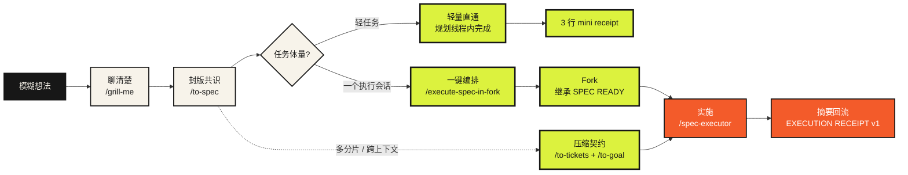

<div align="center">

# Sam Skills

**把需求留在规划线程，把实现放进执行线程：能继承就 Fork，要搬运就 Goal**

让规划线程专注于把事情想清楚，让执行线程专注于把事情做完。

[](https://github.com/mattpocock/skills)
[](https://github.com/opsbli/sam-skills)
[](#demo一次完整闭环)
[](LICENSE)

`grill → spec ready → execute in fork → receipt returns`

[**▶ 在线故事版：别让一个线程从需求聊到代码写完**](https://verifiable-goal-weekly-share-public.pages.dev)

</div>

## 它解决什么问题

AI coding 任务常常从需求讨论一路聊到代码实现。线程越长，上下文越容易膨胀、压缩和变慢；但直接开新线程，又担心缺少需求背景和已经确认的决策。

这套技能把工作拆成两类线程，并用仓库里的持久化证据连接它们：

| 常见困境 | 这套流程的处理方式 |
|---|---|
| 方案讨论和代码实现挤在一个长线程里 | 规划线程停在 `SPEC READY`，fork 线程承担代码和测试日志 |
| Fork 后又重新分析和改写一遍 Goal | `spec-executor` 直接执行继承的最终 Spec，并回传结构化 receipt |
| Fork、启动和回传仍要手工串起来 | `execute-spec-in-fork` 自动创建执行任务、发送 Ask、接回结果并条件归档 |
| 当前上下文太脏、无法可靠继承 | `to-goal` 把 ticket 和仓库证据压成干净的执行契约 |
| 不同任务都使用同一档模型和推理强度 | goal 按风险推荐 Lightweight / Standard / Advanced 与推理强度 |
| “做完了”依赖人的主观判断 | receipt 首字段带 `Schema` 版本，六道归档门机械校验，逐项证据 |
| “改个文案也要走 grill → spec → fork 全链” | 轻量直通：低于复杂度地板的任务在规划线程内直接完成，留 3 行 mini receipt 保持可追溯 |

> **Fork 负责隔离后续上下文，Goal 负责压缩已有上下文，Express lane 负责轻任务不出规划线程。** 连续开发优先 fork；跨人、跨天、跨引擎、并行或上下文混乱时使用 `to-goal`；单文件机械改动直接走直通。

## 30 秒看懂主流程



普通连续开发默认从最终 `SPEC READY` 处 fork。多分片、并行、延迟执行或上下文混乱时，再用 `to-tickets` / `to-goal` 建立可独立执行的合同。**轻任务不进管线**：单文件机械改动或无歧义的明显修复、且无未决产品决策时，走轻量直通——在规划线程内完成，以 `改了什么 / 跑了什么验证 / 工作树状态` 三行 mini receipt 收尾；任一条件不满足即回到 fork 路由。回流 receipt 首字段携带 `Schema: spec-executor-receipt/v1`，两条路由（自动 / 手动）都按它机械校验，契约演进不再靠人眼辨认。

## 使用步骤

### 第 0 步：安装与初始化（一次性）

```bash
# 方式一：Claude Code 插件（推荐，受管只读）
claude plugin marketplace add opsbli/sam-skills
claude plugin install matt-skills-with-to-goal@opsbli

# 方式二：npx skills（多 harness 通用）
npx skills@latest add opsbli/sam-skills
```

在目标项目里运行一次 `/setup-matt-pocock-skills`，它会配置 issue tracker（GitHub Issues 或本地 `.scratch/` markdown）、triage 标签词汇和领域文档布局。之后每个项目只需按需维护 `docs/agents/project-standards.md`。

### 第 1 步：把想法聊成 Spec（规划线程）

```text
/grill-me          ← 追问式访谈，把模糊想法逼成具体决策
/to-spec           ← 冻结共识，发布 SPEC READY 到 issue tracker
```

`to-spec` 产出的 `SPEC READY` 块是后续一切的启动钥匙：它是已批准 spec 的索引（来源、基线、测试缝、非目标、外部授权），不是 spec 的副本。

### 第 2 步：选择执行路由

```text
/execute-spec-in-fork   ← 默认。一个执行会话能装下的 approved spec
/to-tickets → /to-goal  ← 多分片、跨天、跨人、并行或上下文混乱
轻量直通                 ← 单文件机械改动 / 明显修复，无未决产品决策
```

`execute-spec-in-fork` 在 Codex App 里全自动（fork → Messenger Ask → 等回执 → 校验 → 归档）；在 ZCode、Claude Code 等没有 Codex 任务工具的环境里，它给出**一等手动 runbook**：同目录新会话 → 粘贴 `SPEC READY` → `/spec-executor` → receipt 用 `#sess_<id>` 引用回流（粘贴亦可）。

### 第 3 步：执行（执行线程）

执行线程里的 `/spec-executor` 不重开产品决策。它先发 execution lock（范围、验证缝、外部授权），记录实施前 HEAD 作为 review 固定点，然后按最窄垂直路径实现、跑最小验证、`/code-review` 对照固定点，最后产出结构化 receipt。

### 第 4 步：回流、校验、归档（规划线程）

receipt 回到规划线程后，过**六道归档门**才允许归档：

1. `outcome=completed` 且与请求关联；
2. 单一可解析 receipt，**首字段为 `Schema: spec-executor-receipt/v1`**——缺失或不符即校验失败，不人工补写；
3. `Conclusion` 为 `completed`；
4. 每条验收标准都有证据；
5. 无待决的规划线程决策；
6. 最终工作树状态与外部影响已报告。

归档前再确认共享 checkout：规划线程看到的工作树与 receipt 报告的最终状态一致、无意外漂移，且没有第二个执行 fork 在跑——同一 checkout 同时只允许一个活跃执行线程。`Docs delta` 非 `none` 时立即经 `/domain-modeling` 沉淀进 `CONTEXT.md` 或 ADR；空白 delta 是无效 receipt。

## Demo：一次完整闭环

场景：给团队的周报脚本加一个 `--since` 参数，只统计指定日期之后的提交。

**① 规划线程 —— `/grill-me` 聊清楚**

```text
你：周报脚本现在统计全部历史，我想只看最近一段。
agent：「最近一段」是相对当前时间的滚动窗口，还是以发版日为锚点？
你：以传入的日期为锚点，命令行显式传，不做隐式默认值。
agent：`--since` 接受什么格式？非法日期是报错还是回退全量？
你：ISO 日期（YYYY-MM-DD），非法直接非零退出并打印用法。
```

**② 规划线程 —— `/to-spec` 封版**，产出：

```text
SPEC READY

- Status: ready for implementation
- Source: https://github.com/acme/team-tools/issues/42
- Repository: acme/team-tools
- Baseline: main @ 3fa9c1e
- Test seam: scripts/weekly-report.sh 的 CLI 行为测试（bats）
- Non-goals: 不改输出格式；不引入新依赖；不做 --until
- External authority: 仅授权本地实现与验证；commit 需用户确认；禁止 push
- Next route: fork + /spec-executor
```

**③ 规划线程 —— `/execute-spec-in-fork`**（ZCode 下走手动 runbook）

```text
1. 规划线程冻结在 SPEC READY，不再讨论实现
2. 同目录开新会话（继承同一 workspace）
3. 粘贴 SPEC READY，声明这是启动命令，运行 /spec-executor
4. 执行完成后用 #sess_<id> 把 receipt 引用回规划线程
5. 过六道门 → 沉淀 Docs delta → 归档
```

**④ 执行线程 —— `/spec-executor` 先锁范围**

```text
Executing: weekly-report.sh 支持 --since <YYYY-MM-DD>，非法输入非零退出
Source: SPEC READY · acme/team-tools#42
In scope: 参数解析、git log --since 接线、3 个 bats 行为测试
Out of scope: 输出格式、--until、文档站
Validation: bats tests/cli/weekly-report.bats；bash -n
External authority: 仅本地实现与验证；commit 未授权
```

**⑤ 执行线程 —— 完成后返回 receipt**

```text
SPEC EXECUTION RECEIPT

- Schema: spec-executor-receipt/v1
- Conclusion: completed
- Spec source: acme/team-tools#42 (SPEC READY)
- Review fixed point: 3fa9c1e
- Acceptance criteria:
  - --since 2026-08-01 只统计该日后提交：pass（bats: since_filters_log）
  - 非法日期非零退出并打印用法：pass（bats: invalid_since_exits_nonzero）
  - 不传 --since 行为与现状一致：pass（bats: default_unchanged）
- Main changes: 参数解析 12 行；git log 调用加 --since；3 个测试
- Changed files: scripts/weekly-report.sh, tests/cli/weekly-report.bats
- Branch / commit / review: 本地分支 feat/weekly-since，未 commit（未授权）
- Validation results: bats 3/3 pass；bash -n clean；/code-review 无 P0/P1
- Review findings: 无 P0/P1；1 条 P2（usage 文案可更短）已记录
- Not validated or not executed: 未在 macOS 上跑（开发机为 Linux）
- Risks and remaining work: 无
- Planning-thread decision needed: none
- Final worktree state: 仅上述两文件改动，无其他 dirty
- External effects: none
- Docs delta: 团队惯例——CLI 参数非法时打印用法到 stderr（spec 未写明，按仓库既有模式执行）
- Goal / spec quality: （留空，由规划线程或用户对照 diff 后填写）
```

**⑥ 规划线程 —— 校验与沉淀**

六道门全过 → `Docs delta` 非 `none`，立即运行 `/domain-modeling` 把「非法参数打印用法到 stderr」写进 `docs/agents/project-standards.md` 的 CLI 惯例 → 核对工作树无漂移 → 归档执行会话。规划线程从头到尾没有出现过一行测试日志。

## Demo：轻量直通（Express lane）

场景：README 里把 `to-goal` 写成了 `to-gola`，一个错字。

```text
你：README 有个错字 to-gola。
agent：低于复杂度地板（单文件、机械、无产品决策），走轻量直通，不 fork。
      （直接改完，跑 markdown 校验）

MINI RECEIPT
- what changed: README.md 1 处 to-gola → to-goal
- validation run: npm run lint:skills → OK (31 promoted)
- worktree state: 仅 README.md 一行改动
```

可追溯性保住了，fork 的仪式感没有出现。**判定规则**：单文件或几行机械改动 / 明显修复、无未决产品决策、触点有廉价验证——三条全满足才走直通；任一不满足，回到 fork 路由。

## Fork 与 to-goal 分工

| 场景 | 推荐路线 | 原因 |
|---|---|---|
| 同一代码仓、连续推进 | **继承 fork** | 子线程继承规划对话、最终 spec、仓库证据，直接执行；规划线程不被实现细节和测试日志淹没 |
| 上下文很脏、跨人/跨天、跨 harness、并行 ticket | **压缩 goal** | ticket、spec、branch 和 recorded fixed point 被压成可粘贴的执行契约 |
| 单个长期、实现密集的 build | **Fork-first** | 实现、测试日志和 review 细节留在 fork；规划线程只保留最终决策和摘要 |
| spec 过大，无法一次执行完 | **`to-tickets` 拆分** | 每个 ticket 声明依赖边；executor 只取当前可执行 frontier |
| 单文件机械改动 / 明显修复 | **轻量直通** | 规划线程内完成，3 行 mini receipt 收尾；不出规划线程 |

## `to-goal` 增加了什么

1. **保留证据、压缩上下文。** 从 tracker spec、sub-issues、comments、blocking graph、repo instructions、branch、HEAD、diff、test seam 与 validation commands 中提炼 goal，而不是依赖当前线程记忆。
2. **防止伪造目标。** readiness checklist 任一不满足就停止，而不是编造 goal。
3. **显式处理部分完成。** 已验证完成的工作进入 `Current state`，剩余 gap 进入 `Completion criteria`；已证实完成的事项不会再次列为待办。
4. **可跨 harness 迁移。** goal block 不绑定任何特定 agent；风险等级推荐 Low / Medium / High 与 Lightweight / Standard / Advanced，而不是硬编码模型名。
5. **默认低风险边界。** 完成标准包含 code-review fixed point、smallest applicable validation、commit 授权与不污染无关 dirty files。

## 如何选择入口

| 当前情况 | 推荐入口 |
|---|---|
| 需求还模糊，需要先聊清楚 | `/grill-me` 或 `/grill-with-docs` |
| 方案已明确，准备形成可执行 Spec | `/to-spec` |
| Spec 已批准、当前对话清晰、可以立刻开发 | `/execute-spec-in-fork`（推荐）；或其他 harness 中的 manual fork + `/spec-executor` |
| Spec 太大，需要拆成多个可执行分片 | `/to-tickets` |
| 当前 frontier 已就绪，但要跨线程、跨天或跨 harness 执行 | `/to-goal` |
| 明确指定要把多个 ticket 合成一个跨上下文 goal | `/to-goal --all` |
| 需求口径还不稳，跨会话目标容易失真 | 先回到规划线程继续澄清，不要直接生成 goal |
| 单文件机械改动或明显修复，无未决产品决策 | 轻量直通：规划线程内完成，3 行 mini receipt 收尾 |

## 技能地图

当前发行版包含 31 个 promoted Skills：25 个随上游同步的工程与生产力 Skill，以及本 fork 新增的 [`to-goal`](./skills/engineering/to-goal/SKILL.md)、[`goal-crafter`](./skills/engineering/goal-crafter/SKILL.md)、[`spec-executor`](./skills/engineering/spec-executor/SKILL.md)、[`execute-spec-in-fork`](./skills/engineering/execute-spec-in-fork/SKILL.md)、[`roundtable`](./skills/engineering/roundtable/SKILL.md)、[`project-standards`](./skills/engineering/project-standards/SKILL.md)。

| 阶段 | 技能 |
|---|---|
| 规划 / 澄清 | [`grill-me`](./skills/productivity/grill-me/SKILL.md) · [`grilling`](./skills/productivity/grilling/SKILL.md) · [`grill-with-docs`](./skills/engineering/grill-with-docs/SKILL.md) · [`to-questionnaire`](./skills/productivity/to-questionnaire/SKILL.md) |
| 立项 / 拆解 | [`to-spec`](./skills/engineering/to-spec/SKILL.md) · [`to-tickets`](./skills/engineering/to-tickets/SKILL.md) · [`triage`](./skills/engineering/triage/SKILL.md) · [`wayfinder`](./skills/engineering/wayfinder/SKILL.md) |
| 执行 / 交付 | [`spec-executor`](./skills/engineering/spec-executor/SKILL.md) · [`execute-spec-in-fork`](./skills/engineering/execute-spec-in-fork/SKILL.md) · [`to-goal`](./skills/engineering/to-goal/SKILL.md) · [`implement`](./skills/engineering/implement/SKILL.md) · [`tdd`](./skills/engineering/tdd/SKILL.md) · [`code-review`](./skills/engineering/code-review/SKILL.md) |
| 知识与决策 | [`domain-modeling`](./skills/engineering/domain-modeling/SKILL.md) · [`project-standards`](./skills/engineering/project-standards/SKILL.md) · [`roundtable`](./skills/engineering/roundtable/SKILL.md) · [`codebase-design`](./skills/engineering/codebase-design/SKILL.md) · [`improve-codebase-architecture`](./skills/engineering/improve-codebase-architecture/SKILL.md) |
| 排障 / 运维 | [`diagnosing-bugs`](./skills/engineering/diagnosing-bugs/SKILL.md) · [`resolving-merge-conflicts`](./skills/engineering/resolving-merge-conflicts/SKILL.md) · [`wizard`](./skills/engineering/wizard/SKILL.md) · [`prototype`](./skills/engineering/prototype/SKILL.md) · [`research`](./skills/engineering/research/SKILL.md) |
| 写作 / 协作 | [`writing-for-agents`](./skills/productivity/writing-for-agents/SKILL.md) · [`handoff`](./skills/productivity/handoff/SKILL.md) · [`teach`](./skills/productivity/teach/SKILL.md) · [`wait-what`](./skills/productivity/wait-what/SKILL.md) |
| 入口 | [`ask-matt`](./skills/engineering/ask-matt/SKILL.md) · [`setup-matt-pocock-skills`](./skills/engineering/setup-matt-pocock-skills/SKILL.md) |

更多背景：[`docs/engineering/to-goal.md`](./docs/engineering/to-goal.md) 与 [`CONTEXT.md`](./CONTEXT.md)。

## 设计边界

- `to-goal` 是编译器，不是采访者；不会重新访谈用户、不会修改 tracker、不会创建分支。
- Fork 只隔离对话，不隔离文件系统；并行实现仍需独立 worktree、分支和文件所有权。同一 checkout 上同时只允许一个活跃执行线程（自动 fork 或手动会话），receipt 回流时规划线程核对工作树无意外漂移后才归档。
- `SPEC EXECUTION RECEIPT` 首字段为 `Schema: spec-executor-receipt/v1`；缺失或版本不符即视为校验失败，不人工补写。
- goal 不会默认授权 push、PR、merge、关闭 issue 或修改 tracker。
- `spec-executor` 把规划线程当作唯一产品事实来源，不重新打开已确认决策；`Docs delta` 是它的回报义务——执行中发现的新约束、新术语和自决偏差必须显式回流，空白即缺陷。
- `execute-spec-in-fork` 只在 Codex App 提供任务工具和 Messenger v2+ 时创建真实 fork；否则明确说出缺失能力并交出手动 runbook，绝不假装传输存在。

## 与上游 mattpocock/skills 的差异

本仓库不是只读镜像，而是一个长期维护的 opinionated fork：

- 同步基线：上游 `main` 的 `6654f6b`（2026-08-24），发行序列见 [CHANGELOG.md](./CHANGELOG.md)。
- 新增执行闭环：[`spec-executor`](./skills/engineering/spec-executor/SKILL.md) + [`execute-spec-in-fork`](./skills/engineering/execute-spec-in-fork/SKILL.md)，把 `SPEC READY → fork → receipt → 条件归档` 变成一等流程；receipt 强制 `Docs delta` 回流事实文档，首字段带 `Schema` 版本供机械校验；轻任务有 Express lane（[ADR 0003](./.agents/adr/0003-codex-app-fork-loop-is-an-adapter.md)、[ADR 0004](./.agents/adr/0004-receipt-schema-and-express-lane.md)）。
- 新增决策与标准工具：[`roundtable`](./skills/engineering/roundtable/SKILL.md)（对立视角子代理辩论已成形决策）、[`project-standards`](./skills/engineering/project-standards/SKILL.md)（从真实代码探索生成可执行工程标准）。
- 新增跨线程执行合同：[`to-goal`](./skills/engineering/to-goal/SKILL.md) + [`goal-crafter`](./skills/engineering/goal-crafter/SKILL.md)，把 tracker 上的当前 frontier 编译为可验证、可携带、可恢复的执行目标。
- 继承技能遵循 expression-layer 变更政策，由 `lint-skills.mjs --diff-audit` 把关；发布元数据以 `package.json` 为准，插件校验由 `check-plugin-version` 保证。
- Fork 维护基建：[`docs/maintaining-fork.md`](./docs/maintaining-fork.md)、[`docs/upstream-collision-playbook.md`](./docs/upstream-collision-playbook.md)、fork-guard CI 与 `.githooks/pre-push`。

## 来源与许可

- 上游作者与版权：**Matt Pocock**
- 上游仓库：[mattpocock/skills](https://github.com/mattpocock/skills)
- 本 fork：[opsbli/sam-skills](https://github.com/opsbli/sam-skills)
- 许可证：[MIT](./LICENSE)

感谢 Matt Pocock 发布原始技能集；本仓库仅做 fork 侧的维护、同步与扩展。
