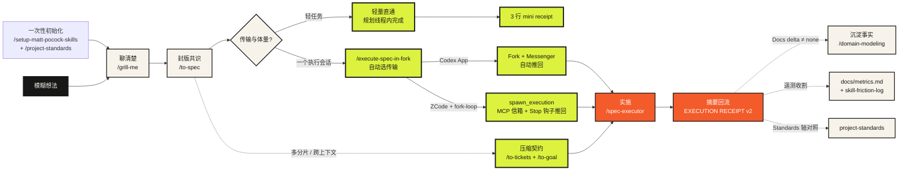

<div align="center">

# Sam Skills

**把需求留在规划线程，把实现放进执行线程：能继承就 Fork，要搬运就 Goal**

让规划线程专注于把事情想清楚，让执行线程专注于把事情做完。

[](https://github.com/mattpocock/skills)
[](https://github.com/opsbli/sam-skills)
[](#demo一次完整闭环)
[](#demozcode-自动闭环装了-fork-loop与-codex-同款)
[](LICENSE)

`grill → spec ready → execute in fork → receipt returns`

[**▶ 在线故事版：别让一个线程从需求聊到代码写完**](https://verifiable-goal-weekly-share-public.pages.dev)

</div>

## 它解决什么问题

AI coding 任务常常从需求讨论一路聊到代码实现。线程越长，上下文越容易膨胀、压缩和变慢；但直接开新线程，又担心缺少需求背景和已经确认的决策。

这套技能把工作拆成两类线程，并用仓库里的持久化证据连接它们：

| 常见困境 | 这套流程的处理方式 |
|---|---|
| 方案讨论和代码实现挤在一个长线程里 | 规划线程停在 `SPEC READY`，fork 线程承担代码和测试日志 |
| Fork 后又重新分析和改写一遍 Goal | `spec-executor` 直接执行继承的最终 Spec，并回传结构化 receipt |
| Fork、启动和回传仍要手工串起来 | `execute-spec-in-fork` 自动选传输：Codex Messenger / ZCode fork-loop MCP（spawn + Stop 钩子推回）都是一次手动；未装则给手动 runbook |
| 当前上下文太脏、无法可靠继承 | `to-goal` 把 ticket 和仓库证据压成干净的执行契约 |
| 不同任务都使用同一档模型和推理强度 | goal 按风险推荐 Lightweight / Standard / Advanced 与推理强度 |
| “做完了”依赖人的主观判断 | receipt 首字段带 `Schema` 版本，六道归档门机械校验，逐项证据 |
| “改个文案也要走 grill → spec → fork 全链” | 轻量直通：低于复杂度地板的任务在规划线程内直接完成，留 3 行 mini receipt 保持可追溯 |
| Agent 每次都靠猜项目规矩（骨架放哪、迁移怎么写、验证跑到什么程度） | `/project-standards` 探索真实代码生成标准草案，人确认后固化为 `docs/agents/project-standards.md`；评审与执行的验收底线直接读它 |

> **Fork 负责隔离后续上下文，Goal 负责压缩已有上下文，Express lane 负责轻任务不出规划线程。** 连续开发优先 fork；跨人、跨天、跨引擎、并行或上下文混乱时使用 `to-goal`；单文件机械改动直接走直通。

## 30 秒看懂主流程



普通连续开发默认从最终 `SPEC READY` 处执行。多分片、并行、延迟执行或上下文混乱时，先用 `to-tickets` / `to-goal` 建立可独立执行的合同。**轻任务不进管线**：单文件机械改动或无歧义的明显修复、且无未决产品决策时，走轻量直通——在规划线程内完成，以 `改了什么 / 跑了什么验证 / 工作树状态` 三行 mini receipt 收尾；任一条件不满足即回到执行路由。回流 receipt 首字段携带 `Schema: spec-executor-receipt/v2`（含 `Receipt metrics` 遥测行），三条传输（Codex Messenger / ZCode fork-loop / 手动）都按同一组归档门机械校验。

## 使用步骤

### 第 0 步：安装与初始化（每个仓库一次性）

```bash
# 方式一：Claude Code 插件（推荐，受管只读）
claude plugin marketplace add opsbli/sam-skills
claude plugin install sam-skills@opsbli

# 方式二：Codex 插件（受管只读，同 Claude 路由）
codex plugin marketplace add opsbli/sam-skills
codex plugin add sam-skills@opsbli

# 方式三：npx skills（多 harness 通用）
npx skills@latest add opsbli/sam-skills
```

安装即含 **fork-loop 自动闭环**（ZCode 用）：插件 manifest 自带 `fork-loop` MCP 服务与 `Stop` 回流钩子，指向插件内的 `scripts/fork-loop-mcp/`，无需任何独立部署或 zai 账号。唯一的额外一次性动作：headless 执行会话要有可用的模型 provider——在 `~/.zcode/cli/config.json` 里配好你自己的供应商（`provider.<id>.options.{baseURL, apiKey}` + `model.main: "<provider>/<模型 id>"` 字符串），执行会话就花它的额度（详见 [fork-loop-mcp README](./scripts/fork-loop-mcp/README.md) 与 [ADR 0005](./.agents/adr/0005-zcode-fork-loop-mcp-mailbox.md)）。

然后在目标项目里**按顺序跑两个一次性命令**：

```text
/setup-matt-pocock-skills   ← ① 配置 issue tracker（GitHub Issues 或本地 .scratch/）、triage 标签词汇、领域文档布局
/project-standards          ← ② 接着跑一次：探索真实代码，生成 docs/agents/project-standards.md
```

**第 ② 步必须在让 agent 写代码或评审之前完成。** `/project-standards` 的探索子代理只报告「代码实际是怎么做的」（事实），每条规则由你逐条确认后才生效（标准）——它是 [`/code-review`](./skills/engineering/code-review/SKILL.md) Standards 轴的权威依据，也是 [`/spec-executor`](./skills/engineering/spec-executor/SKILL.md) 的隐含验收标准。没有这份文件，下游 agent 只能猜项目规则。之后框架或约定变化时跑 `update`，定期跑 `audit` 防止规范与代码静默漂移。

### 第 1 步：把想法聊成 Spec（规划线程）

```text
/grill-me          ← 追问式访谈，把模糊想法逼成具体决策
/to-spec           ← 冻结共识，发布 SPEC READY 到 issue tracker
```

`to-spec` 产出的 `SPEC READY` 块是后续一切的启动钥匙：它是已批准 spec 的索引（来源、基线、测试缝、非目标、外部授权），不是 spec 的副本。

### 第 2 步：选择执行路由

```text
/execute-spec-in-fork   ← 默认。skill 自动选传输（按序检测）：
                           ① Codex App 任务工具 → Messenger 自动闭环
                           ② fork-loop MCP 已连接 → spawn 自动闭环（ZCode 同款体验）
                           ③ 都没有 → 手动 runbook
/to-tickets → /to-goal  ← 多分片、跨天、跨人、并行或上下文混乱
轻量直通                 ← 单文件机械改动 / 明显修复，无未决产品决策
```

Codex App 里全自动（fork → Messenger Ask → 等回执 → 校验 → 归档）。**ZCode 想要同款自动闭环，需一次性装上 fork-loop MCP + Stop 钩子**——sam-skills 插件已自带（见第 0 步安装），装好后 `/execute-spec-in-fork` 自动走 spawn 路由：agent 调 `spawn_execution`，执行会话后台跑、规划线程照常可用，receipt 由 Stop 钩子自动送回。什么都没装时走手动 runbook：同目录新会话 → 粘贴 `SPEC READY` → `/spec-executor` → receipt 用 `#sess_<id>` 引用回流。

### 第 3 步：执行（执行线程）

执行线程里的 `/spec-executor` 不重开产品决策。它先发 execution lock（范围、验证缝、外部授权），记录实施前 HEAD 作为 review 固定点，然后按最窄垂直路径实现、跑最小验证、`/code-review` 对照固定点，最后产出结构化 receipt。

### 第 4 步：回流、校验、归档（规划线程）

receipt 回到规划线程后，过**六道归档门**才允许归档：

1. `outcome=completed` 且与请求关联；
2. 单一可解析 receipt，**首字段为 `Schema: spec-executor-receipt/v2`**——缺失或不符即校验失败，不人工补写；
3. `Conclusion` 为 `completed`；
4. 每条验收标准都有证据；
5. 无待决的规划线程决策；
6. 最终工作树状态与外部影响已报告。

归档前再确认共享 checkout：规划线程看到的工作树与 receipt 报告的最终状态一致、无意外漂移，且没有第二个执行 fork 在跑——同一 checkout 同时只允许一个活跃执行线程。`Docs delta` 非 `none` 时立即经 `/domain-modeling` 沉淀进 `CONTEXT.md` 或 ADR；空白 delta 是无效 receipt。Receipt 的 `Receipt metrics` 行同步收割：度量追加进 `docs/metrics.md`，`skill-friction` 非 `none` 追加进 `docs/skill-friction-log.md`，由 `/project-standards audit` 定期把高频摩擦转成 SKILL.md 修订 issue。

## Demo：一次完整闭环

场景：给团队的周报脚本加一个 `--since` 参数，只统计指定日期之后的提交。

**① 规划线程 —— `/grill-me` 聊清楚**

```text
你：周报脚本现在统计全部历史，我想只看最近一段。
agent：「最近一段」是相对当前时间的滚动窗口，还是以发版日为锚点？
你：以传入的日期为锚点，命令行显式传，不做隐式默认值。
agent：`--since` 接受什么格式？非法日期是报错还是回退全量？
你：ISO 日期（YYYY-MM-DD），非法直接非零退出并打印用法。
```

**② 规划线程 —— `/to-spec` 封版**，产出：

```text
SPEC READY

- Status: ready for implementation
- Source: https://github.com/acme/team-tools/issues/42
- Repository: acme/team-tools
- Baseline: main @ 3fa9c1e
- Test seam: scripts/weekly-report.sh 的 CLI 行为测试（bats）
- Non-goals: 不改输出格式；不引入新依赖；不做 --until
- External authority: 仅授权本地实现与验证；commit 需用户确认；禁止 push
- Next route: fork + /spec-executor
```

**③ 规划线程 —— `/execute-spec-in-fork`**（skill 自动选传输；ZCode 装了 fork-loop 走 spawn，未装走手动 runbook）

```text
自动（fork-loop MCP，一次手动）：
1. agent 调 spawn_execution(checkout, spec_ready, planner_session)
2. 执行会话后台跑，规划线程照常可用
3. Stop 钩子把 receipt 自动送回 → 过六道门 → 沉淀 Docs delta → ack_receipt 归档

手动（未装 fork-loop）：
1. 规划线程冻结在 SPEC READY，不再讨论实现
2. 同目录开新会话（继承同一 workspace）
3. 粘贴 SPEC READY，声明这是启动命令，运行 /spec-executor
4. 执行完成后用 #sess_<id> 把 receipt 引用回规划线程
5. 过六道门 → 沉淀 Docs delta → 归档
```

**④ 执行线程 —— `/spec-executor` 先锁范围**

```text
Executing: weekly-report.sh 支持 --since <YYYY-MM-DD>，非法输入非零退出
Source: SPEC READY · acme/team-tools#42
In scope: 参数解析、git log --since 接线、3 个 bats 行为测试
Out of scope: 输出格式、--until、文档站
Validation: bats tests/cli/weekly-report.bats；bash -n
External authority: 仅本地实现与验证；commit 未授权
```

**⑤ 执行线程 —— 完成后返回 receipt**

```text
SPEC EXECUTION RECEIPT

- Schema: spec-executor-receipt/v2
- Conclusion: completed
- Spec source: acme/team-tools#42 (SPEC READY)
- Review fixed point: 3fa9c1e
- Acceptance criteria:
  - --since 2026-08-01 只统计该日后提交：pass（bats: since_filters_log）
  - 非法日期非零退出并打印用法：pass（bats: invalid_since_exits_nonzero）
  - 不传 --since 行为与现状一致：pass（bats: default_unchanged）
- Main changes: 参数解析 12 行；git log 调用加 --since；3 个测试
- Changed files: scripts/weekly-report.sh, tests/cli/weekly-report.bats
- Branch / commit / review: 本地分支 feat/weekly-since，未 commit（未授权）
- Validation results: bats 3/3 pass；bash -n clean；/code-review 无 P0/P1
- Review findings: 无 P0/P1；1 条 P2（usage 文案可更短）已记录
- Not validated or not executed: 未在 macOS 上跑（开发机为 Linux）
- Risks and remaining work: 无
- Planning-thread decision needed: none
- Final worktree state: 仅上述两文件改动，无其他 dirty
- External effects: none
- Docs delta: 团队惯例——CLI 参数非法时打印用法到 stderr（spec 未写明，按仓库既有模式执行）
- Receipt metrics: fork-or-express: fork | archive-gates: pass | archive-gate-failures: 0 | grill-rounds: 2 | criteria-evidenced: 3/3 | docs-delta: 1 | skill-friction: none
- Goal / spec quality: （留空，由规划线程或用户对照 diff 后填写）
```

**⑥ 规划线程 —— 校验与沉淀**

六道门全过 → `Docs delta` 非 `none`，立即运行 `/domain-modeling` 把「非法参数打印用法到 stderr」写进 `docs/agents/project-standards.md` 的 CLI 惯例 → 核对工作树无漂移 → 归档执行会话。规划线程从头到尾没有出现过一行测试日志。

## Demo：ZCode 全流程实录（两个会话怎么接力）

还是「weekly-report 加 `--since`」这个任务，这次把镜头对准 ZCode 里的**两个会话**。全程你只有三次手动操作（标 🔧），其余都是 agent 自动完成。

> 这是**未配置 fork-loop 自动闭环时**的手动路由（Claude Code / Cursor / 终端同样适用）。ZCode 装好 sam-skills 插件后，请直接看下一个 demo 的三行口令——同样的自动闭环体验。

> 这是**未装 fork-loop MCP 时**的手动路由。装好后（插件自带）ZCode 升级为一次手动的自动闭环，见下面 Codex demo 的口令速查表。

### 会话 A · 规划线程（你的主会话）

```text
你：/grill-me 周报脚本现在统计全部历史，我想只看最近一段。
agent：Round 1 烤问（日期锚点怎么定？非法输入怎么办？…）→ Round 2 → 定稿方案
agent：「以上即共享理解的全部内容。确认无误的话，我就按这个方案实施。」
```

⚠️ **分叉口（最常见的踩空点）**：这时点「确认」= 同线程直接实现，管线到此断开，`SPEC READY`、receipt、`Docs delta` 全都不会出现。要走管线，回一句：

```text
你：先 /to-spec 封版。
agent：已把 spec 发布到 tracker（或 .scratch/weekly-since/spec.md），并产出：

SPEC READY
- Status: ready for implementation
- Source: <spec 地址>
- Repository: acme/team-tools
- Baseline: main @ 3fa9c1e
- Test seam: scripts/weekly-report.sh 的 CLI 行为测试（bats）
- Non-goals: 不改输出格式；不做 --until
- External authority: 仅本地实现与验证；禁止 commit/push
- Next route: fork + /spec-executor
```

### 🔧 手动 ①：在 ZCode 新建一个会话，绑定**同一个工作区目录**

关键：必须是同一个 checkout——fork 隔离的是对话上下文，不是文件。

### 会话 B · 执行线程（刚建的新会话）

```text
你：（粘贴完整的 SPEC READY 块）以上是启动命令。/spec-executor

agent：找到 SPEC READY → 校验路由 → 发出 execution lock：
       Executing: weekly-report.sh 支持 --since <YYYY-MM-DD>，非法输入非零退出
       In scope / Out of scope / Validation / External authority: ...
agent：记录实施前 HEAD=3fa9c1e（review 固定点）→ 实现 → bats 3/3 通过
       → /code-review 对照固定点，无 P0/P1
agent：SPEC EXECUTION RECEIPT
       - Schema: spec-executor-receipt/v2
       - Conclusion: completed
       - Acceptance criteria: 3/3 pass（附 bats 证据）
       - Docs delta: 团队惯例——CLI 参数非法时打印用法到 stderr
       - Receipt metrics: fork | gates pass | skill-friction: none
       - External effects: none
       「请把 receipt 带回规划线程；本会话 id：sess_7f3a9c…」
```

### 🔧 手动 ②：切回会话 A，发一句话

```text
你：执行完了，receipt 在 #sess_7f3a9c。
```

### 会话 A · 规划线程（闭环自动跑完）

```text
agent：1. 经 #sess_7f3a9c 读取 receipt 原文（不经粘贴，无编辑损耗）
       2. 过六道归档门：Schema ✓ completed ✓ 逐条证据 ✓ 无待决决策 ✓ 工作树一致 ✓
       3. Docs delta ≠ none → 自动运行 /domain-modeling，
          把「非法参数打印用法到 stderr」沉淀进 docs/agents/project-standards.md
       4. 问一次 Goal / spec quality（可跳过，不阻塞验收）
       5. 汇报验收完成——会话 B 可以关掉了
```

规划线程从头到尾没有出现一行测试日志；实现细节全部留在会话 B 里。

### 口令速查

| 会话 | 你要敲的（按顺序） |
|---|---|
| **A · 规划** | `/grill-me …` → `先 /to-spec 封版` →（等执行）→ `执行完了，receipt 在 #sess_<id>` |
| **B · 执行** | 粘贴 SPEC READY 全文 + `以上是启动命令。/spec-executor` |

> 💡 把「grill 收敛后默认 `/to-spec` 封版，而非直接实施」写进项目根的 `AGENTS.md` 后，连「先封版」这句提醒都可以省掉——agent 每次开工都会读到这条纪律。

## Demo：ZCode 自动闭环（装了 fork-loop，与 Codex 同款）

**ZCode 装好 sam-skills 插件后**（manifest 自带 fork-loop MCP + Stop 钩子），同样只用一次手动。唯一的准备：在 `~/.zcode/cli/config.json` 配好自己的模型 provider（第三方 OpenAI-compatible 端点即可，不需要 zai 账号）——执行会话花它的额度。

### 规划会话（你唯一的会话）

```text
你：/grill-me 周报脚本现在统计全部历史，我想只看最近一段。
agent：烤问 → 收敛 → 定稿方案
你：先 /to-spec 封版。
你：/execute-spec-in-fork   ← skill 检测到 fork-loop MCP，自动走 spawn 路由
agent：调 spawn_execution(checkout, spec_ready, planner_session) — checkout 被机器锁定
       （此时执行会话已在后台跑，你可以继续用本会话聊别的）
       ……Stop 钩子在回合结束时从信箱取出 receipt，自动注入并继续：
agent：1. 过六道归档门：Schema ✓ completed ✓ 逐条证据 ✓ 无待决决策 ✓ 工作树一致 ✓
       2. Docs delta ≠ none → /domain-modeling 沉淀进事实文档
       3. 收割 docs/metrics.md 一行 + skill-friction（如非 none）
       4. ack_receipt → 锁释放，闭环完成
```

## Demo：Codex App 全自动闭环（一键编排）

还是「weekly-report 加 `--since`」这个任务，看同一条管线在 Codex App 里如何走完。前提：Codex App 原生任务工具可用，且已安装 [Codex Task Messenger](https://github.com/tt-a1i/codex-task-messenger)（v2+）。

### 规划任务（你唯一的会话）

```text
你：/grill-me 周报脚本现在统计全部历史，我想只看最近一段。
agent：烤问 → 收敛 → 定稿方案（同样别点「确认就实施」）
你：先 /to-spec 封版。
agent：spec 发布 + SPEC READY 块产出（内容同前，略）
```

### 🔧 手动 ①（也是全程唯一一处）：敲 `/execute-spec-in-fork`

agent 自动完成编排四连：

```text
1. 校验启动契约：最新 SPEC READY、路由为 fork、单会话可完成、无未决产品决策
2. 同目录 fork 当前任务 → 拿到子任务 ID（异步或缺失 ID 视为启动失败，不猜）
3. 命名子任务「执行 · weekly-since」
4. 通过 Messenger 向该子任务发 Ask：
   「运行 /spec-executor 执行继承的最新 SPEC READY；
     这条 Ask 就是 fork 快照里缺失的启动命令；
     完成后回一个 completed / needs-input / failed Reply，receipt 放在 completed Reply 里」
```

> 为什么 fork 了还要补一条 Ask：fork 只包含**已完成的历史**，创建它的命令还在运行——子任务继承了 spec，但需要这条后续消息告诉它开工、以及结果回传到哪里。

### 执行任务（自动创建的子任务，异步干活）

```text
子任务：运行 /spec-executor → execution lock → 记录固定点 → 实现
        → bats 3/3 → /code-review → SPEC EXECUTION RECEIPT（Schema v2 …）
        → Messenger Reply（completed）自动推回规划任务
```

等待期间你可以继续在规划任务里聊别的（但别动共享 checkout 的实现文件——同一 checkout 同时只允许一个活跃执行线程）。agent 不会阻塞傻等，子任务完成时会把结果**推**回来。

### 规划任务（收到 Reply，自动闭环）

```text
agent：1. 关联校验：Reply 来自本次创建的子任务、reply-to 匹配本次请求
       2. 过六道归档门：Schema ✓ completed ✓ 逐条证据 ✓ 无待决决策 ✓ 工作树一致 ✓
       3. Docs delta ≠ none → 自动 /domain-modeling 沉淀进事实文档
       4. 问一次 Goal / spec quality（可跳过，不阻塞归档）
       5. 解 pin、归档子任务（归档可恢复，不删历史）
```

### 如果子任务中途 `needs-input`

子任务被 pin 住，带着它需要决策的问题回到规划任务 → 你直接用下一条消息回答 → agent 发 Messenger **Resume** 继续**同一个**子任务（不会重新 fork）。注意：卡片只是传输不是授权——若你的回答扩大了范围或授予新权限，子任务会回到源任务核对你的原话后才继续。

### 口令速查

| 环境 | 你要敲的（按顺序） | 手动次数 |
|---|---|---|
| **Codex App** | `/grill-me …` → `先 /to-spec 封版` → `/execute-spec-in-fork` →（等 Reply；有 needs-input 就回答） | **1 次** |
| **ZCode（装了 fork-loop）** | `/grill-me …` → `先 /to-spec 封版` → `/execute-spec-in-fork`（agent 调 `spawn_execution`，receipt 由 Stop 钩子自动送回） | **1 次** |
| **ZCode / 其他（未装）** | A：`/grill-me …` → `先 /to-spec 封版` → `执行完了，receipt 在 #sess_<id>`；B：粘贴 SPEC READY + `以上是启动命令。/spec-executor` | 3 次 |

三条路由的契约完全相同（`SPEC READY` 进、`RECEIPT v2` 出、六道门、Docs delta 沉淀），区别只在传输：Codex 用 Messenger 卡片推回，ZCode 装了 fork-loop 用 MCP 信箱 + Stop 钩子推送，未装则用 `#sess_<id>` 引用人工带回。

## Demo：轻量直通（Express lane）

场景：README 里把 `to-goal` 写成了 `to-gola`，一个错字。

```text
你：README 有个错字 to-gola。
agent：低于复杂度地板（单文件、机械、无产品决策），走轻量直通，不 fork。
      （直接改完，跑 markdown 校验）

MINI RECEIPT
- what changed: README.md 1 处 to-gola → to-goal
- validation run: npm run lint:skills → OK (32 promoted)
- worktree state: 仅 README.md 一行改动
```

可追溯性保住了，fork 的仪式感没有出现。**判定规则**：单文件或几行机械改动 / 明显修复、无未决产品决策、触点有廉价验证——三条全满足才走直通；任一不满足，回到 fork 路由。

## Fork 与 to-goal 分工

| 场景 | 推荐路线 | 原因 |
|---|---|---|
| 同一代码仓、连续推进 | **执行线程**（Codex fork / ZCode spawn） | 执行线程继承最终 spec 与仓库证据，直接开工；规划线程不被实现细节和测试日志淹没 |
| 上下文很脏、跨人/跨天、跨 harness、并行 ticket | **压缩 goal** | ticket、spec、branch 和 recorded fixed point 被压成可粘贴的执行契约 |
| 单个长期、实现密集的 build | **执行线程优先** | 实现、测试日志和 review 细节留在执行线程；规划线程只保留最终决策和摘要 |
| spec 过大，无法一次执行完 | **`to-tickets` 拆分** | 每个 ticket 声明依赖边；executor 只取当前可执行 frontier |
| 单文件机械改动 / 明显修复 | **轻量直通** | 规划线程内完成，3 行 mini receipt 收尾；不出规划线程 |

## `to-goal`：作用与详细用法

**一句话作用**：把"已经规划好的任务"（批准的 spec、agent-ready ticket、tracker 当前 frontier、做了一半的 ticket）编译成一份**可验证、可粘贴、跨上下文的执行契约**——新会话拿到它直接开工，不需要重新访谈你，也不会把旧线程的噪音一起搬过去。

**和 fork 的分工**：fork 继承的是整个对话，goal 携带的是压缩后的证据。当前对话干净连贯、spec 一个会话能做完 → fork（`/execute-spec-in-fork`）；跨人、跨天、跨 harness、并行执行，或当前上下文太脏、存在多版冲突草稿 → `/to-goal`。

### 五种输入

| 调用方式 | 它做什么 |
|---|---|
| `/to-goal`（无参数） | 读配置的 tracker，自动选当前未阻塞、agent-ready 的 frontier ticket |
| `/to-goal <ticket 号或 URL>` | 完整读该 ticket（含评论；评论也是证据） |
| `/to-goal <父 spec issue>` | 读 spec + sub-issues + 阻塞图，选当前 frontier |
| `/to-goal <本地路径>` | 读本地 spec / ticket 文件（`.scratch/<feature>/` 约定） |
| `/to-goal --all <父>` | 显式跨 ticket：按依赖序合成一个 goal，标注 cross-context，推荐持久 goal loop（非常规用法） |

多个 frontier 并存时它列出来让你选，绝不静默合并；被阻塞的 ticket 只报告阻塞项，不生成目标。

### 编译前它读什么（全程只读）

完整 spec 与 ticket（含验收标准和评论）→ 仓库指令与设计词汇 → 当前 branch / HEAD / worktree / diff（记录实施前 HEAD 作为 code-review 固定点）→ 逐条对照验收标准分类（已证据完成 / 明确未完成 / 未验证——commit message 不算证据）→ 从仓库脚本、CI、现有测试发现验证命令 → 保留源上下文里的权限与工作区边界。

### readiness 硬停止

以下任一不满足，它停下来报缺什么，**绝不编造 goal**：source 已 agent-ready · ticket 未阻塞 · 恰好一个 frontier · 已记录 review 固定点 · 每条验收标准已分类 · 验证命令已发现 · 权限边界已保留 · 每条完成标准可独立判定（没有"看起来不错"这种标准）。

### 输出三件套

1. **勾选的 readiness checklist**（自证用，不进粘贴块）；
2. **可粘贴的 goal 模板**——`Goal`（一个 ticket 级结果）/ `Current state`（分支、HEAD 固定点、要保护的脏文件、已证据完成项、已知缺口）/ `Execution order`（最短依赖路径）/ `Completion criteria`（逐条可判定 + 最小验证命令 + 对照固定点跑 code-review）/ `Constraints`（不 push、不动无关脏文件、不提前做下游 ticket 等默认边界）/ `Context`（来源 ticket、设计文档、测试缝、先看哪里）；
3. **会话推荐**——`Lightweight / Standard / Advanced` 能力档 × `Low / Medium / High` 推理强度，按任务风险取**最低够用档**，可跨 harness 移植，不硬编码模型名。

部分完成的 ticket 会被显式处理：已验证完成的工作写进 `Current state`，剩余 gap 写进 `Completion criteria`——下一个 agent 不会重做已证实的事，也看不到被隐藏的缺口。goal 的可验证性规则（一个勾选框一条可验证条件）由 [`goal-crafter`](./skills/engineering/goal-crafter/SKILL.md) 提供。

### 边界

只编译，不实现、不改 tracker、不建分支、不重新访谈；spec 还没有 ticket 时，仅当全部工作能装进一个全新上下文窗口才直接出 goal，否则路由到 `/to-tickets`；`--all` 仅用于明确要求的多 ticket 持久执行，不是常规 Matt 工作流。

## 如何选择入口

| 当前情况 | 推荐入口 |
|---|---|
| 新项目首次接入本套技能，还没配置 tracker | `/setup-matt-pocock-skills`，**紧接着跑一次 `/project-standards`**（在让 agent 写码/评审之前） |
| 想让 agent 停止猜项目规矩，把骨架/迁移/验证底线固化成文 | `/project-standards`（`generate`：无文件；`update`：规则变了；`audit`：检查代码是否还在遵守） |
| 需求还模糊，需要先聊清楚 | `/grill-me` 或 `/grill-with-docs` |
| 方案已明确，准备形成可执行 Spec | `/to-spec` |
| Spec 已批准、当前对话清晰、可以立刻开发 | `/execute-spec-in-fork`（推荐，skill 自动选传输：Codex Messenger / ZCode fork-loop / 手动 runbook） |
| Spec 太大，需要拆成多个可执行分片 | `/to-tickets` |
| 当前 frontier 已就绪，但要跨线程、跨天或跨 harness 执行 | `/to-goal` |
| 明确指定要把多个 ticket 合成一个跨上下文 goal | `/to-goal --all` |
| 需求口径还不稳，跨会话目标容易失真 | 先回到规划线程继续澄清，不要直接生成 goal |
| 单文件机械改动或明显修复，无未决产品决策 | 轻量直通：规划线程内完成，3 行 mini receipt 收尾 |

## 技能地图

当前发行版包含 32 个 promoted Skills：25 个随上游同步的工程与生产力 Skill，以及本 fork 新增的 [`to-goal`](./skills/engineering/to-goal/SKILL.md)、[`goal-crafter`](./skills/engineering/goal-crafter/SKILL.md)、[`spec-executor`](./skills/engineering/spec-executor/SKILL.md)、[`execute-spec-in-fork`](./skills/engineering/execute-spec-in-fork/SKILL.md)、[`roundtable`](./skills/engineering/roundtable/SKILL.md)、[`project-standards`](./skills/engineering/project-standards/SKILL.md)、[`harvest`](./skills/engineering/harvest/SKILL.md)。

| 阶段 | 技能 |
|---|---|
| 规划 / 澄清 | [`grill-me`](./skills/productivity/grill-me/SKILL.md) · [`grilling`](./skills/productivity/grilling/SKILL.md) · [`grill-with-docs`](./skills/engineering/grill-with-docs/SKILL.md) · [`to-questionnaire`](./skills/productivity/to-questionnaire/SKILL.md) |
| 立项 / 拆解 | [`to-spec`](./skills/engineering/to-spec/SKILL.md) · [`to-tickets`](./skills/engineering/to-tickets/SKILL.md) · [`triage`](./skills/engineering/triage/SKILL.md) · [`wayfinder`](./skills/engineering/wayfinder/SKILL.md) |
| 执行 / 交付 | [`spec-executor`](./skills/engineering/spec-executor/SKILL.md) · [`execute-spec-in-fork`](./skills/engineering/execute-spec-in-fork/SKILL.md) · [`to-goal`](./skills/engineering/to-goal/SKILL.md) · [`implement`](./skills/engineering/implement/SKILL.md) · [`tdd`](./skills/engineering/tdd/SKILL.md) · [`code-review`](./skills/engineering/code-review/SKILL.md) |
| 知识与决策 | [`domain-modeling`](./skills/engineering/domain-modeling/SKILL.md) · [`project-standards`](./skills/engineering/project-standards/SKILL.md) · [`roundtable`](./skills/engineering/roundtable/SKILL.md) · [`codebase-design`](./skills/engineering/codebase-design/SKILL.md) · [`improve-codebase-architecture`](./skills/engineering/improve-codebase-architecture/SKILL.md) · [`harvest`](./skills/engineering/harvest/SKILL.md) |
| 排障 / 运维 | [`diagnosing-bugs`](./skills/engineering/diagnosing-bugs/SKILL.md) · [`resolving-merge-conflicts`](./skills/engineering/resolving-merge-conflicts/SKILL.md) · [`wizard`](./skills/engineering/wizard/SKILL.md) · [`prototype`](./skills/engineering/prototype/SKILL.md) · [`research`](./skills/engineering/research/SKILL.md) |
| 写作 / 协作 | [`writing-for-agents`](./skills/productivity/writing-for-agents/SKILL.md) · [`handoff`](./skills/productivity/handoff/SKILL.md) · [`teach`](./skills/productivity/teach/SKILL.md) · [`wait-what`](./skills/productivity/wait-what/SKILL.md) |
| 入口 | [`ask-matt`](./skills/engineering/ask-matt/SKILL.md) · [`setup-matt-pocock-skills`](./skills/engineering/setup-matt-pocock-skills/SKILL.md) |

更多背景：[`docs/engineering/to-goal.md`](./docs/engineering/to-goal.md) 与 [`CONTEXT.md`](./CONTEXT.md)。

## 设计边界

- `to-goal` 是编译器，不是采访者；不会重新访谈用户、不会修改 tracker、不会创建分支。
- Fork 只隔离对话，不隔离文件系统；并行实现仍需独立 worktree、分支和文件所有权。同一 checkout 上同时只允许一个活跃执行线程（自动 fork 或手动会话），receipt 回流时规划线程核对工作树无意外漂移后才归档。
- `SPEC EXECUTION RECEIPT` 首字段为 `Schema: spec-executor-receipt/v2`；缺失或版本不符即视为校验失败，不人工补写。v2 必带 `Receipt metrics` 行（路由、归档门结果、grill 轮数、证据计数、`skill-friction`），规划线程在归档前收割进 `docs/metrics.md` 与 `docs/skill-friction-log.md`。
- goal 不会默认授权 push、PR、merge、关闭 issue 或修改 tracker。
- `spec-executor` 把规划线程当作唯一产品事实来源，不重新打开已确认决策；`Docs delta` 是它的回报义务——执行中发现的新约束、新术语和自决偏差必须显式回流，空白即缺陷。
- `execute-spec-in-fork` 按序自动选传输：Codex App 任务工具（Messenger）→ fork-loop MCP（spawn + Stop 钩子）→ 手动 runbook。没有可用传输时明确说出缺失能力并交出手动 runbook，绝不假装传输存在。

## 与上游 mattpocock/skills 的差异

本仓库不是只读镜像，而是一个长期维护的 opinionated fork：

- 同步基线：上游 `main` 的 `6654f6b`（2026-08-24），发行序列见 [CHANGELOG.md](./CHANGELOG.md)。
- 新增执行闭环：[`spec-executor`](./skills/engineering/spec-executor/SKILL.md) + [`execute-spec-in-fork`](./skills/engineering/execute-spec-in-fork/SKILL.md)，把 `SPEC READY → 执行 → receipt → 条件归档` 变成一等流程；receipt 强制 `Docs delta` 回流事实文档，首字段带 `Schema` 版本供机械校验；轻任务有 Express lane（[ADR 0003](./.agents/adr/0003-codex-app-fork-loop-is-an-adapter.md)、[ADR 0004](./.agents/adr/0004-receipt-schema-and-express-lane.md)）。
- 新增 ZCode 自动传输：[`fork-loop-mcp`](./scripts/fork-loop-mcp/README.md)（MCP spawn + 信箱 + Stop 钩子推送）随插件分发，ZCode 与 Codex App 同享一次手动的自动闭环，执行会话可跑任意第三方 provider（[ADR 0005](./.agents/adr/0005-zcode-fork-loop-mcp-mailbox.md)）。
- 新增决策与标准工具：[`roundtable`](./skills/engineering/roundtable/SKILL.md)（对立视角子代理辩论已成形决策）、[`project-standards`](./skills/engineering/project-standards/SKILL.md)（从真实代码探索生成可执行工程标准）。
- 新增知识回收与评测：[`harvest`](./skills/engineering/harvest/SKILL.md)（回执遥测与评测失败 → 技能修订提案，人工批准后落盘）+ [`docs/evals/`](./docs/evals/README.md)（核心管线 8 个黄金任务与记分板，收敛从理念变成证据）。
- 新增跨线程执行合同：[`to-goal`](./skills/engineering/to-goal/SKILL.md) + [`goal-crafter`](./skills/engineering/goal-crafter/SKILL.md)，把 tracker 上的当前 frontier 编译为可验证、可携带、可恢复的执行目标。
- 继承技能遵循 expression-layer 变更政策，由 `lint-skills.mjs --diff-audit` 把关；发布元数据以 `package.json` 为准，插件校验由 `check-plugin-version` 保证。
- Fork 维护基建：[`docs/maintaining-fork.md`](./docs/maintaining-fork.md)、[`docs/upstream-collision-playbook.md`](./docs/upstream-collision-playbook.md)、fork-guard CI 与 `.githooks/pre-push`。

## 来源与许可

- 上游作者与版权：**Matt Pocock**
- 上游仓库：[mattpocock/skills](https://github.com/mattpocock/skills)
- 本 fork：[opsbli/sam-skills](https://github.com/opsbli/sam-skills)
- 许可证：[MIT](./LICENSE)

感谢 Matt Pocock 发布原始技能集；本仓库仅做 fork 侧的维护、同步与扩展。
