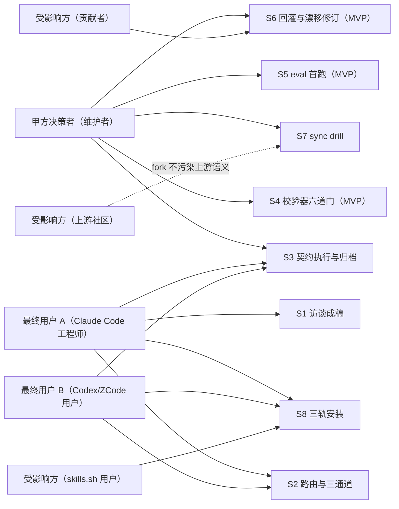
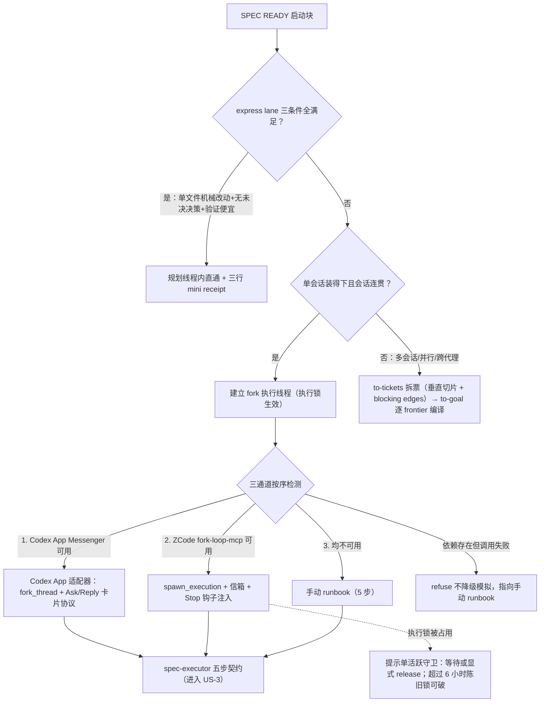
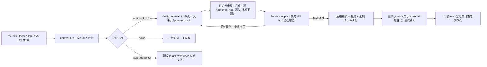

# AICoding 架构设计 · UserStory

> 本文档为《AICoding 架构设计》核心产物之一，定位为**产品需求与用户故事（UserStory）文档**。
> 上游输入：《高层架构设计》（G3 已过审，业务边界已冻结）中的需求概要、需求分析、行业调研、方案决策、产品需求及原型；
> 下游输出：与《系统设计》并行，共同驱动《部署设计》《安全设计》与集成交付。

> **工具说明**：复用《高层架构设计》的需求边界（In-Scope 12 条 / Out-of-Scope 6 条）、功能清单（F1~F10、N1~N5）、双触点产品原型（规划线程会话 / 维护者工作台）与价值目标（V1~V6）；流程图以 mermaid 内嵌，与正文同文件维护。

---

## 0. 元信息：修订记录

```yaml
标题: sam-skills（opsbli/sam-skills） - UserStory v1.0
版本: v1.0
状态: Draft   # Draft | Reviewing | Approved | Deprecated
创建日期: 2026-09-11
最后更新: 2026-09-11
作者: product-story-designer（产品故事设计师 顾全景）
评审人:
  - 主理人（team-lead）→ G4 人工审核待执行

关联文档:
  上游输入:
    - 高层架构设计: .workbuddy/output/高层架构设计.md（G3 已过审；角色、场景、功能模块、MVP 范围与边界均已冻结）
    - 资料摘要: .workbuddy/output/material_digest.md（G1 已过审：D1~D77、X1~X6）
  并行产物:
    - 系统设计: system-architect 负责（与本文档互不阻塞，跨成员信息经主理人中转）
  下游产出:
    - 部署设计 / 安全设计 / 集成交付（G4 通过后进入）
```

| 版本 | 日期 | 作者 | 变更内容 | 评审状态 |
| --- | --- | --- | --- | --- |
| v1.0 | 2026-09-11 | product-story-designer（产品故事设计师 顾全景） | 初稿（六章 + 8 条 US 七段式展开 + 附录 A 自检报告） | Draft |

**引用记号约定**：引用 G1 资料摘要标注（D编号，§章节）；引用冲突记录标注（X编号）；引用《高层架构设计》章节标注（H§编号）；引用 G2 调研报告公开来源标注（SR-编号）。全文引用语法一律使用全角〈〉。

**已冻结口径（G1/G3 确立，本文全篇遵守）**：receipt 契约以 spec-executor-receipt/v2 为当前版本（X1）；evals 记分板在首跑完成前全部 0 runs，本文不以任何评测结果作质量证据，仅以「首跑后回填」表述目标态（X4）；goal-crafter 流程口径仅采信其 SKILL.md（X3）；术语遵循 CONTEXT.md 词汇：Issue tracker、Issue、Triage role、Decision ticket、Draft proposal，backlog 不作领域词（D2）；X6 术语漂移按多数出处采信 ready-for-agent 为规范角色名。

---

## 1. 业务背景与价值

### 1.1 业务背景

- **当前业务现状（行业 / 产品 / 用户规模）**：AI 编码协作正从对话式即兴走向可验证的工程化管线。sam-skills（发布身份 opsbli/sam-skills）是 mattpocock/skills 的 opinionated fork，为 Claude Code / Codex / ZCode 三类宿主提供「把资深工程纪律编码为可执行技能」的本地仓库（D1，§开头/定位）。当前在基线 6654f6b（v1.2.3）上沉淀 7 个 fork 新增技能（to-goal / goal-crafter / spec-executor / execute-spec-in-fork / roundtable / project-standards / harvest）、receipt v2 契约、fork-loop-mcp 传输层与 32 个 promoted skills（D1，§与上游差异；D70）。用户规模：本地单用户仓库形态，主用户为仓库维护者本人及其直接使用者（Claude Code 插件工程师、Codex/ZCode 多 harness 用户、skills.sh 可编辑拷贝用户），无注册体系、无多租户（H§4.2）。
- **触发本次需求的事件（痛点修复）**：用户提出「基于项目背景和资料生成完整架构方案」。架构盘点发现三类已确认风险：质量证据链空转（评测 8 个黄金任务全部 0 runs，D15）、receipt 契约校验停留 prompt 级可检测非可防止（D75，§Consequences）、三处文档与术语漂移未治理（X2/X3/X6）。本阶段需把风险解除项落成可验收的用户故事（H§2.2 痛点 P1/P2/P4）。
- **本系统在产品矩阵中的位置**：在「AI 编码工程纪律工具」矩阵中承担**技能资产与契约管线**职责：对上消费宿主 harness（Claude Code / Codex / ZCode）运行时机制，对下交付 32 个 promoted skills 与三条执行通道，与上游 mattpocock/skills 形成「继承基线 + overlay 差异」的演进闭环（H§4.1）。

### 1.2 行业方案

> 同类功能、痛点的行业标杆系统及解决方案（引用 G2 调研报告 6 家标杆，完整分析见 H§3.1/§3.2）。本节只回答一个问题：各标杆对本 UserStory 各旅程的借鉴落点是什么。

| 标杆系统 | 场景覆盖 | 对本 UserStory 的借鉴落点 |
| --- | --- | --- |
| B1 Claude Code（Anthropic） | Skills 三层渐进披露 + subagents 上下文隔离 + 插件 marketplace | US-1 / US-2 / US-3 的宿主交互契约按其官方机制设计（SR-1、SR-3）；US-8 插件轨道安装即其 marketplace 机制 |
| B2 GitHub Spec Kit | spec-driven 五命令 + analyze/checklist 质量命令 | 阶段质量门思想延后至完整版（O6 冻结），本期 US 不展开（H§4.3） |
| B3 Kiro（AWS） | EARS 三文档 + 三阶段人工门禁 | 仅在 US-3 receipt 验收证据措辞上局部参考 EARS 可测句式 |
| B4 OpenSpec（Fission AI） | delta specs 增量语义 + validate --strict 结构门硬阻断 | US-3 的 Docs delta 结算、US-4 的「结构门硬阻断、拒绝降级模拟」哲学印证（SR-10） |
| B5 OpenHands / SWE-agent | 沙箱自主执行路线 | 反向印证 US-2 的单活跃执行线程与执行锁设计（SR-4；D75 §Decision 3） |
| B6 mattpocock/skills（上游） | 53 skills 工程纪律技能集 | 全部 US 的技能行为契约源头（继承基线）；US-7 的 overlay 同步模型直接对齐其上游节奏 |

### 1.3 方案收益与价值

| 项 | 说明 |
| --- | --- |
| 功能模块 | N1 receipt 六道归档门脚本化校验器；N2 evals 8 黄金任务首跑与 SCOREBOARD 回填；N3 漂移修订入库；F1~F10 既有「规划→执行→回灌」管线回归保持 |
| 预期价值收益 | 合规留痕：receipt 契约从 prompt 级纪律升级为机器可校验，格式漂移不再静默腐坏；体验可信：质量声称获得运行证据支撑；效率：规划线程 / 执行线程分离，规划上下文成本受控；成本：上游同步成本可量化、可预判 |
| 量化标准 | 六道门 6/6 脚本化、合成错误 receipt 拦截率 100%（V2）；SCOREBOARD 8/8 任务各 ≥1 run 且回填 pass rate（V1）；MVP 末 X2/X3/X6 三处修订入库（V4）；SPEC READY 产出前主会话 token 占用 ≤150k（H§1.3 效率目标）；MVP 时间窗 W1~W2（H§4.3） |

### 1.4 术语清单

> 统一文档中专有名词的中英文对照与含义。领域五术语以 CONTEXT.md 为唯一权威源（D2）；管线术语与《系统设计》术语表对齐（system-architect 并行产出，经主理人在 G4 集成阶段统一复核）。

| 术语 | 英文 / 写法 | 含义 |
| --- | --- | --- |
| Issue tracker | Issue tracker | 承载 issue 的工具：GitHub Issues、GitLab、本地 .scratch markdown（D2，§Language） |
| Issue | Issue | 单个被追踪的工作单元（D2） |
| Triage role | Triage role | triage 时打到 Issue 上的规范状态机标签：needs-triage / needs-info / ready-for-agent / ready-for-human / wontfix（D2；D44，§Roles） |
| Decision ticket | Decision ticket | wayfinder 单元：wayfinder:map 的子 Issue，装的是问题不是施工切片（D2） |
| Draft proposal | Draft proposal | harvest 产出的 docs/evals/draft-proposals/ 文件，含精确 old→new 编辑与 Approved: 行；文件是审批记录而非聊天（D2；D30） |
| 规划线程 | planning thread | 用户在 Claude Code 主会话中完成访谈、成稿与归档结算的会话（D1，§30 秒主流程） |
| 执行线程 | execution thread | 在 fork 内按契约实现 spec 的会话（Codex App / ZCode headless / 手动新会话三通道之一）（D27） |
| SPEC READY | SPEC READY | to-spec 产出的启动块（Status / Source / Repository / Baseline / Test seam / Non-goals / External authority / Next route 共 8 字段），标识 spec 已批准可执行（D42，§5） |
| SPEC NOT READY | SPEC NOT READY | 存在未决产品决策或测试 seam 未定时的拦截输出：列出缺失项且不启动实现（D42，§4） |
| receipt v2 | spec-executor-receipt/v2 | 执行回执契约当前版本：首字段 Schema、Conclusion 单 token、Docs delta、Receipt metrics 机器可解析行（X1；D39，§Receipt v2 字段） |
| 六道归档门 | six archival gates | 归档前逐条核验：①outcome=completed ②单一可解析 receipt ③Conclusion 单 token ④验收标准逐条有证据 ⑤无待决规划决策 ⑥工作树/外部影响已报告且无意外漂移（D27） |
| express lane | express lane | 单文件/几行机械改动 + 无未决产品决策 + 验证便宜三条件全部满足时在规划线程内直通完成，收三行 mini receipt（D27，§Express lane） |
| 执行锁 | execution lock | 单活跃执行线程守卫：原子 mkdir 锁，ack / fail / release 释放，超过 6 小时陈旧锁可破（D69，§保障） |
| 黄金任务 | golden task | docs/evals/tasks/ 下 8 个评测任务，4 个考核技能各 2 个（D13，§Golden tasks；D16） |
| SCOREBOARD | SCOREBOARD | docs/evals/SCOREBOARD.md 评测记分板：每任务一行 runs / pass rate / 主导失败模式（D15） |
| sync drill | sync drill | scripts/sync-drill.sh 无副作用试 rebase，记三指标：冲突文件数 / 冲突块数 / 预计评审分钟（D8） |
| overlay | overlay | fork 演进模型：上游为底、fork 只增量表达差异；继承技能表达层改动 ≤40 行/技能（D8） |
| promoted skills | promoted skills | 进入插件分发的技能集：engineering 25 + productivity 7 = 32（D70） |
| 三重同步 | triple sync | 每个 promoted skill 必须同时登记 plugin.json skills 数组、顶层 README、docs/ 对应页面，漏一即 drift（D4，§Promoted 三重同步） |
| 权限信封 | External authority | SPEC READY 启动块字段，决定执行方权限边界，默认不授予 commit / push / deploy 等外部权限（D27，§权限信封） |

---

## 2. 范围与边界

### 2.1 系统内模块及功能

> 一级功能清单（与 H§5.1 三层业务架构、H§6.2 模块全景一致；MVP 标记与 H§4.3/§6.3 一致）。

| 一级模块 | 二级模块 / 功能 | MVP 是否包含 |
| --- | --- | --- |
| 访谈与规划（M1） | grilling / grill-with-docs / grill-me 访谈主线；to-spec 成稿；to-tickets 拆分；to-goal + goal-crafter 契约编译；wayfinder / triage / ask-matt 入口分诊 | ✅（现状保持） |
| 执行编排与契约（M2） | execute-spec-in-fork 三通道编排 + express lane；spec-executor 五步契约；receipt v2；单活跃执行锁 | ✅ |
| 质量与评审（M3） | tdd（seam 红绿循环）、code-review（双轴 diff）、roundtable（四席两轮）、diagnosing-bugs（六阶段）、project-standards（三模式）、improve-codebase-architecture、domain-modeling | ✅（现状保持） |
| 证据回灌与评测（M4） | harvest run / apply 双模式；docs/metrics.md 与 docs/skill-friction-log.md 双台账；N2 evals 首跑与 SCOREBOARD 回填（MVP 新增）；receipt 校验报告消费 | ✅ |
| 路由与初始化（M5） | ask-matt 主流程路由与阶段边界；setup-matt-pocock-skills 一次性配置 | ✅（现状保持） |
| 维护与分发工具（B4） | N1 receipt 六道归档门脚本化校验器（MVP 新增）；N3 漂移修订入库（MVP 新增）；sync-upstream / sync-drill / lint-skills 等既有脚本保持；三轨安装话术（install-block.md 单一来源） | ✅ |

### 2.2 系统外模块及功能

> 当前系统**不覆盖**的功能及其原因（与 H§6.1 Out-of-Scope 6 条逐行一致，US 不得超出）。

| 编号 | 不做的事 | 原因 | 后续计划 |
| --- | --- | --- | --- |
| O1 | 云部署 / SaaS 化 / 多租户服务端 | 用户运行时决策显式冻结：本地 CLI/Skills 仓库，无云部署 | 不做（永久边界，除非用户推翻该决策） |
| O2 | 跨 harness 通用便携编排抽象层 | ADR 0003 已冻结「一适配器一文档、拒绝便携抽象」——一个真适配器 + 诚实 fallback 比假便携层便宜 | 不做（ADR 级边界） |
| O3 | 第三 harness 适配器（Cursor 等） | refuse-not-degrade 原则；通用集成路线为框架级投入，非单仓可负担 | 完整版后按真适配器条件评估 |
| O4 | receipt schema v3 演进 | X1 冻结 v2 为当前契约；本期无数据驱动的字段变更需求 | 待 receipt metrics 数据积累后按需评估 |
| O5 | 评测 CI 化（GitHub Actions） | D14 明确零依赖边界；CI 化属工具依赖引入，首跑完成前禁止 | 完整版评估（首跑数据回填后） |
| O6 | 阶段质量门 skill（对应功能编号 N4） | 门规则需 receipt metrics 与 friction log 数据定形（D30）——先跑数据再定门 | 完整版（依赖 N2 完成） |

### 2.3 外部依赖

| 依赖系统 | 提供方 | 依赖能力 | 接入方式 | 接口人 |
| --- | --- | --- | --- | --- |
| Claude Code 宿主 | Anthropic | Skills 三层渐进披露、subagents 上下文隔离、插件 marketplace 加载 | skill 目录 + plugin.json 本地文件加载 | 无专人接口；官方文档与社区渠道 |
| Codex 宿主 | OpenAI | 任务工具 fork / message / read / pin / archive + Task Messenger 卡片协议 v2+ | execute-spec-in-fork capability map 单点调用（能力名只活在这张表，ADR 0003） | 无专人接口；官方文档与社区渠道 |
| ZCode 宿主 | ZCode（用户自配 provider） | headless CLI（-p/--cwd/--json）+ 七事件 hooks + Stop 续跑（预算 3） | fork-loop-mcp（MCP stdio + stdout 捕获），workspace 级 .zcode/config.json 配置 | 无专人接口；0.16.5 实测口径见 D76，§Hard facts |
| mattpocock/skills 上游 | 上游社区（Matt Pocock） | 继承技能基线（grilling / to-spec / to-tickets / tdd / code-review 等） | git rebase（scripts/sync-upstream.sh），表达层 ≤40 行/技能 | 上游仓库公开 issue / PR；本仓侧接口人为仓库维护者（opsbli） |
| 模型 API | 各模型厂商（经宿主） | 推理能力 | 宿主注入（BYOK），本仓零直连、零持有 API key | 不适用（无直连依赖） |
| issue tracker 宿主 | GitHub / GitLab / 本地文件 | issue 读写（triage / to-spec / to-tickets / wayfinder 消费） | gh CLI / glab / .scratch markdown 文件；setup 一次性配置（D38） | 由使用者自选宿主；无跨仓接口人 |
| Node 18+ 运行时 | 本地环境 | scripts 九脚本 + fork-loop-mcp 服务 + N1 校验器（新增落点） | ESM 脚本直接执行，零第三方依赖（D14/D68/D69 同一边界） | 不适用 |
| 分发面 | Claude marketplace / Codex 插件机制 / skills.sh | 三轨安装与单轨互斥 | plugin.json、marketplace.json、.codex-plugin/ 镜像、npx skills add | install-block.md 为唯一公开话术来源（D77） |

---

## 3. 功能清单

### 3.1 功能清单结构

> **定位**：全景骨架表，进入「角色 / 场景 / US」之前先看到完整功能版图。本表与 H§6.3 功能清单逐行互查一致：编号、一级模块、优先级、MVP / 完整版标记全部沿用上游，无增删改；新增「支撑 US」列做反向映射。

| 编号 | 一级模块 | 二级功能 | 功能描述 | 优先级 | MVP 范围 | 完整版范围 | 对齐目标 | 支撑 US |
| --- | --- | --- | --- | --- | --- | --- | --- | --- |
| F1 | 访谈与规划 | grill 主线 | grilling 原语 + grill-with-docs/grill-me 访谈，领域词落盘 CONTEXT.md、难逆转决策落 ADR | P0 | ✅ | ✅ | V4（前提基线） | US-1 |
| F2 | 访谈与规划 | to-spec 成稿 | 会话压缩为 spec，SPEC READY 启动块 8 字段，未决决策发 SPEC NOT READY | P0 | ✅ | ✅ | V2（前提基线） | US-1 / US-2 |
| F3 | 访谈与规划 | to-tickets 拆分 | tracer-bullet 垂直切片，.scratch 或 tracker 一票一文件，blocking edges 声明 | P0 | ✅ | ✅ | V1（前提基线） | US-2 |
| F4 | 跨上下文契约 | to-goal + goal-crafter | 五种输入编译为机器可查 goal，Readiness checklist 八项硬停，会话档位推荐 | P0 | ✅ | ✅ | V2 | US-2 |
| F5 | 执行编排 | execute-spec-in-fork | 三通道按序检测（Codex App / ZCode fork-loop-mcp / 手动 runbook），express lane 三条件直通，权限信封 | P0 | ✅ | ✅ | V5 | US-2 / US-3 |
| F6 | 执行契约 | spec-executor | lock → 逐切片 tdd → 类型检查 → 全量验证 → receipt v2（Schema 首字段、Docs delta、metrics 行） | P0 | ✅ | ✅ | V2 | US-3 |
| F7 | 质量与评审 | tdd + code-review + roundtable + diagnosing-bugs | seam 红绿循环、双轴 diff 评审（Standards 轴 + Spec 轴）、四席两轮对抗评审、六阶段诊断 | P0 | ✅ | ✅ | V1 | US-3 |
| F8 | 治理技能 | improve-codebase-architecture + project-standards + domain-modeling | 架构摩擦扫描（deletion test）、规范文档三模式、glossary 与 ADR 主动维护 | P0 | ✅ | ✅ | V4 | US-3 / US-6 |
| F9 | 证据回灌 | harvest | run（读台账→分诊→起草）/ apply（显式 Approved: yes 才应用）双模式，一缺陷一提案 | P0 | ✅ | ✅ | V1 / V4 | US-6 |
| F10 | 入口路由 | ask-matt + triage + setup-matt-pocock-skills | idea→ship 主流程路由、issue 五状态机分诊（含 PR 请求面）、仓库一次性配置 | P0 | ✅ | ✅ | V4 | US-1 / US-8 |
| N1 | 维护工具 | receipt 校验器（新增） | 六道归档门脚本化：outcome / 单一可解析 receipt / Conclusion 单 token / 验收证据 / 无待决决策 / 工作树无漂移，另支持 --check 防漂移 | P0 | ✅ | ✅ | V2 | US-4 |
| N2 | 维护工具 | evals 激活（新增） | 8 黄金任务首跑、SCOREBOARD 回填、失败信号按 repeat-test 规则喂 harvest（D14） | P0 | ✅ | ✅ | V1 | US-5 |
| N3 | 维护工具 | 漂移修订（新增） | X2 Codex 插件轨道 ADR 级补档、X3 goal-crafter README 处置（仅采信 SKILL.md）、X6 ready-for-agent 术语对齐 | P0 | ✅ | ✅ | V4 | US-6 |
| N4 | 维护工具 | 质量门 skill + Docs delta 细则（新增） | 吸收 B2 analyze/checklist 思想建阶段质量门；B4 delta 语义细化 Docs delta 字段细则 | P1 | ❌ | ✅ | V2 / V1 | 完整版功能，本期不展开 US |
| N5 | 维护工具 | drill 常态化 + Session recommendation 推广（增强） | 每次上游同步前 sync drill 覆盖率 100%；to-goal 会话投入档位推广至主流程提示 | P1 | ❌ | ✅ | V3 | 完整版功能，本期不展开 US |
| — | 全局约束 | 全程本地运行 | 无云服务、无遥测外发、台账 repo 内自持、本仓不持有 API key（H§6.1 In-Scope 第 12 条，该条编号为 N4 但属全局约束，与上表功能编号 N4 质量门不是同一事物） | P0 | ✅ | ✅ | 全局约束 | 全部 US 隐含遵守 |

**互查一致性声明**：本表 F1~F10 / N1~N5 的编号、优先级、MVP / 完整版标记与 H§6.3 逐行一致；全局约束行对应 H§6.1 In-Scope 第 12 条。**P0 = MVP**：全部 P0 功能 MVP 范围列为 ✅，无例外；P1 功能（N4 / N5）延后至完整版。

---

## 4. 角色与场景

### 4.1 角色清单

> 与 H§2.1 六行逐行对齐（业务身份、主要操作、核心关注点均沿用已冻结口径），新增「关联 US」列。

| 角色 | 业务身份 | 主要操作 | 核心关注点 | 关联 US |
| --- | --- | --- | --- | --- |
| 甲方决策者 | 仓库维护者（fork owner，opsbli） | 决策 fork 演进方向、审批 draft proposal、审阅 sync drill 与 eval 指标、运行 N1 校验器与 N2 首跑 | fork 差异资产的可维护性与质量证据链（不因上游迭代与文档漂移而腐坏） | US-4 / US-5 / US-6 / US-7 |
| 最终用户 A | 使用 Claude Code 插件的工程师 | 跑 grill→to-spec→execute-spec-in-fork 主流程、读 receipt | 主流程顺畅、receipt 可信（六道门有机器校验而非肉眼） | US-1 / US-2 / US-3 / US-8 |
| 最终用户 B | Codex / ZCode 多 harness 用户 | 经 Codex App 适配器或 fork-loop-mcp 自动闭环执行 | 传输通道可用性与腐化风险（宿主升级后是否失效） | US-2 / US-3 / US-8 |
| 受影响方（上游社区） | mattpocock/skills 上游维护者 | 上游迭代、管理官方 marketplace listing | fork 不污染上游语义；上游改名/重构可被 fork 消化 | US-7 |
| 受影响方（贡献者） | 向 fork 提交变更的协作者 | 提 changeset、过 lint-skills/check-router 门、参与修订提案评审 | 贡献门禁清晰（三重同步规则、40 行预算、invocation 双侧配对） | US-6 / US-7 |
| 受影响方（skills.sh 用户） | 走可编辑拷贝轨道的安装者 | npx skills add opsbli/sam-skills | 安装路径不与插件轨道双装冲突；升级可自管 | US-8 |

### 4.2 关键场景清单

> 频率列按本系统工作流节奏表达（本地 CLI/仓库形态，无 QPS 概念）。

| 编号 | 角色 | 触发条件 | 期望结果 | 频率（工作流节奏） |
| --- | --- | --- | --- | --- |
| S1 | 最终用户 A | 有想法或 Issue 需要澄清为可执行 spec | grill→to-spec 产出 SPEC READY 启动块；存在未决决策时发 SPEC NOT READY 并列缺失项 | 每个规划任务一次 |
| S2 | 最终用户 A/B | SPEC READY 已产出，需选择执行路径 | express lane 直通，或三通道之一建立执行线程且执行锁生效 | 每 SPEC READY 后一次 |
| S3 | 最终用户 A/B | 执行线程完成实现 | receipt v2 产出并通过六道归档门，metrics 行追加，锁释放 | 每 receipt 验收后 |
| S4 | 甲方决策者（维护者） | 任一 receipt 待归档（MVP 新增 N1） | 校验器逐项输出六道门结果；错误 receipt 100% 被拦截回执行方 | 每 receipt 验收后 |
| S5 | 甲方决策者（维护者） | 技能变更后必跑；常规至多每周（MVP 新增 N2） | 8 黄金任务各 ≥1 run，SCOREBOARD 回填 pass rate 与主导失败模式 | 技能变更后必跑；其余至多每周一次 |
| S6 | 贡献者 + 甲方决策者 | 台账出现跨 receipt 重复摩擦、eval 连续两次失败或漂移待修订 | harvest 起草 draft proposal，人工批准后 apply；X2/X3/X6 修订入库 | 每 confirmed-defect 一次 |
| S7 | 甲方决策者（维护者） | 上游 push 或季度节奏 | sync drill 三指标入账；冲突文件大于 20 即停；40 行预算审计报告产出 | 每次上游同步前（常态化覆盖率目标属完整版 N5） |
| S8 | skills.sh 用户 + 最终用户 A/B | 新使用者安装，或宿主升级后重装 | 三轨择一安装成功；单轨互斥警告在两轨文档触达 | 每次安装 / 每次宿主升级 |

角色-场景覆盖图（六类角色的核心关注点全部被至少一个场景覆盖）：



> 对齐说明（对照 H§2.1）：维护者的「质量证据链」关注点由 S4 / S5 / S6 / S7 承载；最终用户 A 的「主流程顺畅、receipt 可信」由 S1~S4 承载；最终用户 B 的「通道可用性与腐化风险」由 S2 / S3 / S8 承载；上游社区、贡献者、skills.sh 用户分别由 S7 / S6 / S8 承载。

---

## 5. 用户旅程（UserStory）

US 总览（粒度原则：一条 US 对应一个主角色的一条完整任务闭环；MVP 三项新增 N1/N2/N3 各有专属 US；映射见 §3.1「支撑 US」列）：

| 编号 | 标题 | 主角色 | 对应功能 | 优先级 |
| --- | --- | --- | --- | --- |
| US-1 | 访谈成稿主线：grill → to-spec → SPEC READY | 最终用户 A | F1 / F2 / F10 | P0 |
| US-2 | 执行路由与三通道传输 | 最终用户 A / B | F2（执行路由）/ F3 / F4 / F5 | P0 |
| US-3 | 契约执行与 receipt v2 归档结算 | 最终用户 A / B | F5（通道消费）/ F6 / F7 / F8 | P0 |
| US-4 | receipt 六道归档门脚本化校验器（MVP 新增） | 甲方决策者（维护者） | N1 | P0 |
| US-5 | evals 8 黄金任务首跑与 SCOREBOARD 回填（MVP 新增） | 甲方决策者（维护者） | N2 | P0 |
| US-6 | 执行证据回灌与漂移修订入库（MVP 新增 N3） | 受影响方（贡献者）+ 甲方决策者 | F8 / F9 / N3 | P0 |
| US-7 | 上游同步前 sync drill 与 overlay 预算审计 | 甲方决策者（维护者） | 既有维护脚本能力保持（常态化属完整版 N5） | P0（能力保持） |
| US-8 | 三轨安装与单轨互斥 | 受影响方（skills.sh 用户）+ 最终用户 A/B | 分发话术（install-block.md，D77） | P0（能力保持） |

### 5.1 US-1：访谈成稿主线：grill → to-spec → SPEC READY

#### 5.1.1 业务场景

- **视角**：最终用户 A（Claude Code 插件工程师）。
- **描述逻辑**：工程师在 Claude Code 主会话中带着一个模糊想法或一条 Issue 进入规划线程，希望在同一个不间断的上下文窗口里，把想法经访谈澄清为一份可执行的 spec——领域词汇沉淀进 CONTEXT.md、难逆转决策落 ADR、最终拿到 SPEC READY 启动块（8 字段）交给执行路由。全程本地运行，spec 正文落在使用者自选的 Issue tracker 中（GitHub / GitLab / 本地 .scratch）。

#### 5.1.2 业务流程

- **视角**：用户；Given / When / Then 表述产品表现流程。

- Given 工程师已安装 sam-skills 插件且已运行 setup-matt-pocock-skills 完成一次性配置，When 工程师调用 ask-matt 描述想法，Then ask-matt 识别入口类型并路由到 grill-with-docs（有工作目录时；无工作目录用 grill-me），主流程保持单一上下文窗口。
- Given 访谈开始，When grilling 按 frontier 轮次制推进，Then 每轮以「🔥 Round N · K questions」开头一次性问出当前 frontier 的全部决策问题（每题编号、带 💡 推荐答案）；环境事实类问题由 agent 派子代理自查，不占用用户。
- Given 访谈中出现领域新词或难逆转决策，When 术语敲定或决策落定，Then 词汇当轮内联写入 CONTEXT.md、满足 ADR 三条件（难逆转、无上下文会令人惊讶、真实权衡）的决策写成 ADR 文件。
- Given 全部决策 settling 且 smart zone（约 150k token）未越界，When 用户调用 to-spec，Then to-spec 探仓、先 sketch 测试 seams 并与用户核对、把 spec 写入 Issue tracker 并打 ready-for-agent 标签、输出 SPEC READY 启动块（Status / Source / Repository / Baseline / Test seam / Non-goals / External authority / Next route 共 8 字段）。
- **异常分支**：Given 存在未决产品决策或测试 seam 未定，When to-spec 评估成稿条件，Then 输出 SPEC NOT READY 并逐条列出缺失项，不启动任何实现动作。

#### 5.1.3 UE 原型

> 本系统为 CLI/仓库形态，无图形界面；UE 原型 = CLI 会话交互文本（对应 H§6.4 规划线程会话触点）。

```text
用户：/ask-matt 我想给执行方加一个「归档前自动核验工作树」的能力

🔥 Round 1 · 3 questions
1. 🎯 Q1 - 该能力作用于哪一层：spec-executor 还是校验器脚本？
   💡 推荐答案：校验器脚本（门 6 的脚本化），spec-executor 保持报告职责
2. ⚖️ Q2 - 漂移发现后允许执行方自动修复吗？
   💡 推荐答案：不允许，回规划线程路由（refuse-not-degrade）
3. 🏷️ Q3 - 领域词定为「工作树终态核对」还是「工作树漂移核对」？
   💡 推荐答案：工作树终态核对，落 CONTEXT.md
👇 请逐条回答；事实类问题我会派子代理查证，不占用你

（用户回答后，frontier 外移，进入下一轮直至 frontier 为空）

用户：/to-spec

SPEC READY
Status: fork
Source: .scratch/worktree-verify/issues/001-worktree-terminal-check.md
Repository: opsbli/sam-skills（fork 工作树）
Baseline: 6654f6b + to-goal.3 变更集
Test seam: scripts 校验器入口（公共 CLI 参数面）
Non-goals: 不做 CI 化（O5 边界）；不改 receipt schema（O4 边界）
External authority: 默认不授予 commit/push/deploy
Next route: /execute-spec-in-fork
```

#### 5.1.4 业务逻辑

- **视角**：业务系统（技能编排逻辑）。
- grilling 维护一棵 design tree：每个决策分支挂在其下属决策之下；frontier 定义为「前置已 settling、现在就能问的问题」，一轮全问；用户回答重塑树，settled 问题使 frontier 外移；frontier 为空时会话结束。
- 决策与事实分离：需要环境事实时 agent 派子代理查证；决策逐条请用户定并等待；用户确认共识前不动手。
- grill-with-docs 组合 grilling 与 domain-modeling：术语敲定立即内联更新 CONTEXT.md（不攒批）；ADR 按三条件阈值克制落档。
- to-spec 遵循「不再访谈用户」原则：只综合已讨论内容与代码库理解；先 sketch 测试 seams（优先既有 seam、默认一 spec 一 seam、新 seam 放最高处并与用户核对）；spec 模板含 Problem Statement / Solution / User Stories（LONG 编号清单）/ Implementation Decisions（禁具体文件路径与代码片段）/ Testing Decisions / Out of Scope / Further Notes。
- 上下文卫生：步骤 1~3 保持一个不间断上下文窗口直到 SPEC READY 边界；smart zone（约 150k token）接近时只在阶段边界执行 /compact（D22，§Context hygiene）。

#### 5.1.5 数据描述

| 数据 | 位置 | 流转 |
| --- | --- | --- |
| CONTEXT.md 词条 | 仓库根 CONTEXT.md | 访谈中敲定的领域词当轮内联写入；后续所有技能读词对齐 |
| ADR 文件 | .agents/adr/（本仓现状；domain-modeling 模板按 docs/adr/ 约定亦可） | 难逆转决策落档，供 to-spec / spec-executor / 校验器引用 |
| spec 正文 | Issue tracker（GitHub issue / GitLab issue / .scratch 下 markdown） | to-spec 写入并打 ready-for-agent 标签；后续执行路由读取 |
| SPEC READY 启动块 | 规划线程会话输出（8 字段索引块） | 交给 US-2 执行路由；启动块是已批 spec 的索引不是替代品 |
| 分诊输入 | tracker 既有 Issue / .out-of-scope/ 知识库 | triage 场景下作为 on-ramp 输入（本 US 的前置变体） |

#### 5.1.6 验收标准 AC

- **AC1（正常，成稿完整）**：Given 全部产品决策与测试 seam 已 settling，When 用户调用 to-spec，Then 输出包含全部 8 字段的 SPEC READY 启动块，且启动块与 tracker 中 spec 正文一一对应、不重复全文。
- **AC2（异常，未决拦截）**：Given 存在任一未决产品决策或测试 seam 未定，When 调用 to-spec，Then 输出 SPEC NOT READY、逐条列出缺失项清单，且不产生任何实现动作（无 fork 建立、无执行线程启动）。
- **AC3（访谈效率，轮次制）**：Given 一轮内有多个可问问题，When grilling 输出本轮问题，Then 以单轮多题形式呈现（编号 + 推荐答案），不回退为单题串行追问（上游 v1.2 frontier 轮次制，H§6.4）。
- **AC4（词汇落盘）**：Given 访谈中敲定一个新领域词，When 该轮结束，Then CONTEXT.md 已内联新增该词条（不攒批、不留到会话结束）。
- **AC5（上下文预算）**：Given 规划线程从 ask-matt 到 SPEC READY，When 成稿完成，Then 主会话 token 占用 ≤150k（H§1.3 效率目标值；越界时仅在阶段边界 /compact）。

#### 5.1.7 外部集成接口

| 外部能力 | 提供方 | 集成点 | 失效处理 |
| --- | --- | --- | --- |
| Skills 三层披露与 subagents | Claude Code 宿主 | 技能加载、事实查证子代理、上下文隔离 | 宿主异常即会话中断，无降级模拟；恢复后从工件（CONTEXT.md / spec / 启动块）重建 |
| Issue tracker 读写 | GitHub（gh CLI）/ GitLab（glab）/ 本地 .scratch | to-spec 发 spec、打 ready-for-agent 标签；triage 消费 | tracker 不可写时 to-spec 明确报错并停在本边界（refuse-not-degrade）；本地 .scratch 为零外部依赖兜底 |
| 模型推理 | 各模型厂商（经宿主 BYOK） | 全部访谈与成稿的推理能力 | 本仓零直连零持有 key；宿主侧失效属宿主问题，本仓无降级 |

### 5.2 US-2：执行路由与三通道传输

#### 5.2.1 业务场景

- **视角**：最终用户 A（Claude Code 工程师）与最终用户 B（Codex / ZCode 多 harness 用户）。
- **描述逻辑**：SPEC READY 产出后，用户需要决定执行路径：轻任务走 express lane 在规划线程内直通完成；单会话装得下的任务建立 fork 执行线程；多会话 / 并行 / 跨代理任务拆票编译。fork 执行时系统按序检测三条传输通道（Codex App Messenger → ZCode fork-loop-mcp → 手动 runbook），全程受单活跃执行锁约束；缺依赖时诚实拒绝而非降级模拟。

#### 5.2.2 业务流程

- Given SPEC READY 启动块已产出，When 执行路由评估，Then 按序判定：①单文件/几行机械改动 + 无未决产品决策 + 验证便宜三条件全部满足 → express lane 在规划线程内直通完成并收三行 mini receipt（what changed / validation run / worktree state）；②单会话装得下且会话连贯 → 建立 fork 执行线程；③需多 tracer-bullet 切片 / 并行 / 跨代理 / 压缩 → to-tickets 拆票后 to-goal 逐 frontier 编译。
- Given 走 to-tickets + to-goal 路径，When to-goal 接收五种输入之一（已批准 spec / agent-ready ticket / tracker frontier / 原始 issue / 对话），Then 执行证据收集 7 步并过 Readiness checklist 八项硬停检查，产出机器可查 goal（Completion criteria 逐项复选框）与会话投入档位推荐；任一项不满足即停，不猜。
- Given fork 执行路径，When execute-spec-in-fork 按序检测三通道，Then 命中第一个可用通道建立执行线程：Codex App（fork_thread + Ask/Reply 卡片协议）→ ZCode（spawn_execution 经 fork-loop-mcp 信箱 + Stop 钩子）→ 手动 runbook（5 步：规划线程停在最终 SPEC READY → 开新会话同 workspace → 粘贴启动块 → 跑 /spec-executor → 把 receipt 带回规划线程归档）。
- Given 执行线程建立，When 启动块携带权限信封（External authority），Then 执行方权限以信封为准，默认不授予 commit / push / deploy 等外部权限。
- **异常分支 1（通道依赖缺失）**：Given Codex 或 ZCode 的依赖（任务工具 / 卡片协议 / MCP server）不存在或版本不满足，When 通道检测，Then refuse 并明确指向手动 runbook 路线，不降级模拟（ADR 0003）。
- **异常分支 2（执行锁冲突）**：Given ZCode 通道下已有活跃执行线程（原子 mkdir 锁被占），When 新 spawn_execution 到来，Then 提示单活跃执行守卫冲突并等待或走显式 release；锁超过 6 小时判定为陈旧锁可破（D69，§保障）。

#### 5.2.3 UE 原型

三通道检测与路由决策流（CLI 会话与 headless 传输的组合形态，对应 H§6.4/§6.5 双触点）：



#### 5.2.4 业务逻辑

- 路由判定权在 to-spec §4 执行路由与 ask-matt 主流程：产品决策或测试 seam 未决永远不会进入执行路由（US-1 AC2 已拦截）。
- express lane 是 first-class 诚实路径：三条件判定防止轻任务倒挂进全管线、也防止其走 silent bypass（D75，§Decision 2）。
- 三通道按序检测且能力名只活在 execute-spec-in-fork 的 capability map（ADR 0003 单点维护）：API 改名只改表，能力迁移才重写适配器。
- to-goal 是只读编译器：不实现、不动 tracker、不建分支；goal-crafter 词汇与格式规则（双模式、Phase 1 五问、Phase 2 三种 harness 格式、Phase 3 四项自检）仅以 SKILL.md 为准（X3 口径）。
- 单活跃执行锁是传输层守卫：fork-loop-mcp 以原子 mkdir 实现，ack / fail / release 释放，崩溃 runner 不能静默解锁；状态皆在持久化工件（SPEC READY 块、锁、receipt），任何一方崩溃后可从工件重建（D27，§守卫）。

#### 5.2.5 数据描述

| 数据 | 位置 | 流转 |
| --- | --- | --- |
| SPEC READY 启动块 | 规划线程会话输出 | 路由输入；fork 通道下作为执行线程唯一契约载体（跨上下文压缩版经 to-goal 产出） |
| goal 文件 | 规划线程输出（to-goal 模板六节） | 跨上下文契约：Goal / Current state / Execution order / Completion criteria（机器可查复选框）/ Constraints / Context |
| ticket 文件 | .scratch/〈feature-slug〉/issues/ 下编号文件，或真实 tracker issue | to-tickets 一票一文件，含 What to build / Acceptance criteria / Blocked by |
| 锁文件 | fork-loop-mcp 状态目录（FORK_LOOP_STATE_DIR） | 原子 mkdir 创建；记录初始状态供比对；ack / fail / release 释放 |
| 三行 mini receipt | express lane 会话输出 | what changed / validation run / worktree state |
| 权限信封 | SPEC READY 启动块 External authority 字段 | 决定执行方权限边界，随启动块进入执行线程 |

#### 5.2.6 验收标准 AC

- **AC1（正常，express lane 直通）**：Given 三条件全部满足的轻任务，When 执行路由评估，Then 在规划线程内直通完成并以三行 mini receipt 收尾，不建立 fork、不占执行锁。
- **AC2（正常，三通道按序）**：Given Codex 与 ZCode 依赖同时可用，When execute-spec-in-fork 检测，Then 按 Codex App → ZCode fork-loop-mcp → 手动 runbook 的固定顺序命中第一个可用通道。
- **AC3（异常，依赖缺失拒绝）**：Given 某通道硬依赖缺失（如 Codex 任务工具不存在或卡片协议版本低于 v2），When 通道检测到该通道，Then refuse 并输出指向手动 runbook 的引导，不产生任何模拟执行或伪造 receipt。
- **AC4（异常，执行锁冲突）**：Given ZCode 通道已有活跃执行锁，When 新的 spawn_execution 发起，Then 返回单活跃守卫冲突提示且不启动第二个执行线程；锁文件超过 6 小时时允许显式破锁。
- **AC5（异常，to-goal 硬停）**：Given to-goal 的 Readiness checklist 任一项不满足（如缺验收标准、缺完成定义），When 编译执行，Then 立即停止并指出缺失项，不产出 goal、不猜测补全。
- **AC6（权限边界）**：Given 启动块 External authority 为默认值，When 执行线程运行，Then 执行方不执行 commit / push / deploy 等外部动作（US-3 的 receipt 工作树报告可回验）。

#### 5.2.7 外部集成接口

| 外部能力 | 提供方 | 集成点 | 失效处理 |
| --- | --- | --- | --- |
| Codex 任务工具与 Messenger 卡片协议 v2+ | OpenAI（Codex 宿主） | fork_thread / read_thread / wait_threads / set_thread_archived 等能力逐项经 capability map 调用 | 缺依赖即 refuse 指向手动路线；宿主升级后按 V5 目标重验能力表（完整版节奏） |
| ZCode headless CLI 与 hooks | ZCode（用户自配 provider） | spawn_execution（zcode -p 同 checkout --json）、Stop 钩子续跑（预算 3）、信箱投递 | 模型推理走用户自配 provider；ZCode 0.16.5 已知硬事实（--settings 未接线勿用、auth 分裂）已在适配器文档固化（D76，§Hard facts） |
| fork-loop-mcp 传输层 | 本仓 scripts/fork-loop-mcp/ | MCP stdio 五工具 + Stop 钩子 + 信箱三态（pending / delivered / done） | receipt 缺失可观测（注原始输出尾段+警告，不静默成功）；exactly-once 投递（D69） |
| issue tracker（to-tickets 发布面） | GitHub / GitLab / 本地 .scratch | 票文件写入与 blocking 关系声明 | 本地 .scratch 为零外部依赖兜底 |

### 5.3 US-3：契约执行与 receipt v2 归档结算

#### 5.3.1 业务场景

- **视角**：最终用户 A / B 的执行线程（以及手动 runbook 下的人力辅助）。
- **描述逻辑**：执行线程拿到 SPEC READY 契约后，在 fork 内按 spec-executor 五步完成实现：写执行锁记录初始状态 → 按 tdd 逐切片实现（seam 红绿循环）→ 常跑类型检查 → 全量验证 → 产出 receipt v2 回执。规划线程收回 receipt 后过六道归档门逐条核验，非 none 的 Docs delta 经 domain-modeling 结算，metrics 行追加台账，工作树终态核对无漂移后释放锁、完成归档。执行中的关键决策（超出契约范围的产品决策）路由回规划线程，不由执行方擅自决定。

#### 5.3.2 业务流程

- Given 执行线程建立，When spec-executor 启动，Then 第一步写执行锁：记录继承的 SPEC READY 契约、fixed point、外部动作权限、初始工作树状态。
- Given 锁就位，When 逐切片实现，Then 按 tdd 在 pre-agreed seams 上执行红绿循环（红在绿前、一次一片、refactor 不属于本循环），常跑类型检查。
- Given 全部切片完成，When 全量验证通过，Then 产出 receipt v2：首字段 Schema: spec-executor-receipt/v2、Conclusion 单 token（completed / blocked / failed）、Docs delta 结算（none 空白即缺陷）、Receipt metrics 机器可解析行、验收标准逐条证据、工作树/外部影响报告；secret 先脱敏。
- Given receipt 返回规划线程，When 六道归档门逐条核验（outcome / 单一可解析 receipt / Conclusion 单 token / 验收证据 / 无待决规划决策 / 工作树无意外漂移），Then 全部通过后：非 none 的 Docs delta 经 domain-modeling 结算（更新 CONTEXT.md / ADR / 相关文档点），receipt metrics 行追加至 docs/metrics.md，工作树终态与 receipt 报告核对一致，锁释放，归档完成。
- **异常分支 1（Schema 漂移）**：Given receipt 首字段缺失或与 spec-executor-receipt/v2 不匹配，When 六道门核验，Then 校验失败并拒绝归档，且禁止手补 Schema 字段（D39）。
- **异常分支 2（待决决策）**：Given 执行中出现契约外产品决策未决，When 门 5 核验，Then 拦截归档，决策经执行线程路由回规划线程裁决后再续跑。
- **异常分支 3（工作树漂移）**：Given 工作树实际终态与 receipt 报告不一致，When 门 6 核验，Then 拦截归档并回执行方对账。

#### 5.3.3 UE 原型

receipt 归档视图（H§6.4「receipt 归档视图」触点；六道门逐条结果展示）：

```text
（执行线程产出，规划线程收回）
Schema: spec-executor-receipt/v2
Conclusion: completed
Docs delta: CONTEXT.md（新增「工作树终态核对」词条）；ADR 无变更
Receipt metrics: task=worktree-terminal-check slices=3 tests=42 dev=1 friction=0 quality=good
Acceptance evidence:
  AC1 校验器入口参数解析 .......... 已验证（gates 解析测试 12 断言通过）
  AC2 错误 receipt 拦截 ........... 已验证（合成用例 r-bad-01 被拦截）
  AC3 退出码语义 .................. 已验证（exit 0 与 exit 1 两态）
Worktree / external impact: 5 files changed, 0 external actions

（规划线程六道归档门输出）
Gate 1 outcome=completed ............. PASS
Gate 2 单一可解析 receipt ............ PASS
Gate 3 Conclusion 单 token ........... PASS
Gate 4 验收证据逐条齐备（3/3）....... PASS
Gate 5 无待决规划决策 ................ PASS
Gate 6 工作树无意外漂移 .............. PASS
→ 结算 Docs delta：domain-modeling 更新 CONTEXT.md
→ metrics.md 追加一行；锁释放；归档完成
```

#### 5.3.4 业务逻辑

- spec-executor 五步是执行契约：lock（状态快照）→ 逐切片 tdd 实现 → 类型检查 → 全量验证 → 产出 receipt；五步顺序固定，验证不通过不得产出 completed receipt。
- 六道归档门是归档唯一通道：任何一门不过即整体拦截回执行方，不允许部分归档；门下纪律在 MVP 前为 prompt 级（D75 自评），MVP 后由 US-4 校验器承接为脚本执行——本 US 的门逻辑与校验器逐条对应。
- Docs delta 结算规则：非 none 时逐点更新（CONTEXT.md 词条 / ADR / 文档），由 domain-modeling 技能承接；none 空白即缺陷（D39）。
- receipt metrics 行为机器可解析遥测：任务、切片数、测试、偏差、摩擦、质量标签等字段按 D39 字段定义追加至 docs/metrics.md（D9 台账结构）；质量标签在验收后询问（D9，§Goal/spec quality 标签）。
- Schema 升级规则：必填字段增删改名必须 bump 版本并两侧技能同步更新——本期冻结 v2（O4）。

#### 5.3.5 数据描述

| 数据 | 位置 | 流转 |
| --- | --- | --- |
| receipt v2 全文 | 执行线程产出（手动通道为手贴；自动通道经信箱/卡片回传） | 六道门输入；归档后留存于会话工件 |
| 执行锁记录 | fork-loop-mcp 状态目录 / 会话工件 | 初始工作树状态快照，供门 6 终态比对；done 或显式 release 释放 |
| receipt metrics 行 | docs/metrics.md（append-only 遥测表） | 每 receipt 验收后追加一行（D9 列结构），harvest run 的输入之一 |
| Docs delta 结算结果 | CONTEXT.md / ADR / 相关文档 | domain-modeling 执行更新；无结算则 Docs delta 不得留空白 |
| friction 记录 | docs/skill-friction-log.md（append-only） | 执行中技能卡点按日期追加（D10），喂 US-6 harvest |

#### 5.3.6 验收标准 AC

- **AC1（正常，全链路归档）**：Given 五步契约完成且全量验证通过，When receipt v2 回到规划线程过六道门，Then 六门全过、Docs delta 完成结算、metrics 行追加、锁释放，整个归档在一轮内完成。
- **AC2（异常，Schema 漂移拦截）**：Given receipt 首字段缺失或不等于 spec-executor-receipt/v2，When 门 2 核验，Then 拒绝归档并提示契约版本错误，任何一方不得手补字段。
- **AC3（异常，待决决策拦截）**：Given 执行线程存在未决产品决策，When 门 5 核验，Then 拒绝归档，决策路由回规划线程；执行线程不自行拍板。
- **AC4（异常，工作树漂移拦截）**：Given 工作树实际状态与 receipt 报告的终态不一致，When 门 6 核验，Then 拒绝归档并要求执行方对账后再交。
- **AC5（异常，blocked/failed 如实上报）**：Given 全量验证失败或执行受阻，When 产出 receipt，Then Conclusion 取 blocked 或 failed 并附阻塞原因，不伪造 completed。
- **AC6（正常，express lane 对齐）**：Given express lane 直通任务完成，When 收三行 mini receipt，Then 其工作树状态行与本 US 门 6 的终态核对规则一致（轻任务同样不允许未报告漂移）。

#### 5.3.7 外部集成接口

| 外部能力 | 提供方 | 集成点 | 失效处理 |
| --- | --- | --- | --- |
| Codex 任务工具（执行侧容器） | OpenAI（Codex 宿主） | fork 内执行、receipt 经 Messenger 卡片回传 | 回传失败时可从持久化工件（SPEC READY 块、锁、receipt）重建状态 |
| ZCode Stop 钩子（receipt 注入） | ZCode 宿主 + fork-loop-mcp | 回合末查信箱注入 pending receipt，一次 receipt 消耗一次续跑（预算 3） | 续跑预算耗尽仍未回传→按 receipt 缺失路径可观测处理（不静默成功） |
| 类型检查与测试工具链 | 项目自身工具栈 | spec-executor 第三、四步 | 工具缺失属环境不满足，refuse 并报告，不降级为「跳过验证」 |
| 模型推理 | 各模型厂商（经宿主 BYOK） | 执行线程全部推理 | 同 US-1：宿主侧失效属宿主问题 |

### 5.4 US-4：receipt 六道归档门脚本化校验器（MVP 新增）

#### 5.4.1 业务场景

- **视角**：甲方决策者（仓库维护者，fork owner）。
- **描述逻辑**：MVP 之前，六道归档门停留 prompt 级——「单一可解析 receipt」「Schema 首字段匹配」等门全靠肉眼与纪律（D75，§Consequences；D27/D39），格式漂移会静默腐坏。MVP 新增一个 Node 18+ ESM 零依赖脚本化校验器（落点 scripts/，模式参照 lint-skills.mjs --check，D68），在每 receipt 验收时由维护者运行，逐项输出六道门 pass / fail 与理由；错误 receipt 100% 被拦截（V2）。这是维护者把「可检测」升级为「可防止」的核心动作。

#### 5.4.2 业务流程

- Given 一份待归档 receipt v2，When 维护者运行校验器（Node 18+ 环境，scripts/ 落点，零第三方依赖），Then 校验器按六道门逐项输出 pass / fail 及失败理由，并以退出码表达整体结果（全过 exit 0，任一失败 exit 非 0）。
- Given 校验器全部通过，When 维护者执行归档，Then 才允许追加 metrics 行并释放执行锁（与 US-3 的归档动作衔接）。
- Given 任一门失败，When 维护者查看报告，Then 报告指明失败门序号、期望与实际差异，receipt 回执行方修复；**禁止手补 Schema 字段**（D39）。
- **异常分支（合成错误 receipt 验证）**：Given 维护者用预置合成错误用例（Schema 缺失、Conclusion 多 token、验收证据缺条、工作树漂移各一），When 运行校验器，Then 每个用例都被对应门拦截，拦截率 100%（V2 目标值，验证方式参照 lint-skills --check 模式，H§2.3 V2）。

#### 5.4.3 UE 原型

维护者工作台（H§6.5 触点）中校验器的 CLI 输出形态（脚本命名由《系统设计》定，本原型只固定输出契约）：

```text
$ node scripts/校验器脚本 --receipt 〈receipt 文件路径〉

Gate 1 outcome=completed ............. PASS
Gate 2 单一可解析 receipt ............ PASS
Gate 3 Conclusion 单 token ........... PASS
Gate 4 验收证据逐条齐备（5/5）....... PASS
Gate 5 无待决规划决策 ................ FAIL（发现 1 条待决决策：seam 命名未裁决）
Gate 6 工作树无意外漂移 .............. PASS
Result: 5/6 — 归档：拒绝
建议：回执行线程完成决策路由后重新提交 receipt

$ node scripts/校验器脚本 --check
校验器规则与契约文档一致：OK（防漂移自检通过）
```

#### 5.4.4 业务逻辑

- 校验器是六道门的脚本化执行体，门逻辑与 D27/D39 定义逐条对应（本 US 与 US-3 是同一契约的两个消费面：US-3 从规划线程会话视角、US-4 从脚本视角）。
- 实现约束延续仓库既定技术边界：Node 18+ ESM、零第三方依赖、--check 模式防自身漂移（D68 的 lint-skills --check 同模式；H§4.3 MVP 架构差异点「无新架构组件」）。
- 拦截语义为 refuse-not-degrade：校验失败绝不静默放行、绝不代为修补 receipt。
- 校验器报告为一次性输出（stdout），不新建台账文件；归档留痕仍走 docs/metrics.md（避免双台账漂移）。

#### 5.4.5 数据描述

| 数据 | 位置 | 流转 |
| --- | --- | --- |
| receipt v2 文本 | 待归档工件 | 校验器唯一输入（手动通道为文件路径传入；自动通道为信箱取出的同一文本） |
| 校验报告 | stdout（一次性输出） | 六道门逐项结果 + 退出码；维护者据此决定归档或回退 |
| 合成错误用例 | 校验器配套测试数据 | Schema 缺失 / Conclusion 多 token / 证据缺条 / 漂移四类用例，用于拦截率验证 |
| metrics 追加行 | docs/metrics.md | 仅在校验器全过后由归档动作追加（append-only） |

#### 5.4.6 验收标准 AC

- **AC1（正常，合规 receipt 放行）**：Given 一份合规 receipt v2（六门全部满足），When 运行校验器，Then 六项逐条输出 PASS、整体退出码为 0，允许进入归档动作。
- **AC2（异常，Schema 错误拦截）**：Given receipt 首字段缺失或与 spec-executor-receipt/v2 不匹配，When 运行校验器，Then 门 2 输出 FAIL、退出码非 0、报告含期望与实际值；不产生任何修补行为。
- **AC3（异常，Conclusion 多 token 拦截）**：Given Conclusion 字段含多于一个 token（如 completed with caveats），When 运行校验器，Then 门 3 输出 FAIL 并拦截。
- **AC4（异常，验收证据缺条拦截）**：Given 启动块声明的验收标准中任一条在 receipt 中无对应证据，When 运行校验器，Then 门 4 输出 FAIL 并列出缺条编号。
- **AC5（异常，工作树漂移拦截）**：Given 工作树实际终态与 receipt 报告不一致（以执行锁记录的初始状态比对），When 运行校验器，Then 门 6 输出 FAIL 并给出差异文件清单。
- **AC6（拦截率目标）**：Given 四类合成错误用例（Schema 缺失 / Conclusion 多 token / 证据缺条 / 漂移），When 逐一运行校验器，Then 4/4 全部被对应门拦截（拦截率 100%，V2）。
- **AC7（零依赖约束）**：Given 一台仅有 Node 18+ 与 git 的环境，When 运行校验器，Then 无需安装任何第三方包即可执行（零依赖边界，D68）。
- **AC8（防漂移自检）**：Given 校验器已入库，When 以 --check 模式运行，Then 校验器所实现的门规则与契约文档（D27/D39 口径）一致性自检通过，不一致时退出码非 0。

#### 5.4.7 外部集成接口

| 外部能力 | 提供方 | 集成点 | 失效处理 |
| --- | --- | --- | --- |
| Node 18+ 运行时 | 本地环境 | 脚本执行 | 环境缺失时脚本无法运行属环境问题；不引入运行时垫片 |
| git（工作树状态读取） | 本地 git | 门 6 的工作树终态比对 | git 不可用时门 6 显式报「无法核验」并整体拒绝归档，不跳过该门 |
| 无外部服务 | — | 本 US 全程本地运行（全局约束，H§6.1 第 12 条） | 不适用 |

### 5.5 US-5：evals 8 黄金任务首跑与 SCOREBOARD 回填（MVP 新增）

#### 5.5.1 业务场景

- **视角**：甲方决策者（仓库维护者）。
- **描述逻辑**：评测协议（D14）与 8 个黄金任务（D16）早已定义，但 SCOREBOARD 全部 0 runs（D15，X4）——质量声称没有任何运行证据。MVP 时间窗 W1~W2 内，维护者按 PROTOCOL 为 4 个考核技能（to-goal / spec-executor / tdd / code-review）的 8 个黄金任务各完成 ≥1 run：新会话贴 Prompt、记录偏差与干预、按 rubric 打分、results/ 归档一档、SCOREBOARD 回填 runs / pass rate / 主导失败模式。失败信号按 repeat-test 规则喂 harvest（US-6）。首跑完成前，任何面板不得引用评测结果为质量证据（X4 约束）。

#### 5.5.2 业务流程

- Given 8 个黄金任务文件就位（Setup / Prompt / Rubric / Pass condition / Deviation markers 五要素齐备，D16），When 维护者选择一个任务开始首跑，Then 在新会话中贴入 Prompt（不含技能名的裸任务），技能在 Setup 描述的仓库状态下自主运行。
- Given 任务运行结束，When 维护者评分，Then 对照 rubric 的 3~5 条可观察行为逐条打分（禁态度描述），记录偏航率、纠偏成本、返工次数三类指标（D14，§What gets measured）。
- Given 评分完成，When 归档，Then docs/evals/results/ 新增一次运行档案，SCOREBOARD 对应任务行更新 runs（≥1）、pass rate、主导失败模式。
- Given 8 个任务全部完成首轮，When 维护者复核，Then SCOREBOARD 达成 8/8 各 ≥1 run 且 4 个考核技能均有聚合 pass rate（V1 目标达成态）。
- **异常分支（失败信号）**：Given 某任务本次运行失败，When 记录，Then 失败进入 Defect signals 区；同一任务连续两次失败 = confirmed-defect 信号，喂 /harvest run（US-6）；偶发失败记为噪音，但有效 receipt 被门弹回一类失败一次也值得记录（D14，§Repeat-test）。

#### 5.5.3 UE 原型

维护者工作台的 SCOREBOARD 面板（H§6.5；下表为首跑完成后的目标形态示意，首跑前全部 0 runs）：

```text
docs/evals/SCOREBOARD.md

| Task | Runs | Pass rate | Dominant failure mode |
| to-goal/01 frontier-ticket-to-verifiable-goal | 1 | 1/1 | — |
| to-goal/02 partial-ticket-state-carried-forward | 1 | 0/1 | completion criteria 含复合条件 |
| spec-executor/01 receipt-contract-discipline | 1 | 1/1 | — |
| spec-executor/02 docs-delta-and-fact-settlement | 1 | 1/1 | — |
| tdd/01 seams-and-red-green-discipline | 1 | 1/1 | — |
| tdd/02 test-quality-at-the-seam | 1 | 1/1 | — |
| code-review/01 fixed-point-standards-axis | 1 | 1/1 | — |
| code-review/02 spec-axis-faithfulness | 1 | 0/1 | spec 源定位偏移（未读 issue 引用） |

Defect signals（示意行，展示登记形态）:
- 某任务连续失败 2 次 → confirmed-defect → /harvest run
```

#### 5.5.4 业务逻辑

- 评测协议（D14）约束全程：任务测技能契约而非 agent 通用能力；不引入新工具（零依赖边界）；结果是证据不是评判。
- 运行节奏：技能变更后必跑，其余至多每周一次（D14，§Cadence）；eval 不是每 receipt 的门——目的是抓漂移不是拦每次执行。
- 打分口径：每次运行测偏航率（是否守住技能契约）、纠偏成本（拉回正轨的干预次数）、返工次数（范围内工作重启/重写次数）；按技能聚合 pass rate 与主导失败模式。
- 证据纪律：results/ 每次运行一档；SCOREBOARD 行由运行档案驱动更新，不允许凭印象回填；首跑完成（8/8）之前全仓不得引用评测结果作质量证据（X4，全下游适用）。

#### 5.5.5 数据描述

| 数据 | 位置 | 流转 |
| --- | --- | --- |
| 黄金任务文件 | docs/evals/tasks/（8 个文件） | 只读输入：Setup / Prompt / Rubric / Pass condition / Deviation markers |
| 运行档案 | docs/evals/results/（每次运行一档） | 偏差、干预次数、rubric 逐条得分、pass condition 判定 |
| SCOREBOARD 行 | docs/evals/SCOREBOARD.md | 每任务一行 runs / pass rate / 主导失败模式；首跑后由 0 runs 更新 |
| Defect signals | SCOREBOARD 的 Defect signals 区 | 失败信号登记；repeat-test 判定后喂 US-6 |
| 会话消耗 | 宿主会话（BYOK） | 每任务一个新会话；不占用规划线程上下文 |

#### 5.5.6 验收标准 AC

- **AC1（正常，单任务首跑闭环）**：Given 任一黄金任务，When 维护者完成运行与评分，Then results/ 新增一档（含偏差与干预记录）且 SCOREBOARD 对应行 runs 增至 ≥1 并回填 pass rate 与主导失败模式。
- **AC2（完成态，8/8 首跑）**：Given W1~W2 时间窗内执行完毕，When 复核 SCOREBOARD，Then 8 个任务全部 runs ≥1、每个考核技能有聚合 pass rate（V1 达成态：8/8，D15 的 0 runs 状态解除）。
- **AC3（异常，失败信号登记）**：Given 某任务本次运行未过 pass condition，When 归档，Then Defect signals 区登记该失败；若为同一任务连续第二次失败，则同时产出 confirmed-defect 判定并提示 /harvest run。
- **AC4（异常，偶发噪音不立案）**：Given 某任务首次失败且失败模式无记录价值，When 维护者复核，Then 记为噪音一行，不触发 harvest 提案（repeat-test 规则，D14）。
- **AC5（证据纪律）**：Given 首跑未完成（任一任务 runs=0），When 任何文档或面板引用质量证据，Then 该引用违规——SCOREBOARD 首跑完成前全仓不得以评测结果作质量声称（X4）。
- **AC6（节奏约束）**：Given 无技能变更的常规周期，When 排程 eval，Then 频率至多每周一次；技能变更后必跑对应技能的黄金任务（D14 cadence）。

#### 5.5.7 外部集成接口

| 外部能力 | 提供方 | 集成点 | 失效处理 |
| --- | --- | --- | --- |
| Claude Code 会话（任务运行容器） | Anthropic（Claude Code 宿主） | 每任务一个新会话执行裸任务 | 会话异常即该次运行作废重跑，不部分计分 |
| 模型推理 | 各模型厂商（经宿主 BYOK） | 任务执行的推理能力 | 同上；不引入 CI 化或外部评测服务（O5 边界） |
| git（Setup 状态准备） | 本地 git | 每任务按 Setup 描述准备仓库状态 | 状态准备失败即停止该次运行，不得带病打分 |

### 5.6 US-6：执行证据回灌与漂移修订入库（MVP 新增 N3）

#### 5.6.1 业务场景

- **视角**：受影响方（贡献者）与甲方决策者（维护者）。
- **描述逻辑**：metrics / friction log / eval 失败信号在台账中积累后，维护者运行 harvest run 分诊：跨 receipt 重复的摩擦或 eval 连续失败判定为 confirmed-defect，起草 draft proposal（一缺陷一文件，Approved: no 起步）；维护者审阅后在文件内翻 Approved: yes（聊天批准不算），再运行 harvest apply 应用修订。MVP 新增的 N3 三处漂移（X2 install-block.md 引用不存在的 ADR 文件名 / X3 goal-crafter README 内容漂移 / X6 ready-for-agent 术语漂移）走同一提案-审批-应用机制在 MVP 末入库（V4）。harvest 唯一写目标是 draft-proposals/，绝不直接改 SKILL.md / AGENTS.md / 事实文档（D30，§继承的一规则）。

#### 5.6.2 业务流程

- Given 台账存在信号（metrics 质量标签、friction log 条目、eval 失败），When 维护者运行 /harvest run，Then harvest 读取四输入（docs/metrics.md、docs/skill-friction-log.md、docs/evals/ 失败档案、被点名的 SKILL.md 与 AGENTS.md/CLAUDE.md），按三档分诊：confirmed-defect / noise / gap-not-defect；台账缺席按空台账处理不是错误（D30，§run/1）。
- Given 判定为 confirmed-defect，When harvest 起草，Then 每缺陷一个文件（命名：日期-技能名-短标识.md）写入 docs/evals/draft-proposals/，模板含 Skill / Evidence / Verdict / Change（old→new 机械可应用）/ Approved: no；汇总交付并声明「尚未改动任何技能」。
- Given 提案入库，When 维护者（或贡献者经评审）批准，Then 在提案文件内将 Approved 行显式改为 yes——聊天里的批准不生效，文件是唯一审批记录（D30，§apply）。
- Given 提案已带显式 Approved: yes，When 维护者运行 /harvest apply 〈proposal-file〉，Then apply 先核对 Change 的 old text 仍在原位，核对通过后应用编辑、翻 Approved: yes 并追加 Applied: 行；行为变更提醒重同步 docs 页与 ask-matt 路由（三重同步纪律）。
- **N3 漂移修订**：Given X2/X3/X6 三处已确认漂移，When 按 MVP 计划处置，Then 各自经 draft proposal 提案并审批入库：X2 为 Codex 插件轨道补 ADR 级记录并修正 install-block.md 的 ADR 引用；X3 按「goal-crafter 仅采信 SKILL.md」口径处置其 README（X3 结论）；X6 将漂移处术语统一为规范角色名 ready-for-agent。
- **异常分支 1（未批准即申请应用）**：Given 提案 Approved 行仍为 no，When 运行 harvest apply，Then 拒绝应用并提示审批记录缺失。
- **异常分支 2（old text 漂移）**：Given 提案 Change 的 old text 在当前文件中已不存在或已变位，When apply 核对，Then 立即中止应用（漂移即停），不产生部分应用。

#### 5.6.3 UE 原型

harvest 回灌闭环（维护者工作台 docs/evals/draft-proposals/ 审批队列触点，H§6.5）：



#### 5.6.4 业务逻辑

- harvest 的一规则：事实在台账里找，修订由人确认；技能资产的任何直接改动都绕过本流程视为违规（V4 完整版目标「未经流程直接改动次数 = 0」的机制前提）。
- 分诊三档判据（D30，§run/2）：confirmed-defect = 跨 receipt 重复的摩擦（2+ receipt 同摩擦）/ quality 标签重复 / eval 复跑仍失败；noise = 一次性误读，一行记录；gap-not-defect = 技能该说话没说但一条子句修不了，建议走 grill-with-docs 立新技能。
- 提案文件即审批记录：一缺陷一提案，「重写整个技能」类提案应转 grill-with-docs；文件入库 git 可批量评审（贡献者参与点）。
- apply 是唯一写入时刻：核对 old text 原位（漂移即停）→ 应用 → 翻牌 + Applied 行 → 提醒重同步（SKILL.md 行为变更须联动 docs 页与 ask-matt 路由，三重同步）。
- N3 是本机制的首批存量清偿：三处漂移不是新缺陷发现，而是已确认事实（X2/X3/X6），走同一提案机制入库后 MVP 末达成 V4 的「3 处修订入库」。

#### 5.6.5 数据描述

| 数据 | 位置 | 流转 |
| --- | --- | --- |
| 台账三源 | docs/metrics.md、docs/skill-friction-log.md、docs/evals/results/ | harvest run 的只读输入；全部 append-only 不修剪（D10/D30） |
| draft proposal 文件 | docs/evals/draft-proposals/〈日期〉-〈技能名〉-〈短标识〉.md | harvest 唯一写目标；含 Skill / Evidence / Verdict / Change / Approved 行 |
| 修订目标文件 | SKILL.md / CONTEXT.md / install-block.md / 新增 ADR / docs 页 | apply 的写入对象（仅在 Approved: yes 且 old text 核对通过后） |
| Applied 记录 | 提案文件内 Approved: yes + Applied: 行 | 审批与应用的留痕；git 历史可追溯 |
| N3 处置产物 | ADR 补档（X2）、README 处置说明（X3）、术语统一编辑（X6） | MVP 末入库，三处漂移清零（V4） |

#### 5.6.6 验收标准 AC

- **AC1（正常，提案审批应用闭环）**：Given 一份 confirmed-defect 提案且维护者已在文件内翻 Approved: yes，When 运行 harvest apply，Then old text 核对通过、编辑被应用、提案翻牌并追加 Applied: 行，且全过程中 SKILL.md 未被 harvest 直接改动。
- **AC2（异常，未批准拒绝）**：Given 提案 Approved 行为 no，When 运行 harvest apply，Then 拒绝应用并提示缺少显式审批记录；聊天中口头批准不产生任何应用效果。
- **AC3（异常，old text 漂移中止）**：Given 提案 Change 的 old text 已不在目标文件原位，When apply 核对，Then 立即中止且不产生部分应用，提示重新起草提案。
- **AC4（分诊正确性）**：Given 一次性摩擦与跨 receipt 重复摩擦混合的台账，When harvest run 分诊，Then 一次性摩擦归 noise（一行记录）、重复摩擦归 confirmed-defect（起草提案）、机制性空白归 gap-not-defect（建议立新技能），三档互不混淆。
- **AC5（N3 完成态）**：Given MVP 末复核，When 检查三处漂移，Then X2 的 ADR 级补档与引用修正、X3 的 README 处置（仅采信 SKILL.md 口径落档）、X6 的术语统一（规范角色名 ready-for-agent）全部经提案-审批-应用入库（V4 的 3 处修订入库达成）。
- **AC6（写目标纪律）**：Given harvest 任意模式运行，When 检查其写入行为，Then 写目标仅为 docs/evals/draft-proposals/（run 模式零写入台账外的文件；apply 模式仅在审批后写修订目标），台账一律 append-only 不修剪。

#### 5.6.7 外部集成接口

| 外部能力 | 提供方 | 集成点 | 失效处理 |
| --- | --- | --- | --- |
| git（提案入库与批量评审） | 本地 git / GitHub（贡献者协作面） | 提案文件入库，贡献者经 PR 评审批准 | 无远端时本地文件审批同样有效（文件即记录，不依赖平台） |
| docs 页与 ask-matt 路由（重同步面） | 本仓 docs/ 与 skills/engineering/ask-matt/ | apply 后的行为变更重同步提醒 | 重同步遗漏由 check-router.mjs / lint-skills.mjs 机器校验兜底（D68） |
| 无外部服务 | — | 本 US 全程本地运行（全局约束） | 不适用 |

### 5.7 US-7：上游同步前 sync drill 与 overlay 预算审计

#### 5.7.1 业务场景

- **视角**：甲方决策者（仓库维护者）；间接受影响方为上游社区与贡献者。
- **描述逻辑**：上游 mattpocock/skills 高速迭代（7 分钟内完成改名级替换，SR-19；v1.2 重构 grilling 轮次制，SR-21），fork 的 overlay 边界随时可能被击穿。维护者在每次上游同步前先跑 sync drill（scripts/sync-drill.sh 无副作用试 rebase），量化本次同步成本并写入 docs/sync-drill-log.md；冲突文件超过 20 即停止并重评 overlay 边界（D8）。正式同步按冲突 playbook a/b/c 决策树处置；继承技能的 40 行表达层预算由 lint-skills --diff-audit 审计（现 warn-only，两版后转硬门，D68/D8）。本 US 为既有脚本能力的使用旅程（MVP 保持）；「每次上游同步前 100% 先演练」的常态化覆盖率目标属完整版 N5（V3）。

#### 5.7.2 业务流程

- Given 上游出现 push 或季度同步节奏到来，When 维护者准备同步，Then 先运行 sync drill：脚本在丢弃式分支上试 rebase，记录三指标（冲突文件数 / 冲突块数 / 预计评审分钟），完成后清理还原并追加一行记录至 docs/sync-drill-log.md。
- Given drill 三指标产出，When 冲突文件数 ≤20，Then 维护者评估评审成本后执行正式同步（scripts/sync-upstream.sh，要求干净 worktree + 命名本地分支）；逐冲突按 playbook 决策树处置：a = 放弃 fork 差异跟随上游；b = 保留差异重建补丁；c = 语义已分叉时晋升为 fork 全所有权技能（脱离 40 行预算约束）（D12）。
- **异常分支（超阈值停止）**：Given drill 报告冲突文件数大于 20，When 维护者复核，Then 停止同步动作并启动 overlay 边界重评（D8 规则 100% 执行），不强行 rebase。
- Given 正式同步完成，When 维护者运行 lint-skills --diff-audit（对照上游 ref），Then 继承技能表达层改动超 40 行且无 changeset 提名的被报告（fork 自有技能豁免）；报告项逐条补 changeset 或收缩改动。
- Given 继承技能行为变化，When 涉及 promoted 集，Then 同步走三重同步检查（plugin.json / 顶层 README / docs 页）与 check-router.mjs 校验，漏一即 drift 被拦截。

#### 5.7.3 UE 原型

维护者工作台的 sync-drill 面板（H§6.5；docs/sync-drill-log.md 既有 1 行记录为 2026-09-04 零冲突基线，D11）：

```text
$ bash scripts/sync-drill.sh

→ 在丢弃式分支 drill/2026-09-12 试 rebase upstream/main …
→ 冲突文件：2（docs/maintaining-fork.md、skills/engineering/implement/SKILL.md）
→ 冲突块：5
→ 预计评审：约 25 分钟
→ 清理还原完成（无副作用）
→ 已追加记录至 docs/sync-drill-log.md

结论：冲突文件 2 ≤ 20，可进入正式同步；按 playbook b（保留差异重建补丁）处置 implement 语义对照
```

#### 5.7.4 业务逻辑

- drill 先行原则：正式同步前必须有当次 drill 记录；drill 无副作用（丢弃式分支 + 清理还原），成本量化先行（D8）。
- overlay 模型：上游为底、fork 只增量表达差异；继承技能表达层 ≤40 行/技能，超预算必须开 changeset 说明动机——审计现为 warn-only，两版后转硬门（D8/D68），本 US 按现状 warn-only 表述。
- 冲突 playbook 三分支的判据是语义是否分叉：改名级替换走 a/b，语义分叉（如 implement 与 implement-spec）走 c 晋升全所有权（D12，§决策树 a/b/c）。
- 正式同步的前置硬约束：干净 worktree + 命名本地分支，否则 sync-upstream.sh 报错退出（D68）。

#### 5.7.5 数据描述

| 数据 | 位置 | 流转 |
| --- | --- | --- |
| drill 三指标 | docs/sync-drill-log.md（append-only 追加一行/次） | 冲突文件数 / 冲突块数 / 预计评审分钟；同步决策输入 |
| 冲突对照表 | docs/upstream-collision-playbook.md | implement-spec 等语义对照与决策树 a/b/c 的处置依据 |
| 40 行预算审计报告 | lint-skills --diff-audit stdout | 继承技能超预算清单；逐条补 changeset 或收缩 |
| changeset | .changeset/ | 超预算改动的动机留痕；版本推进随 npm run version 双写 |
| 三重同步状态 | plugin.json / 顶层 README / docs 页 | 同步后 promoted 集一致性核验对象（check-router.mjs 校验） |

#### 5.7.6 验收标准 AC

- **AC1（正常，drill 记录入账）**：Given 上游有新 push，When 运行 sync-drill.sh，Then drill 在丢弃式分支完成试 rebase、清理还原无残留，且 docs/sync-drill-log.md 追加一行含三指标的记录。
- **AC2（异常，超阈值停止）**：Given drill 报告冲突文件数大于 20，When 维护者复核，Then 不执行正式同步、不 rebase 当前分支，并启动 overlay 边界重评（D8 规则）。
- **AC3（正常，playbook 处置留痕）**：Given 正式同步产生冲突，When 逐冲突处置，Then 每个冲突按 a/b/c 决策树分支处置且其选择可在对照表与 commit 记录中追溯，不发明第四种处置。
- **AC4（审计，40 行预算）**：Given 继承技能发生表达层改动，When 运行 lint-skills --diff-audit，Then 超 40 行且无 changeset 提名的技能被逐条报告，fork 自有技能不出现在报告中（豁免规则，D68）。
- **AC5（同步后一致性）**：Given 正式同步完成，When 运行 check-router.mjs 与 lint-skills.mjs，Then promoted 集三重同步与路由完整性校验通过，任何漂移被拦截在合入前。

#### 5.7.7 外部集成接口

| 外部能力 | 提供方 | 集成点 | 失效处理 |
| --- | --- | --- | --- |
| mattpocock/skills 上游仓库 | 上游社区 | git rebase 的 rebase 源（sync-upstream.sh / sync-drill.sh） | 上游不可达时 drill 报错退出，不做离线猜测；上游改名级变更经 playbook 消化 |
| GitHub 远端（origin） | opsbli/sam-skills | 同步分支推送与 PR 面 | 推送失败属网络/权限问题，本地分支与 drill 记录不受影响 |
| 无云服务依赖 | — | 全程本地 git 操作（全局约束） | 不适用 |

### 5.8 US-8：三轨安装与单轨互斥

#### 5.8.1 业务场景

- **视角**：受影响方（skills.sh 用户）为主，最终用户 A / B 在安装与宿主升级场景同样涉及。
- **描述逻辑**：新使用者拿到仓库后需要选择安装轨道：Claude Code 走插件 marketplace（marketplace add opsbli/sam-skills → install sam-skills@opsbli），Codex 走插件（plugin marketplace add → plugin add sam-skills@opsbli），其余场景走 skills.sh 可编辑拷贝（npx skills@latest add opsbli/sam-skills，支持整集或单技能）。关键约束是**每 harness 只选一路线**：插件是只读托管束、skills.sh 是可编辑拷贝，装两路会同技能双载（D77，§install-block）。安装话术以 install-block.md 为唯一来源；docs 人面页不写安装命令。fork 不能用上游官方 listing（D73，§Fork update 2026-08-10）。

#### 5.8.2 业务流程

- Given 使用者使用 Claude Code，When 按安装话术操作，Then 依次执行 marketplace add opsbli/sam-skills 与 install sam-skills@opsbli，安装后 32 个 promoted skills 与 fork-loop MCP server 随插件可用，ask-matt / setup 入口可运行。
- Given 使用者使用 Codex，When 按安装话术操作，Then 经 Codex 插件机制安装（.codex-plugin/ 扁平镜像承载，D68 build-codex-plugin.mjs 生成），同样获得 promoted 集与 fork-loop MCP。
- Given 使用者需要可编辑拷贝（其他 harness 或想自行修改），When 运行 npx skills@latest add opsbli/sam-skills，Then 得到整集或单技能的可编辑拷贝，升级由使用者自管（自行重跑安装或 git 拉取）。
- **异常分支（双装冲突）**：Given 同一 harness 先装插件又装 skills.sh 拷贝，When 技能加载，Then 同名技能双载——文档在插件与 skills.sh 两轨均给出单轨互斥警告，使用者应卸载其一（警告触达目标：两轨文档 100% 覆盖，V6 完整版目标，MVP 保持 install-block.md 单一来源）。
- Given 宿主升级（Claude Code / Codex / ZCode 版本变化），When 使用者重装或复检，Then 按 install-block.md 话术重验安装轨道选择；ZCode 侧额外遵循 fork-loop-mcp 的版本升级重验义务（D76，§Consequences）。

#### 5.8.3 UE 原型

安装触点（H§6.4「安装与文档触点」；README 安装节与 install-block.md 同源）：

```text
（Claude Code 轨道）
$ claude plugin marketplace add opsbli/sam-skills
$ claude plugin install sam-skills@opsbli
✔ 32 promoted skills + fork-loop MCP 已就绪
提示：请勿在同一 harness 再安装 skills.sh 拷贝（双装 = 同技能双载）

（skills.sh 轨道）
$ npx skills@latest add opsbli/sam-skills          # 整集可编辑拷贝
$ npx skills@latest add opsbli/sam-skills --skill=ask-matt   # 单技能
✔ 拷贝完成；升级自管
提示：若已装插件轨道，请先卸载其一（单轨互斥）
```

#### 5.8.4 业务逻辑

- 话术单一来源：install-block.md 是唯一公开安装话术（docs 人面页不写安装命令，发布面自带 widget）；三轨话术与其逐字一致。
- 单轨互斥的机制原因：插件轨道由 marketplace 托管更新（只读），skills.sh 拷贝由使用者自管（可编辑），两者并存时同一技能出现两份实例，行为不可预期。
- 版本形态：上游衍生预发布形式（1.2.3-to-goal.N），plugin.json 与 package.json 双写一致（sync-plugin-version.mjs / check-plugin-version 门，D6/D68）。
- Codex 插件轨道的存在由 .codex-plugin/ 已提交镜像支撑（X2 版本 A 口径：已实现但缺 ADR 级记录——该缺口由 N3/X2 修订补档，US-6）。

#### 5.8.5 数据描述

| 数据 | 位置 | 流转 |
| --- | --- | --- |
| plugin.json | .claude-plugin/plugin.json | promoted 集权威清单（32 条）+ fork-loop MCP server 声明（D70）；三重同步的一环 |
| marketplace.json | .claude-plugin/marketplace.json | 仓库自成单插件 marketplace 的声明（D73） |
| .codex-plugin/ 镜像 | .codex-plugin/skills/ 扁平已提交副本 | Codex 单路径 manifest 的载荷（build-codex-plugin.mjs 生成，--check 防漂移） |
| 安装话术 | .agents/install-block.md | 三轨命令与互斥警告的唯一来源（D77） |
| 本地安装面 | ~/.claude/skills、~/.agents/skills 等 | 三轨安装的最终落点；sync:local 为维护者本地命令非公开途径（D68） |

#### 5.8.6 验收标准 AC

- **AC1（正常，Claude 插件轨道）**：Given 使用者按话术在 Claude Code 安装，When 安装完成，Then 32 个 promoted skills 与 fork-loop MCP server 可用，ask-matt 路由可运行。
- **AC2（正常，skills.sh 轨道）**：Given 使用者运行 npx skills add，When 拷贝完成，Then 得到可编辑拷贝且单技能安装（--skill 参数）同样可用；升级由使用者自管。
- **AC3（异常，双装警告触达）**：Given 使用者在同一 harness 已装一轨又尝试另一轨，When 查阅任一轨安装文档，Then 可见单轨互斥警告与冲突后果说明（双装 = 同技能双载）。
- **AC4（话术一致性）**：Given README 安装节、docs 触点与 install-block.md，When 逐字比对，Then 三处话术一致且来源唯一（install-block.md）；docs 人面页不出现安装命令。
- **AC5（版本一致性）**：Given 发布版本推进，When 运行 check-plugin-version 门，Then package.json 与 plugin.json 版本双写一致，不一致即拦截。
- **AC6（上游 listing 隔离）**：Given 使用者在上游官方 marketplace 检索，When 查找本 fork，Then 得到「fork 不能用上游官方 listing，需加 opsbli marketplace」的正确引导（D73，§Fork update 2026-08-10）。

#### 5.8.7 外部集成接口

| 外部能力 | 提供方 | 集成点 | 失效处理 |
| --- | --- | --- | --- |
| Claude marketplace 机制 | Anthropic（Claude Code 宿主） | marketplace add / install 两步安装 | 宿主 marketplace 异常时引导走 skills.sh 轨道（可编辑拷贝为万能兜底，D73） |
| Codex 插件机制 | OpenAI（Codex 宿主） | plugin marketplace add / plugin add | 同上 |
| skills.sh 安装器 | 上游生态（npx skills） | 整集 / 单技能可编辑拷贝 | 安装器版本变化由使用者侧重跑吸收；本仓不锁定安装器版本 |
| 上游官方 listing | 上游社区 | fork 明确不消费（listing sha pin 滞后于 main，D73 §Update 2026-08-05） | 引导话术已固化于 install-block.md |

---

## 6. 非功能性需求

### 6.1 易用性需求

- **操作便利性**：全部交互为 CLI 会话与 repo 文件形态，无图形界面依赖；安装后第一步由 ask-matt 路由承接（使用者不需要记忆技能清单），首次使用前由 setup-matt-pocock-skills 完成一次性配置（tracker / 标签词表 / 领域文档布局三节问答，D38），重跑仅在换 tracker 时需要。
- **交互一致性**：访谈轮次固定骨架「🔥 Round N · K questions」+ 12 类 type emoji 结构锚（🎯 范围 / ⚖️ 权衡 / ⚠️ 风险 / 🏷️ 命名等，D49）——emoji 是结构信号而非装饰，全技能一致；启动块 8 字段、receipt v2 字段、六道门输出顺序全链路固定，维护者与使用者形成稳定预期。
- **引导提示**：每个决策问题附 💡 推荐答案；阶段边界提供五选项（Continue / clear / handoff / Subagent / compact，D22）；SPEC NOT READY 逐条列出缺失项而非笼统报错；校验器与六道门输出逐门给 PASS / FAIL 及失败理由（US-3 / US-4）。
- **错误反馈**：错误反馈遵循 refuse-not-degrade——通道依赖缺失、tracker 不可写、提案未批准、old text 漂移等场景一律给出明确拒绝理由与下一步指引（指向手动 runbook / 指向补审批 / 指向重新起草），不静默降级。
- **无障碍支持**：纯文本 CLI 与 markdown 文件天然兼容屏幕阅读器与终端缩放；无颜色编码依赖（PASS / FAIL 均有文字）；术语全链路遵循 CONTEXT.md 统一词表，降低认知负担（N3/X6 修订后消除现存术语漂移）。
- **文档一致性**：每个 promoted 技能有一页 docs 人面页（What it does / When to reach for it / Where it fits 固定三节，D77 writing-docs）；技能改名/行为变更联动建页/搬页并由 lint-skills / check-router 机器校验兜底。

### 6.2 性能响应需求

> 本系统为本地 CLI/Skills 仓库形态，**无服务端、无网络接口、无多租户**——模板中的接口时延（P50/P90/P99）、吞吐量（QPS/TPS）、并发用户数等指标**不适用**，不虚构。性能约束以本系统真实存在的工作流节奏与上游已冻结目标值表达（不自造 SLA，见附录 A 自检 4）：

- **上下文预算**：SPEC READY 产出前主会话 token 占用 ≤150k（smart zone 阈值内完成规划，H§1.3 效率目标；接近时仅在阶段边界 /compact）。
- **本地脚本执行**：N1 校验器与 lint-skills / check-router 等维护脚本同为 Node 18+ ESM 零依赖本地脚本，执行时延为秒级量级（与 lint-skills --check 同模式同量级，D68）；不承诺具体毫秒数（本地单用户工具，无时延 SLA 概念）。
- **评测节奏**：eval 至多每周一次、技能变更后必跑（D14 cadence）；8 黄金任务首跑在 W1~W2 完成（H§4.3 MVP 时间窗）。
- **传输层预算**：ZCode Stop 钩子续跑预算 3 次、一次 receipt 恰耗一次续跑；钩子配置 timeoutMs 15000（D69）；执行锁陈旧阈值 6 小时（D69）——三项均为上游已冻结事实值。
- **数据规模上限**：promoted skills 32 个（plugin.json 显式清单）、黄金任务 8 个；三台账（metrics / friction log / evals results）为 append-only 文件，不设行数上限，靠 harvest 分诊与 eval 周检消化（D30/D14），不引入数据库。
- **同步成本可预判**：每次上游同步前 drill 三指标（冲突文件数 / 冲突块数 / 预计评审分钟）量化成本；冲突文件数大于 20 即停止（D8 阈值）。

### 6.3 操作与环境需求

- **运行环境**：Node 18+（scripts 九脚本、fork-loop-mcp、N1 校验器，ESM 零第三方依赖，不引入 Deno/Bun 替代）；git（版本控制与同步）；操作系统为 Node 18+ 支持的本地环境。
- **宿主兼容性**：Claude Code（Skills 三层披露 + subagents + 插件 marketplace）；Codex（任务工具 + Task Messenger 卡片协议 v2+）；ZCode（headless CLI -p/--cwd/--json + 七事件 hooks + Stop 续跑）。ZCode 已知硬事实固化遵循：--settings 参数勿用（宣传与实现错位）、auth 走用户自配 provider、headless 无显式 provider 拒启（D76，§Hard facts）；ZCode 原生长出会话原语则 fork-loop-mcp 适配器退役（D76，§Consequences）。
- **网络环境**：本仓自身零网络服务、零遥测外发（全局约束）；需要网络的场景仅有三处且均经外部组件——模型推理经宿主 BYOK、上游同步经 git 远端、三轨安装经各自分发渠道；离线状态下访谈成稿 / 校验器 / drill / 台账维护等本地能力不受影响。
- **issue tracker 环境**：GitHub（gh CLI）/ GitLab（glab）/ 本地 .scratch markdown 三选一，setup 一次性配置；本地 .scratch 为零外部依赖兜底。
- **分发环境**：三轨安装各自要求宿主最新机制（Claude marketplace、Codex 插件、npx skills）；fork 不能用上游官方 listing（D73）。
- **设备规格**：无特殊要求（纯文本仓库 + Node 运行时）；不依赖 GPU、容器或沙箱。

### 6.4 安全性需求

#### 6.4.1 安全密码设置

- 本系统**不涉及账号密码设置功能**：本地单用户仓库形态，无注册、无登录、无账号体系（H§4.2 多租户行）。模板该项不适用，原因如上。
- 相关替代控制：本仓不持有任何 API key（模型推理经宿主 BYOK，H§5.2）；使用者侧凭据经环境变量（diagnosing-bugs Phase 1：凭据留在环境变量，D25）与 wizard 的 ask_secret 隐藏输入（不回显，D46）；仓库内不落任何 secret 值（project-standards 探索发现秘密按事实报告 file+line 不引值，D33）。

#### 6.4.2 安全软件架构

- **模块通信安全**：模块间通信面为本地文件系统与进程内调用；唯一跨进程通道 fork-loop-mcp 走 MCP stdio（本机进程间），无网络监听端口；无远程攻击面。
- **组件、用户、资源的认证与访问控制**：以单活跃执行锁（原子 mkdir）+ 权限信封（External authority 默认不授予 commit / push / deploy）+ git-guardrails 危险 git 命令拦截（push --force / reset --hard / clean -fd 等，D62）构成三层访问控制；执行方对外部资源的一切动作以启动块信封为准（US-2 AC6）。
- **与外部系统接口的安全**：外部接口仅宿主 harness 与 git 远端；能力调用经 capability map 单点（限制未经许可的接口访问——能力名只活在表里，ADR 0003）；缺失依赖一律 refuse 不降级（不给伪造数据留通道）；外部可获取的内容以 SPEC READY 契约与权限信封为边界（限制外部所能获取的内容）；传输均为本机 stdio / git over SSH/HTTPS（安全通讯协议）。

#### 6.4.3 安全设计

- 认证授权功能：本系统无账号体系，认证授权由宿主 harness 承担（宿主对其自身 API key 与会话负责）；本仓的授权模型为「权限信封 + 执行锁 + git-guardrails」三层（见 6.4.2），核心原则是默认最小权限：执行线程默认无外部动作权限，越界动作被 refuse。
- 台账与工件的防篡改：三台账 append-only 不修剪不回写（D10/D30）；提案审批以文件行为准（聊天批准不算，D30）；审批与应用核对 old text 原位（漂移即停）——构成对技能资产修改的审计链。

#### 6.4.4 安全开发

- **入口参数检查**：校验器与维护脚本对 CLI 参数做合法性与准确性检查（--check / --receipt / --diff-audit 等模式显式定义，非法组合报错退出，延续 D68 九脚本的既有模式）；mermaid 式「规则咬人」验证思路（D58）在 N1 校验器上体现为合成错误用例拦截率 100% 验证（US-4 AC6）。
- **输入边界检查**：receipt v2 格式校验（Schema 首字段、Conclusion 单 token）即是对最常手贴输入的长度与格式边界检查（D39/D75）；to-goal Readiness checklist 八项硬停是对规划输入的完整性边界检查（D41）。
- **不引入高危漏洞的编码约束**：零第三方依赖（D14/D68/D69）从源头消除供应链投毒面；脚本不 eval 不可信输入；Node 18+ ESM 标准模块。
- **输入输出过滤与信息泄露防范**：redact 纪律全链路——diagnosing-bugs 先脱密（凭据留环境变量，D25）、receipt 产出前 secret 先脱敏（D39）、handoff 文档脱敏 API key / 密码 / PII（D50）、wizard ask_secret 隐藏输入（D46）。
- **禁止未授权代码**：技能与脚本全部为本仓显式提交物；依赖零引入；上游继承代码经 40 行预算审计与 changeset 纪律受控（D8）。
- **无绕行安全机制行为与后门**：门的全部实现为公开 repo 内脚本（N1 校验器源码入库），--check 防漂移自检（US-4 AC8）保证门逻辑与契约文档一致，无隐藏旁路。

#### 6.4.5 安全测试和部署

- **安全扫描测试**：本仓以仓库自身校验体系承担等价职责——lint-skills / check-router / check-plugin-version 三门机器校验 + mailbox-cycle.test.mjs 全链路测试（投递 / exactly-once / 锁生命周期，D69）+ N1 校验器合成错误用例（US-4）；wizard 脚本强制 bash -n + shellcheck 静态检查（D46）。
- **安全配置基线检查**：build-codex-plugin / sync-plugin-version 的 --check 模式为配置防漂移门（不一致 exit 1，D68）；fork-loop-mcp 的 workspace 级配置（.zcode/config.json + hooks.enabled）在 README 固化基线（D69）。
- **安全功能测试**：权限信封默认拒绝（US-2 AC6）、执行锁冲突拦截（US-2 AC4）、六道门拦截（US-3 AC2~AC4 / US-4 AC2~AC5）均有对应验收标准可测。
- **上线前无高危风险**：本地仓库形态的「上线」即 MVP 发布（W1~W2）；发布前置条件为 H§4.3 退出标准三项全达成（8/8 首跑回填、六门 6/6 脚本化且拦截率 100%、X2/X3/X6 修订入库），达成前不发布。

#### 6.4.6 数据安全

- **数据存储和传输加密**：本仓无用户密码、身份鉴别信息等重要数据（无账号体系）；机密类数据（API key 等）一律不入库——存储侧走环境变量与使用者本机凭据管理（6.4.1 替代控制），传输侧模型推理经宿主 HTTPS（BYOK），本仓零直连零中转，不存在本仓侧的明文传输面。
- **数据不出域**：无遥测外发——metrics / friction log / evals 台账全部为 repo 内 append-only 文件，本仓不向任何外部系统推送数据（H§5.2 数据订阅行「不适用」）。
- **工件可追溯**：提案审批、metrics 追加、drill 记录全部经 git 历史 traceable，删除与回写受 append-only 纪律约束。

---

## 附录 A：中间确认自检报告（协议 §2.4）

> 按《阶段内中间确认协议》，在 §3 / §4 / §5 / §6 四个关键章节产出后各插入一次自检：先按协议 §2.1 判定（三条全部成立才命中方案分歧型），再按协议 §2.3 反向验证 3 问（判定未命中后仍须逐问给出证据）。**本轮四个决策点均未命中触发条件，故未发起 [中间确认]**；以下如实记录每次自检的判定与 3 问证据。

### 自检 1：§3 功能清单完成后

- **§2.1 判定**：未命中。功能清单的编号、优先级、MVP / 完整版标记逐行沿用 H§6.3（G3 已冻结产物），无任何自定调整——不存在「≥2 种各有合理性且无法单方裁决」的方案分歧；新增「支撑 US」列仅为反向映射索引，不改变任何功能定义。
- **反向 3 问**：
  - Q1：若映射列调整，返工范围 = §3.1 一张表的「支撑 US」列 + §5 US 总览的「对应功能」列，估值约 0.5 人日；切换成本可控（纯文档索引，无代码影响）。
  - Q2：感知方 = 主理人与用户（G4 审核弹窗可见该表）；感知点仅限文档索引组织，不属于功能 / 交互 / 合同 / 合规四类跨界感知边界——功能是否提供、交互路径、SLA、合规属性均未因本列变化（判断依据：功能定义列逐行照抄 H§6.3）。
  - Q3：与用户诉求一致——诉求原文「启动 AICoding 架构专家团，基于我的项目背景和资料生成完整架构方案」；功能清单全部源自项目资料（H§6.3 引 D1~D77）；用户诉求未显式提及 US 映射列，本决策不改变产品形态与对外承诺，属文档组织。

### 自检 2：§4 角色与场景完成后

- **§2.1 判定**：未命中。角色清单六行逐行沿用 H§2.1 已冻结口径（不细分子角色、不新增角色）；场景清单按主理人调度原文撰写指引「关键场景建议覆盖 ①~⑦」展开为 S1~S8（①~⑦ 拆分：eval 首跑与校验器分列、安装单列），拆分仅影响文档组织，不新增 / 裁剪任何功能或边界。
- **反向 3 问**：
  - Q1：若场景合并或重拆（如 S4 并回 S3），返工范围 = §4.2 一张表 + §5 总览表与相关 US 头部引用，估值约 0.5 人日；不触及功能清单与下游模块边界。
  - Q2：感知方 = 主理人与用户（G4 可见）；感知点为场景清单粒度（文档组织），无功能 / 交互 / 合同 / 合规属性变化——角色关注点覆盖完整性未变（六类角色 Top1 关心点均有场景承载，见 §4.2 对齐说明）。
  - Q3：与主理人调度原文直接一致——撰写指引原文：「关键场景建议覆盖：①grill→to-spec→SPEC READY 主流程（最终用户 A）；②路由决策与三通道执行→receipt v2 归档（最终用户 A/B）；③维护者消费 N1 校验器报告与六道门拦截（MVP 新增）；④维护者跑 N2 eval 首跑并回填 SCOREBOARD（MVP 新增）；⑤N3 漂移修订经 draft proposal 审批（贡献者/维护者）；⑥上游同步前 sync drill（维护者）；⑦三轨安装与单轨互斥（skills.sh 用户）」——S1~S8 与 ①~⑦ 一一对应（①→S1、②→S2/S3、③→S4、④→S5、⑤→S6、⑥→S7、⑦→S8）。

### 自检 3：§5 全部 US 七段式完成后

- **§2.1 判定**：未命中。US 拆分为 8 条、每条绑定单一主角色一条完整任务闭环；该粒度决策存在弹性（合并 US-2/US-3 或拆分 US-6 均有合理性），但判定其不构成方案分歧：US 粒度不改变功能边界（§3.1 互查已锁定 F/N 清单）、不改变模块拆分输入（system-architect 的输入是 H§5/§6.3 冻结架构而非 US 粒度）、不改变任何用户可见行为。协议 §2.1 第 2 条「影响下游成员产出」不成立（系统设计并行推进、输入为高层架构）。
- **反向 3 问**：
  - Q1：若 US 重组（如 8 条并为 6 条或拆为 10 条），返工范围 = §5 一章（总览表 + 对应 US 小节重组），估值约 1 人日；无代码、无接口、无边界影响，切换成本可控。
  - Q2：感知方 = 主理人与用户（G4 审核可见 US 清单）；感知点为 US 数量与编号（文档组织）；功能 / 交互 / 合同 / 合规属性零变化——每条 US 的行为契约均直接引自上游已冻结的技能定义（D22/D27/D39/D41/D42/D30/D14/D69/D8/D77），无新增行为。
  - Q3：与用户诉求一致——诉求未显式提及 US 数量与粒度（注明：用户诉求原文与 material_digest 均无 US 粒度表述）；8 条 US 完整覆盖 MVP 三项新增（N1→US-4、N2→US-5、N3→US-6，各有专属 US 与含异常分支的 Given/When/Then 验收标准，满足调度硬性要求）与 F1~F10 既有能力场景，未偏离「生成完整架构方案」框架。
  - **验收标准取值专项核查**（对应本角色高频决策点「§5.1.6 验收标准严格度」）：全部阈值直接引自上游冻结值——拦截率 100%（V2）、8/8 首跑（V1）、token ≤150k（H§1.3）、锁陈旧阈值 6h（D69）、续跑预算 3（D69/D76）、冲突文件阈值 20（D8）、40 行预算（D8）、卡片协议 v2+（D74）；无任何自造 SLA。

### 自检 4：§6 非功能性需求完成后（最后一轮完整复核）

- **§2.1 判定**：未命中。§6 各项取值全部继承上游冻结口径或如实声明不适用：性能节明确声明 P50/P90/P99、QPS、并发数对本系统不适用（本地 CLI 仓库无服务端），性能约束全部引用上游事实值（150k token / 6h 锁 / 预算 3 / 20 文件阈值 / 周检 cadence）；安全性六小节按本地仓库形态如实映射（6.4.1 明确不适用并给出替代控制）；无任何对外承诺新增。
- **反向 3 问**：
  - Q1：若 §6 取值调整，返工范围 = §6 一章，估值约 0.5 人日；不触及功能与 US 行为契约。
  - Q2：感知方核查——本系统无客户合同、无监管场景、无服务端可用性概念（H§4.2 边界行已明确不提供可用性 SLA 承诺）；性能节因不虚构 QPS/时延而不产生隐性 SLA 承诺；安全节全部为对使用者的如实能力陈述（无过度承诺）。结论：无跨界感知。
  - Q3：与用户运行时决策一致——主理人调度原文「跳过云现状核对——本地 CLI/Skills 仓库，无云部署」；§6.2 性能节「无服务端、无网络接口」与 §6.3「本仓自身零网络服务、零遥测外发」直接继承该决策；全部 NFR 与「本地优先」形态自洽。

### 结论

四个关键决策点均未命中协议 §2.1（无未决方案分歧：功能与角色照抄冻结产物、US 粒度不触边界、NFR 取值全继承上游）或 §2.2（返工 ≤1 人日远小于 30% 产物且无供应商绑定；无功能/交互/合同/合规四类跨界感知；无偏离用户显式诉求）。**本报告未发起 [中间确认]**；G4 人工审核为全部产出的最终用户裁决通道。若 G4 审核对 US 粒度、场景拆分或 NFR 表述有意见，按定点修订处理，不扩写。

---

## 硬指标总自查（对照自动校验要求与模板硬指标）

| 校验项 | 状态 | 落点 |
| --- | --- | --- |
| 模板一、二级章节骨架完整（§1~§6 全部一级、二级章节 + §6.4.1~§6.4.6 子节） | ✅ | §1.1~§1.4 / §2.1~§2.3 / §3.1 / §4.1~§4.2 / §5.1~§5.8 / §6.1~§6.4（含 6.4.1~6.4.6） |
| 角色清单 ≥3 条（业务身份 / 主要操作 / 核心关注点三列齐备） | ✅ | §4.1：6 行（甲方决策者 / 最终用户 A/B / 受影响方三类六行） |
| 关键场景清单（角色 / 触发条件 / 期望结果 / 频率） | ✅ | §4.2：S1~S8，频率全部为工作流节奏（无虚构 QPS） |
| 每条 US 七段式完整（场景 / 流程 / 原型 / 逻辑 / 数据 / 验收 / 外部集成） | ✅ | US-1~US-8 各含 5.x.1~5.x.7，无空节 |
| 验收标准 Given/When/Then 结构化、含正常与异常路径 | ✅ | 每条 US ≥5 条 AC，均含异常分支（SPEC NOT READY / 六道门拦截 / 执行锁冲突 / apply 拒绝 / drill 超阈值停 / 双装警告等） |
| MVP 功能 N1/N2/N3 有专属 US 与完整 AC | ✅ | US-4（N1）/ US-5（N2）/ US-6（N3） |
| 功能清单与高层架构 §6.3 互查一致 | ✅ | §3.1 逐行沿用 + 互查一致性声明 |
| 非功能需求覆盖 §6.1~§6.4 全部子节 | ✅ | §6.1~§6.4（6.4.1 如实声明不适用并给替代控制） |
| 全文无 ASCII 尖括号占位（引用一律全角〈〉） | ✅ | 全文核查（含 mermaid 与代码块） |
| 全文格式红线核查（ASCII 尖括号占位 / 违规子串 / 模糊日期） | ✅ | 日期均为 2026-09-11 或 W1~W6 相对窗口；引用语法一律全角〈〉；无残留占位结构、无模糊日期字样 |
| 中间确认自检报告随文档留存 | ✅ | 附录 A（四轮自检判定 + 反向 3 问证据） |
