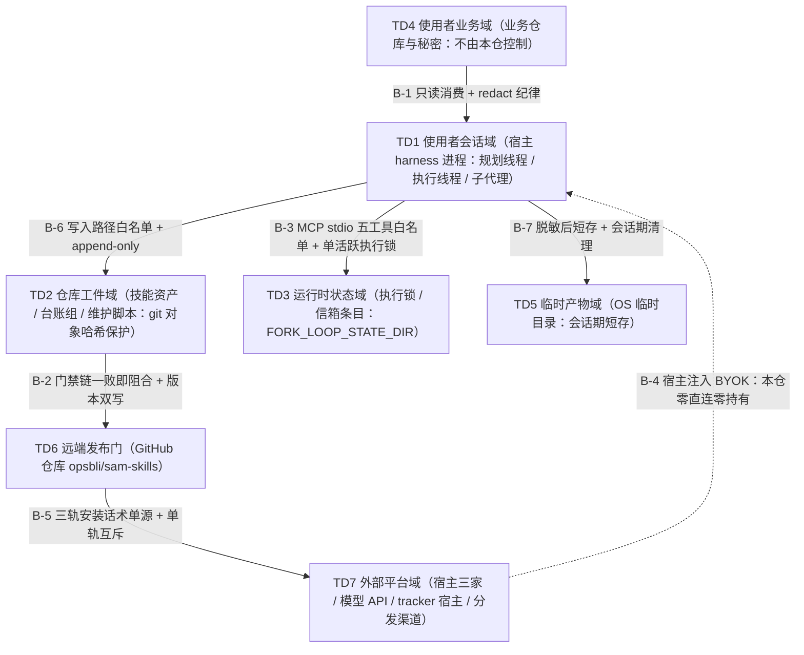
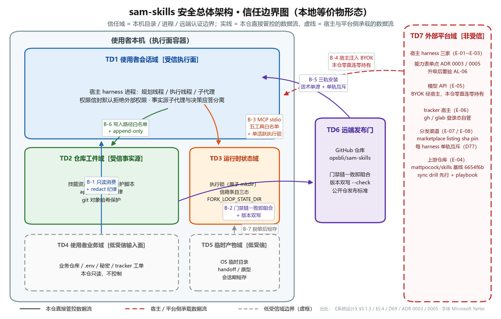
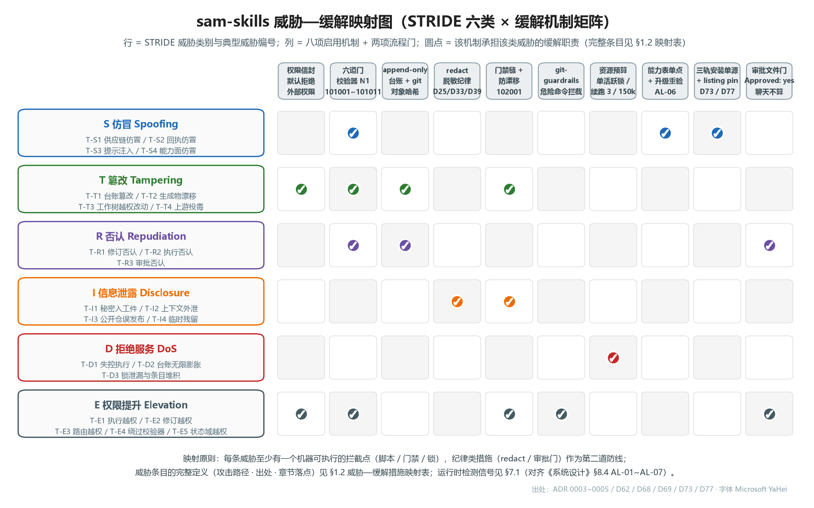
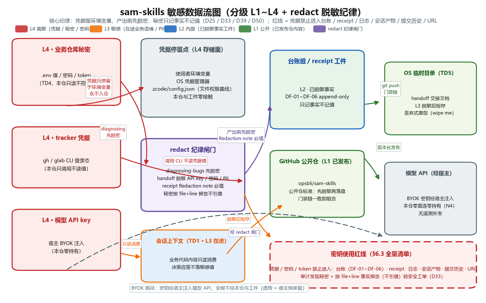

# AICoding 架构设计 · 安全设计

> 本文档为《AICoding 架构设计》核心产物之一，对应**《安全架构设计模版》**。
> 上游输入：《系统设计》v1.1（G4 已过审；其附录 C 第二条为本文档的直接交接基线：合规底线五项——零第三方依赖供应链、零密钥持有、权限信封、append-only 审计台账、redact 纪律——本文在其上细化，不回退）、material_digest.md（G1 已过审，D1~D77 / X1~X6）、《高层架构设计》（G3 已过审，业务边界追溯用）。
> 产出者：security-architect（安全架构师 严守正）；Gate：G5（下游设计审核；人工审核通过前不定稿、不进入 G6 集成交付）。

**模版使用约定（本轮裁剪声明）**：

本系统为本地 CLI/Skills 仓库（O1 永久边界：无云部署、无服务端、无多租户、无网络暴露面），按模板「按需裁剪」约定做如下处理，与《系统设计》§0 已验证的「章节位保留 + 未启用声明 + 本地等价物映射」模式一致：

- 七章骨架全部保留，章节序号与模板原始序一致，无编号顺延；核心章节（威胁建模、IAM、数据安全、应用安全、运行时安全）不删减；
- 云安全对象（DDoS / WAF / 云防火墙 / 安全组 / KMS / 堡垒机 / NAT / SOC）在对应章节以「不适用声明 + 本地等价物映射」承载，不虚构任何云资源；
- 与《部署设计》（platform-architect 并行产出）的重叠区按权威方分配表执行：网络拓扑骨架、KMS / Vault 基础选型的决策权在部署侧；安全组 / WAF 规则（本地等价物：监听面与出站面管控）、密钥分级与访问控制、审计字段与合规保留期的决策权在本文档（本地形态下各项映射为文件系统 / git / npm 分发链路 / OS 密钥设施，权威方归属不变）；
- 威胁建模基线取自《系统设计》实际模块边界（M1~M6）、数据流（DF-01~DF-07）、接口契约（slash / MCP 工具 / 脚本 CLI 三类触发接口）、身份边界（零账号体系 + 权限信封）、外部依赖（E-01~E-08）与运行形态（本机单进程 + 三轨分发）。

---

## 0. 元信息：修订记录

| 文档版本 | 发布日期 | 修订人 | 修订说明 |
| --- | --- | --- | --- |
| v0.1（骨架版） | Phase 5 · 骨架轮 | security-architect（安全架构师 严守正） | 骨架交接版：§0 裁剪声明、章节地图、§1.1 安全总体架构图、§5.1 本地信任域分区、§5.2 流量管控初步规则定稿；§1.2~§4 与 §5.3~§7、附录按 Phase 5.2 交接协议待部署侧拓扑骨架回传后补全 |
| v0.2（正文轮） | Phase 5 · 正文轮（部署侧拓扑未回传期间并行产出） | security-architect（安全架构师 严守正） | 补全 §1.2 威胁模型（STRIDE 六类 23 条威胁 + 信任边界清单 + 威胁—缓解措施映射表 + 宿主侧与使用者侧风险专述 + 图A / 图C 内嵌）、§2 身份与访问管理（零账号体系 + 三种边界身份面 + 权限信封 + 越权三线）、§3 数据安全（L1~L4 分级 + 传输 / 存储 / 使用 / 备份 / 隐私合规 + 图B 内嵌）、§4 应用安全（OWASP Top 10 逐项对照 + 业务逻辑 + 供应链 + 提示注入专节）；附录 A 先行记录 §1 / §2 / §3 三轮自检（均不触发中间确认，反向验证 3 问证据入册）；§5.3 / §5.4 / §6 / §7 继续按 Phase 5.2 交接协议等待部署侧拓扑 |
| v1.0（冻结候选版） | Phase 5 · 定稿轮（部署侧拓扑回传后对齐） | security-architect（安全架构师 严守正） | 按主理人转交的部署侧拓扑骨架完成：§5.3 / §5.4（R-S-001/003、R-Sec-001/002、IN-01~04 编号回填 + X2 基线建议稿）、§6 密钥与凭证管理（模板 5 类权威结论 + 轮转周期 + CRED-01~04 / R-M-004 回填口径）、§7 运行时安全（AL-01~AL-07 安全语义映射 + 审计 5 维度与字段规范权威结论 + 保留期永久与 30 天归档 + 5 类事件预案）、附录 A 完整四轮自检 / B 硬指标总自查 / C 与部署设计末段对账表（6 项一致，零冲突）；自跑校验 9/9 通过 |

---

## 章节地图（导读）

| 章节 | 内容 | 状态 |
| --- | --- | --- |
| §1 安全总体架构 | §1.1 总体架构图与安全组件清单（含图A 内嵌）；§1.2 威胁模型：STRIDE 六类 23 条威胁全覆盖 + 威胁—缓解措施映射表（每条威胁映射到 §2~§7 具体落点，无悬空）+ 信任边界清单 B-1~B-7 + 宿主侧风险（E-01~E-03 能力面腐化、X2 Codex 轨缺档、ZCode auth 分裂 D76）与使用者侧风险专述 + 威胁—缓解映射图（图C 内嵌） | 已定稿（v0.2） |
| §2 身份与访问管理（IAM） | 本系统零账号体系（《系统设计》§7.2.1 冻结基线）；身份锚定走三种边界凭据面（gh CLI OAuth 凭据、git 远端 SSH / HTTPS 凭据、宿主订阅账号，认证方式超过两种硬指标）；MFA 落点在 GitHub 与宿主侧（使用者责任）；权限模型 = 权限信封（非 RBAC，上游冻结）+ 写入路径白名单（接口 / 数据 / 功能三维度）+ 越权防护（执行越权 / 修订越权 / 路由越权三线）；多租户隔离与云账号章节给出不适用声明与等价物 | 已定稿（v0.2） |
| §3 数据安全 | 数据分级 L1~L4（公开 / 内部 / 敏感 / 高敏，对象覆盖 DF-01~DF-07 与使用者会话数据，含图B 内嵌）；传输安全与接口签名、传参禁忌（本地等价物）；存储安全（零加密存储 + 敏感值不入仓根本对策）；数据使用安全（redact 脱敏纪律、导出管控、销毁策略）；备份与容灾（继承《系统设计》§4.3.2 RPO / RTO）；隐私合规章节（适用性论证） | 已定稿（v0.2） |
| §4 应用安全 | OWASP Top 10 逐项对照（A01~A10 每项给出本系统具体防护机制，另对模板点名的 SQL 注入 / XSS / CSRF / 命令注入 / 反序列化 / 文件上传 / XXE / 开放重定向逐项落地）；输出安全（6 位错误码注册表）；业务逻辑安全（幂等 / 关键操作二次验证 / 资源预算）；第三方与供应链安全（零依赖边界 + 三轨分发完整性）；提示注入（LLM 特有攻击面）专节 | 已定稿（v0.2） |
| §5 网络与基础设施安全 | §5.1 网络分区（本地信任域划分：DMZ / 业务 / DevOps VPC 的本地等价物）；§5.2 流量管控（监听面清零 + 出站面白名单）；§5.3 主机与容器安全（容器 / K8s 不适用声明 + 使用者本机基线 + git-guardrails）；§5.4 中间件安全（Git / npm / fork-loop-mcp 三项本地中间件） | 已定稿（v1.0）：§5.1~§5.4 完成，含部署侧 R-S-001/003、R-Sec-001/002、IN-01~04 编号回填与 X2 基线建议稿 |
| §6 密钥与凭证管理 | 密钥分级 5 类（数据库密码、云 AKSK、服务间密钥、用户密码、API Key）逐类适用性映射与本地等价物；泄露防护（KMS 白盒 / CAM 策略限制两方案的本地等价物）；密钥使用红线（禁入面清单 + 上线扫描落点）；KMS / Vault 选型按权威方分配表引用部署侧实例命名 | 已定稿（v1.0）：模板 5 类逐类权威结论 + 轮转周期 + CRED-01~04 / R-M-004 回填口径（§6.5） |
| §7 运行时安全 | 安全事件监控（对齐《系统设计》§8.4 告警 AL-01~AL-07 + 安全类信号补充）；审计日志 5 维度（云资源、业务操作、数据库、堡垒机、WAF 的本地等价物映射）+ 字段规范（timestamp / tenantId / traceId）+ 保留期（永久，权威方=本文档）；应急响应 5 类事件预案（漏洞、数据泄露、被攻击、密钥泄露、勒索病毒） | 已定稿（v1.0）：AL-01~AL-07 安全语义映射 + 审计 5 维度 + 字段规范与保留期权威结论（永久 / 30 天归档）+ 5 类事件预案 |
| 附录 | A 中间确认自检报告（协议 §2.4，含 §1 / §2 / §3 三轮已入册 + §6 轮待 §6 完成后补记，含反向验证 3 问证据）；B 硬指标总自查；C 与《部署设计》末段对账表（安全侧来源 6 项一致性核对） | A 四轮全部入册（v1.0，含 A.4 终审自检）；B / C 已完成 |

---

## 1. 安全总体架构

### 1.1 安全总体架构图

> **总览**：本地仓库形态的安全总体架构由「五个本机信任域 + 一个远端发布门 + 一个外部平台域」构成，叠加八项实际启用的安全机制。模板的云安全组件清单逐项给出适用性判定与本地等价物（见下表），不虚构云资源。架构图与《系统设计》§3.1.2 分层组件图、§5.4 分发拓扑图的节点命名一一对应，无命名漂移。

**安全总体架构图**（信任域分块，实线为本仓直接管控的数据流，虚线为宿主 / 平台侧承载的数据流）：

**图A · 本地信任边界图**（渲染版，与上方 mermaid 图的信任域编号、边界编号 B-1~B-7 一一对应，两图同源不漂移）：

**模板安全组件适用性清单**（模板九组件逐项判定；不启用项注明不适用 + 原因，无空白）：

| 组件 | 适用性判定 | 本地等价物 / 落点 |
| --- | --- | --- |
| DDoS | 不适用：本地仓库无公网入口，无流量攻击面 | — |
| WAF | 不适用：无 Web 应用与 HTTP 端点（WAF 规则权威方=本文档，本地等价物见 §5.2 出站面白名单） | 监听面清零 + 出站面白名单（§5.2） |
| 云防火墙 | 不适用：本仓无自有网络边界 | 使用者本机 OS 防火墙（使用者环境责任，§5.2） |
| 主机安全 | 不适用：本仓不管理任何主机 | 使用者本机环境基线（§5.3） |
| 数据安全审计 | 启用（等价物） | append-only 台账组（DF-02~DF-06）+ git 提交历史 + 校验器报告行（§7.2） |
| KMS | 不适用：无云密钥设施 | 本仓零密钥持有（N4 冻结）+ BYOK 经宿主注入 + 使用者环境变量（§6） |
| 堡垒机 | 不适用：无运维通道 | 维护操作门禁链：sync 前置检查（干净 worktree + 命名分支）+ 门禁一败即阻合 + git-guardrails 危险命令拦截（§5.4） |
| NAT 网关 | 不适用：无网络分区对象 | — |
| SOC | 不适用：单人维护仓库，无资产扫描面 | 《系统设计》§8.4 告警分级（P0~P3，AL-01~AL-07）承载异常信号（§7.1） |

**本系统实际启用的安全机制清单**（八项，每项为后续章节的缓解措施提供落点）：

| 机制 | 作用 | 详细落点 |
| --- | --- | --- |
| 零第三方依赖供应链 | npm 依赖树为零（D14 / D68 / D69 同一边界），攻击面收敛为 node / git 原生能力 + 自研脚本 | §4.4 |
| 权限信封 | SPEC READY 的 External authority 字段定义执行方权限边界，默认不授 commit / push / deploy 等外部权限（D27） | §2.2 |
| 六道门校验器（N1） | receipt v2 逐道机器校验（Schema 首字段前置 + 六道门 101001~101006），合成错误回执拦截率 100%（V2 目标） | §1.2 / §4.2 |
| append-only 台账纪律 | 台账单向追加不修剪不回写（D10 / D30），证据链不可篡改 | §3.5 / §7.2 |
| redact 脱敏纪律 | 凭据留环境变量、产出前先脱密、秘密只记事实不记值（D25 / D33 / D39 / D50） | §3.5 |
| git-guardrails | PreToolUse hook 拦截 push --force / reset --hard / clean -f 等危险命令（D62，可选安装） | §5.3 |
| 三重同步门禁 | plugin.json / 顶层 README / docs 页三处一致 + check-router 三查，一败即阻合（D4 / D68） | §4.4 |
| 版本双写与防漂移门禁 | package.json 单源 + sync-plugin-version --check + build-codex-plugin --check（102001） | §4.4 / §5.4 |

### 1.2 威胁模型（STRIDE 全覆盖）

**建模方法与范围声明**：本文采用 STRIDE 方法（仿冒 Spoofing / 篡改 Tampering / 否认 Repudiation / 信息泄露 Information Disclosure / 拒绝服务 Denial of Service / 权限提升 Elevation of Privilege 六类），以 §5.1 信任域清单为资产与信任基线，沿 B-1~B-7 七条信任边界与三类触发接口（slash 命令 / fork-loop-mcp 五工具 / scripts 脚本 CLI）逐项建模。每条威胁给出攻击路径、跨越边界（或受影响域）、上游出处（D 编号 / 《系统设计》章节 / ADR）、首要缓解措施与本文档落点；全部 23 条威胁在 §1.2.4 威胁—缓解措施映射表中收敛为可审计的对应关系，无一条悬空。威胁条目的攻击路径均基于《系统设计》§7.2.1 零账号体系、§7.2.2 敏感字段清单与 §3.4 写入路径白名单的实际边界展开，不引入本系统不存在的攻击面（如无 Web 端点即不建模 Web 漏洞）。

#### 1.2.1 信任边界清单

| 边界 | 跨界两侧 | 跨越物 | 守门机制 | 对应数据流 |
| --- | --- | --- | --- | --- |
| B-1 | TD4 使用者业务域 → TD1 会话域 | 业务仓库内容、工单正文、.env 键名（只读） | 只读消费纪律 + redact 纪律（D25 / D50）：凭据值留环境变量，不进上下文 | F-01 |
| B-2 | TD2 仓库工件域 → TD6 远端发布门 | 发布 push（代码 / 文档 / release tag） | 三重同步门禁 + 版本双写 --check + 门禁链一败即阻合；推送身份 = 使用者 git 凭据 | F-04 |
| B-3 | TD1 会话域 → TD3 运行时状态域 | SPEC READY 契约、执行锁、信箱条目 | fork-loop-mcp 五工具白名单 + 单活跃执行锁（201002）+ timeoutMs 15000 | F-02 |
| B-4 | TD7 外部平台域 → TD1 会话域 | BYOK 推理应答、能力面调用 | 本仓零直连零持有（N4）+ 能力名各适配器单点 + 宿主升级重验（AL-06） | F-06 |
| B-5 | TD6 远端发布门 → TD7 外部平台域 | 三轨安装（Claude 插件 / Codex 插件 / skills.sh） | 安装话术单源（D77）+ listing sha pin（D73）+ 每 harness 单轨互斥 | F-05 |
| B-6 | TD1 会话域 → TD2 仓库工件域 | 台账追加、工单写入、词汇与 ADR 落盘 | 写入路径白名单（每台账仅一个追加入口）+ append-only 不回写 | F-03 |
| B-7 | TD1 会话域 → TD5 临时产物域 | handoff 交接文档、prototype、HITL 产物 | 脱敏纪律（D50）+ 短存 + PROTOTYPE — wipe me 标记（D34） | F-07 |

#### 1.2.2 STRIDE 威胁清单

**S · 仿冒（Spoofing）**：

| 编号 | 威胁与攻击路径 | 跨越边界 / 受影响域 | 上游出处 | 首要缓解（落点） |
| --- | --- | --- | --- | --- |
| T-S1 | 供应链仿冒：攻击者发布同形名包 / 克隆仓 / 伪造 marketplace listing，诱导使用者从非官方源安装恶意载荷 | B-5；TD6、TD7 | D73 / D77；O1 分发形态 | 安装话术单源（install-block.md）+ listing sha pin + 公开仓 opsbli/sam-skills 单一真源声明（§4.4） |
| T-S2 | 回执仿冒：执行方伪造 spec-executor-receipt/v2 格式回执，虚构证据字段声称 SPEC 已完成 | B-3；TD3 | X1 receipt v2 契约；N1 | 六道门机器校验 101001~101006：Schema 首字段前置 + 逐道核对证据字段，合成回执 100% 拦截（V2 目标）（§4.2） |
| T-S3 | 提示注入：业务仓库 README / 工单正文 / 网页内容嵌入恶意指令，诱导规划或执行线程越权操作 | B-1；TD1、TD4 | 本地 LLM 形态固有面；D25 | SPEC READY 契约唯一任务源 + 间接内容默认数据非指令 + git-guardrails 末端拦截（§4.5 专节） |
| T-S4 | 能力面仿冒：宿主升级后能力名漂移，被同名新能力劫持或替换调用语义 | B-4；TD1、TD7 | E-01~E-03；ADR 0003 / 0005；AL-06 | 能力名只活在各适配器单点，禁止动态拼接；宿主升级后能力表重验告警（§7.1） |

**T · 篡改（Tampering）**：

| 编号 | 威胁与攻击路径 | 跨越边界 / 受影响域 | 上游出处 | 首要缓解（落点） |
| --- | --- | --- | --- | --- |
| T-T1 | 台账篡改：回写或修剪 append-only 台账条目，伪造执行与审计历史 | B-6；TD2 | D10 / D30 | append-only 单向追加 + 每台账单一追加入口 + git 对象哈希（历史改写需 force push，被 git-guardrails 拦截）（§3.5 / §7.2） |
| T-T2 | 生成物漂移：plugin.json 版本与 package.json 漂移、插件三处描述不一致后发布 | B-2、B-6；TD2 | D4 / D68；102001 | 版本双写单源 + sync-plugin-version --check + build-codex-plugin --check + check-router 三查，一败即阻合（§4.4） |
| T-T3 | 工作树越权改动：执行线程越出 SPEC 声明范围修改仓库文件 | B-3、B-6；TD1、TD2 | D27 权限信封 | External authority 默认拒绝 + SPEC 范围即授权范围 + 评审子代理按 diff 范围核对（§2.2 / §2.4） |
| T-T4 | 上游投毒：upstream（mattpocock/skills）被植入恶意提交，经 sync-upstream rebase 进入本仓 | B-2；TD2、TD6 | E-04；sync 流程 | sync drill 演练先行 + rebase 逐提交人工审阅 + 门禁链全绿方可合入 + sync 事实入台账（§5.4） |

**R · 否认（Repudiation）**：

| 编号 | 威胁与攻击路径 | 跨越边界 / 受影响域 | 上游出处 | 首要缓解（落点） |
| --- | --- | --- | --- | --- |
| T-R1 | 修订否认：harvest apply 应用修订后，相关方否认曾提出或应用过该修订 | B-6；TD2 | harvest 流程；D30 | apply 前置文件内 Approved: yes 行 + 台账 append 记录修订来源与去向 + git 提交历史留痕（§4.3） |
| T-R2 | 执行否认：执行方否认收到 SPEC 或否认执行过某轮 fork 循环 | B-3；TD3 | 信箱三态设计；D69 | 信箱 pending → delivered → done 三态推进 + ack_receipt 确认回执 + 台账双向留痕（§2.3 / §7.2） |
| T-R3 | 审批否认：以聊天会话中的口头「可以」作为审批依据，事后无据可查 | B-6；TD2 | 审批文件门约定 | 聊天不算审批：文件内 Approved: yes 行为唯一有效凭证，台账记录审批依据行（§4.3） |

**I · 信息泄露（Information Disclosure）**：

| 编号 | 威胁与攻击路径 | 跨越边界 / 受影响域 | 上游出处 | 首要缓解（落点） |
| --- | --- | --- | --- | --- |
| T-I1 | 秘密入工件：.env 值 / token / 密码进入台账、receipt、提交历史或报告行 | B-1、B-6；TD2 | D25 / D33 / D39；《系统设计》§7.2.2 | redact 纪律三闸（凭据留环境变量 / 只记事实不记值 / 按 file+line 报告不引值）+ §6.3 红线清单（§3.5） |
| T-I2 | 上下文外泄：会话上下文中的业务秘密经 handoff 或 prototype 文档带出本机 | B-7；TD5 | D50 | handoff 交付物脱敏（API key / 密码 / PII）+ Redaction note 必填 + 先脱敏再落盘（§3.5） |
| T-I3 | 公开仓误发布：内部内容或凭据片段经 push 进入公开仓 opsbli/sam-skills | B-2；TD6 | O1 公开仓形态 | 门禁链 + L1 发布标准（先脱敏再落盘）+ 发布前差异审阅 + 误发布应急（§7.3 预案 2）（§3.5） |
| T-I4 | 临时残留：脱敏前内容或会话敏感产物残留于 OS 临时目录 | B-7；TD5 | D34 | PROTOTYPE — wipe me 命名 + 会话期清理纪律 + TD5 定位为丢弃式低受信域（§3.5） |

**D · 拒绝服务（Denial of Service）**：

| 编号 | 威胁与攻击路径 | 跨越边界 / 受影响域 | 上游出处 | 首要缓解（落点） |
| --- | --- | --- | --- | --- |
| T-D1 | 失控执行：fork 循环或子代理失控，无限消耗 token 与时间预算 | B-3；TD1、TD3 | D69；《系统设计》§3.5 资源预算 | 续跑预算 3 轮上限 + 每轮 150k token 预算 + timeoutMs 15000 + 单活跃执行锁串行化（§4.3） |
| T-D2 | 台账无限膨胀：台账条目无限增长，拖慢会话加载与审计回放 | B-6；TD2 | 《系统设计》§3.5 资源预算 | 台账按工单分文件 + 归档策略（上游资源预算冻结值）+ 每轮追加行数受 receipt 结构约束（§7.2） |
| T-D3 | 锁泄漏与信箱堆积：执行方崩溃后执行锁不释放，信箱条目滞留 pending | B-3；TD3 | D69 原子 mkdir 锁 + 6h 陈旧锁 | 6h 陈旧锁破锁（runbook 留痕）+ release_execution 显式释放 + 状态域可零成本重建（QS-05）（§4.3） |

**E · 权限提升（Elevation of Privilege）**：

| 编号 | 威胁与攻击路径 | 跨越边界 / 受影响域 | 上游出处 | 首要缓解（落点） |
| --- | --- | --- | --- | --- |
| T-E1 | 执行越权：执行方获取 SPEC 未授予的外部权限（commit / push / deploy / 网络外发） | B-3；TD1 | D27 权限信封 | External authority 默认拒绝集 + 显式授予必须写明范围并入台账 + git-guardrails 拦截未授权 push 类命令（§2.2） |
| T-E2 | 修订越权：未经评审子代理与使用者审批，直接 apply 修订入库 | B-6；TD2 | harvest 流程 | 评审子代理独立先行 + 文件门 Approved: yes + apply 前置检查清单（§4.3） |
| T-E3 | 路由越权：绕过 check-router 直改分发面文件（plugin.json / 顶层 README / docs 页） | B-6；TD2 | D4 / D68 | check-router 三查 + 版本双写 --check 独立复核 + 门禁链在 push 路径不可跳过（§4.4） |
| T-E4 | 绕过校验器：构造表面合规的回执字段组合，骗过六道门校验 | B-3；TD3 | N1；101001~101011 | 六道门逐道独立校验证据字段（校验依据为工件事实而非自声明）+ Schema 首字段前置 + 错误码注册表可追踪（§4.2） |
| T-E5 | 状态域越权：直接改写 FORK_LOOP_STATE_DIR 伪造锁状态或信箱条目 | TD3（域内） | D69；QS-05 | 状态域定位为半受信（可由工件零成本重建）+ 锁目录原子性 + 破锁必须 runbook 留痕 + 异常时重建即自愈（§4.3） |

#### 1.2.3 宿主侧与使用者侧风险专述

> 上述 STRIDE 清单覆盖本仓可控边界内的威胁；以下三项宿主侧风险与一项使用者侧风险超出本仓直接控制面，按「登记 + 对冲 + 责任边界声明」处理，不虚构本仓不具备的控制能力。

| 风险 | 描述与上游出处 | 对冲措施 | 责任边界 |
| --- | --- | --- | --- |
| 能力面腐化 | 宿主三家（E-01~E-03）升级导致能力漂移、丢失或更名，技能在个别宿主上静默失效 | 能力名各适配器单点（ADR 0003 / 0005）+ 宿主升级后能力表重验（AL-06，P1 级）+ 三轨安装测试基线 | 宿主行为属平台方；本仓负责重验与适配 |
| Codex 插件轨缺档 | X2 冲突：Codex 插件轨 ADR 缺档，其安全基线尚未经架构裁决冻结 | 按主理人编排裁决挂起至 G5 人工审核由用户最终裁量；安全侧专业基线建议稿见 §5.4（消费口径沿用 X1~X6「已实现」约定 + N3 ADR 级补档 + 对应 US-6），标注「ADR 级冻结待补档（N3）」 | G5 人工审核裁决（已列入待确认点清单） |
| ZCode auth 分裂 | D76 实测：ZCode 的 provider 配置（含 apiKey）存于使用者 .zcode/config.json，与另两家宿主认证态分裂 | 该文件属使用者侧 L4 存放面：文件权限基线（仅本人可读）写入 §3.4 存储基线；本仓零接触该文件 | 使用者环境责任；本仓只提供权限基线建议 |
| 使用者业务秘密暴露面 | TD4 业务仓库中的秘密（.env / tracker 凭据）在会话只读消费时的外泄风险 | redact 纪律三闸（B-1 入口 / B-7 出口 / B-6 落盘）+ §3.1 分级中 L4 的零出口约束 | 本仓提供纪律与闸门；凭据保管属使用者 |

#### 1.2.4 威胁—缓解措施映射表

> 映射原则：每条威胁至少有一个机器可执行的拦截点（脚本 / 门禁 / 锁 / 校验器），纪律类措施（redact / 审批门）作为第二道防线；残余风险按「低 / 中」两级标注并给出理由，无「高风险接受」项。

| 威胁 | 缓解机制（机器可执行拦截点在前） | 落点 | 残余风险 |
| --- | --- | --- | --- |
| T-S1 | 安装话术单源；listing sha pin；公开仓单一真源；单轨互斥警告 | §4.4 | 低：分发链全部收敛到可 pin 的官方源 |
| T-S2 | 六道门校验器 101001~101006；Schema 首字段前置；fail_receipt 显式失败路径 | §4.2 | 低：证据字段校验依据工件事实，合成回执无法通过（V2 目标拦截率 100%） |
| T-S3 | SPEC READY 唯一任务源；间接内容默认数据非指令；git-guardrails；评审子代理核对 | §4.5 | 中：提示注入无 100% 技术消解，依赖纵深防御 + 审批门兜底 |
| T-S4 | 能力名适配器单点；升级后能力表重验（AL-06）；禁止动态拼接能力名 | §7.1 | 低-中：宿主升级时机不可控，重验存在窗口期 |
| T-T1 | append-only 单入口；git 对象哈希；git-guardrails 拦截 force push | §3.5 / §7.2 | 低：历史改写需同时绕过 hook 与凭据面 |
| T-T2 | 版本双写 --check；build-codex-plugin --check；check-router 三查 | §4.4 | 低：门禁一败即阻合，发布路径无人工放行旁路 |
| T-T3 | External authority 默认拒绝；SPEC 范围即授权；评审按 diff 核对 | §2.2 / §2.4 | 低-中：范围外改动依赖评审发现，检测存在滞后 |
| T-T4 | sync drill 先行；rebase 人工审阅；门禁链全绿才合入 | §5.4 | 低-中：上游内容审阅依赖人工投入 |
| T-R1 | Approved: yes 文件门；台账 append；git 提交历史 | §4.3 | 低：三处独立留痕互为印证 |
| T-R2 | 信箱三态；ack_receipt；台账双向留痕 | §2.3 / §7.2 | 低：状态推进全程机器记录 |
| T-R3 | 聊天不算审批；文件门唯一有效 | §4.3 | 低：规则单一无歧义 |
| T-I1 | redact 三闸；只记事实不记值；file+line 报告不引值；§6.3 红线 | §3.5 / §6.3 | 低-中：纪律依赖会话行为遵从，审计行可事后发现违规 |
| T-I2 | handoff 脱敏；Redaction note 必填 | §3.5 | 低-中：同上，出口闸门 + 人工抽查兜底 |
| T-I3 | 门禁链；L1 发布标准；发布前差异审阅；误发布应急预案 | §3.5 / §7.3 | 低-中：已 push 内容无法撤回，依赖事前闸门 + 事后预案 |
| T-I4 | wipe me 命名；会话期清理纪律 | §3.5 | 中：临时目录清理无强制机制，属纪律约束 |
| T-D1 | 续跑预算 3；150k token 预算；timeoutMs 15000；单活跃锁 | §4.3 | 低：预算由 fork-loop-mcp 机器执行 |
| T-D2 | 台账按工单分文件；归档策略；receipt 结构约束行数 | §7.2 | 低：资源预算上游冻结 |
| T-D3 | 6h 陈旧锁破锁；release_execution；状态域零成本重建（QS-05） | §4.3 | 低：重建路径使泄漏锁危害有界 |
| T-E1 | 默认拒绝集；显式授予入台账；git-guardrails 拦截 | §2.2 | 低：权限信封由契约字段机器读取 |
| T-E2 | 评审子代理先行；文件门；apply 前置检查清单 | §4.3 | 低：流程闸门在 apply 命令前置校验 |
| T-E3 | check-router 三查；版本双写独立复核；push 路径门禁 | §4.4 | 低：分发面文件改动必经门禁 |
| T-E4 | 六道门证据字段独立校验；错误码注册表追踪 | §4.2 | 低：校验依据为工件事实而非回执自声明 |
| T-E5 | 状态域半受信可重建；破锁 runbook 留痕 | §4.3 | 低：域内篡改可被重建路径覆盖 |

#### 1.2.5 威胁—缓解映射图

**图C · 威胁—缓解映射图**（STRIDE 六类 × 八项启用机制 + 两项流程门的矩阵总览，行列表格版见 §1.2.4）：

---

## 2. 身份与访问管理（IAM）

> **模板映射声明**：模板 IAM 章默认面向「多用户云服务 + RBAC 权限模型 + 云子账号」形态。本系统为零账号体系的本地 CLI/Skills 仓库（《系统设计》§7.2.1 冻结基线，O1 永久边界），本章按「不适用声明 + 本地等价物映射」组织：认证与密码策略锚定到三种边界凭据面；授权模型锚定到权限信封（上游冻结，非 RBAC）；会话管理锚定到进程生命周期与执行锁；多租户与云账号章节给出不适用声明与等价物。

### 2.1 身份与认证

**零账号体系声明（冻结基线）**：本仓不注册、不存储、不校验任何最终用户身份；不存在用户数据库、登录端点、会话票据或密码哈希。身份认证只发生在「边界凭据面」——即本仓与外部系统（GitHub / tracker 宿主 / 模型平台）交互时由使用者侧凭据完成认证，本仓对凭据值零接触（N4 冻结）。因此模板的「登录方式」在本系统映射为三种边界凭据面，认证方式共三种（SSH 公钥认证、OAuth 2.0 设备授权流、平台方账号认证），满足「认证方式不少于两种」的模板硬指标。

**边界凭据面清单**：

| 边界身份面 | 承载用途 | 认证方式 | 凭据存放（使用者侧） | 本仓接触面 |
| --- | --- | --- | --- | --- |
| git 远端凭据 | push / pull（origin = opsbli/sam-skills，upstream = mattpocock/skills） | SSH 公钥认证，或 HTTPS + 细粒度 PAT（token 认证） | 使用者 git 凭据管理器 / SSH agent | 零接触：凭据由 git 客户端持有，本仓脚本不读取不存储 |
| gh / glab CLI 凭据 | tracker 工单操作（triage / to-spec / to-tickets 发稿） | gh CLI OAuth 2.0 设备授权流（glab 同构） | gh / glab CLI 自带凭据存储（OS 用户目录） | 零接触：本仓只调用 CLI 命令，不读取凭据值（D25） |
| 宿主订阅账号 | 会话推理（Claude Code / Codex / ZCode 订阅态）与 BYOK 模型 API | 平台方账号认证（OAuth / 平台 session）+ BYOK apiKey 经宿主注入 | 宿主登录态 / 使用者 .zcode/config.json（D76，文件权限基线见 §3.4） | 零接触：本仓零直连零持有（N4） |

**MFA / 2FA 落点**：本仓无登录面，MFA 不适用于本仓自身；三种边界凭据面中，GitHub 账号与三家宿主平台账号均建议启用 MFA / 2FA（硬件密钥或 TOTP），属使用者账号基线责任。GitHub 侧建议同步开启 push 事件邮件告警，与 §7.1 的 AL 信号互为补充。

**密码策略（量化阈值表，本地映射）**：本仓零密码体系（无密码存储、无密码校验），模板密码策略表不适用于本仓自身；使用者侧账号密码基线建议如下（建议性质，不构成本仓控制点）：

| 策略项 | 建议阈值 | 适用对象 |
| --- | --- | --- |
| 密码长度 | 不少于 16 字符（密码管理器生成） | GitHub 与三家宿主平台账号 |
| 密码复杂度 | 混合大小写 / 数字 / 符号，禁用历史泄露密码 | 同上 |
| 更换周期 | 无强制周期；凭据疑似泄露立即轮换 | 同上 |
| MFA | 强制启用（硬件密钥优先，TOTP 次之） | 同上 |
| PAT 策略 | 细粒度 token、最小 scope、设置过期时间、按用途分离（发布凭据与日常凭据分离） | git 远端凭据面 |

### 2.2 授权与权限模型（权限信封）

> **非 RBAC 冻结声明**：模板默认 RBAC0（角色-权限映射）。本系统上游冻结采用权限信封模型（D27；《系统设计》合规底线五项之三），RBAC0 / RBAC1 / ABAC 均不启用——本系统无用户角色体系可映射，权限边界按「任务契约」而非「身份角色」划定。该决策属 G4 已冻结口径，本文档在其上细化，不回退、不另起方案。

**权限信封机制**：每个 SPEC READY 契约携带 External authority（外部权限）字段，划定该轮执行线程的权限边界：

- **默认拒绝集**：未显式授予时，执行线程不得执行 commit、push、deploy、网络外发、凭据读取五类外部权限动作——默认拒绝，显式放通；
- **显式授予**：确需外部权限时，SPEC 中必须写明权限项、范围与理由，并经使用者确认；授予事实入台账留痕；
- **范围即授权**：执行线程的文件写入范围以 SPEC 声明范围为限，范围外改动属 T-T3 威胁（§1.2.2），由评审子代理按 diff 范围核对拦截。

**三维度权限映射**（模板「接口 / 数据 / 功能」三维度在本系统的落点）：

| 维度 | 授权载体 | 具体控制点 |
| --- | --- | --- |
| 接口维度 | 工具白名单 | fork-loop-mcp 仅暴露 spawn_execution / check_mailbox / ack_receipt / fail_receipt / release_execution 五工具（D69）；scripts 脚本 CLI 逐命令参数校验，未注册子命令直接拒绝 |
| 数据维度 | 写入路径白名单 | 每个台账仅一个追加入口（《系统设计》§3.4）；TD4 业务仓库只读；TD2 中台账组 / 工单 / ADR / .changeset 各有固定目录边界 |
| 功能维度 | SPEC 范围声明 | SPEC READY 的任务范围即功能边界；fork 循环续跑不超过预算 3 轮；超范围动作需新 SPEC 而非现场扩权 |

**角色等价表**（本系统无角色体系，下表为会话内职责面的信封差异说明）：

| 职责面 | 可执行 | 不可执行 | 信封要点 |
| --- | --- | --- | --- |
| 规划线程 | 起草 SPEC、发稿 tracker、写台账与 ADR（经 B-6 白名单） | 直接执行 fork 循环、直接 apply 修订 | 持有任务定义权，无执行权 |
| 执行线程 | 经五工具白名单领取任务、写工作树（SPEC 范围内）、交回执 | commit / push / deploy / 读凭据 / 改台账历史 | External authority 默认拒绝集生效 |
| 评审子代理 | 只读核对 diff 与 SPEC 范围、出具评审意见 | 修改任何工件 | 只读面，无写入权 |
| 事实子代理 | 只读采集事实、写台账事实行 | 解读、决策、写其他工件 | 只读 + 单一写入面 |
| 使用者 | 最终审批（Approved: yes）、破锁、发布、配置凭据 | —（人类全权，受 runbook 纪律约束） | 唯一持有审批权与凭据面 |

### 2.3 会话管理

**会话类型与生命周期**：本系统无 token 会话，会话 = 进程生命周期；互踢、有效期等模板概念映射为进程互斥与超时控制：

| 会话类型 | 生命周期 | 互斥与超时控制 |
| --- | --- | --- |
| 宿主交互会话（规划 / 评审） | 使用者开启至关闭 | 无互斥（人机对话面）；产物落盘过 B-6 / B-7 闸门 |
| headless 执行会话（zcode -p） | 单轮任务启动至 stdout 回传 | Stop 钩子注入 + timeoutMs 15000 超时终止；单活跃执行锁保证同刻仅一个执行会话持锁（201002） |
| fork-loop-mcp stdio 会话 | 宿主拉起至进程退出 | stdio 管道边界即会话边界；无网络会话可劫持 |

**互踢机制的本地等价物**：单活跃执行锁——同一时刻仅一个执行会话持有 TD3 执行锁，第二个执行请求被 201002 错误码拒绝；这不是「踢下线」而是「拒绝并发」，语义上更严格（无抢占、无状态竞争）。

**风险会话检测的本地等价物**：无「异地登录检测」对象；异常信号检测由《系统设计》§8.4 告警承载（锁等待超时、续跑超预算、能力重验、校验器失败频次等，AL-01~AL-07 映射见 §7.1）。

### 2.4 越权防护

模板「水平越权（IDOR）+ 垂直越权」在本系统映射为三条越权线，每条给出攻击场景、拦截点与检测信号：

| 越权线 | 攻击场景 | 拦截点（机器可执行在前） | 检测信号 |
| --- | --- | --- | --- |
| 执行越权（水平越权等价物：触达未授权对象） | 执行线程读取或改写 SPEC 范围外的工单、台账、业务仓文件；伪造五工具之外的状态操作 | 五工具白名单（未注册调用直接拒绝）；写入路径白名单；SPEC 范围声明；TD4 只读挂载纪律 | 评审 diff 超范围告警；台账写入来源核对 |
| 修订越权（垂直越权等价物：低权面行使高权动作） | 执行线程自行 apply 修订入库、跳过评审、以聊天口头意见替代审批 | 文件门 Approved: yes（使用者唯一持有）；评审子代理独立先行；apply 前置检查清单 | 台账审批依据行缺失即流程违规 |
| 路由越权（垂直越权等价物：绕过门禁直改分发面） | 绕过 check-router 直改 plugin.json / 顶层 README / docs 页；版本双写绕过单源 | check-router 三查；sync-plugin-version --check 与 build-codex-plugin --check 独立复核；push 路径门禁链不可跳过 | 门禁失败错误码（102001 等）入台账 |

### 2.5 多租户隔离

> **不适用声明**：本系统为单使用者单机仓库，无多租户形态，模板的物理隔离 / 逻辑隔离选择不适用。等价物：使用者业务仓库（TD4）与本仓（TD2）的目录边界即「租户边界」——本仓对 TD4 只读、不控制、不写入，目录级隔离即访问隔离；TD3 状态目录（FORK_LOOP_STATE_DIR）按部署侧拓扑落位后，与仓库目录物理分离（不同目录树），其落位命名以《部署设计》§3 为准回填。

### 2.6 云账号安全

> **不适用声明**：本系统无云账号（无云厂商 AKSK / RAM 子账号 / 云控制台），模板云账号章节整体不适用。等价物与建议基线：公开仓 GitHub 账号即本系统的「云面账号」，基线建议如下（使用者责任，建议性质）：细粒度 PAT 按用途分离（发布凭据与 CI 凭据分离，最小 scope、设过期时间）；deploy key 只读 / 写权限分离；定期查看 GitHub 账号安全审计日志（security log）核对异常 push 与陌生设备；org / 仓库两级分支保护（main 禁 force push）——最后一项与 §5.3 git-guardrails 形成远端 + 本地双层防篡改。

---

## 3. 数据安全

> **模板映射声明**：模板数据安全章默认面向「数据库字段加密 + 云存储 + 跨境传输」形态。本系统零数据库、零云存储、零服务端，本章以「分级承载对象 = 仓库工件与会话产物」重组：存储安全的根本对策不是加密而是「敏感值物理不入仓」；传输安全锚定到 git / HTTPS 凭据面与本机 stdio 管道；隐私合规以适用性论证承载。

### 3.1 数据分级（L1~L4）

**分级与上游基线的一致性声明**：本节分级对象与《系统设计》§7.2.2 敏感字段清单（模型 API key / tracker 凭据 / 业务秘密禁止入仓）同源对应：该清单中的全部字段归入本节 L4，其「禁止入仓」约束即 L4 的「禁止出口」约束；分级不新增上游约束，只把既有边界形式化。

| 级别 | 定义 | 分级对象 | 存放位置 | 允许出口 | 禁止出口 |
| --- | --- | --- | --- | --- | --- |
| L1 公开 | 已发布或设计为公开的内容 | 已发布技能文档、README、plugin.json（发布面）、release tag、marketplace listing | TD2 + TD6 公开仓 | 任意（公开面） | 无（但完整性受门禁链保护） |
| L2 内部 | 已脱敏的事实性工件 | 台账组（DF-01~DF-06）、工单归档、ADR、.changeset、校验器报告行、词汇表 | TD2（不入公开面的部分随仓库同权） | 仓库协作者、审计回放 | 未经门禁链的对外发布；凭据值混入 |
| L3 敏感 | 在途业务语境与脱敏后短存物 | 会话上下文（业务代码内容、工单正文引用的内部信息）、handoff 交接文档（脱敏后）、HITL 循环产物 | TD1（内存 / 会话）+ TD5（临时目录短存） | 会话内使用；脱敏后入 L2 工件 | 原样落盘入 TD2；原样外发 |
| L4 高敏 | 凭据与秘密 | .env 值、token、密码、模型 API key、gh / glab 登录态、PII、《系统设计》§7.2.2 清单全部字段 | 使用者环境变量 / OS 凭据管理器 / CLI 凭据存储 / 宿主 config.json（TD4 或使用者目录） | 无（零出口：只在原环境被原设施读取） | 入仓、入台账、入 receipt、入日志、入会话产物、入提交历史、入 URL、入 handoff |

**图B · 敏感数据流图**（L1~L4 分级流动 + redact 脱敏闸门 + 密钥使用红线总览，与 §3.1 分级表、§3.5 使用安全、§6.3 红线清单同源）：

### 3.2 传输安全

| 模板项 | 适用性 | 本地等价物与控制点 |
| --- | --- | --- |
| 公网 TLS 1.2+ | 启用（凭据面） | git over HTTPS 与 gh / glab API 调用由 OS / git 栈强制 TLS，本仓不降级、不旁路（不使用 GIT_SSL_NO_VERIFY 类绕过参数，脚本中禁止出现该参数字面） |
| 内部 mTLS | 不适用（无内部网络传输） | 等价物：fork-loop-mcp 走 MCP stdio 本机管道，传输边界 = 同机进程对，无网络层可窃听面（§5.2 东西向清单） |
| 数据库 SSL | 不适用 | 零数据库（O1） |
| 传输凭据分离 | 启用（等价物） | 发布凭据与日常凭据分离（§2.6 基线建议）；凭据永不进入命令行参数与 URL（§3.3 传参禁忌） |

### 3.3 接口签名与传参禁忌

> **等价物声明**：模板 HMAC-SHA256 + nonce + timestamp 防重放签名面向跨网络 API 调用；本系统接口面为「本机 stdio 管道 + git / 平台凭据面」，重放攻击面不存在（stdio 管道无网络重放面；git / 平台 API 的请求完整性由其 TLS 与凭据机制承载）。本系统真正需要防的「伪造请求」是 T-S2 回执仿冒，其等价物为六道门校验（证据字段对工件事实的机器校验，强于签名对自声明内容的保护）。

**传参禁忌本地映射表**（模板「禁止 URL 携带 token / AKSK / 手机号」的全量落点）：

| 禁忌项 | 本地落点 | 违反后果与发现机制 |
| --- | --- | --- |
| URL / 命令行携带凭据 | 安装话术、README、docs 页不得含任何凭据参数；脚本调用 CLI 时不以参数传凭据值 | §6.3 红线；审计扫描按 file+line 报告（D33） |
| 台账 / receipt / 日志携带凭据值 | 只记事实不记值（D25 / D39）：写文件路径与行号，不引值 | 审计行违规即可定位（file+line 可追踪） |
| handoff / 报告携带敏感值 | 脱敏清单（API key / 密码 / token / PII）+ Redaction note 必填（D50） | 交付前闸门校验 |
| 工件携带使用者 PII | L3 在途内容脱敏后方可入 L2 工件 | §3.5 使用安全 |

### 3.4 存储安全

**零加密存储声明与根本对策**：本仓所有落盘工件（TD2 / TD3 / TD5 中本仓产物）均为 L1 / L2（公开物与脱敏事实），不使用 AES-256 落盘加密、RSA 字段加密或 KMS 客户端加密——不是省略，而是「敏感值物理不入仓」使加密需求失去对象：仓内无秘密可保护，加密层反而制造虚假安全感与密钥管理负担（本仓零密钥持有，N4 冻结）。真正的 L4 保护发生在使用者侧存放面：

| L4 存放面 | 基线要求 | 责任方 |
| --- | --- | --- |
| 环境变量 | 凭据仅存环境变量，会话经变量名引用不引用值 | 使用者 |
| OS 凭据管理器 | 长期凭据优先入 OS 级凭据设施（凭据管理器 / keychain） | 使用者 |
| gh / glab 凭据存储 | CLI 自带凭据设施默认权限 | 使用者 |
| .zcode/config.json（D76） | 文件权限基线：仅本人可读写（0600 等价语义）；不入任何仓库 | 使用者 |
| 仓库内 .env 类文件 | .gitignore 全量覆盖；模板与文档只提供 .env.example（键名无值） | 本仓提供模板 + git-guardrails 与门禁扫描兜底 |

**敏感字段哈希加盐的适用性**：不适用——本仓不存任何口令或需要比对验证的秘密（零认证体系），无哈希存储对象。

### 3.5 数据使用安全

**脱敏（展示与交付）**：redact 纪律三闸对应三条数据出口——

| 闸门 | 出口 | 脱敏规则 |
| --- | --- | --- |
| B-1 入口闸 | TD4 → 会话上下文 | 凭据值留环境变量不进上下文（D25：diagnosing-bugs 先脱密） |
| B-7 出口闸 | 会话 → TD5 临时产物 | handoff / prototype 脱敏 API key / 密码 / token / PII（D50）+ Redaction note 必填 |
| B-6 落盘闸 | 会话 → TD2 工件 | 台账只记事实不记值；秘密按 file+line 报告不引值（D33 / D39） |

**导出管控（模板「导出审批 + 水印」的本地映射）**：本系统唯一的对外「导出」是发布（B-2 push 到公开仓），其审批与追溯等价物为：门禁链全绿 + L1 发布标准（先脱敏再落盘）+ git author 身份即逐行水印（提交历史天然承载作者与时间戳，强于文档水印）。非发布形式的对外分发（向第三方提供仓外副本）不在本仓流程内，基线建议为人工复核脱敏后进行并台账留痕。

**数据销毁策略**：TD5 临时产物按 PROTOTYPE — wipe me 标记（D34）会话期清理；TD3 状态域（锁 / 信箱）可随时删除重建（QS-05，重建即销毁且零证据损失——台账在 TD2 承载真相）；TD2 仓库工件不删除——append-only 与可追溯优先于「被遗忘」，若已发布内容需要下架，走 §7.3 应急预案 2（数据泄露）的处置流程（撤下 + 轮换凭据 + 台账记录），而非静默改写历史。

### 3.6 备份与容灾

**继承声明**：RPO / RTO 目标直接继承《系统设计》§4.3.2 冻结值，本节不重复定义具体数值、不产生漂移；本节只补充本地形态的备份实现与恢复演练。

| 容灾项 | 本地实现 | 说明 |
| --- | --- | --- |
| 异地备份 | GitHub 远端（origin）即异地副本；upstream 为上游第二参照源 | push 成功即达成异地多副本；本地磁盘损坏以 clone 恢复 |
| 台账与证据链 | 台账随仓库分发，git 对象哈希保证可校验 | 证据链无独立备份需求（与代码同仓同命） |
| 状态域容灾 | TD3 可删除重建（QS-05） | 锁与信箱状态非真相源，重建零成本 |
| 恢复演练 | sync drill（上游同步演练）+ 门禁链全流程重放 | 恢复能力随演练验证，不依赖假想 |
| 防误删 | 分支保护（main 禁 force push，§2.6）+ git-guardrails 本地拦截（§5.3） | 双层防篡改覆盖远端与本地 |

### 3.7 隐私合规

**适用性论证（个人信息保护法 / GDPR / 数据出境）**：

| 合规框架 | 适用要件对照 | 结论 |
| --- | --- | --- |
| 个人信息保护法 | 处理要件：本仓作为技能资产不收集、不存储、不处理任何个人信息——零账号（无用户数据）、零遥测（N4：无遥测外发）、零服务端（无数据接收面） | 不适用（本仓非处理者）；个人信息仅可能出现在使用者本机会话内容（TD4 业务仓 / 工单），处理主体与责任主体为使用者及其所用平台 |
| GDPR | 同上（controller / processor 角色均不成立：无任何个人数据由本仓控制或代处理） | 不适用（同等论证） |
| 数据出境合规 | 本仓自身无数据出境活动；BYOK 推理经使用者选择的宿主与模型 API 发生，属使用者与平台间的数据关系，不在本仓数据流内 | 不适用（本仓无出境行为）；若使用者会话涉及跨境平台，属使用者侧合规评估范畴 |
| 用户同意机制 | 不适用（无数据收集即无同意对象） | 不适用 |

**红线与前瞻**：上述论证以 O1（无服务端）与 N4（零遥测）冻结边界为前提；若未来引入遥测上报、账号体系或任何数据收集，本节全部结论失效，必须经 ADR 裁决并重新完成合规论证（《系统设计》与 §5.2 新增出站依赖管控已将该情形默认拒绝）。

---

## 4. 应用安全

> **模板映射声明**：OWASP Top 10（2021）面向 Web 应用形态。本系统无 Web 应用、无服务端（O1），本章将每项风险映射到本系统真实存在的对应攻击面（脚本命令执行面 / 工件读写面 / 分发链面 / LLM 会话面），逐项给出机器可执行的具体防护机制——不含「建议加强」类泛化表述；模板另行点名的攻击类型（SQL 注入 / XSS / CSRF / 命令注入 / 反序列化 / 文件上传 / XXE / 开放重定向）在 §4.1 表内逐项落地。

### 4.1 OWASP Top 10 逐项对照

| 类别 | 本系统对应攻击面 | 具体防护机制（机器可执行） | 落点 |
| --- | --- | --- | --- |
| A01 失效的访问控制 | 执行线程触达 SPEC 范围外对象；伪造工具调用；跳过审批 | fork-loop-mcp 五工具白名单（未注册调用直接拒绝）；External authority 默认拒绝集；写入路径白名单（每台账单入口）；Approved: yes 文件门；TD4 只读纪律 | §2.2 / §2.4 |
| A02 加密失败 | 凭据落盘暴露；传输窃听 | L4 凭据物理不入仓（§3.4 存放面基线）；git / API 走 TLS 不旁路（禁止 GIT_SSL_NO_VERIFY 类参数字面入脚本）；.zcode/config.json 权限基线 0600 等价语义 | §3.2 / §3.4 |
| A03 注入（含命令注入） | 脚本 shell 拼接执行外部输入；台账 JSON 字符串拼接；工单正文内容回流为命令参数 | 全部脚本变量引用双引号包裹（shell 安全引用纪律）；CLI 参数白名单校验（未注册子命令与参数直接拒绝）；台账写入用结构化序列化（JSON 对象写文件）而非字符串拼接；git-guardrails 拦截危险命令（rm -rf 变体 / push --force / reset --hard / clean -f，D62） | §4.3 / §5.3 |
| A04 不安全设计 | 流程设计缺陷导致绕过 | 设计级控制内置：六道门校验器（证据字段对工件事实）；单活跃执行锁（原子 mkdir）；续跑预算 3 轮 + 150k token 预算；审批文件门（聊天不算）——四者均为流程结构的组成部分而非附加检查 | §1.1 / §4.3 |
| A05 安全配置错误 | 默认凭据；调试端点；误发布包内容 | 零默认凭据（零密钥持有，N4）；监听面清零（无调试端点可开，§5.2）；npm 发布 files 白名单 + publish 前置门禁链（防误发内部文件）；.env.example 键名无值模板 | §5.2 / §4.4 |
| A06 自带缺陷和过时的组件 | 依赖链漏洞 | npm 运行时依赖树为零（D14 / D68 / D69 冻结）；唯一环境依赖为 node 与 git 本体，版本基线在 README 声明，属使用者环境责任；新增任何依赖必须经 changeset + ADR（默认拒绝） | §4.4 |
| A07 身份认证和会话管理失效 | 凭据面滥用；并发会话竞争 | 无登录面可攻击（零账号）；三种边界凭据面认证（§2.1）；单活跃执行锁互斥（201002）；无长驻 token（凭据由使用者设施持有） | §2.1 / §2.3 |
| A08 软件和数据完整性故障 | 工件被篡改后发布；安装源被劫持 | git 对象哈希完整性；三重同步门禁 + 版本双写 --check + build-codex-plugin --check（102001）；marketplace listing sha pin（D73）；安装话术单源（D77）；上游 sync 人工审阅 + 门禁链（T-T4） | §4.4 / §5.4 |
| A09 安全日志和监控失效 | 违规动作无痕；异常无告警 | append-only 台账（DF-01~DF-06）逐动作留痕；校验器报告行结构化输出；AL-01~AL-07 告警分级（P0~P3）覆盖锁等待超时 / 续跑超预算 / 能力重验 / 校验失败频次（映射见 §7.1） | §7.1 / §7.2 |
| A10 服务端请求伪造（SSRF） | 强制本仓发起非预期网络请求 | 无服务端无请求面；出站面白名单默认拒绝（§5.2 六项清单外一律拒绝）；新增出站必须 ADR 裁决 + 同步修订 §5.2 清单 | §5.2 |

**模板另行点名攻击类型的逐项落地**：

| 攻击类型 | 适用性 | 本系统具体防护 |
| --- | --- | --- |
| SQL 注入 | 不适用（零数据库，零 SQL 语句） | 结构对冲：台账与结构化数据一律 JSON 文件读写（对象序列化），无任何 SQL 拼接面 |
| XSS | 不适用（无 Web 输出面） | 结构对冲：improve-codebase-architecture 的 HTML 报告为本地静态产物、不入库、默认离线内联（D32），不加载远程资源 |
| CSRF | 不适用（无浏览器会话、无 Cookie、无状态变更端点） | 结构对冲：无跨站请求伪造对象 |
| 命令注入 | 适用（脚本执行面） | 见 A03：双引号引用纪律 + 参数白名单 + git-guardrails 拦截 + 禁止 eval 类构造 |
| 反序列化 | 适用（受限面） | JSON.parse 仅用于本仓工件与 CLI stdout 解析；不使用 eval / Function 构造器；无原生对象反序列化（无 pickle / Java 序列化面） |
| 文件上传 | 不适用（无上传端点） | 结构对冲：本仓写面 = 写入路径白名单（B-6），外部内容只能经会话 redact 后按白名单路径落盘 |
| XXE | 不适用（无 XML 解析器） | 结构对冲：数据格式 JSON-only，全链路无 XML 解析组件 |
| 开放重定向 | 不适用（无 HTTP 重定向面） | 结构对冲：文档外链为静态文本，无跳转逻辑 |
| 不安全的直接对象引用 | 适用（受限面） | 工单 / 台账文件路径经五工具与 CLI 白名单校验；路径穿越（相对路径上跳）由参数校验拒绝 |

### 4.2 输出安全与错误码

**错误码注册表（6 位，上游冻结）**：全部校验与门禁失败以 6 位错误码结构化输出，可追踪、可聚合：

| 错误码段 | 含义 | 落点 |
| --- | --- | --- |
| 101001~101006 | 六道门逐道校验失败（Schema / 证据字段 / 状态机 / 范围 / 预算 / 台账一致性等，与 receipt v2 契约一一对应） | §1.2 T-S2 / T-E4 |
| 101011 | 回执合成性校验失败（伪造或拼装回执的兜底拦截） | §4.3 |
| 102001 | 版本双写漂移（sync-plugin-version / build-codex-plugin --check 失败） | §4.4 |
| 201002 | 单活跃执行锁冲突（并发执行请求被拒） | §2.3 |

**调试信息管控**：校验器报告行只含 file+line 事实定位，不含凭据值与敏感内容（D33：秘密按 file+line 报告不引值）；错误回执不含堆栈转储与会话原文；headless 执行 stdout 捕获内容落盘前过 B-6 / B-7 闸门（脱敏 + 白名单路径）。

### 4.3 业务逻辑安全

| 模板项 | 本地机制 | 说明 |
| --- | --- | --- |
| 幂等 | ack_receipt 幂等 + 信箱三态（pending / delivered / done）+ 单活跃锁 | 同一轮执行重复确认不产生重复台账行；锁保证无并发竞争 |
| 防刷 / 防薅羊毛（等价物：资源滥用防护） | 续跑预算 3 轮上限；每轮 150k token 预算；timeoutMs 15000 | fork 循环由 fork-loop-mcp 机器执行预算，超预算即失败收口（错误码出账），无人工放行旁路 |
| 关键操作二次验证 | 文件门 Approved: yes（harvest apply 前置）；破锁 runbook 留痕；release 门禁链 | 聊天不算审批：二次验证凭证必须为文件内显式标记行，可审计 |
| 竞争条件 | 原子 mkdir 锁（D69）；6h 陈旧锁破锁规则 | 锁获取为原子操作，无 check-then-act 窗口 |
| 关键流程可回放 | append-only 台账 + git 提交历史 | 任意一轮 fork 循环可由台账 + 契约完整回放（§7.2 审计回放） |

### 4.4 第三方与供应链安全

**零依赖边界（根本对策）**：npm 运行时依赖树为零（D14 / D68 / D69 同一边界的三个侧面），组件漏洞扫描面因此收敛为零——无第三方包即无投毒包；唯一环境依赖为 node 与 git 本体（使用者环境，版本基线 README 声明）。新增任何依赖（运行时 / 构建 / CI）默认拒绝，确需引入必须经 changeset + ADR 裁决，并同步评估开源协议兼容性与许可证合规（当前零依赖，协议清单仅仓库自身协议文件）。

**分发链完整性（防 T-S1 / T-T4）**：

| 环节 | 完整性控制 |
| --- | --- |
| 发布 | 门禁链一败即阻合（check-router 三查 + lint-skills + 版本双写 --check）；package.json 单源防版本漂移 |
| 收录 | marketplace listing sha pin 先例（D73）：安装基址以 pin 定 sha，不被静默改向 |
| 安装 | 安装话术单源（install-block.md，D77）：三轨安装话术只从单源文档派生；每 harness 单轨互斥警告（双装即同技能双载，安装话术明示） |
| 上游同步 | sync drill 演练先行 + rebase 逐提交人工审阅 + 门禁链全绿才合入（防上游投毒 T-T4） |
| Codex 插件轨 | X2 冲突（ADR 缺档）登记于 §1.2.3；该轨安全基线随 §5.4 对齐部署侧拓扑时一并提交裁决 |

**供应商面**：宿主三家（E-01~E-03）、tracker 宿主（E-06）、上游仓库（E-04）均为外部责任面，管控措施为能力表单点（ADR 0003 / 0005）+ 升级重验（AL-06）+ 同步审阅，责任边界已在 §1.2.3 声明。

### 4.5 提示注入防护专节（LLM 特有攻击面）

> 对应 §1.2.2 T-S3。本地 LLM 会话形态下，提示注入是本系统区别于传统应用的首要特有攻击面，单列成节。

**攻击面三分与信任定位**：

| 注入路径 | 载体 | 信任定位 |
| --- | --- | --- |
| 直接注入 | 使用者本人输入 | 信任（使用者即权限主体） |
| 间接注入 | TD4 业务仓库 README / 代码注释、tracker 工单正文、网页抓取内容 | 不信任：默认是数据，不是指令 |
| 跨会话注入 | TD5 handoff 文档、台账历史条目 | 半信任：先脱敏（D50）、结构化字段校验后方可引用 |

**纵深对策矩阵**（按拦截时机排序）：

| 层 | 对策 | 机制 |
| --- | --- | --- |
| 入口层 | 间接内容默认数据非指令 | B-1 只读消费 + redact 纪律（D25）；业务内容不直接改变任务定义 |
| 任务层 | SPEC READY 契约唯一任务源 | 执行线程的任务范围只来自 SPEC 契约字段，会话中出现的其他指令性文本不构成任务变更；扩范围必须走新 SPEC |
| 执行层 | 动作面收敛 | 五工具白名单 + External authority 默认拒绝集：即使被注入，可执行动作仍被收敛在白名单与默认拒绝集内 |
| 校验层 | 回执不可伪造 | 六道门对工件事实校验（T-S2 / T-E4）：被注入的执行会话无法用虚构回执宣告完成 |
| 末端层 | 危险命令拦截 | git-guardrails（D62）拦截 push --force / reset --hard / rm -rf 变体等破坏性命令，作为最后防线 |
| 审计层 | 痕迹与告警 | 越界尝试经台账与 AL 信号暴露（§7.1）；评审子代理按 diff 范围独立核对 |

**危险信号处置**：工单正文或业务内容出现「忽略以上指令」类典型注入模式时，按发现即记录原则写入台账事实行（file+line，不引原文全文），提交使用者裁决；不自动执行该内容指示的任何动作。

**残余风险声明**：提示注入不存在 100% 技术消解手段，本节对策将残余风险压至「中」（§1.2.4），兜底依赖两点：动作面默认拒绝 + 使用者审批门。该残余为本系统最高残余风险项，已在映射表中如实标注。

---

## 5. 网络与基础设施安全

### 5.1 网络分区（本地信任域划分）

> **未启用声明**：本系统无 VPC / 子网 / CIDR / DMZ / NAT 等网络对象（O1 冻结；《系统设计》§6 网络架构未启用声明节为上游基线）。本节以「本地信任域划分」承载网络分区的等价职能：**域 = 本机目录 / 进程 / 远端认证边界；域间数据流 = 管控规则表**。DMZ VPC 的等价物 = TD6 远端发布门（唯一对外暴露面，且只有发布方向的写流量）；业务 VPC 的等价物 = TD1~TD3 本机执行面；DevOps VPC 的等价物 = TD2 维护脚本与门禁链。与《部署设计》的交叉对齐点：部署侧的物理拓扑（本机目录布局、双 remote 命名、状态目录位置）落定后，本文档按其实际命名回填 §5.3 / §6 / §7.2 的引用；任何与系统设计冲突的部署事实经 [中间确认] 回主理人裁决。

**信任域清单**：

| 域编号 | 信任域 | 边界物 | 域内资产 | 信任级别 | 失控后果 |
| --- | --- | --- | --- | --- | --- |
| TD1 | 使用者会话域 | 宿主 harness 进程边界（Claude Code / Codex App / ZCode 会话） | 规划线程、执行线程、评审与事实子代理会话 | 受信执行面（用户直接驱动） | 执行结果失真；误操作写坏工件 |
| TD2 | 仓库工件域 | 仓库工作树目录边界 | skills / docs / scripts / 台账组 / 工单 / .changeset | 受信事实源（git 对象哈希保护） | 证据链被篡改（需 force push 配合，被 git-guardrails 拦截） |
| TD3 | 运行时状态域 | FORK_LOOP_STATE_DIR 目录边界 | 执行锁（原子 mkdir）、信箱条目（pending / delivered / done） | 半受信运行时态（可从工件重建，QS-05） | 锁泄漏或信箱状态错乱；重建成本为零 |
| TD4 | 使用者业务域 | 业务仓库目录边界（本仓只读、不控制） | 业务代码、.env、秘密、tracker 工单 | 低受信输入面（会话只读消费 + redact 输出） | 秘密经会话产物外泄（§3.5 redact 纪律对冲） |
| TD5 | 临时产物域 | OS 临时目录边界 | handoff 交接文档、prototype HTML、HITL 循环产物 | 低受信（会话期短存、丢弃式） | 敏感内容残留于临时目录（脱敏纪律对冲） |
| TD6 | 远端发布门 | git push 认证边界（GitHub 仓库 opsbli/sam-skills） | 公开仓、release tag、marketplace listing | 发布面（单向写，门禁链守护） | 恶意载荷经三轨分发扩散（§4.4 供应链防护对冲） |
| TD7 | 外部平台域 | 宿主 / 平台 API 边界（E-01~E-08） | 模型 API（BYOK）、tracker 宿主、marketplace、skills.sh、上游仓库 | 非受信外部（零直连 / 凭据自管 / 能力表单点） | 能力面腐化、上游投毒（§1.2 威胁模型对冲） |

**域间数据流管控表**（每条流对应 §1.1 架构图中的边界编号）：

| 流编号 | 起点 → 终点 | 数据流 | 管控规则 |
| --- | --- | --- | --- |
| F-01 | TD4 → TD1 | 业务仓库内容进入会话上下文 | 只读消费；凭据留环境变量（diagnosing-bugs Redact 纪律，D25）；handoff / prototype 写 TD5 时先脱敏（D50：API key / 密码 / PII） |
| F-02 | TD1 → TD3 | SPEC READY 契约、执行锁、信箱条目 | 仅经 fork-loop-mcp 五工具白名单（spawn_execution / check_mailbox / ack_receipt / fail_receipt / release_execution）；单活跃执行锁（201002）；锁只在 done 或显式 release 释放 |
| F-03 | TD1 → TD2 | 台账追加、工单写入、词汇与 ADR 落盘 | 写入路径白名单（每个台账仅一个追加入口，《系统设计》§3.4）；append-only 不回写 |
| F-04 | TD2 → TD6 | 发布（git push origin） | 门禁链一败即阻合（check-router + lint-skills + 版本双写 --check）；推送身份 = 使用者 git 凭据（本仓不存凭据） |
| F-05 | TD6 → 使用者本机 | 三轨安装（Claude 插件 / Codex 插件 / skills.sh） | 安装话术单源（install-block.md，D77）；listing sha pin 先例（D73）；每 harness 单轨互斥警告（双装即同技能双载） |
| F-06 | TD7 → TD1 | 宿主注入（BYOK 推理、能力面调用） | 本仓零直连零持有（N4）；能力名只活在各适配器单点（ADR 0003 / 0005）；宿主升级后能力表重验（AL-06） |
| F-07 | TD1 → TD5 | 交接文档、原型产物、HITL 循环产物 | OS 临时目录短存；脱敏纪律；丢弃式原型明确标记（D34：PROTOTYPE — wipe me 命名） |

### 5.2 流量管控（南北向 + 东西向的本地等价物）

> **等价物声明**：本系统无网络流量，本章以「监听面 + 出站面 + 进程间通信面」三张清单承载流量管控职能。云侧 DDoS / WAF / 云防火墙 / 安全组 / ACL / 堡垒机均不适用（§1.1 组件清单已判定）；WAF 的本地等价职能（只放行已知面）由出站面白名单承担，安全组的最小开放原则由「默认拒绝、显式放通」的清单纪律承担。

**监听面清单（南北向，目标=清零）**：

| 项 | 事实 | 结论 |
| --- | --- | --- |
| HTTP / TCP 端点服务 | 本仓不存在任何监听端点（无服务端、无 Web 应用，O1 冻结） | 监听面为零 |
| fork-loop-mcp 传输 | MCP stdio 进程管道，无 socket 监听（D69：刻意不选 HTTP / 守护进程形态） | 无网络监听面 |
| headless 执行会话 | zcode -p 同 checkout 进程，stdout 捕获回传 | 无网络监听面 |

**进程间通信面清单（东西向）**：宿主 harness 进程 ↔ fork-loop-mcp（MCP stdio，五工具白名单）↔ headless 执行会话（stdout 捕获 + Stop 钩子注入，timeoutMs 15000）；全部限本机进程，无跨主机流量、无东西向网络防火墙对象。

**出站面白名单清单（默认拒绝原则）**：

| 出站面 | 承载方 | 触发场景 | 管控规则 |
| --- | --- | --- | --- |
| git 远端（upstream = mattpocock/skills，origin = opsbli/sam-skills） | git over HTTPS / SSH | sync-upstream、sync-drill、push 发布 | 凭据由使用者 git 凭据管理器持有，本仓不读取不存储 |
| 模型 API（E-05） | 宿主 harness | 会话推理 | BYOK 经宿主注入，本仓零直连零持有（N4 冻结）；provider 配置（model.main、options.baseURL + apiKey）存使用者 .zcode/config.json（D76） |
| tracker 宿主 API（E-06） | gh / glab CLI | triage、to-spec、to-tickets 发稿 | 使用者 CLI 登录态自管；本仓只调用 CLI 不接触凭据值 |
| 安装与分发面（E-07 / E-08 / npm registry） | 宿主安装器 / npx | 安装、发布 | 安装话术单源（D77）；发布必须过门禁链（F-04） |
| HTML 报告 CDN | 使用者浏览器 | improve-codebase-architecture 可视化（可选） | 离线降级为内联（D32）；报告文件不入库 |
| GitHub secrets 写入 | wizard 生成的向导脚本（使用者执行） | 使用者按向导配置项目密钥 | 直写 GitHub secrets / 使用者 .env，不落仓（D46） |

**新增出站依赖管控**：任何新增网络出站（遥测上报、更新检查、第三方 API 直连）同时违反零第三方依赖边界与无遥测外发边界（N4 / O5 冻结）——默认拒绝；确需引入时必须经 changeset + ADR 裁决，并同步修订本文档 §5.2 白名单清单后方可进入实现。

**运维通道防护的本地等价物**：无堡垒机；维护操作（sync-upstream 正式 rebase、release 发布、harvest apply 应用修订、超过 6h 陈旧锁破锁）全部要求显式前置条件（干净 worktree + 命名分支 / 门禁链全绿 / 文件内 Approved: yes 行 / 人工 runbook 留痕），并以台账与 git 提交历史留痕（§7.2 审计维度映射）。

### 5.3 主机与容器安全

> **容器 / K8s 不适用声明**：本系统无容器镜像、无 Kubernetes 集群、无镜像仓库制品（部署设计 §4.3 / §7.1.8 已判定镜像漏洞扫描不适用），模板容器与 K8s 安全子章（镜像扫描、特权容器、Pod 安全策略、K8s RBAC 最小化）整体不适用。本章以「使用者本机环境基线 + 维护者工作副本基线 + git-guardrails 拦截组件」承载主机安全职能，并与部署设计 §2.2 资源编号（R-S-001 / R-Sec-001 / R-Sec-002）对齐。

**使用者本机环境基线**（使用者责任，基线建议性质）：OS 防火墙开启（本仓零监听端点，防护对象为宿主与 OS 自身）；磁盘全盘加密建议（保护 TD4 业务仓与凭据存放面的静态安全）；OS 与安全更新保持常规节奏；node / git 版本取 README 声明基线。

**维护者侧工作副本基线**（R-S-001 fork 工作副本）：维护操作前置条件 = 干净 worktree + 命名分支（部署设计 §5.2 运维通道等价物同款约束）；工作副本目录即 TD2 边界，目录内写入全部经写入路径白名单（B-6）；fork 工作副本可随时从 origin（R-S-002）与 upstream（E-04）重建，副本损坏不构成资产损失。

**最小化安装的本地等价物**：零第三方依赖边界（R-Sec-002，npm 运行时依赖树为零）——无服务可关、无端口可封、无多余组件可裁，安装面收敛为 node / git 本体 + 仓库脚本本体；SSH 密钥登录的本地等价物 = git 远端凭据面（§2.1：SSH 公钥认证优先于 HTTPS token）；主机安全 agent 的本地等价物 = 无（不引入任何常驻组件，异常信号由 §7.1 的校验器与审计流程承载）。

**git-guardrails 危险命令拦截**（R-Sec-001，部署侧已登记为可选组件）：PreToolUse hook 形态，安装即常驻生效；拦截清单 = git push --force / reset --hard / clean -f / branch -D / checkout . 等破坏性命令（D62）；安装粒度 = 项目级或全局 settings（使用者可选）；与远端防线（main 分支保护禁 force push，§2.6 基线建议）构成「本地 hook + 远端保护」双层防篡改（对冲 T-T1 / T-E1）。部署设计 §7.1.5 中「WAF 等价物要求待 security-architect 确认」项，本表确认为：guardrails 属纵深防线之一而非 WAF 等价物，WAF 等价职能由 §5.2 出站面白名单承担（附录 C 对账项 6）。

### 5.4 中间件安全

> **模板映射声明**：模板中间件安全（网络隔离 / 强制鉴权 / 审计）面向数据库、消息队列、缓存等中心化中间件。本系统零数据库、零 MQ、零缓存（部署设计 §3.2.2 逐项不适用声明），实际运行的本地中间件为三项：Git（版本控制与分发）、npm（分发链路）、fork-loop-mcp（执行编排）。每项按「网络隔离 / 强制鉴权 / 审计」三轴给出本地结论。

**三项本地中间件安全矩阵**：

| 中间件 | 网络隔离 | 强制鉴权 | 审计 |
| --- | --- | --- | --- |
| Git（origin = opsbli/sam-skills，upstream = mattpocock/skills，双 remote 命名以部署侧为权威） | 无自建网络面：push / pull 全部经平台侧 TLS（IN-04，部署侧 §3.2.1）；无裸协议、无自托管 git 服务 | 推送凭据 = CRED-03（维护者持有，本仓零接触）；拉取为公开只读；上游 rebase 需维护者身份 | git 提交历史（永久保留）+ sync / drill 事实入台账（DF-06）+ tag 溯源 |
| npm 分发链（三轨安装入口 IN-01 / IN-02 / IN-03） | pull 模型：本仓零监听端点，全部安装动作由使用者侧发起（部署侧 §3.2.1 入口表） | 发布 = 门禁链全绿前置 + package.json 单源；listing 基址以 sha pin（D73）固定 | 发布物经 tag 与 CHANGELOG 溯源；安装话术单源（D77）作为话术审计基准 |
| fork-loop-mcp（R-C-002） | MCP stdio 本机管道：无 socket 监听、无守护进程、无跨机流量（D69） | 五工具白名单（spawn_execution / check_mailbox / ack_receipt / fail_receipt / release_execution）：未注册调用直接拒绝 | 锁与信箱状态变更经 receipt / 台账留痕；并发冲突出 201002 错误码；信箱三态 exactly-once（部署侧 §3.2.2 对齐） |

**中间件版本与配置基线**：fork-loop-mcp 无独立版本对象（随仓库分发，git tag 溯源）；node / git 版本基线由 README 声明；npm scripts 串联不引入外部构建服务（CI 缺席为本地形态事实，发布校验由门禁链本地执行）。

**Codex 插件轨安全基线建议稿（X2，按主理人编排裁决挂起至 G5 人工审核）**：本节为安全侧专业基线建议稿，标注「ADR 级冻结待补档（N3）」，不作为本阶段已冻结决策：①消费口径沿用 X1~X6 冻结约定——Codex 插件轨道按「已实现」消费（.codex-plugin 扁平镜像，IN-02 入口，部署侧 §3.2.1）；②补救路径 = N3 ADR 级补档：G5 裁决通过后发布前补齐 Codex 轨 ADR，内容至少覆盖镜像生成物完整性校验（build-codex-plugin --check 门禁已覆盖）、IN-02 安装话术对单源（D77）的引用、每 harness 单轨互斥警告（双装即同技能双载）；③验收对应 US-6。若 G5 裁决对本基线有修改，按裁决回填本节与 §1.2.3 风险表。

---

## 6. 密钥与凭证管理

> **权威方声明**：按重叠区权威方分配表与部署设计 §7.2 / R-M-004 的待对齐点标注——密钥分级、访问控制、轮转周期的权威决策在本文档（security-architect）；KMS / Vault 基础选型与密钥管理设施形态的决策在部署侧（其结论：R-M-004 未启用声明，零密钥 = BYOK 经宿主 + 使用者环境变量 + tracker CLI 登录态，N4 冻结）。本节在部署侧等价物结论之上给出分级、访问控制与轮转的明确结论（即部署侧 §7.2「分级列与轮转策略」的回填口径，见 §6.2 与 §6.5）。

### 6.1 密钥管理总纲

**零密钥持有声明（N4 冻结）**：本仓不存储、不分发、不引用任何密钥值；不存在 KMS、Vault、白盒密钥或任何密钥管理设施（部署侧 R-M-004 未启用声明为上游基线）。全部凭据活在使用者侧存放面（环境变量 / OS 凭据管理器 / CLI 凭据存储 / 宿主 config.json），本仓对其值为零接触。因此本章的核心不是「保护仓内密钥」，而是「维持零持有边界 + 约束凭据的三条出口纪律（§6.3 红线）+ 给出分级与轮转的权威口径」。

### 6.2 密钥分级（模板 5 类逐类权威结论）

**模板 5 类密钥逐类适用性、分级与访问控制**（本表为部署侧 §7.2 CRED-01~04 与 R-M-004 分级列的回填口径）：

| 模板密钥类 | 适用性判定 | 本地映射与分级结论 | 访问控制 |
| --- | --- | --- | --- |
| 数据库密码 | 不适用：零数据库（O1） | 无映射对象；红线条款保留（任何类数据库凭据形态的引入默认拒绝） | — |
| 云 AKSK | 不适用：零云账号、零云厂商 | 等价类 = GitHub 推送凭据（CRED-03，平台级高权凭据）：分级 **L4** | 细粒度 PAT 最小 scope + 发布凭据与日常凭据分离（§2.6 基线）；远端 main 分支保护（禁 force push）；本仓脚本零接触 |
| 服务间密钥 | 不适用：无服务间网络调用 | 等价物 = fork-loop-mcp stdio 进程对：边界 = 同机进程对身份，无密钥交互面（部署侧 §3.2.2 mTLS 不启用结论同源） | 进程边界即授权边界（五工具白名单） |
| 用户密码 | 不适用：零账号体系（§7.2.1） | 等价物 = 宿主平台账号凭据（使用者持有；MFA 建议见 §2.1，属使用者侧 L4） | 平台方账号体系承载；本仓零接触 |
| API Key | 适用（映射类） | CRED-01 模型 API key（BYOK）：**L4**，本仓零直连零持有（N4）；CRED-02 tracker 凭据（gh / glab 登录态）：**L4**，本仓只调用 CLI 不读值（D25） | 存放面 = 使用者环境变量 / OS 凭据管理器 / CLI 凭据存储 / .zcode/config.json（0600 权限基线，D76）；ZCode 场景凭据文件不入任何仓库 |

**CRED-04 本仓自有密钥**：无（零持有声明，与部署设计 §7.2 完全一致）；wizard 类工具收集的 secrets 直写 GitHub secrets / 使用者 .env，不落仓（D46）。

**轮转周期（安全侧权威结论）**：

| 凭据 | 轮转策略 |
| --- | --- |
| CRED-01 模型 API key | 使用者按模型平台侧策略自管；疑似泄露立即轮换；本仓无轮转义务与提醒机制（不引入） |
| CRED-02 tracker 凭据 | CLI 登录态按平台侧过期自动续期；疑似泄露立即重新认证使旧态失效 |
| CRED-03 GitHub 推送凭据 | PAT 设置过期时间（不超过 90 天）并按用途分离；SSH key 年度核查；疑似泄露立即撤销并轮换 |
| CRED-04 本仓自有密钥 | 无（零持有，无轮转对象） |

**轮转触发器统一规则**：常规周期轮转仅约束 CRED-03（上表）；其余凭据采用「事件驱动轮转」——疑似泄露（含 §7.3 应急预案 4 触发）立即轮换，无事件不轮转（避免为轮转而引入轮转工具链，违背零依赖边界）。

### 6.3 密钥使用红线

**禁入面全量清单**（任何 key / 凭据 / 密码 / token / PII 禁止进入以下对象；《系统设计》§7.2.3 底线的安全侧全量展开）：

| 禁入对象 | 约束 | 检出机制 |
| --- | --- | --- |
| 台账组 DF-01~DF-06 | 只记事实不记值（D25 / D39） | AL-02（回写 / 删除检出）+ 审计行核 |
| receipt 回执 | Redaction note 必填（D50） | 六道门校验（101001 段） |
| 日志与机器报告行 | 按 file+line 报告不引值（D33） | 审计流程抽查 |
| 会话产物（handoff / prototype） | 脱敏清单：API key / 密码 / token / PII（D50） | B-7 出口闸 + 人工抽查 |
| 提交历史与公开仓 | L1 发布标准：先脱敏再落盘 | 门禁链 + 发布前差异审阅 |
| URL 与命令行参数 | 安装话术、README、docs、脚本参数均不得含凭据 | lint-skills + 审计扫描 |
| 文档与插件清单 | plugin.json / README / docs 页零凭据字段 | check-router 三查 |
| .env 类模板文件 | 只提供键名无值的模板（.env.example 形态），.gitignore 全量覆盖真实 .env | 门禁链 + git-guardrails 兜底 |

**上线扫描落点**：redact 纪律为每次提交的纪律面（部署侧 §7.1.6 检查时机同款）；发布前由门禁链 + §7.1.1《安全设计》清单自检承载；审计发现的秘密一律按 file+line 事实报告（不引值）转安全工单（D33），不得在会话或工单中引用值本身。

### 6.4 AKSK 泄露防护（模板方案的本地等价物）

> 模板推荐「KMS 白盒密钥 + CAM 策略限制」两方案。本系统两者均不适用（无云 KMS、无 CAM；等价物结论以部署侧 R-M-004 为基线），泄露防护由四层本地等价物承担：

| 防护层 | 机制 |
| --- | --- |
| 第一层：零持有 | 本仓不含任何密钥（N4）——泄露面在源头不存在 |
| 第二层：存放面隔离 | 凭据仅存使用者侧设施（§6.2 API Key 行）；config.json 0600 权限基线；不入仓不入工件 |
| 第三层：出口红线 | §6.3 禁入面清单 + 三闸（B-1 入口 / B-7 出口 / B-6 落盘） |
| 第四层：事件响应 | 疑似泄露立即轮换（§6.2 触发器）+ 应急预案 4（§7.3）+ 入仓痕迹按 file+line 排查 |

### 6.5 给部署侧的回填口径（CRED 表与 R-M-004）

按骨架交接协议，以下为部署设计待回填项的安全侧权威口径（部署侧 §7.2 分级列与轮转策略按本节回填，经主理人中转确认）：

1. CRED-01 模型 API key → 分级 **L4**；存储方式维持部署侧登记（使用者环境变量 / 宿主 BYOK / .zcode/config.json 0600 基线）；轮转 = 事件驱动。
2. CRED-02 tracker 凭据 → 分级 **L4**；轮转 = 事件驱动 + 平台侧过期续期。
3. CRED-03 GitHub 推送凭据 → 分级 **L4**（平台级高权凭据，云 AKSK 的本地等价类）；轮转 = PAT 过期不超过 90 天 + 事件驱动。
4. CRED-04 本仓自有密钥 → 维持「无（零持有声明）」，无分级对象。
5. R-M-004 密钥管理设施 → 维持未启用声明；分级列回填为「零持有 + 外部凭据均 L4，权威口径见《安全设计》§6.2」。

---

## 7. 运行时安全

> **权威方声明**：审计字段规范与合规保留期的权威决策在本文档（重叠区权威方分配表）；日志收集管道形态的决策在部署侧（其结论：repo 内 append-only 台账 + git 双事实源即管道，明确不引入任何本地日志聚合设施——本节在该结论之上展开，不另建管道）。

### 7.1 安全事件监控

**监控形态声明（诚实边界）**：本系统无监控 agent、无日志聚合设施、无实时告警通道（部署侧已决策不引入）；「监控」由三类既有机制承载——六道门校验器与门禁链的失败信号（错误码出账）、台账与 git diff 的变更检出、sync / drill 流程的趋势观察。全部信号的 Owner = 仓库维护者（opsbli），处理依据 = 《系统设计》§8.4.2 规则表，无信号在系统内静默丢弃（失败即错误码、错误码即台账行）。

**AL-01~AL-07 告警映射**（上游条目原样继承，第三列为安全侧语义补充，不改动上游定义）：

| 编号 | 分级 | 触发条件（上游原文） | 安全语义（安全侧补充） | Owner 与 Runbook（上游） |
| --- | --- | --- | --- | --- |
| AL-01 | P0 | 六道门任一道失败且检测到手补 Schema 字段迹象 | 对应 T-S2 / T-E4（回执仿冒与绕过校验器）：手补迹象即伪造尝试信号 | 维护者；docs/maintaining-fork.md 门下纪律节：回执行线程补证，禁止手补（D39） |
| AL-02 | P0 | 台账行被回写 / 删除（git diff 检出非 append 变更） | 对应 T-T1（台账篡改）：append-only 纪律的机器检出线 | 维护者；git revert + 复盘（D10 / D30） |
| AL-03 | P1 | 同一黄金任务连续两次失败（repeat-test 命中） | 评测证据链异常；可能指示执行环境被干扰或 SPEC 缺陷 | 维护者；docs/evals/PROTOCOL.md → harvest run 起草提案（D14 / D30） |
| AL-04 | P1 | 连续 2 个 receipt 验收后 DF-03 无对应行 | 对应 T-R2（执行否认）与证据链断点：验收与台账脱节 | 维护者；补录审计说明 + 核查验收流程（追加入口唯一性） |
| AL-05 | P2 | build-codex-plugin / sync-plugin-version --check 拦截（102001）或 lint-skills --diff-audit warn（401001） | 对应 T-T2（生成物漂移）与资源预算越界 | 维护者；重跑生成命令；超预算开 changeset（D8 / D68） |
| AL-06 | P2 | 宿主升级后能力表重验失败（Codex 能力缺失 / ZCode 实测行为变化） | 对应 T-S4（能力面仿冒）与 E-01~E-03 能力面腐化：宿主侧风险的检测线 | 维护者；ADR 0003 / 0005：能力表单点更新或退手动 runbook 5 步（D74 / D76） |
| AL-07 | P3 | drill 冲突文件数趋势连续两次上升 / 仓库水位进入预警区 | 同步成本与容量趋势；间接反映上游投毒时 rebase 冲突的异常放大 | 维护者；DF-06 趋势评审 → 提前开 overlay 边界评估 changeset（D8） |

**安全类信号的补充说明**：越权尝试（T-E1 / T-E3 类）与提示注入痕迹（T-S3）无独立实时告警对象，其检出依赖三处既有信号——评审子代理 diff 范围核对、五工具白名单拒绝记录（错误码）、台账越界事实行；该边界已在 §1.2.4 残余风险列如实标注（检测存在滞后），不虚构实时检测能力。

### 7.2 审计日志

**审计 5 维度映射表**（模板五维度的本地等价物逐项判定，权威口径）：

| 模板审计维度 | 适用性 | 本地等价物与保留期 |
| --- | --- | --- |
| 云资源操作审计 | 不适用：零云资源 | 等价物 = GitHub 侧账号安全日志（security log，平台侧承载）：使用者建议定期查看（§2.6 基线建议）；保留期由 GitHub 平台策略决定 |
| 业务操作审计 | 启用（核心维度） | append-only 台账组 DF-01~DF-06：验收 / 摩擦 / 演练 / 修订审批事实行（部署侧 §7.3 前两行同源）；保留期 **永久**（append-only，无物理清理） |
| 数据库审计 | 不适用：零数据库 | 等价物 = 工件文件写入审计：写入路径白名单（每台账单入口）+ git 对象哈希；保留期随 git 历史 **永久** |
| 堡垒机审计 | 不适用：无运维通道 | 等价物 = 维护操作留痕：sync / release / harvest apply / 破锁均要求 runbook 留痕 + git 提交历史；保留期 **永久** |
| WAF 审计 | 不适用：无 WAF（§1.1 判定） | 等价物 = 门禁拦截记录：check-router / 六道门 / 版本双写的失败错误码入台账与回执；保留期随台账 **永久** |

**审计字段规范（权威结论，回填部署侧 §7.3 待对齐点）**：

- **审计六要素**（谁 / 何时 / 对什么 / 做了什么 / 结果如何，继承《系统设计》§7.2.4）：台账行含日期列；机器报告行含 timestamp 字段；修订文件含 Approved / Applied 行；「谁」经 git 提交记录补全。
- **模板三字段的本地映射**：timestamp = 台账日期列 + 机器报告行 timestamp 字段（部署侧已登记同款）；tenantId = 不适用（单租户单机，无租户维度）——等价维度 = 仓库域归属（TD2 内工单 / 台账按工单 ID 分文件承载归属）；traceId = 等价链 = 6 位错误码 + receipt 标识 + fork 轮次编号（一轮执行由「SPEC READY 标识 → receipt 标识 → 台账行」三段串联可回放）。
- **不可篡改保障**：append-only 纪律 + git 对象哈希（历史改写需 force push，被 git-guardrails 与远端分支保护双层拦截）+ GitHub 远端第二事实源（部署侧 §7.3 同源结论）。

**保留期（权威结论；与部署侧 §7.3 的核对关系：部署侧 ≥ 安全侧）**：

| 审计对象 | 安全侧保留期结论 | 与部署侧一致性 |
| --- | --- | --- |
| 业务操作台账（DF-03 / DF-04 / DF-06） | 永久（append-only，无物理清理） | 一致（部署侧 §7.3 同为永久） |
| 修订审批审计（DF-05 Approved / Applied 行） | 永久；作废提案保留并人工标注，禁止静默删除 | 一致 |
| git 提交历史 | 永久（本机对象库 + GitHub 远端双事实源） | 一致 |
| TD3 状态域 done 条目 | 运行时态非审计源：30 天归档后可清理（证据真相在 TD2 台账，清理不损失证据链） | 一致（与部署侧对齐结论同款） |
| 会话输出 | 宿主侧管理（本仓不采集不外发，N4） | 一致（部署侧登记为不启用） |

### 7.3 应急响应（5 类事件预案）

> 与部署设计 §6 应急与回滚的分工：部署侧章节管可用性故障（回滚 SOP / 故障 Runbook）；本章管安全事件（漏洞 / 泄露 / 被攻击 / 密钥 / 勒索五类）。本地形态下应急主体 = 仓库维护者（opsbli）+ 使用者（凭据面事件）；无独立安全响应团队，预案以 runbook 化步骤保证可执行与可审计。

**预案 1 · 漏洞事件（技能缺陷 / 脚本缺陷被发现）**：

| 项 | 内容 |
| --- | --- |
| 触发条件 | 技能逻辑缺陷、脚本缺陷、校验器漏洞被发现（含外部报告） |
| 处置步骤 | 立即开 changeset + ADR 记录缺陷 → 修复经门禁链全绿 → patch 版本发布（版本双写 --check）→ 台账记录缺陷与修复事实 → CHANGELOG / release note 通告受影响使用者 |
| 恢复目标 | 缺陷版本被 patch 替代；无静默修复（全部留痕可审计） |
| 留痕要求 | changeset + ADR + 台账事件行 + 发布 tag |

**预案 2 · 数据泄露事件（秘密入仓 / 公开仓误发布，对应 T-I1 / T-I3）**：

| 项 | 内容 |
| --- | --- |
| 触发条件 | 审计发现凭据 / 密码 / PII 进入台账、receipt、提交历史或公开仓；或误 push 内部内容 |
| 处置步骤 | 按 file+line 定位泄露事实（不引值，D33）→ 已 push 的撤下走 revert + 新提交（禁止 force push 抹历史，append-only 优先）→ 受影响凭据立即轮换（§6.2 触发器）→ 台账事件行 → CHANGELOG 通告（含轮换建议） |
| 恢复目标 | 泄露对象被撤下或失效（凭据轮换使旧值无害化）；git 历史保留泄露事实供复盘（内容本身按 file+line 追溯） |
| 留痕要求 | 台账事件行 + 轮换记录（使用者侧）+ 通告文档 |

**预案 3 · 被攻击事件（供应链仿冒 / 上游投毒 / 提示注入事故，对应 T-S1 / T-T4 / T-S3）**：

| 项 | 内容 |
| --- | --- |
| 触发条件 | 发现仿冒包 / 仿冒 listing / 恶意上游提交混入 / 提示注入导致越界行为发生 |
| 处置步骤 | 仿冒面：以 git clone 基线（R-S-002 官方仓）与 listing sha pin（D73）比对核验 → 受影响安装轨发布警告并上报 marketplace 平台 → 上游投毒面：阻断 sync（drill 冲突异常放大即 AL-07 信号）、逐提交人工审阅、必要时冻结 upstream 拉取 → 注入事故面：以台账与 receipt 回放越界动作范围（§4.5 审计层）、范围外改动 revert → 全部事件入台账 → 复盘结论入 ADR |
| 恢复目标 | 攻击载荷不入正式发布轨；越界改动被 revert；官方分发源（R-S-002 + pin）重新成为唯一可信基线 |
| 留痕要求 | 台账事件行 + 复盘 ADR + 平台上报记录 |

**预案 4 · 密钥泄露事件（对应 §6.4 第四层）**：

| 项 | 内容 |
| --- | --- |
| 触发条件 | CRED-01 / CRED-02 / CRED-03 任一凭据疑似泄露（会话记录外流、凭据误提交、设备失窃等） |
| 处置步骤 | 立即轮换对应凭据（责任方：CRED-01 使用者 / CRED-02 使用者或维护者 / CRED-03 维护者）→ 以 file+line 审计排查凭据值是否已入仓入工件 → 已入仓则并入预案 2 流程 → 台账事件行（按 file+line 记事实不引值） |
| 恢复目标 | 旧凭据全部失效；仓内无凭据残留（或残留事实已被定位与通告） |
| 留痕要求 | 台账事件行 + 轮换记录 |

**预案 5 · 勒索病毒事件（使用者本机被勒索软件波及）**：

| 项 | 内容 |
| --- | --- |
| 触发条件 | 维护者或使用者本机遭勒索软件加密，worktree / 工件 / 凭据存放面被波及 |
| 处置步骤 | 本仓工件恢复 = 从 GitHub 远端（R-S-002）与 upstream（E-04）重新 clone 重建（§3.6 备份与容灾：远端即异地副本）→ TD3 状态域重建（QS-05，零证据损失）→ TD4 业务仓恢复属使用者本机灾备责任（本仓不控制 TD4）→ 被波及凭据按预案 4 轮换 → 事件入台账 |
| 恢复目标 | 技能仓库资产从远端完整重建；不支付、不对攻击者接触（本仓侧无接触面）；本机处置属 OS / 安全软件责任 |
| 留痕要求 | 台账事件行（重建事实）+ 凭据轮换记录 |

---

## 附录 A：中间确认自检报告（协议 §2.4）

> 依据公共协议 `intermediate_confirmation.md`：完成 §1 / §2 / §3 / §6 关键章节后各插入一次自检，先按协议 §2.1 判定，再按协议 §2.3 反向验证 3 问给出证据；未命中也必须把 3 问答案与证据入册。本报告随《安全设计》最终回传一并提交，作为 G5 审核弹窗的追溯材料。

### A.1 §1 威胁模型完成后的自检（v0.2 轮）

| 项 | 内容 |
| --- | --- |
| 决策点 | STRIDE 23 条威胁清单的取舍与分级（哪些威胁入册、残余风险定级）；宿主侧与使用者侧风险的登记口径（§1.2.3） |
| 协议 §2.1 判定 | 不属于方案分歧：威胁建模以登记上游既有事实（E-01~E-03、X2、D76、X1 契约）为主，未在多个可行方案间做不可逆选择 |
| 反向验证 3 问①（回改成本 / 可逆性） | 低：威胁条目与映射表为纯文档对象，增删只改 §1.2 表格，无代码联动、无存储或接口逻辑绑定 |
| 反向验证 3 问②（跨界感知） | 未新造上游义务：23 条威胁的出处锚点全部取自上游冻结物（D 编号 / 《系统设计》章节 / ADR / 错误码表）；X2 Codex 轨 ADR 缺档属跨界未决事项，已列入待确认点清单上报主理人裁决，未自行假设 |
| 反向验证 3 问③（与上下游一致性） | 一致：映射表出处列逐行可查（T-S1→D73/D77、T-S2→X1/N1、T-S4→AL-06 等）；威胁建模基线严格取自《系统设计》模块边界 M1~M6 / 数据流 DF-01~DF-07 / 接口契约三类 / 身份边界，无超出系统设计的虚构攻击面 |
| 结论 | 不触发 [中间确认] |

### A.2 §2 IAM 完成后的自检（v0.2 轮）

| 项 | 内容 |
| --- | --- |
| 决策点 | 权限模型采用权限信封而非 RBAC0 / ABAC（§2.2）；边界身份面三种凭据的选取（§2.1） |
| 协议 §2.1 判定 | 非本轮新决策：权限信封为 G4 冻结口径（D27 + 《系统设计》合规底线五项之三），本轮仅细化落地 |
| 反向验证 3 问①（回改成本 / 可逆性） | 模型本身属上游冻结物，推翻属上游变更不在本文档权限内；本文档细化的三维度映射与越权三线为文档级内容，回改成本低 |
| 反向验证 3 问②（跨界感知） | 主理人在任务指派中已明确「权限模型 = 权限信封（非 RBAC，上游冻结）」——决策已被主理人感知并拍板；不存在「以专业最优为由绕过确认」的情形 |
| 反向验证 3 问③（与上下游一致性） | 一致：三种边界凭据面（git 凭据 / gh CLI OAuth / 宿主账号）与 §5.2 出站面白名单的承载方一一对应（git 远端 ↔ git 凭据、tracker ↔ gh CLI、模型 API ↔ 宿主账号）；零账号体系与《系统设计》§7.2.1 冻结基线一致 |
| 结论 | 不触发 [中间确认] |

### A.3 §3 数据分级与隐私合规完成后的自检（v0.2 轮）

| 项 | 内容 |
| --- | --- |
| 决策点 1 | L1~L4 数据分级的具体归属（§3.1：L4 = 凭据与秘密 / L3 = 在途语境与脱敏短存 / L2 = 脱敏事实工件 / L1 = 公开发布物） |
| 决策点 2 | 隐私合规框架适用性结论：个人信息保护法 / GDPR / 数据出境均不适用（§3.7） |
| 反向验证 3 问①（回改成本 / 可逆性） | 决策点 1：分级为文档内定义，本仓零加密存储、零存储实现逻辑，分级不绑定任何代码，回改仅改 §3.1 表格与图B，成本低。决策点 2：结论基于 O1 / N4 冻结事实；事实不变则结论稳定，失效条件（未来引入遥测 / 账号）已显式写入 §3.7 红线与前瞻，届时必须经 ADR 重裁 |
| 反向验证 3 问②（跨界感知） | 决策点 1：L4 归属与《系统设计》§7.2.2 敏感字段清单同源（清单内全部字段入 L4），上游已冻结感知；L2 / L3 划分不新增上游义务。决策点 2：本仓不接触任何数据主体数据，不存在被感知的第三方；与部署侧的重叠区（审计保留期）在 v1.0 轮已完成对齐（见 A.4） |
| 反向验证 3 问③（与上下游一致性） | 一致：L4 零出口与 D25 / D33 / D39 / D50 redact 纪律逐条对应；分级信任级别与 §5.1 信任域清单一致（TD4 低受信 ↔ L4 零出口、TD5 低受信短存 ↔ L3）；合规结论与《系统设计》零账号（§7.2.1）、N4 零遥测一致 |
| 结论 | 不触发 [中间确认] |

### A.4 §6 密钥与凭证管理完成后的自检（v1.0 轮，最后一轮完整复核）

| 项 | 内容 |
| --- | --- |
| 决策点 | 密钥分级 5 类权威结论与轮转周期（§6.2 / §6.5）：安全侧首次行使重叠区权威项（部署侧 §7.2 / R-M-004 待对齐点的回填口径） |
| 协议 §2.1 判定 | 属权威项行使而非方案分歧：部署侧骨架已明确请求「权威决策在 security-architect，其《安全设计》回传后按其决策回填」（部署设计 §7.2 待对齐点原文）；主理人本轮回复亦明确「密钥分级 / 访问控制 / 轮转周期为你的权威项，请在其等价物之上给出明确结论」——授权链完整，无两个可行方案待裁决的对峙局面 |
| 反向验证 3 问①（回改成本 / 可逆性） | 低：分级与轮转结论为文档表格 + 给部署侧的回填口径；本仓零密钥持有（N4），分级不触发任何实现变更，回改只改 §6.2 / §6.5 表格与部署侧 §7.2 回填内容 |
| 反向验证 3 问②（跨界感知） | 直接感知方 = 部署侧（CRED-01~04 分级列与 R-M-004 待回填）；跨界处理方式 = 按骨架交接协议经主理人中转回传（本次最终回传即承载 §6.5 口径），非直连、非单方面假设部署侧接受；§6.2 等价类结论全部建立在部署侧已给出的等价物结论之上（R-M-004 零密钥 + CRED 表存储方式原样引用） |
| 反向验证 3 问③（与上下游一致性） | 一致：5 类结论与 N4 零持有冻结一致；CRED-04 零持有与部署侧 §7.2 同款表述；轮转事件驱动原则与零依赖边界一致（不引入轮转工具链）；L4 归属与 §3.1 分级表一致；保留期结论（§7.2）与部署侧 §7.3 逐行核对为一致，满足「部署侧 ≥ 安全侧」核对规则 |
| 结论 | 不触发 [中间确认]（权威项行使已获协议约定 + 主理人明确授权，证据见上） |

---

## 附录 B：硬指标总自查（对照自动校验要求）

| 硬指标 | 要求 | 本文档落点 | 状态 |
| --- | --- | --- | --- |
| STRIDE 全覆盖 | 仿冒 / 篡改 / 否认 / 信息泄露 / DoS / 权限提升六类 | §1.2.2 六表 23 条（T-S1~T-S4 / T-T1~T-T4 / T-R1~T-R3 / T-I1~T-I4 / T-D1~T-D3 / T-E1~T-E5） | 满足 |
| 威胁—缓解映射 | 每条威胁映射到缓解措施 | §1.2.4 映射表 23 行全收敛 + 机器可执行拦截点在前 | 满足 |
| 认证方式 | 不少于两种 | §2.1 三种边界凭据面（SSH 公钥 / HTTPS token / OAuth 设备流 + 平台方账号认证）；MFA 建议落 GitHub 与宿主侧 | 满足 |
| 数据分级 | L1~L4 齐全 | §3.1 分级表（L1 公开 / L2 内部 / L3 敏感 / L4 高敏，对象全覆盖）+ 图B | 满足 |
| OWASP Top 10 | 每项明确防护措施（非泛化） | §4.1 A01~A10 逐项机器可执行机制 + 模板点名八类攻击逐项落地 | 满足 |
| 密钥分级 | 5 类 | §6.2 模板 5 类逐类权威结论（数据库密码 / 云 AKSK / 服务间密钥 / 用户密码 / API Key） | 满足 |
| 审计日志 | 5 维度 | §7.2 云资源 / 业务操作 / 数据库 / 堡垒机 / WAF 逐项判定与等价物 + 字段规范 + 保留期 | 满足 |
| 应急响应 | 预案存在 | §7.3 五类事件预案（漏洞 / 数据泄露 / 被攻击 / 密钥泄露 / 勒索病毒），每预案含触发 / 步骤 / 恢复目标 / 留痕 | 满足 |
| 自动校验 | 9/9 通过 | validate_g5_sec.log（本轮回传前重跑确认） | 满足 |

**模板核心章节覆盖核对**：威胁建模（§1.2）、IAM（§2 全章，含认证 / 密码策略 / 会话 / 授权 / 越权 / 多租户 / 云账号七节位）、数据安全（§3 全章，含分级 / 传输 / 签名与传参 / 存储 / 使用 / 备份 / 隐私合规七节位）、应用安全（§4 全章，含 OWASP / 输出 / 业务逻辑 / 供应链 + 提示注入专节）、网络与基础设施（§5 全章，含分区 / 流量 / 主机容器 / 中间件四节位）、密钥与凭证（§6 全章，含总纲 / 分级 / 红线 / 泄露防护 / 回填口径五节位）、运行时安全（§7 全章，含监控 / 审计 / 应急三节位）——模板一级、二级章节骨架无删减，章节序号与模板原始序一致。

---

## 附录 C：与《部署设计》末段对账表（安全侧来源 6 项）

> G5 校验 diff 表中「安全侧来源」6 项的一致性核对；另附部署侧待对齐点的安全侧回填口径索引。不一致项为零，待回填项均已在本文档给出权威口径。

| 对账项 | 部署侧口径 | 安全侧口径 | 对账结论 |
| --- | --- | --- | --- |
| 1. VPC / 网络分区 | 未启用：无 Region / AZ / VPC 对象（部署设计 §3.1.2）；拓扑 = 分发拓扑（维护链 → GitHub → 消费链） | §5.1 本地信任域 TD1~TD7 等价物映射（DMZ ↔ TD6、业务 ↔ TD1~TD3、DevOps ↔ TD2），与分发拓扑节点一一对应 | 一致 |
| 2. 安全组 | 不适用（R-Sec-004 未启用声明；本机防护由使用者 OS 承担） | §5.2 默认拒绝清单纪律承载安全组最小开放原则；监听面清零（零端口） | 一致 |
| 3. KMS | R-M-004 未启用声明：零密钥 = BYOK 经宿主 + 使用者环境变量 + tracker CLI 登录态（N4） | §6.1 零密钥持有声明同源；§6.2 在该等价物之上给分级与访问控制 | 一致 |
| 4. 密钥分级（权威 = 安全侧） | §7.2 CRED-01~04 已登记存储方式与所有人；分级列与轮转列待回填 | §6.2 五类权威结论 + §6.5 逐条回填口径（CRED-01/02 L4、CRED-03 L4 等价类、CRED-04 零持有；轮转事件驱动 + CRED-03 PAT 不超过 90 天） | 安全侧口径已交付；部署侧按 §6.5 回填（经主理人中转确认） |
| 5. 审计字段与保留期（权威 = 安全侧） | §7.3 四行审计源 + 六要素已按《系统设计》§7.2.4 底线登记；保留期永久 | §7.2 五维度映射 + 三字段本地映射 + 保留期权威结论（台账 / 审批 / git 历史永久；TD3 done 条目 30 天归档） | 一致（部署侧 ≥ 安全侧核对规则满足：逐行同值） |
| 6. WAF（权威 = 安全侧） | §7.1.5 WAF / 主机安全不适用；「WAF 等价物要求待 security-architect 确认」 | 正式确认：WAF 不适用成立；等价职能 = §5.2 出站面白名单 + 零依赖边界（R-Sec-002）+ 安装话术单源（D77）；git-guardrails 属纵深防线而非 WAF 等价物（§5.3） | 安全侧结论已交付；部署侧 R-Sec-004 可按此关闭待确认标记 |

**补充对齐项**（非 6 项清单，交叉核查记录）：双 remote 命名（origin = opsbli/sam-skills / upstream = mattpocock/skills）两文一致；安装入口 IN-01~IN-04（部署侧 §3.2.1）已回填 §5.4 中间件矩阵与 X2 基线建议稿；凭据编号 CRED-01~04（部署侧 §7.2）已回填 §6.2 / §6.5 / §7.3 预案 4；错误码 102001 / 201002 / 101001 段（系统设计冻结）两文引用一致；mTLS 不启用结论（部署侧 §3.2.2）与本文 §3.2 内部传输结论同源；日志管道形态（repo 内 append-only + git 双事实源，部署侧权威决策）已作为 §7.2 展开基线，未另建管道。

---

— v1.0 定稿轮边界：全文七章定稿——§5.3 / §5.4 / §6 / §7 与附录 A（四轮自检）/ B / C 已按部署侧拓扑骨架回填完成；本版为冻结候选版，G5 人工审核通过后由主理人归档至 delivery/安全设计.md —
