# AICoding 架构设计 · 系统设计

> 本文档为《AICoding 架构设计》核心产物之一，对应**系统架构设计模版**。
> 上游输入：《高层架构设计》（G3 已过审）产出的业务架构、系统定位、能力盘点；
> 下游输出：用于驱动《部署设计》《安全设计》《UserStory》的实施。

> **模版使用约定（按需裁剪）——本轮裁剪声明**：
> 本系统为本地 CLI/Skills 仓库（无云部署、无服务端、无多租户，O1 永久边界），按模板「按需裁剪」约定做如下处理，全文编号连续、无悬空引用：
> - **章节位保留：§6 网络架构**（本地仓库形态未启用网络域，§6 以「未启用声明」节保留章节位：无网络拓扑、无南北向/东西向流量、无 VPC/Region 概念；网络相关结论由宿主 harness 承担，本仓零直连模型 API）。安全设计为 §7、可观测设计为 §8，与模板原始编号一致，无编号顺延。
> - **未启用：原 §4.4 缓存与 Key 规范**（理由：无 Redis/Memcached 等缓存组件；缓存语义的等价物——执行锁的原子互斥——由文件系统原子 mkdir 承担，见 §3.5.2 与 §4.2 DF-07）。原 §4.5 顺延为 §4.4。
> - **未启用：原 §4.5 数据迁移与兼容性**（理由：无存量数据迁移——N1~N3 均为新增激活物，台账与契约文件已存在且按 append-only 演进；数据版本演进与兼容性规则由 §4.4「数据演进与兼容性」承载）。
> - **改写保留：§5 部署架构**（本系统不部署、无集群，但为给下游《部署设计》提供输入，本章按本地形态改写为「本地运行环境与分发形态」，章节结构对齐模板五节）。
> - **保留并本地化：§3.5.3 限流约定**（无网关限流，改写为本地形态的「并发与资源预算约定」，5 维预算结构保留）。
> - **保留并本地化：§3.5.5 路由设计规范**（无 HTTP 路由，改写为「触发词与入口路由规范」，对齐 invocation 双轨与 ask-matt 路由）。
> - **数据设计形态映射**：本系统数据存储的现实形态是 repo 内文件。§4 按「文件型数据设计」映射：表≈数据文件/台账、行≈行记录、字段≈列结构、索引≈命名与检索约定、DDL≈文件结构定义、备份≈git 版本管理。全文按此口径内部自洽。

---

## 0. 元信息：修订记录

| 文档版本 | 发布日期 | 修订人 | 修订说明 |
| --- | --- | --- | --- |
| v1.0 | 2026-09-11 | system-architect（系统架构师 高见远） | 文档初始版本：八章骨架（§6 网络架构以未启用声明节保留章节位）、六大业务域、五段式模块设计 M1~M6、文件型数据设计 DF-01~DF-07、中间确认自检四点均未命中（见附录 A） |
| v1.1 | 2026-09-11 | system-architect（系统架构师 高见远） | G4 校验返工：清除残留占位标记（mermaid 节点换行写法与双向箭头改写、容量比较符全部文字化、日期格式描述改为 ISO 8601 短横线格式举例、待定字样自查行改写）；章节编号恢复模板原始序（§6 网络架构未启用声明节补齐、安全设计→§7、可观测设计→§8），全文交叉引用同步；内容无实质变更 |

**填写要求**：每次评审通过新增一行；修订说明必须能定位到具体章节。

**已冻结口径继承声明**（全篇遵守，源自《高层架构设计》§0 与 G3 审核）：receipt 契约以 spec-executor-receipt/v2 为当前版本（X1）；evals 记分板全部 0 runs，本文不得引用评测结果作质量证据（X4）；Codex 插件轨道按「已实现」消费但缺 ADR 级记录（X2，N3 修订落点）；goal-crafter 仅采信 SKILL.md（X3）；术语遵循 CONTEXT.md 词汇（Issue tracker / Issue / Triage role / Decision ticket / Draft proposal），backlog 不作领域词（D2）。引用记号：G1 资料摘要标注（D编号，§章节）；冲突标注（X编号）；ADR 标注（ADR 编号）；引用语法一律全角〈〉。

---

## 1. 引言

### 1.1 文档目标

- **一句话定位**：本文档定义 sam-skills（发布身份 opsbli/sam-skills）在交付物中的所有系统级架构设计产物——把《高层架构设计》冻结的业务边界（本地 CLI/Skills 仓库、三层业务架构、五大模块组 M1~M5 与底座 B1~B4、MVP=N1~N3）落成研发与下游文档（部署/安全/UserStory）可直接消费的系统蓝图。
- **读者对象**：架构师 / 维护者（贡献者）/ 下游文档 Owner（platform-architect、security-architect、product-story-designer）/ 评审委员会。
- **设计范围**：业务架构 + 应用架构 + 数据库设计（文件型数据设计）+ 部署架构（本地运行与分发）+ 安全设计（合规底线）+ 可观测设计；网络架构未启用（见 §0 裁剪声明）。
- **明确不做**：本文档不重写业务价值与产品目标（归 business-architect）；不输出资源预算与发布流水线（归 platform-architect 的《部署设计》）；不输出完整威胁模型与安全方案（归 security-architect 的《安全设计》）。

### 1.2 关联文档清单

| 输入类型 | 内容要点 | 在本文档中的用途 | 形式（外部文档 / 本文档自带） |
| --- | --- | --- | --- |
| 业务需求 | 系统定位（本地优先的工程纪律技能集与契约管线）、六类角色、业务主链路五环节、In-Scope 12 条 / Out-of-Scope 6 条 | §2 业务架构全部小节 | 外部文档：《高层架构设计》§1/§2/§5/§6 |
| 非功能性需求 | 质量目标 V1~V6（六道门 6/6 脚本化、8/8 黄金任务首跑、40 行预算、runbook ≤5 步）、token 预算（L2 ≤5k、smart zone 约 150k）、零依赖边界 | §2.5 / §3.5 / §5.5 / §8 | 外部文档：《高层架构设计》§1.3/§2.3 |
| 系统定位与边界 | 无云部署 / 无服务端 / 无多租户（O1）；不做跨 harness 便携抽象（O2，ADR 0003）；本仓不直连模型 API | §1.1 / §3.1.1 / §5.3 / §7 | 外部文档：《高层架构设计》§4.2/§6.1 |
| 外部系统契约 | 宿主 harness 三家能力面（Claude Code Skills 机制、Codex 任务工具+Messenger 卡片 v2+、ZCode headless CLI 七事件 hooks）；上游 mattpocock/skills 基线 6654f6b；issue tracker 宿主（gh/glab/.scratch） | §3.1.3 外部依赖清单 E-xx / §3.2.M2 适配器设计 | 外部文档：《高层架构设计》§5.2 + 本文自带能力表（§3.2.M2.3） |
| 云组件 / 中间件清单 | 不适用（无云组件）；本地底座等价物：Node 18+ 运行时、Git、文件系统原子 mkdir、MCP stdio | §3.1.3 本地底座组件清单 C-xx / §3.1.5 | 本文档自带 |
| 团队 / 行业规范 | 仓库既定规范：CONTEXT.md 纯 glossary 五术语、三重同步规则、40 行表达层预算、append-only 台账纪律、一适配器一文档、refuse-not-degrade | §3.2.1 / §3.4 / §4.1 / §7.2 | 外部文档：material_digest.md（D2/D4/D8/D30/D75） |
| 事实口径基线 | receipt v2 字段契约（D39）、六道归档门（D27）、fork-loop-mcp 机制（D69）、evals 协议（D14）、harvest 双模式（D30） | §3.2.M2/M4/M6 / §4.2 | 外部文档：material_digest.md 对应 D 条目 |

### 1.3 名词与术语表

统一系统专有名词。本表是 **业务名 ↔ 核心对象 ↔ 数据落盘位置** 三层映射的唯一索引（本地形态无数据库表，第三列为数据落盘位置，与 §4.2 编号对应）。

| 业务术语 | 业务定义（≤ 30 字） | 应用层核心对象（§3.3 O-xx） | 数据落盘位置（§4.2） |
| --- | --- | --- | --- |
| Issue tracker | 承载 issue 的工具（GitHub/GitLab/本地 .scratch） | O-05 Issue / O-06 Ticket | tracker 宿主 或 .scratch/ 工单文件 |
| Issue | 单个被追踪的工作单元 | O-05 Issue | tracker 工单 |
| Decision ticket | wayfinder 决策地图的子 issue，装问题不装施工 | O-05 Issue（子类型） | tracker 决策工单 |
| SPEC READY 启动块 | 已批 spec 的 8 字段执行启动索引 | O-01 SpecReadyBlock | spec 正文内（tracker issue） |
| Receipt（回执） | 执行结果的结构化回执，v2 契约 | O-02 Receipt | 执行会话产物文件（DF-01） |
| Receipt metrics 行 | 回执验收后追加的遥测台账行 | O-12 ReceiptMetricsRow | docs/metrics.md（DF-03） |
| Execution lock（执行锁） | 单活跃执行线程守卫 | O-03 ExecutionLock | 锁文件（DF-07） |
| Mailbox message（信箱条目） | 规划线程与执行线程间的投递条目 | O-11 MailboxMessage | 信箱状态目录（DF-07） |
| Goal（可验证目标） | 跨上下文契约编译产物 | O-04 Goal | goal 工件文件 |
| Ticket（本地工单） | 本地 tracker 下 Issue 的落盘形态 | O-06 Ticket | .scratch/〈feature-slug〉/issues/ 一票一文件 |
| Triage role | 分诊状态机标签（2 类别 × 5 状态） | O-08 TriageRole | tracker label 字符串 |
| Draft proposal | harvest 产出的技能修订提案文件 | O-07 DraftProposal | docs/evals/draft-proposals/（DF-05） |
| Skill asset（技能资产） | promoted 技能文件组 | O-09 SkillAsset | skills/〈bucket〉/〈skill〉/SKILL.md 等 |
| Changeset（变更集） | 跨预算/行为变更的动机记录 | O-10 Changeset | .changeset/ 目录 |

**填写要求自查**：§2 业务域名词、§3 模块名与 O-xx 对象、§4 数据落盘位置全部可在本表查到唯一标准名；Issue 与 Ticket 的命名漂移在 §3.3.2 登记表说明。

---

## 2. 业务架构

> **本章回答**：系统服务什么业务、业务由哪些场景构成、业务的关键流程长什么样。
> **本章不回答**：用什么技术、怎么部署、数据文件怎么建。
> **边界继承**：本章全部内容回溯《高层架构设计》§5.1（三层业务架构）、§5.3（业务闭环）、§6.1/§6.3（需求边界与功能清单），不引入新业务域、新场景或新模块。

### 2.1 业务架构概览

#### 2.1.1 业务全景图

系统级业务全景按**六个业务域**组织（与 §3.2 六个模块、§4.2 数据文件分组一一对应）。三层总表述：**接入层（三类触点）→ 业务能力层（六大业务域）→ 基础能力层（四类底座）**。

**业务域清单**：

| 业务域 | 核心场景 | 涉及角色 | 与其他业务域的关系 | 对应模块（§3.2） |
| --- | --- | --- | --- | --- |
| BD1 访谈与规划域 | 访谈成稿（grilling 轮次制）、spec 压缩（to-spec）、工单拆分（to-tickets）、跨上下文契约编译（to-goal + goal-crafter）、迷雾工程（wayfinder）、issue 分诊（triage） | 最终用户 A、受影响方（贡献者） | 上游 BD5（入口路由）；下游 BD2（交付执行契约）；Shared Kernel 词汇归 BD1 维护（domain-modeling） | M1 |
| BD2 执行编排域 | 三通道传输适配、express lane 直通、契约执行（spec-executor 五步）、六道归档门验收 | 最终用户 A、最终用户 B | 上游 BD1（SPEC READY）；下游 BD4（receipt 与 metrics 行）；ACL 适配宿主 harness（E-01~E-03） | M2 |
| BD3 质量与评审域 | tdd 红绿循环、双轴 diff 评审（code-review）、四席两轮对抗评审（roundtable）、疑难 bug 六阶段诊断 | 最终用户 A | 上游 BD1（spec 与固定点）；输出消费 BD4（摩擦与缺陷信号） | M3 |
| BD4 证据回灌域 | 台账运营（metrics / friction log / SCOREBOARD）、evals 体系（N2 首跑）、harvest 分诊与修订提案、receipt 校验器（N1，门禁消费方） | 甲方决策者（维护者） | 上游 BD2/BD3（结果与信号）；下游 BD1（经人工批准回灌修订）与 BD6（校验器与提案入库） | M4 |
| BD5 路由与初始化域 | ask-matt 主流程路由、仓库一次性配置（setup：tracker / 标签 / 领域文档布局）、阶段边界管理 | 最终用户 A、最终用户 B | 全局入口：向上分发给 BD1~BD3；向下消费 BD6（配置文件产出） | M5 |
| BD6 资产维护与分发域 | 六道门脚本化校验器（N1）、漂移修订入库（N3）、三重同步机器校验、40 行预算审计、上游同步 drill、三轨分发 | 甲方决策者、受影响方（上游社区、贡献者、skills.sh 用户） | 全局底座：为 BD1~BD5 提供校验与同步能力；对接 E-04 上游与 E-07/E-08 分发渠道 | M6 |

**业务全景图**（业务域分块，箭头标注业务上下游关系；粗线为主链路，虚线为经人工批准的回灌回路）：

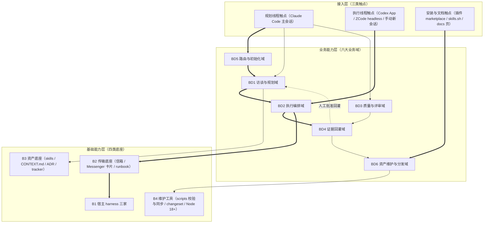
```mermaid
flowchart TB
    subgraph ACCESS["接入层（三类触点）"]
        T1["规划线程触点（Claude Code 主会话）"]
        T2["执行线程触点（Codex App / ZCode headless / 手动新会话）"]
        T3["安装与文档触点（插件 marketplace / skills.sh / docs 页）"]
    end
    subgraph DOMAIN["业务能力层（六大业务域）"]
        BD1["BD1 访谈与规划域"]
        BD5["BD5 路由与初始化域"]
        BD2["BD2 执行编排域"]
        BD3["BD3 质量与评审域"]
        BD4["BD4 证据回灌域"]
        BD6["BD6 资产维护与分发域"]
    end
    subgraph BASE["基础能力层（四类底座）"]
        B1["B1 宿主 harness 三家"]
        B2["B2 传输底座（信箱 / Messenger 卡片 / runbook）"]
        B3["B3 资产底座（skills / CONTEXT.md / ADR / tracker）"]
        B4["B4 维护工具（scripts 校验与同步 / changeset / Node 18+）"]
    end
    T3 ==> BD6
    T1 ==> BD5
    BD5 ==> BD1
    T1 --> BD1
    T1 --> BD3
    T2 ==> BD2
    BD1 ==> BD2
    BD2 ==> BD4
    BD3 --> BD4
    BD4 -.人工批准回灌.-> BD1
    BD4 --> BD6
    BD1 --> B3
    BD2 ==> B2
    B2 ==> B1
    BD6 --> B4
```

> 读图说明：粗箭头为主链路（§2.3.2 BF-01）；虚线为 harvest 修订回路（必须经人工批准）。接入层三触点、业务域六块、底座四类，与《高层架构设计》§5.1 / §6.2 一一对应，无命名漂移。

### 2.2 领域关系映射

#### 2.2.1 限界上下文清单

每个业务域对应一个限界上下文：

| 限界上下文 | 对应业务域 | 域类型 | 覆盖的核心业务实体 | 上下文边界（属于本域 vs 不属于） |
| --- | --- | --- | --- | --- |
| 规划访谈上下文 | BD1 访谈与规划域 | 核心域 | SPEC READY 启动块（O-01）、Goal（O-04）、Issue（O-05）、Ticket（O-06）、Triage role（O-08）、Decision ticket | 属于：访谈轮次、spec/split/compile 三类成稿、分诊状态机、决策地图；不属于：执行过程、receipt 产出、技能文件修订（归 BD2/BD4/BD6） |
| 契约执行上下文 | BD2 执行编排域 | 核心域 | Receipt（O-02）、Execution lock（O-03）、Mailbox message（O-11）、传输适配器能力表 | 属于：三通道传输、express lane 判定、五步执行契约、六道门验收；不属于：台账写入（归 BD4）、技能修订（归 BD4/BD6） |
| 评审上下文 | BD3 质量与评审域 | 支撑域 | 评审报告（双轴报告、圆桌裁决、诊断结论） | 属于：固定点 diff、双轴/两轮评审、红循环诊断；不属于：缺陷信号分诊（归 BD4） |
| 证据回灌上下文 | BD4 证据回灌域 | 核心域 | Receipt metrics 行（O-12）、Draft proposal（O-07）、eval 运行档 | 属于：三台账运营、黄金任务运行与记分、harvest 三档分诊；不属于：直接修改技能资产（禁止，归 BD6 经人工批准） |
| 入口路由上下文 | BD5 路由与初始化域 | 通用域 | setup 配置产出（tracker 配置 / 标签词表 / 领域文档布局）、路由决策 | 属于：主流程分流、一次性配置写入；不属于：任何业务执行（路由后即移交） |
| 资产维护上下文 | BD6 资产维护与分发域 | 支撑域 | Skill asset（O-09）、Changeset（O-10）、校验器报告、同步 drill 记录 | 属于：机器校验、预算审计、漂移修订入库、三轨分发；不属于：业务语义判断（哪条是缺陷归 BD4） |

**域类型说明与投入策略**：

| 域类型 | 含义 | 投入策略 |
| --- | --- | --- |
| 核心域（Core） | 业务护城河，差异化竞争力所在 | 投入最多资源自研：访谈与规划（to-goal 跨上下文契约编译为 fork 全量差异能力）、契约执行（receipt v2 契约 + 六道门为业界无同构物，G2 §2.3）、证据回灌（质量证据链闭环是 P1 痛点解法） |
| 支撑域（Supporting） | 必要但非差异化 | 评审复用上游既有技能（40 行预算约束）；资产维护以机器校验脚本与既有 playbook 为主，MVP 仅新增校验器与漂移修订 |
| 通用域（Generic） | 通用能力 | 入口路由完全复用上游 ask-matt / setup 机制，fork 不改语义 |

#### 2.2.2 上下文映射（Context Mapping）

五种关系模式全部启用，每条关系均回溯上游已冻结决策：

| 关系编号 | 上游上下文 | 下游上下文 | 关系模式 | 同步方式 | 选择理由 |
| --- | --- | --- | --- | --- | --- |
| C-01 | 上游 mattpocock/skills（E-04） | 规划访谈上下文 | Conformist | git rebase（sync-upstream.sh，人工触发异步） | 无议价能力的强势上游（7 分钟完成改名级替换，SR-19）：fork 完全遵循上游模型，表达层差异限 40 行/技能（D8），冲突按 playbook a/b/c 消化（D12） |
| C-02 | 宿主 harness 三家（E-01/E-02/E-03） | 契约执行上下文 | ACL 防腐层 | MCP stdio 信箱（异步）/ Messenger 卡片（同步）/ 手动 runbook | 外部模型不污染本域：一适配器一文档（ADR 0003 冻结），Codex 能力名只活在 capability map 单点、ZCode 能力表住 MCP 服务（D76）；缺依赖即 refuse 不降级模拟 |
| C-03 | 规划访谈上下文 | 评审/证据回灌/入口路由上下文 | Shared Kernel | CONTEXT.md 文件共享（同步读取） | 五术语（Issue tracker / Issue / Triage role / Decision ticket / Draft proposal）跨域一致且稳定（D2）；领域词内联落盘，CONTEXT.md 是纯 glossary（D26），维护成本由 domain-modeling 主动维护兜住 |
| C-04 | 契约执行上下文 | 证据回灌上下文、资产维护上下文 | Published Language | receipt v2 标准契约（文本工件，验收时同步消费） | spec-executor-receipt/v2 是多下游共同消费的标准协议（X1 冻结）：六道门（M2/校验器）、metrics 台账（M4）、校验器（N1）都以同一 Schema 消费；必填字段增删改名必须 bump 版本（D39） |
| C-05 | 证据回灌上下文 | 规划访谈上下文 | Customer/Supplier | draft proposal 文件 + 人工批准（异步） | 下游（技能资产质量）需求节奏由上游（证据）供应：harvest 供应 confirmed-defect 提案（一缺陷一文件），规划侧消费修订；人类批准是节奏控制点（聊天批准不算，D30） |

**关系模式说明**（本项目适用性注记）：

| 关系模式 | 适用场景 |
| --- | --- |
| Customer/Supplier | 上下游强协作，下游能影响上游节奏：harvest 提案→技能修订，批准节奏由维护者控制 |
| Conformist | 顺从者，下游完全遵循上游模型：fork 对上游基线 6654f6b 的 overlay 继承 |
| ACL（Anticorruption Layer） | 对接外部强势平台必用：三家宿主 harness 各建真适配器，能力表单点维护 |
| Shared Kernel | 共享内核，维护成本高慎用：仅限 CONTEXT.md 五术语这一小块纯 glossary |
| Published Language | 标准协议多下游消费：receipt v2 契约（Schema 首字段锁定，多消费方） |

#### 2.2.3 跨域协作原则

| 原则编号 | 原则 |
| --- | --- |
| P-01 | 核心域 → 支撑域/通用域禁止反向依赖：契约执行上下文不感知评审上下文内部结构（spec-executor 只消费 SPEC READY 与产出 receipt，评审是执行线程内的模型触发行为） |
| P-02 | 核心域之间禁止直接耦合，必须通过契约工件解耦：规划访谈→契约执行之间只传 SPEC READY 启动块（不传 grill 历史——D76，§能力对照表「继承保持契约级」）；契约执行→证据回灌之间只传 receipt v2 |
| P-03 | 对接外部不可控系统必须建 ACL 防腐层：宿主 harness 能力面（fork_thread / spawn_execution 等）只允许存在于各自适配器文档（capability map / MCP 服务）单点，禁止贯穿到技能语义层（ADR 0003） |
| P-04 | 跨上下文崩溃恢复以持久化工件为准：SPEC READY 块、执行锁、receipt 三工件任何一方崩溃后可重建会话状态（D27，§守卫），禁止依赖会话内存状态跨上下文传递 |
| P-05 | 修订必须经人工批准回路：任何对技能资产（SKILL.md / 规范文档）的修改只能经 draft proposal 显式 Approved: yes（D30），台账 append-only 不回写 |

### 2.3 详细业务架构

#### 2.3.1 用例图

**用例图清单**：

| 编号 | 用例图标题 | 涉及业务域 | 源文件位置 |
| --- | --- | --- | --- |
| UC-01 | 规划线程用例（使用者 A 视角） | BD5 / BD1 / BD3 | 本节内嵌（mermaid，与文档同步维护） |
| UC-02 | 执行线程用例（使用者 A/B 视角） | BD2 / BD3 | 本节内嵌 |
| UC-03 | 维护者运营用例（甲方决策者视角） | BD4 / BD6 | 本节内嵌 |

**UC-01 规划线程用例**：

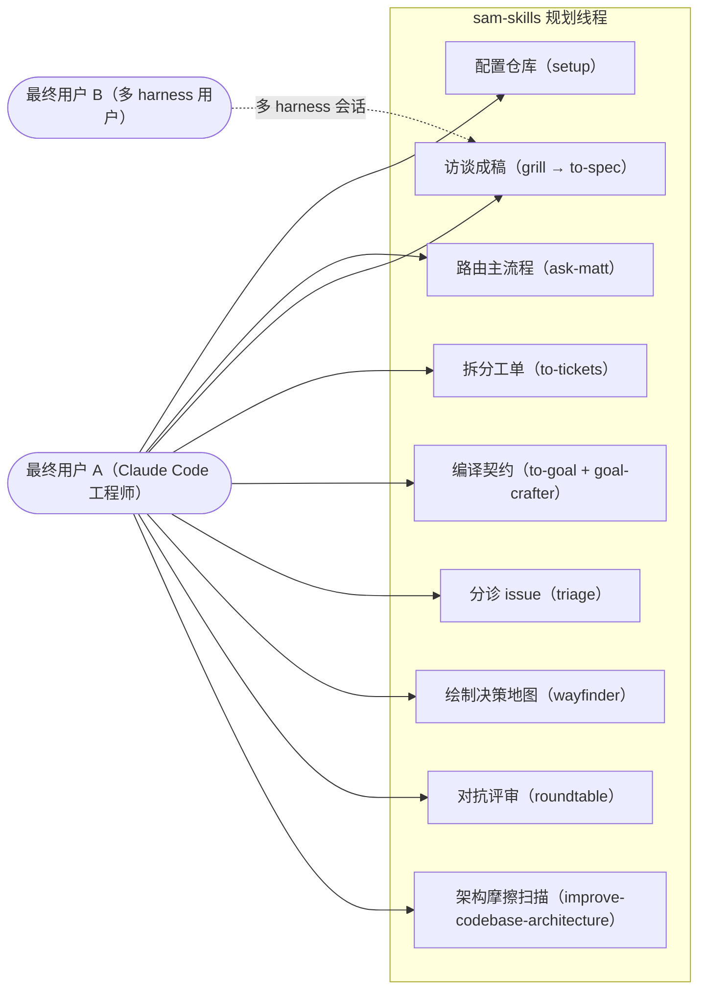
```mermaid
flowchart LR
    UA(["最终用户 A（Claude Code 工程师）"])
    UB(["最终用户 B（多 harness 用户）"])
    subgraph SYS1["sam-skills 规划线程"]
        UC11["配置仓库（setup）"]
        UC12["路由主流程（ask-matt）"]
        UC13["访谈成稿（grill → to-spec）"]
        UC14["拆分工单（to-tickets）"]
        UC15["编译契约（to-goal + goal-crafter）"]
        UC16["分诊 issue（triage）"]
        UC17["绘制决策地图（wayfinder）"]
        UC18["对抗评审（roundtable）"]
        UC19["架构摩擦扫描（improve-codebase-architecture）"]
    end
    UA --> UC11
    UA --> UC12
    UA --> UC13
    UA --> UC14
    UA --> UC15
    UA --> UC16
    UA --> UC17
    UA --> UC18
    UA --> UC19
    UB -.多 harness 会话.-> UC13
```

**UC-02 执行线程用例**：

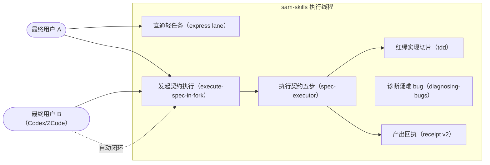
```mermaid
flowchart LR
    UA(["最终用户 A"]) 
    UB(["最终用户 B（Codex/ZCode）"])
    subgraph SYS2["sam-skills 执行线程"]
        UC21["直通轻任务（express lane）"]
        UC22["发起契约执行（execute-spec-in-fork）"]
        UC23["执行契约五步（spec-executor）"]
        UC24["红绿实现切片（tdd）"]
        UC25["诊断疑难 bug（diagnosing-bugs）"]
        UC26["产出回执（receipt v2）"]
    end
    UA --> UC21
    UA --> UC22
    UB --> UC22
    UC22 --> UC23
    UC23 --> UC24
    UC23 --> UC26
    UB -.自动闭环.-> UC22
```

**UC-03 维护者运营用例**：

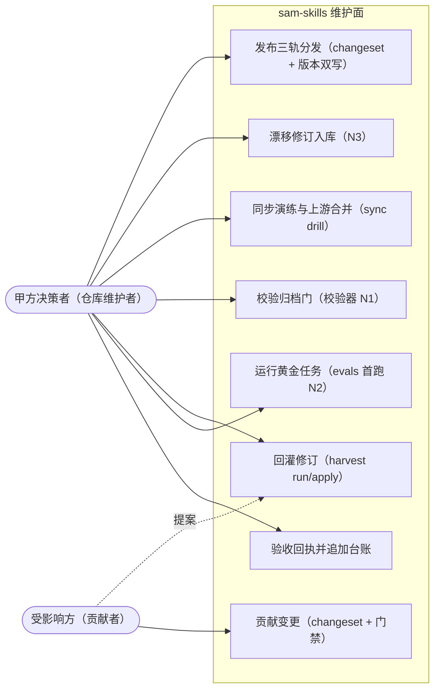
```mermaid
flowchart LR
    M(["甲方决策者（仓库维护者）"])
    C(["受影响方（贡献者）"])
    subgraph SYS3["sam-skills 维护面"]
        UC31["验收回执并追加台账"]
        UC32["运行黄金任务（evals 首跑 N2）"]
        UC33["回灌修订（harvest run/apply）"]
        UC34["校验归档门（校验器 N1）"]
        UC35["同步演练与上游合并（sync drill）"]
        UC36["漂移修订入库（N3）"]
        UC37["发布三轨分发（changeset + 版本双写）"]
        UC38["贡献变更（changeset + 门禁）"]
    end
    M --> UC31
    M --> UC32
    M --> UC33
    M --> UC34
    M --> UC35
    M --> UC36
    M --> UC37
    C --> UC38
    C -.提案.-> UC33
```

#### 2.3.2 业务流程图

**关键流程清单**（核心业务覆盖度 ≥ 80%：BF-01~BF-04 覆盖主链路五环节、证据回灌、上游同步、分发安装四条主线）：

| 流程编号 | 流程名 | 起点 | 终点 | 涉及业务域 | 源文件位置 |
| --- | --- | --- | --- | --- | --- |
| BF-01 | 规划→执行→归档主链路 | idea / tracker Issue / 外部 PR | receipt 验收入台账 | BD5→BD1→BD2→BD4 | 本节内嵌泳道图 |
| BF-02 | 证据回灌闭环 | friction 记录 / eval 失败 / 重复摩擦 | 技能修订入库（Approved: yes → apply） | BD4→BD6→BD1 | 本节内嵌泳道图 |
| BF-03 | 上游同步流程 | 上游 push / 季度节奏 | fork 基线推进（或停止重评 overlay） | BD6 | 本节内嵌泳道图 |
| BF-04 | 三轨分发安装 | 维护者发布 | 使用者本机安装面 | BD6 | 本节内嵌泳道图 |

**BF-01 规划→执行→归档主链路**（角色泳道；菱形判定均有分支条件文字标注）：

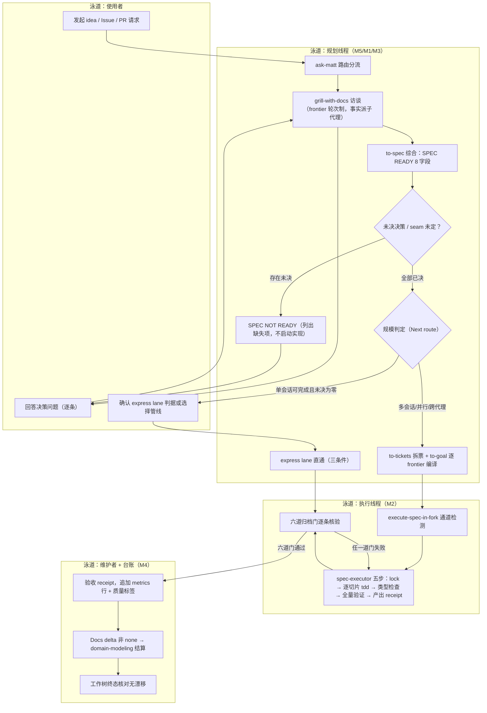
```mermaid
flowchart TB
    subgraph LANE_USER["泳道：使用者"]
        A1["发起 idea / Issue / PR 请求"]
        A4["回答决策问题（逐条）"]
        A8["确认 express lane 判据或选择管线"]
    end
    subgraph LANE_PLAN["泳道：规划线程（M5/M1/M3）"]
        B1["ask-matt 路由分流"]
        B2["grill-with-docs 访谈（frontier 轮次制，事实派子代理）"]
        B3["to-spec 综合：SPEC READY 8 字段"]
        B4{"未决决策 / seam 未定？"}
        B5["SPEC NOT READY（列出缺失项，不启动实现）"]
        B6{"规模判定（Next route）"}
        B7["express lane 直通（三条件）"]
        B8["to-tickets 拆票 + to-goal 逐 frontier 编译"]
    end
    subgraph LANE_EXEC["泳道：执行线程（M2）"]
        C1["execute-spec-in-fork 通道检测"]
        C2["spec-executor 五步：lock → 逐切片 tdd → 类型检查 → 全量验证 → 产出 receipt"]
        C3["六道归档门逐条核验"]
    end
    subgraph LANE_OPS["泳道：维护者 + 台账（M4）"]
        D1["验收 receipt，追加 metrics 行 + 质量标签"]
        D2["Docs delta 非 none → domain-modeling 结算"]
        D3["工作树终态核对无漂移"]
    end
    A1 --> B1
    B1 --> B2
    B2 --> A4
    A4 --> B2
    B2 --> B3
    B3 --> B4
    B4 -- 存在未决 --> B5
    B5 --> A4
    B4 -- 全部已决 --> B6
    B6 -- 单会话可完成且未决为零 --> A8
    B6 -- 多会话/并行/跨代理 --> B8
    A8 --> B7
    B8 --> C1
    B7 --> C3
    C1 --> C2
    C2 --> C3
    C3 -- 六道门通过 --> D1
    C3 -- 任一道门失败 --> C2
    D1 --> D2 --> D3
```

> 读图说明：粗主链路为「grill → SPEC READY → execute in fork → receipt returns」（D1，§30 秒主流程）；B4/B6/C3 三个判定节点的分支条件均为语义标签，无「是/否」裸标签。express lane 收尾为三行 mini receipt（what changed / validation run / worktree state，D27 §Express lane）。

**BF-02 证据回灌闭环**：

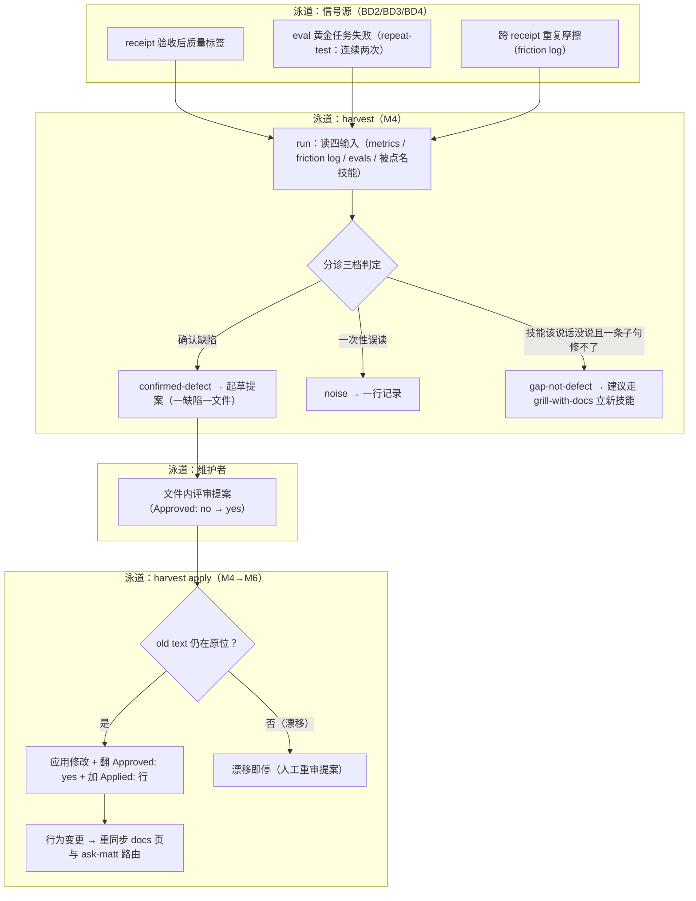
```mermaid
flowchart TB
    subgraph LANE_SIG["泳道：信号源（BD2/BD3/BD4）"]
        S1["receipt 验收后质量标签"]
        S2["eval 黄金任务失败（repeat-test：连续两次）"]
        S3["跨 receipt 重复摩擦（friction log）"]
    end
    subgraph LANE_HV["泳道：harvest（M4）"]
        H1["run：读四输入（metrics / friction log / evals / 被点名技能）"]
        H2{"分诊三档判定"}
        H3["confirmed-defect → 起草提案（一缺陷一文件）"]
        H4["noise → 一行记录"]
        H5["gap-not-defect → 建议走 grill-with-docs 立新技能"]
    end
    subgraph LANE_OPS2["泳道：维护者"]
        O1["文件内评审提案（Approved: no → yes）"]
    end
    subgraph LANE_APPLY["泳道：harvest apply（M4→M6）"]
        P1{"old text 仍在原位？"}
        P2["应用修改 + 翻 Approved: yes + 加 Applied: 行"]
        P3["漂移即停（人工重审提案）"]
        P4["行为变更 → 重同步 docs 页与 ask-matt 路由"]
    end
    S1 --> H1
    S2 --> H1
    S3 --> H1
    H1 --> H2
    H2 -- 确认缺陷 --> H3
    H2 -- 一次性误读 --> H4
    H2 -- 技能该说话没说且一条子句修不了 --> H5
    H3 --> O1
    O1 --> P1
    P1 -- 是 --> P2
    P1 -- 否（漂移） --> P3
    P2 --> P4
```

**BF-03 上游同步流程**（D8/D11/D12）：

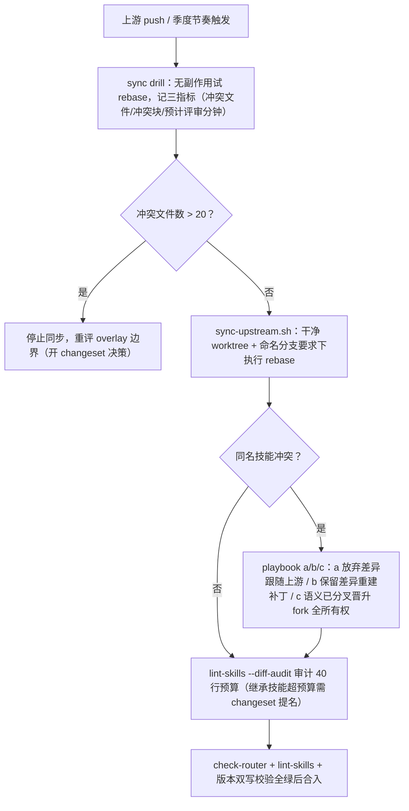
```mermaid
flowchart TB
    U1["上游 push / 季度节奏触发"] --> U2["sync drill：无副作用试 rebase，记三指标（冲突文件/冲突块/预计评审分钟）"]
    U3{"冲突文件数 > 20？"}
    U2 --> U3
    U3 -- 是 --> U4["停止同步，重评 overlay 边界（开 changeset 决策）"]
    U3 -- 否 --> U5["sync-upstream.sh：干净 worktree + 命名分支要求下执行 rebase"]
    U5 --> U6{"同名技能冲突？"}
    U6 -- 是 --> U7["playbook a/b/c：a 放弃差异跟随上游 / b 保留差异重建补丁 / c 语义已分叉晋升 fork 全所有权"]
    U6 -- 否 --> U8["lint-skills --diff-audit 审计 40 行预算（继承技能超预算需 changeset 提名）"]
    U7 --> U8
    U8 --> U9["check-router + lint-skills + 版本双写校验全绿后合入"]
```

**BF-04 三轨分发安装**（D5/D73/D77）：

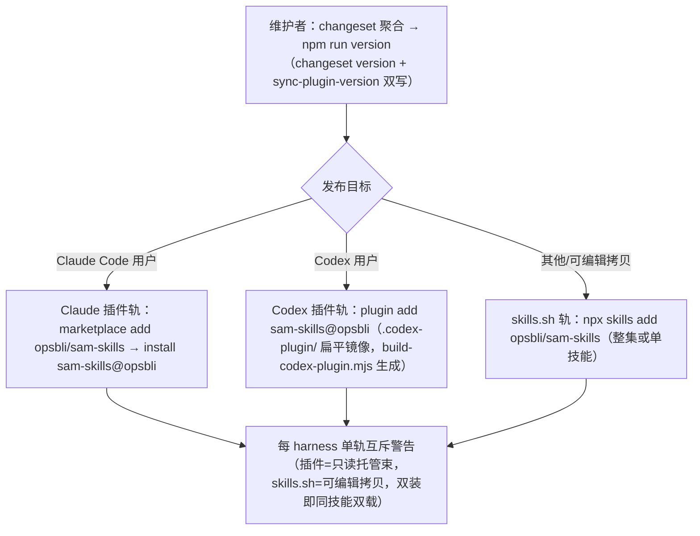
```mermaid
flowchart TB
    V1["维护者：changeset 聚合 → npm run version（changeset version + sync-plugin-version 双写）"] --> V2{"发布目标"}
    V2 -- Claude Code 用户 --> V3["Claude 插件轨：marketplace add opsbli/sam-skills → install sam-skills@opsbli"]
    V2 -- Codex 用户 --> V4["Codex 插件轨：plugin add sam-skills@opsbli（.codex-plugin/ 扁平镜像，build-codex-plugin.mjs 生成）"]
    V2 -- 其他/可编辑拷贝 --> V5["skills.sh 轨：npx skills add opsbli/sam-skills（整集或单技能）"]
    V3 --> V6["每 harness 单轨互斥警告（插件=只读托管束，skills.sh=可编辑拷贝，双装即同技能双载）"]
    V4 --> V6
    V5 --> V6
```

### 2.4 业务范围与边界

> **编号继承声明**：本节沿用《高层架构设计》§6.1/§6.3 已冻结的功能编号体系（F1~F10 / N1~N4 / O1~O6），不重排、不改名；模板的「F1.1 两层子编号」示意结构不适用（上游编号为全局冻结口径，重排即命名漂移）。子功能粒度在 §3.2 各模块接口清单中展开。

#### 2.4.1 功能模块清单

| 编号 | 一级功能名 | 子功能要点（展开见 §3.2） | 对应业务域 | 实现状态 | 柔性层级（§2.5.2） |
| --- | --- | --- | --- | --- | --- |
| F1 | 规划线程访谈成稿主线 | grilling 原语 + grill-with-docs/grill-me；词汇落 CONTEXT.md、难逆转决策落 ADR；to-spec 发 SPEC READY 8 字段 | BD1 | 完整实现（基线保持） | L1 |
| F2 | 跨上下文契约编译 | to-goal 五种输入 + goal-crafter 词汇格式；Readiness checklist 八项硬停；Session recommendation 档位 | BD1 | 完整实现（基线保持） | L1 |
| F3 | 执行契约与回执 | spec-executor 五步；receipt v2（Schema 首字段 + Docs delta + metrics 行）；执行锁 | BD2 | 完整实现（基线保持） | L0 |
| F4 | 执行编排与传输适配 | execute-spec-in-fork 三通道按序检测 + express lane 三条件直通 + 权限信封 | BD2 | 完整实现（基线保持） | L0 |
| F5 | 质量与评审技能集 | tdd seam 红绿循环；code-review 双轴 diff；roundtable 四席两轮；diagnosing-bugs 六阶段 | BD3 | 完整实现（基线保持） | L2 |
| F6 | 架构与规范治理 | improve-codebase-architecture（deletion test）；project-standards 三模式；domain-modeling 词汇与 ADR 维护 | BD1/BD3 | 完整实现（基线保持） | L3 |
| F7 | 证据回灌 | harvest run/apply 双模式；draft proposal 机制；metrics / friction log 双台账 | BD4 | 完整实现（基线保持） | L2 |
| F8 | 入口路由与初始化 | ask-matt 主流程路由；triage 五状态机；wayfinder 决策地图；setup 一次性配置 | BD5 | 完整实现（基线保持） | L1 |
| N1 | receipt 校验器（新增） | 六道归档门脚本化：Node 18+ ESM 零依赖、--check 模式防漂移，参照 lint-skills.mjs 模式（D68） | BD6/BD4 | MVP 新增 | L0 |
| N2 | evals 体系激活（新增） | 8 黄金任务首跑；SCOREBOARD 回填 pass rate 与主导失败模式；失败信号喂 harvest | BD4 | MVP 新增 | L1 |
| N3 | 漂移修订入库（新增） | X2 Codex 插件轨道 ADR 级补档；X3 goal-crafter README 处置（仅采信 SKILL.md）；X6 ready-for-agent 术语对齐 | BD6 | MVP 新增 | L2 |
| N4 | 全程本地运行约束 | 无云服务、无遥测外发、台账 repo 内自持、本仓不持有 API key | 全局约束 | 已实现（永久边界） | L0 |

**In-Scope（本期必做，12 条，与《高层架构设计》§6.1 完全一致）**：F1~F10、N1~N4（其中 N4 为全局约束项）。

**Out-of-Scope（本期不做，6 条，与《高层架构设计》§6.1 完全一致）**：

| 编号 | 不做的事项 | 不做的原因 | 未来归属 |
| --- | --- | --- | --- |
| O1 | 云部署 / SaaS 化 / 多租户服务端 | 用户运行时决策显式冻结：本地 CLI/Skills 仓库，无云部署 | 永不做（永久边界，除非用户推翻该决策） |
| O2 | 跨 harness 通用便携编排抽象层 | ADR 0003 已冻结「一适配器一文档、拒绝便携抽象」——一个真适配器 + 诚实 fallback 比假便携层便宜 | 永不做（ADR 级边界） |
| O3 | 第三 harness 适配器（Cursor 等） | refuse-not-degrade 原则；通用集成路线为框架级投入，非单仓可负担 | 完整版后按真适配器条件评估 |
| O4 | receipt schema v3 演进 | X1 冻结 v2 为当前契约；本期无数据驱动需求 | 待 receipt metrics 数据积累后按需评估（规则见 §4.4） |
| O5 | 评测 CI 化（GitHub Actions） | D14 零依赖边界；工具依赖引入在首跑完成前禁止 | 完整版评估（首跑数据回填后） |
| O6 | 阶段质量门 skill | 门规则需 receipt metrics 与 friction log 数据定形（D30）——先跑数据再定门 | 完整版（依赖 N2 完成） |

### 2.5 质量与柔性可用

#### 2.5.1 服务质量目标

本地仓库形态无云高可用/低延迟指标；按 ISO 25010 选取本系统最重要的 5 个质量目标（已排序），全部可验证：

| 优先级 | 质量目标 | 业务驱动 | 受影响的关键章节 |
| --- | --- | --- | --- |
| Q1 | 契约可信：receipt v2 六道门 6/6 脚本化，合成错误 receipt 拦截率 100% | P2 痛点（门可检测非可防止，D75）→ 目标 V2 | §3.2.M6 / §3.5.1 / §4.2 DF-01 |
| Q2 | 证据可追溯：执行结果 100% 留痕且机器可查；台账 append-only 不回写 | P1 痛点（证据链空转，X4）→ 目标 V1/V4 | §4.2 / §8.2 |
| Q3 | 可维护性：上游同步成本可量化（drill 三指标覆盖 100%），继承差异 ≤40 行/技能 | P3 痛点（上游高速迭代）→ 目标 V3 | §3.2.M6 / §4.4 |
| Q4 | 可移植性：三宿主三轨分发，每 harness 单轨互斥；适配器腐化可观测、退兜底 ≤5 步 | P5/P6 痛点 → 目标 V5/V6 | §3.1.3 / §5.4 |
| Q5 | 韧性（崩溃恢复）：状态皆在持久化工件，任一方崩溃后可从工件重建 | D27 §守卫（同 checkout 竞速缓解） | §3.2.M2.5 / §5.2 |

**可验证质量场景**（SEI ATAM 方法）：

| 场景编号 | 关联目标 | 触发源 | 触发条件 | 期望响应 | 度量指标 |
| --- | --- | --- | --- | --- | --- |
| QS-01 | Q1 | 归档验收 | 注入合成错误 receipt（缺 Schema 首字段 / 多份 receipt / Conclusion 非 token） | 校验器逐道门拦截并给出 6 位错误码 | 拦截率 100%；每类错误对应唯一错误码 |
| QS-02 | Q2 | 每次执行归档 | receipt 通过六道门 | metrics 台账追加一行（含质量标签），friction 摩擦按日期追加 | 台账行与 receipt 一一对应；append-only 零回写 |
| QS-03 | Q3 | 上游同步 | drill 试 rebase | 三指标记录入库；冲突文件超过 20 个即停止 | drill 记录覆盖率 100%（每次同步前） |
| QS-04 | Q4 | 宿主升级（Codex/ZCode 新版本） | 通道能力检测 | 能力表单点重验；失效即退手动 runbook（5 步） | 重验执行率 100%；切换 ≤5 步 |
| QS-05 | Q5 | 执行线程崩溃（如 ZCode 会话中断） | 锁与 receipt 状态残存 | 从 SPEC READY 块 + 锁 + receipt 重建状态；超过 6h 陈旧锁可破 | 重建成功率 100%（工件齐全时）；陈旧锁判定阈值 6h |

#### 2.5.2 业务柔性可用策略

本地工具的「故障态」= 通道失效 / 工件缺失 / 台账缺席，而非服务宕机。取舍原则：**refuse-not-degrade（ADR 0003）——缺依赖即拒绝并指向诚实替代路径，绝不模拟成功**。

**业务功能优先级分层**（§2.4.1 表内已逐项标注，L0 共 3 项 / 12 项 = 25%，≤ 30% 达标）：

| 层级 | 含义 | 故障态下的处置方向 | 用户感知 |
| --- | --- | --- | --- |
| L0 核心业务 | receipt 契约链（F3/F4/N1/N4）：挂掉等于质量证据链停摆 | 不降级；缺依赖即 refuse 并给出手动路径 | 收到明确拒绝说明与替代指引，无假成功 |
| L1 重要业务 | 规划主线与评测（F1/F2/F8/N2） | 会话内重试 / 阶段边界恢复（Continue/clear/handoff/Subagent/compact 五选项） | 对话式引导恢复，上下文不丢 |
| L2 辅助业务 | 评审与回灌（F5/F7/N3） | 空台账视为合法状态（D30：台账缺席=空台账不是错误），分诊降为空结果 | harvest 报告「无信号」，主流程不受阻 |
| L3 附加业务 | 治理与文档（F6、docs 页、HTML 报告） | 跳过或离线降级（HTML 报告 CDN 离线时内联降级，D32） | 报告形态降级，功能可用 |

**业务降级清单**：

| 编号 | 关联功能（F-xx） | 触发条件 | 降级动作 | 用户感知 | 决策类型 |
| --- | --- | --- | --- | --- | --- |
| BD-01 | F4 | Codex 能力缺失或 ZCode 信箱不可用（通道检测失败） | refuse 自动通道，切换手动 runbook 5 步（开新会话→贴 SPEC READY→跑 spec-executor→带回 receipt→规划线程归档） | 明确告知自动闭环不可用，附 5 步手动指引；绝不模拟自动投递 | 手动（通道检测内置，切换由使用者执行） |
| BD-02 | F7 | 台账文件缺席或为空 | harvest 按空台账分诊，输出空结果而非报错 | 「当前无摩擦/无缺陷信号」 | 自动 |
| BD-03 | F4 | express lane 三条件任一不满足 | 回退 fork 全管线（不静默 bypass） | 收到「超出直通条件，转入完整管线」提示（错误码 202001） | 自动 |
| BD-04 | F2 | to-goal Readiness checklist 八项任一不满足 | 硬停不猜（不编译半成品 goal） | 收到缺失项清单 | 自动 |
| BD-05 | N1 | 校验器自身异常（文件不可读等，错误码 901001） | 停止校验并报告，不输出「通过」假象 | 校验器内部错误提示，可重试 | 自动 |

**填写要求自查**：全部一级功能已分层；L0 ≤ 30%；用户感知列无「熔断/兜底逻辑」等技术词。

---

---

## 3. 应用架构

> **本章回答**：系统由哪些模块组成、模块与外部系统怎么集成、每个模块的内部交互链路是什么。
> **本章是系统设计的核心**。本系统为本地仓库形态：无进程服务、无 HTTP API，「应用」= 32 个 promoted skills（宿主会话内执行）+ 13 项维护脚本（Node 18+ 直接执行）+ repo 内工件协议；「接口」= 触发词（slash 命令）、MCP 工具、脚本 CLI 参数三类。

### 3.1 应用架构概览

#### 3.1.1 系统上下文

本系统作为**中心节点**，周围辐射出「用户角色 + 宿主平台 + 上游/分发系统」。本系统不展开内部组件（内部组件归 §3.1.2）。

**系统上下文要素清单**：

| 节点类型 | 节点名 | 与本系统的关系 | 关系语义 |
| --- | --- | --- | --- |
| 角色 | 最终用户 A（Claude Code 工程师） | 使用 | 规划线程会话：访谈→成稿→路由执行；读 receipt |
| 角色 | 最终用户 B（Codex/ZCode 多 harness 用户） | 使用 | 执行线程会话：经适配器自动闭环或手动 runbook |
| 角色 | 甲方决策者（仓库维护者 opsbli） | 运营 | 台账运营、eval 首跑、harvest 审批、上游同步、发布 |
| 角色 | 受影响方（贡献者 / 上游社区 / skills.sh 用户） | 协作/消费 | 贡献过门禁变更；上游迭代；安装消费 |
| 上游平台 | E-04 mattpocock/skills | 推送 → 本系统 | 上游基线 rebase 源（Conformist，40 行预算） |
| 上游平台 | E-05 模型 API（各厂商，经宿主注入） | 被消费（经宿主） | 本仓零直连、零 API key（BYOK 由使用者自配） |
| 外部业务系统 | E-01 Claude Code 宿主 | 双向 | 承载 skills 加载与 subagents；消费 plugin.json |
| 外部业务系统 | E-02 Codex 宿主 | 双向 | 承载任务工具与 Messenger 卡片协议 v2+ |
| 外部业务系统 | E-03 ZCode 宿主 | 双向 | headless CLI + 七事件 hooks + Stop 续跑 |
| 第三方平台 | E-06 issue tracker 宿主 | 双向调用 | gh CLI / glab / .scratch markdown（triage/to-spec/to-tickets 消费） |
| 下游平台 | E-07 Claude 插件 marketplace | 本系统 → 推送 | 插件 listing 分发 |
| 下游平台 | E-08 skills.sh 安装器 | 本系统 → 被拉取 | 可编辑拷贝轨安装（npx skills add） |

**系统上下文图**：

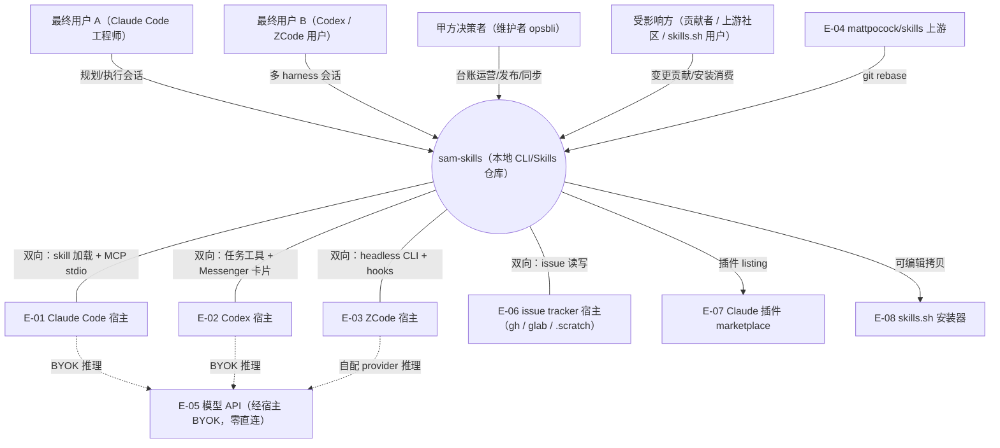
```mermaid
flowchart TB
    UA["最终用户 A（Claude Code 工程师）"]
    UB["最终用户 B（Codex / ZCode 用户）"]
    MO["甲方决策者（维护者 opsbli）"]
    CO["受影响方（贡献者 / 上游社区 / skills.sh 用户）"]
    SYS(("sam-skills（本地 CLI/Skills 仓库）"))
    E1["E-01 Claude Code 宿主"]
    E2["E-02 Codex 宿主"]
    E3["E-03 ZCode 宿主"]
    E4["E-04 mattpocock/skills 上游"]
    E5["E-05 模型 API（经宿主 BYOK，零直连）"]
    E6["E-06 issue tracker 宿主（gh / glab / .scratch）"]
    E7["E-07 Claude 插件 marketplace"]
    E8["E-08 skills.sh 安装器"]
    UA -->|规划/执行会话| SYS
    UB -->|多 harness 会话| SYS
    MO -->|台账运营/发布/同步| SYS
    CO -->|变更贡献/安装消费| SYS
    SYS ---|双向：skill 加载 + MCP stdio| E1
    SYS ---|双向：任务工具 + Messenger 卡片| E2
    SYS ---|双向：headless CLI + hooks| E3
    E4 -->|git rebase| SYS
    E1 -.->|BYOK 推理| E5
    E2 -.->|BYOK 推理| E5
    E3 -.->|自配 provider 推理| E5
    SYS ---|双向：issue 读写| E6
    SYS -->|插件 listing| E7
    SYS -->|可编辑拷贝| E8
```

> 注：无箭头实线（---）表示双向数据交换——下行（宿主能力/配置注入）与上行（工件/状态/结果回传）；E-05 为虚线（本仓零直连，推理经宿主注入）。

#### 3.1.2 系统模块图

分层架构图（接入层 → 应用层 → 中间件层 → 集成对接层）。每条线标注协议方向；中间件与外部组件标注编号（C-xx / E-xx）。

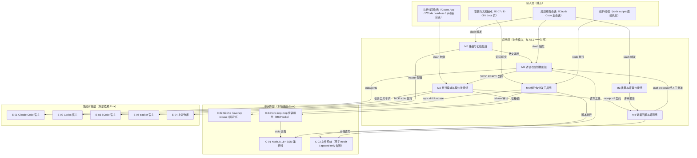
```mermaid
flowchart TB
    subgraph L1["接入层（触点）"]
        A1["规划线程会话（Claude Code 主会话）"]
        A2["执行线程会话（Codex App / ZCode headless / 手动新会话）"]
        A3["安装与文档触点（E-07 / E-08 / docs 页）"]
        A4["维护终端（node scripts 直接执行）"]
    end
    subgraph L2["应用层（业务模块，与 §3.2 一一对应）"]
        M1x["M1 访谈与规划技能组"]
        M2x["M2 执行编排与契约技能组"]
        M3x["M3 质量与评审技能组"]
        M4x["M4 证据回灌与评测组"]
        M5x["M5 路由与初始化组"]
        M6x["M6 维护与分发工具组"]
    end
    subgraph L3["中间件层（本地底座 C-xx）"]
        C1x["C-01 Node.js 18+ ESM 运行时"]
        C2x["C-02 Git 2.x（overlay rebase / 固定点）"]
        C3x["C-03 文件系统（原子 mkdir / append-only 台账）"]
        C4x["C-04 fork-loop-mcp 传输服务（MCP stdio）"]
    end
    subgraph L4["集成对接层（外部依赖 E-xx）"]
        E1x["E-01 Claude Code 宿主"]
        E2x["E-02 Codex 宿主"]
        E3x["E-03 ZCode 宿主"]
        E6x["E-06 tracker 宿主"]
        E4x["E-04 上游仓库"]
    end
    A1 -->|slash 触发| M5x
    M5x -->|散文调用| M1x
    A1 -->|slash 触发| M1x
    A1 -->|slash 触发| M3x
    A2 -->|slash 触发| M2x
    M1x -->|SPEC READY 契约| M2x
    M2x -->|receipt v2 契约| M4x
    M3x -->|评审报告| M4x
    M4x -->|draft proposal 经人工批准| M1x
    A3 -->|安装/同步| M6x
    A4 -->|node 执行| M6x
    M1x -->|读写工件| C3x
    M2x -->|信箱/锁| C4x
    C4x -->|stdio 进程| C1x
    M6x -->|脚本执行| C1x
    M6x -->|rebase/审计| C2x
    M4x -->|台账读写| C3x
    M1x -->|subagents| E1x
    M2x -->|MCP stdio 信箱| E3x
    M2x -->|任务工具/卡片| E2x
    M5x -->|tracker 配置| E6x
    M6x -->|sync drill / rebase| E4x
```

**分层组件清单**：

| 层次 | 内容 | 数据来源 |
| --- | --- | --- |
| 接入层 | 规划线程会话 / 执行线程会话 / 安装与文档触点 / 维护终端 | §2.3.1 用例图角色 |
| 应用层 | M1~M6 六模块（§2.1 六业务域，与 §3.2 一一对应） | §2.1 / §3.2 |
| 中间件层 | Node 运行时 / Git / 文件系统 / fork-loop-mcp 传输服务（C-01~C-04） | §3.1.3 本地底座组件清单 |
| 集成对接层 | 三家宿主适配桩、tracker 消费桩、上游同步桩（E-xx） | §3.1.3 外部依赖清单 |

#### 3.1.3 集成架构

> **核心区分**（本地形态映射）：**外部依赖（E-xx）**= 与本系统协作的外部系统/平台（宿主 harness、上游仓库、tracker、分发渠道）；**本地底座组件（C-xx）**= 本系统运行所需的本地等价物（模板「云组件」在本系统的对应物：无云资源，组件即本机运行时与仓库内设施）。

##### 外部依赖清单

| ID | 外部系统 | 归属团队 / 供应商 | 类别 | 使用方式 | 集成方式 | 协议 / 版本 | 功能定位（≤ 30 字） | 联系人 |
| --- | --- | --- | --- | --- | --- | --- | --- | --- |
| E-01 | Claude Code 宿主 | Anthropic | 第三方业务平台 | 双向 | skills 目录 + plugin.json 本地加载 + subagents | Skills 三层渐进披露；L2 正文 ≤5k token（SR-1） | 技能运行时与上下文隔离 | 维护者（opsbli） |
| E-02 | Codex 宿主 | OpenAI | 第三方业务平台 | 双向 | execute-spec-in-fork capability map 单点调用 | 任务工具 fork/message/read/pin/archive + Messenger 卡片协议 v2+ | Codex App 自动闭环执行通道 | 维护者（opsbli） |
| E-03 | ZCode 宿主 | ZCode（使用者自配 provider） | 第三方业务平台 | 双向 | fork-loop-mcp（MCP stdio + stdout 捕获） | headless CLI 0.16.5 实测（-p/--cwd/--json）；七事件 hooks；Stop 续跑预算 3 | ZCode headless 自动闭环执行通道 | 维护者（opsbli） |
| E-04 | mattpocock/skills 上游 | 上游社区（Matt Pocock） | 第三方业务平台 | 消费 | git rebase（sync-upstream.sh） | 基线 6654f6b（v1.2.3） | 继承技能基线源头 | 维护者（opsbli） |
| E-05 | 模型 API（各厂商） | 各模型厂商 | 第三方业务平台 | 消费（经宿主） | 宿主注入 BYOK，本仓零直连 | —（本仓不可见） | 推理能力来源，本仓不持 key | 使用者自管 |
| E-06 | issue tracker 宿主 | GitHub / GitLab / 本地 | 业务协作 | 双向 | gh CLI / glab / .scratch markdown | setup 一次性配置单点（D38）；PRs-as-request-surface 默认 off | issue 读写与工单承载 | 使用者自选 |
| E-07 | Claude 插件 marketplace | Anthropic 生态 | 第三方业务平台 | 生产 | plugin listing（opsbli 自建 listing，D73） | marketplace.json | Claude 轨分发入口 | 维护者（opsbli） |
| E-08 | skills.sh 安装器 | 社区工具 | 文件导出 | 生产 | npx skills add opsbli/sam-skills | 整集 / 单技能两式 | 可编辑拷贝轨安装 | 维护者（opsbli） |

> 类别枚举映射说明：模板封闭枚举中的「身份认证/支付/埋点/通知推送」在本系统均不存在；E-xx 按实际语义映射到「第三方业务平台 / 业务协作 / 文件导出」。使用方式取值（消费/生产/双向）保持模板口径。

##### 本地底座组件清单（C-xx）

| ID | 组件类别 | 选型 | 部署形态 | 规格量级 | 容量预估 | 提供方 / SLA | 用途 |
| --- | --- | --- | --- | --- | --- | --- | --- |
| C-01 | 脚本运行时 | Node.js 18.x LTS（ESM） | 本机单进程 | 使用者本机 Node ≥18 | 脚本毫秒级~秒级 | 本机环境；无 SLA | 九个维护脚本 + fork-loop-mcp 服务执行 |
| C-02 | 版本控制 | Git 2.x | 本机仓库 + 远端 GitHub | 仓库低于 50MB | 71 skills md + 48 docs md + 脚本 13 项 | 本机 + GitHub 托管 | overlay rebase、固定点 diff、工件版本化 |
| C-03 | 文件系统设施 | OS 文件系统（含原子 mkdir 语义） | 本机 | — | 台账 KB~百 KB 级 | 本机 | append-only 台账、执行锁、信箱状态、工单文件 |
| C-04 | 传输服务 | fork-loop-mcp（本仓自研，零依赖） | MCP stdio 按需启动 | 单实例 | 信箱状态目录数 KB | 随插件分发（D70 mcpServers） | ZCode 自动闭环：信箱 + 执行锁 + stdout 捕获 |
| C-05 | 包与版本管理 | npm + changesets | 本机 | — | 版本双写一致性 | 本机 | changeset 聚合、version 双写、门禁脚本 |
| C-06 | 文档协议 | Markdown + YAML frontmatter + Mermaid | 仓库内 | — | L2 正文 ≤5k token/技能 | — | 技能契约、台账、结构化块的统一载体 |

> 填写要求自查：选型含具体产品 + 版本号；规格量级有数字；不存在的组件（数据库/缓存/MQ/搜索引擎/容器编排/API 网关/任务调度/日志服务/监控告警/KMS）整行不出现（本地仓库无此类资源，可观测设计见 §8，密钥边界见 §7.2.3）。

##### 组件依赖关系

| 业务模块（§3.2） | 依赖的外部系统（E-xx） | 依赖的底座组件（C-xx） | 故障传导风险 |
| --- | --- | --- | --- |
| M1 访谈与规划 | E-01, E-06 | C-03, C-06 | E-06 tracker 不可用 → to-spec/to-tickets 无法发稿（.scratch 本地轨可兜底，属配置级降级路径） |
| M2 执行编排与契约 | E-01, E-02, E-03 | C-01, C-03, C-04 | E-02/E-03 能力失效 → refuse 自动通道退手动 runbook（BD-01）；C-04 崩溃 → 从 SPEC READY+锁+receipt 工件重建（QS-05） |
| M3 质量与评审 | E-01 | C-03, C-06 | 评审为会话内行为，无外部传导 |
| M4 证据回灌与评测 | E-01 | C-03, C-06 | 台账缺席 → 空台账合法（BD-02）；eval 需新会话，宿主不可用则暂停（不阻塞主流程） |
| M5 路由与初始化 | E-06 | C-03, C-06 | setup 未配置 → 硬依赖技能带显式提示（D72：run setup if not） |
| M6 维护与分发 | E-04, E-07, E-08 | C-01, C-02, C-05 | E-04 上游不可达 → 同步暂停（drill 先行可预判）；E-07/E-08 不可达 → 发布暂停，仓库自持不受影响 |

#### 3.1.4 工程结构

本系统的物理组织即仓库本身（无 backend/frontend 二分）。目录树为**真实仓库名录**（D1/D6/D68/D69/D70/D71 溯源），注释标注职责：

```
sam-skills/                          # 仓库根（发布身份 opsbli/sam-skills）
├── README.md                        # 顶层门面：安装四步、技能地图（三重同步点 1）
├── CONTEXT.md                       # 领域词汇纯 glossary（五术语，Shared Kernel，D2）
├── CLAUDE.md                        # agent 维护规则（bucket 规则/三重同步/invocation 模型）
├── AGENTS.md                        # 单行指针，指向 CLAUDE.md（D3）
├── CHANGELOG.md                     # 发布历史（changeset 聚合产物）
├── package.json                     # name=sam-skills，version=1.2.3-to-goal.3（版本双写源）
├── .claude-plugin/
│   ├── plugin.json                  # promoted 32 技能权威清单 + mcpServers fork-loop（三重同步点 2）
│   └── marketplace.json             # 仓库自建单插件 marketplace（D73）
├── .agents/
│   ├── adr/                         # 5 份 ADR（0001 setup 指针 / 0002 插件分发 / 0003 适配器 / 0004 receipt / 0005 信箱）
│   ├── install-block.md             # 唯一公开安装话术单源（D77；X2 修订落点）
│   ├── invocation.md                # invocation 双侧机制规范
│   └── writing-docs.md              # docs 页机制规范
├── skills/
│   ├── engineering/                 # 25 技能：M1~M5 技能资产主体（每技能 SKILL.md + agents/openai.yaml）
│   ├── productivity/                # 7 技能：grilling/grill-me 等
│   ├── in-progress/                 # 6 技能（Beta，不进插件）
│   ├── misc/                        # 4 技能（不进插件）
│   └── deprecated/                  # 空桶（退役直接删除，changeset 指名替代物）
├── docs/
│   ├── agents/                      # setup 产出：issue-tracker.md / domain.md / triage-labels.md / project-standards.md
│   ├── evals/
│   │   ├── PROTOCOL.md              # 评测协议（零依赖，D14）
│   │   ├── SCOREBOARD.md            # 记分板（DF-02，当前全部 0 runs，X4）
│   │   ├── tasks/                   # 8 个黄金任务（4 技能 × 2）
│   │   ├── results/                 # 每次运行一档
│   │   └── draft-proposals/         # harvest 提案审批队列（DF-05）
│   ├── metrics.md                   # receipt 遥测台账（DF-03，D9）
│   ├── skill-friction-log.md        # 摩擦日志（DF-04，append-only，D10）
│   ├── sync-drill-log.md            # 同步演练记录（DF-06，D11）
│   ├── maintaining-fork.md          # fork 维护模型（D8）
│   ├── upstream-collision-playbook.md  # 冲突 playbook a/b/c（D12）
│   ├── engineering/                 # 25 技能人面页镜像（三重同步点 3）
│   └── productivity/                # 7 技能人面页镜像
├── scripts/
│   ├── build-codex-plugin.mjs       # Codex 插件载荷生成 + --check 防漂移
│   ├── check-router.mjs             # 路由器三查机器校验（一败即阻合）
│   ├── lint-skills.mjs              # promoted 清单/链接/docs 页/invocation 配对校验；--diff-audit 40 行预算
│   ├── sync-plugin-version.mjs      # 版本双写 + --check
│   ├── sync-upstream.sh             # 上游 rebase（要求干净 worktree + 命名分支）
│   ├── sync-drill.sh                # 无副作用试 rebase，三指标入 DF-06
│   ├── sync-local-skills.sh         # 维护者本地安装（非公开途径）
│   ├── link-skills.sh               # dev-only symlink（非受支持安装器）
│   ├── list-skills.sh               # 技能清单
│   └── fork-loop-mcp/               # C-04 传输服务：README / server.mjs（5 工具）/ stop-hook.cjs / test/
├── .changeset/                      # 变更集目录（O-10）
├── .codex-plugin/                   # Codex 插件扁平镜像（build 脚本生成，X2 相关）
├── .out-of-scope/                   # 被拒绝增强请求知识库（当前 7 份，triage 前必查）
└── .scratch/                        # 本地 tracker 轨工单目录（一 feature 一目录，D43）
```

**公共与业务依赖方向**：C-03（文件系统设施）与 C-06（文档协议）是所有模块的公共底座；M6（维护工具）被 M1~M5 以「机器校验门」单向消费，禁止业务技能反向调用维护脚本之外自建校验逻辑（校验逻辑单点化，见 §3.4）。

#### 3.1.5 技术选型（版本约束）

| 技术分类 | 选型 | 版本 | 备注 / 选型理由（为什么选 A 不选 B） |
| --- | --- | --- | --- |
| 脚本运行时 | Node.js（ESM，.mjs） | 18.x LTS | 宿主插件分发与使用者本机普遍可用；零第三方依赖边界（D14/D68/D69 同一边界）下无构建步骤。不选 Deno/Bun：既有 9 脚本 + fork-loop-mcp 已是 node 直跑，换运行时引入兼容面而无收益 |
| 脚本语言形态 | JavaScript ESM | ES2022 | 零转译零依赖：node 原生执行。不选 TypeScript：零依赖边界下无 tsc 构建管线，.mjs 头注释即契约文档 |
| 版本控制 | Git | 2.x | overlay rebase 模型（sync-upstream/drill）、固定点 diff（三点 merge-base）、append-only 台账的不可篡改底座。不选其他 VCS：上游同步语义以 git rebase 为前提 |
| 工件与契约格式 | Markdown + YAML frontmatter + Mermaid | — | 技能契约（SKILL.md L2 ≤5k token）、台账、receipt 的统一载体；mermaid 与正文同文件维护可机器校验图文一致。不选 JSON/YAML 单载体：技能正文必须是人类可读散文（L2 渐进披露） |
| 传输协议 | MCP stdio | MCP 协议（宿主当前版本） | ZCode 自动闭环唯一传输（ADR 0005）；信箱协议刻意小到可丢弃。不选 HTTP/守护进程：本地优先 + 无服务端边界（O1），D69 明确 runner 会话无需 MCP 客户端 |
| 结构化数据 | JSON（--json 输出 / openai.yaml / plugin.json） | — | headless 输出解析与插件清单机器消费。不选 protobuf/XML：零依赖 + 人可直接读改 |
| 包与版本管理 | npm + changesets | npm ≥9；changesets 2.x | 既有双写链（changeset version + sync-plugin-version）。不选 pnpm/bun：package.json scripts 是版本链单源（D6） |
| 测试与校验执行 | node:test 原生 + 自研断言（process.exitCode） | node:test（Node 18 内置） | mailbox-cycle.test.mjs 已是 node 原生（D69）；校验器沿用 lint-skills.mjs --check 模式（D68）。不选 jest/vitest：引入依赖树违背零依赖边界（O5 同理） |
| 认证方案 | 无（本仓零认证面） | — | BYOK 经宿主注入，本仓不持 key、无登录态（见 §7.2.1）。不选任何 token 方案：本地工具无服务端，引入即新增攻击面 |
| 图表方案 | Mermaid 内嵌 | — | 与上游《高层架构设计》一致（G3 先例）；图文同文件可校验。不选外置图片工具：图文一致性与零依赖要求 |

### 3.2 模块详细设计

> **核心方法论**：模块详细设计描述**业务逻辑在角色和系统之间流动的过程**，不是接口实现细节。
> **组织原则**：§3.2.1 给出跨模块公共约束；§3.2.2 登记模块清单；§3.2.3 声明五段式模板（规范说明，各模块不再重复）；§3.2.M1~M6 每模块独立成节。

#### 3.2.1 模块公共约束（Common）

**通信方式约束**（本地形态映射：无 RPC/HTTP，通信=触发词、工件传递、进程 stdio 三类）：

| 约束项 | 取值 |
| --- | --- |
| 触发接口风格 | slash 命令（user-invoked）/ 模型自主触发（model-invoked）/ node CLI 参数（脚本）/ MCP 工具（传输服务），四类各归其位不混用 |
| 协议 | 会话内：散文调用（/skill 散文指针，D77 invocation.md）；跨进程：MCP stdio + stdout 捕获；跨上下文：结构化工件传递（SPEC READY / receipt / goal） |
| 数据格式 | Markdown 结构化块（工件）+ JSON（机器解析面：plugin.json、--json 输出、校验器输出行）+ YAML frontmatter（技能元数据） |
| 字符编码 | UTF-8（全仓统一） |
| 调用语义 | 模型触发统一走 ask-matt 路由与 invocation 双轨（§3.5.5）；跨 harness 能力面只出现在各适配器单点（P-03） |

**通用基础结构**（模板 BaseRequest/BaseResponse 在本系统的对应物——三类「统一工件信封」）：

| 基础结构 | 用途 | 落盘位置 |
| --- | --- | --- |
| SPEC READY 启动块（O-01） | 规划线程→执行线程的统一启动契约（8 字段） | spec 正文内（tracker issue） |
| receipt v2 回执（O-02） | 执行线程→归档验收的统一结果契约（Schema 首字段锁定） | 执行会话产物文件（DF-01） |
| 校验器输出行（§3.5.1 结构） | 校验脚本→人与台账的统一报告信封（含 6 位错误码） | stdout / 台账引用（DF-02~DF-06 配套） |

#### 3.2.2 模块清单与编号规则

**模块清单**（编号与《高层架构设计》§5.1/§6.2 一致；M6 为基础能力层 B4 的模块化展开，编号顺延登记）：

| 编号 | 模块名 | 业务域（§2.1） | 模块负责人 | 关联子领域 |
| --- | --- | --- | --- | --- |
| M1 | 访谈与规划技能组 | BD1 访谈与规划域 | 仓库维护者（继承技能责任含上游社区） | grilling 访谈、to-spec 成稿、to-tickets 拆分、to-goal 编译、wayfinder 决策地图、triage 分诊、domain-modeling |
| M2 | 执行编排与契约技能组 | BD2 执行编排域 | 仓库维护者 | execute-spec-in-fork 三通道、express lane、spec-executor 五步、receipt v2、执行锁 |
| M3 | 质量与评审技能组 | BD3 质量与评审域 | 仓库维护者 | tdd、code-review、roundtable、diagnosing-bugs |
| M4 | 证据回灌与评测组 | BD4 证据回灌域 | 仓库维护者 | harvest run/apply、三台账、evals 协议与 8 黄金任务（N2）、draft proposal |
| M5 | 路由与初始化组 | BD5 路由与初始化域 | 仓库维护者 | ask-matt 路由、setup 一次性配置、阶段边界 |
| M6 | 维护与分发工具组 | BD6 资产维护与分发域 | 仓库维护者 | receipt 校验器（N1）、漂移修订（N3）、三重同步门禁、40 行预算审计、sync drill、三轨分发 |

**编号规则**：模块编号 M1~M6 全局唯一（M1~M5 与上游一致）；每模块在 §3.2 下独立成节（§3.2.M1~§3.2.M6）；节内五段式编号 §3.2.M{N}.1~.5。

#### 3.2.3 单模块设计模板（五段式）说明

> 本节为规范说明，不是任何模块的内容。各模块五段式产出：**.1 模块概述**（业务定位三要素：位置/角色/内外部系统）；**.2 接口清单**（本系统语境=触发接口：slash 命令 / MCP 工具 / 脚本 CLI，含输入输出工件、幂等、权限要求，权限基线见 §3.5.5 与 §6.2.5，幂等见 §3.5.2，超时重试见 §3.5.4）；**.3 关键结构定义**（核心工件结构与字段表，格式为语言无关的结构骨架 + 字段表）；**.4 模块逻辑时序图**（清单 + mermaid 本体，参与者命名与 §3.1 一致，含异常分支，写操作标注锁/幂等键）；**.5 关键流程逻辑**（状态机/复杂流程伪代码；无复杂状态机的模块显式注明省略）。所有模块共同遵守的硬性要求（接口字段约束、DTO 分块、时序图要素）在此统一声明，模块节内只体现不重复。

#### 3.2.M1 访谈与规划技能组

##### §3.2.M1.1 模块概述

M1 覆盖「识别与分诊、访谈成稿、契约编译」业务场景，业务逻辑在使用者与规划线程之间流动，同时涉及宿主 harness（E-01 subagents 查证环境事实）、issue tracker 宿主（E-06，spec/工单发稿）、CONTEXT.md 与 .agents/adr/（词汇与决策落盘）的数据流动。本模块是主链路环节 1~3 的承担者（§2.3.2 BF-01），核心域：to-goal「全量压缩、只带契约」的跨上下文编译是 fork 差异化能力（D1，§fork 与 to-goal 分工）。

**涉及角色**：最终用户 A/B（决策应答者）、维护者（triage 语境）、受影响方（tracker 报告人）。
**涉及的内外部系统**：E-01 Claude Code 宿主（subagents、skill 加载）、E-06 tracker 宿主（gh/glab/.scratch）、CONTEXT.md / ADR / .out-of-scope/（工件）。

##### §3.2.M1.2 接口清单

| 子领域 | 触发类型 | 触发名 | 用途（≤ 20 字） | 输入工件 | 输出工件 | 幂等 |
| --- | --- | --- | --- | --- | --- | --- |
| 访谈 | slash（user-invoked） | grill-with-docs | 有纸 trail 访谈成稿 | 用户想法 + 仓库文档 | CONTEXT.md 词条 / ADR / 会话共识 | 天然（会话幂等：同输入重跑不落重复词条） |
| 访谈 | slash（user-invoked） | grill-me | 无工作目录访谈 | 用户想法 | 会话共识（不落盘） | 天然 |
| 访谈 | 模型触发 | grilling | frontier 轮次访谈原语 | 会话上下文 | 轮次问题清单 | 天然 |
| 成稿 | slash（user-invoked） | to-spec | 会话压缩为 spec | 会话共识 | SPEC READY 块（tracker issue） | 是（issue 唯一性由 tracker 保证） |
| 拆分 | slash（user-invoked） | to-tickets | 垂直切片拆工单 | 已批 spec | Ticket 文件 / tracker issues | 是（一票一文件，命名唯一） |
| 编译 | slash（user-invoked） | to-goal | 编译为可验证 goal | 五种输入之一 | Goal 工件 | 是（编译只读，输出唯一） |
| 编译 | 模型触发 | goal-crafter | goal 词汇与格式规则 | to-goal 下游或独立访谈 | Goal 工件 | 是（X3：仅采信 SKILL.md） |
| 分诊 | slash（user-invoked） | triage | issue 五状态机分诊 | tracker issue/PR | 状态标签 + 评论/brief | 是（一 issue 一态，状态机单调推进） |
| 迷雾 | slash（user-invoked） | wayfinder | 决策地图绘制与解题 | 迷雾话题 | wayfinder:map + Decision tickets | 是（先认领再干活防并发） |
| 词汇 | 模型触发 | domain-modeling | 词汇与 ADR 主动维护 | 会话决策 | CONTEXT.md 词条 / ADR | 是（内联更新不攒批） |

##### §3.2.M1.3 关键结构定义

**SPEC READY 启动块（O-01）结构骨架**（8 字段，D42；启动块是已批 spec 的索引不是替代品）：

```text
SPEC READY
- Status:            ready | not-ready
- Source:            spec issue / tracker 引用
- Repository:        仓库路径与分支
- Baseline:          固定点（SHA / 分支 / tag）
- Test seam:         约定的测试接缝清单（默认一 spec 一 seam）
- Non-goals:         明确不做项
- External authority: 外部权限信封（默认不授 commit/push/deploy）
- Next route:        fork | to-tickets | express lane
（not-ready 时改发 SPEC NOT READY 并列出缺失项，不启动实现）
```

**关键字段定义表**：

| 字段 | 类型 | 必填 | 业务含义 | 约束 / 默认值 |
| --- | --- | --- | --- | --- |
| Status | 枚举 | 是 | 成稿状态 | ready / not-ready；not-ready 禁止进入执行 |
| Source | 引用 | 是 | spec 正文出处 | 指向 tracker issue，不重复全文 |
| Baseline | 引用 | 是 | 执行基线固定点 | SHA/分支/tag；执行锁继承此值（M2） |
| Test seam | 清单 | 是 | 红绿循环的接缝约定 | 优先既有 seam，新 seam 与用户核对 |
| External authority | 枚举 | 是 | 外部权限信封 | 默认 none：不授 commit/push/deploy 等外部权限（D27） |
| Next route | 枚举 | 是 | 执行路由 | fork / to-tickets / express lane（§3.2.M2 判定） |

**Goal 工件（O-04）结构骨架**（D41，六节）：

```text
- Goal:                一句话目标
- Current state:       起点状态
- Execution order:     执行顺序
- Completion criteria: 机器可查复选框（一条件一复选框，禁复合条件）
- Constraints:         约束清单
- Context:             上下文（含条件注释块）
```

##### §3.2.M1.4 模块逻辑时序图

| 编号 | 标题 | 场景类别 | 是否包含异常分支 |
| --- | --- | --- | --- |
| SQ-01-1 | M1 - grill 访谈至 to-spec 成稿 | 核心工件的创建/发布 | 是 |
| SQ-01-2 | M1 - to-goal 跨上下文编译（Readiness 硬停） | 核心动作的执行 | 是 |

**SQ-01-1 时序图**：

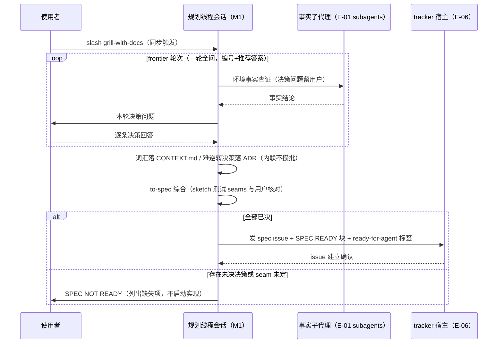
```mermaid
sequenceDiagram
    participant U as 使用者
    participant P as 规划线程会话（M1）
    participant SA as 事实子代理（E-01 subagents）
    participant T as tracker 宿主（E-06）
    U->>P: slash grill-with-docs（同步触发）
    loop frontier 轮次（一轮全问，编号+推荐答案）
        P->>SA: 环境事实查证（决策问题留用户）
        SA-->>P: 事实结论
        P->>U: 本轮决策问题
        U-->>P: 逐条决策回答
    end
    P->>P: 词汇落 CONTEXT.md / 难逆转决策落 ADR（内联不攒批）
    P->>P: to-spec 综合（sketch 测试 seams 与用户核对）
    alt 全部已决
        P->>T: 发 spec issue + SPEC READY 块 + ready-for-agent 标签
        T-->>P: issue 建立确认
    else 存在未决决策或 seam 未定
        P->>U: SPEC NOT READY（列出缺失项，不启动实现）
    end
```

**SQ-01-2 时序图**：

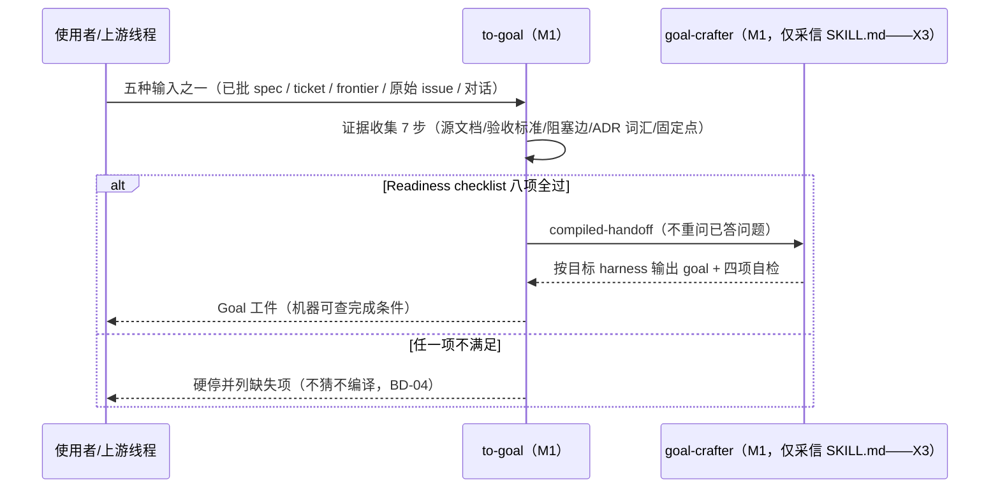
```mermaid
sequenceDiagram
    participant U as 使用者/上游线程
    participant TG as to-goal（M1）
    participant GC as goal-crafter（M1，仅采信 SKILL.md——X3）
    U->>TG: 五种输入之一（已批 spec / ticket / frontier / 原始 issue / 对话）
    TG->>TG: 证据收集 7 步（源文档/验收标准/阻塞边/ADR 词汇/固定点）
    alt Readiness checklist 八项全过
        TG->>GC: compiled-handoff（不重问已答问题）
        GC-->>TG: 按目标 harness 输出 goal + 四项自检
        TG-->>U: Goal 工件（机器可查完成条件）
    else 任一项不满足
        TG-->>U: 硬停并列缺失项（不猜不编译，BD-04）
    end
```

##### §3.2.M1.5 关键流程逻辑

**Triage role 状态机（O-08）**——2 类别 × 5 状态，每 issue 恰好一类一态（D44）：

| 起始状态 | 触发事件 | 终止状态 | 触发条件 / 校验 | 副作用 |
| --- | --- | --- | --- | --- |
| （无标签） | gather 完成 | needs-triage | 新 issue/PR 进入分诊视野 | 三桶注意力清单收录 |
| needs-triage | 报告信息不足 | needs-info | Verify 阶段判 insufficient detail | 发 needs-info 模板（established/needed 两栏） |
| needs-triage | verify 通过 + grill 完成 | ready-for-agent | 复现确认 + agent brief 就绪 | 发 agent brief；标签经 triage-labels.md 映射 |
| needs-triage | verify 通过但不宜委派 | ready-for-human | 说明为何不能委派 | 维护者合并路径 |
| needs-info / needs-triage | wontfix 判定 | wontfix | 三分：已实现（指向位置）/拒绝的 bug（礼貌解释）/拒绝的 enhancement（写 .out-of-scope 再关） | .out-of-scope/ 可能 +1 文件 |
| 任意 | quick override | 维护者指定态 | 维护者直接改状态（确认后照做） | 跳过 grilling；未 grilling 即 ready-for-agent 时询问是否补 brief |

**关键流程伪代码——frontier 轮次推进（grilling，D49）**：

```text
触发：访谈会话开始
Step 1: 建 design tree（决策分支挂决策）
Step 2: loop（frontier 轮次）
  ├── 收集本轮 frontier 问题（前置已 settling、现在就能问）
  ├── 一轮全问：编号 + 每题附推荐答案 + 类型 emoji（12 类，禁装饰性滥用）
  ├── 找事实派子代理（agent 的事）；决策逐条问用户（用户的事）
  ├── 回答重塑树：settled 推 frontier 外移；依赖未决的题入后轮
  └── frontier 空时结束循环
Step 3: 用户确认共识前不动手（防 premature completion）
```

> 本模块无跨多步异步事务与复杂回滚；状态机为 triage role 单状态机与 wayfinder 认领语义（先认领再干活），上表已覆盖。

#### 3.2.M2 执行编排与契约技能组

##### §3.2.M2.1 模块概述

M2 覆盖「契约执行与归档验收」业务场景，业务逻辑在规划线程、执行线程与传输底座之间流动，同时涉及三家宿主 harness（E-01/E-02/E-03，经 ACL 适配器）、执行锁与信箱状态（DF-07）、receipt 产物（DF-01）的数据流动。本模块是主链路环节 4~5 的承担者，核心域：receipt v2 契约 + 六道归档门是 fork 的差异化资产（G2 §2.3：业界无同构物）。

**涉及角色**：最终用户 A/B（发起与验收）、维护者（归档确认）。
**涉及的内外部系统**：E-02 Codex 宿主、E-03 ZCode 宿主、E-01 Claude Code 宿主（手动/规划内联）、C-04 fork-loop-mcp、spec-executor（执行线程内模型技能）。

##### §3.2.M2.2 接口清单

| 子领域 | 触发类型 | 触发名 | 用途（≤ 20 字） | 输入工件 | 输出工件 | 幂等 |
| --- | --- | --- | --- | --- | --- | --- |
| 编排 | 模型触发 | execute-spec-in-fork | 三通道检测并派发执行 | SPEC READY 块 | 执行会话 + receipt | 是（单活跃执行锁互斥） |
| 编排 | 模型触发 | express lane 判定 | 轻任务直通判定 | 会话任务 | 三行 mini receipt | 天然（规划线程内完成） |
| 执行 | 模型触发 | spec-executor | 五步执行契约 | SPEC READY 块 + 执行锁 | receipt v2 | 是（锁继承 SPEC READY 契约） |
| 传输 | MCP 工具 | spawn_execution | headless 派发执行 | SPEC READY 文本 | 信箱 pending 条目 | 是（exactly-once 投递） |
| 传输 | MCP 工具 | check_mailbox | 查询信箱待投条目 | — | pending 条目或空 | 天然 |
| 传输 | MCP 工具 | ack_receipt | 确认收讫并释放 | receipt 引用 | done 状态 + 锁释放 | 是（重复 ack 无副作用） |
| 传输 | MCP 工具 | fail_receipt | 显式失败登记 | 失败原因 | done 状态 + 锁释放 | 是 |
| 传输 | MCP 工具 | release_execution | 显式释放执行锁 | — | 锁删除 | 是（幂等删除） |

##### §3.2.M2.3 关键结构定义

**Codex 通道能力表（ACL 单点，ADR 0003：能力名只活在这张表）**：

| 本域动作 | Codex 能力名 | 说明 |
| --- | --- | --- |
| 建立执行线程 | fork_thread | 程序化 spawn 执行会话 |
| 读取执行线程 | read_thread | 读回执行输出 |
| 等待/轮询 | wait_threads | 同步等待多线程 |
| 归档管理 | set_thread_archived | 会话归档 |
| 澄清交互 | Messenger Ask / Reply / Resume 卡片协议 v2+ | 决策路由回规划线程 |

**ZCode 通道工具表（C-04 五工具，D69）**：spawn_execution（headless 派发执行会话）/ check_mailbox（查信箱）/ ack_receipt（收讫确认）/ fail_receipt（失败登记）/ release_execution（显式释放锁）；信箱三态 pending → delivered → done；执行锁为状态目录下锁文件（原子 mkdir 获取）。

**receipt v2（O-02）结构骨架**（D39，字段契约；Schema 首字段缺失或不匹配=校验失败，禁止手补）：

```text
Schema: spec-executor-receipt/v2
- Outcome:            completed | blocked | failed
- Conclusion:         单 token（completed / blocked / failed）
- Acceptance evidence: 验收标准逐条证据
- Docs delta:         文档影响结算（none 空白即缺陷；非 none 列出应更新点）
- Receipt metrics:    机器可解析遥测行（对应 DF-03 列结构）
- Worktree report:    工作树/外部影响终态报告
- Redaction note:     secret 已脱敏声明（先脱密再产出）
```

**关键字段定义表**：

| 字段 | 类型 | 必填 | 业务含义 | 约束 / 默认值 |
| --- | --- | --- | --- | --- |
| Schema | 字符串（首行） | 是 | 契约版本标识 | 恒为 spec-executor-receipt/v2（X1）；不匹配即拒收 |
| Conclusion | 单 token | 是 | 归档结论 | 枚举 completed / blocked / failed；多 token 即门 3 失败 |
| Docs delta | 结算清单 | 是 | 文档影响结算 | none 为合法值但必须显式写 none（空白即缺陷）；非 none 经 domain-modeling 结算 |
| Receipt metrics | 结构化行 | 是 | 遥测行 | 列结构同 DF-03（日期/任务/技能/结果/偏差/质量标签） |
| Worktree report | 报告块 | 是 | 终态报告 | 与工作树实际终态逐项可核对（门 6） |

**三行 mini receipt（express lane 收尾）**：what changed / validation run / worktree state——轻任务的 first-class 诚实路径（D75 Decision 2，关掉 silent bypass）。

##### §3.2.M2.4 模块逻辑时序图

| 编号 | 标题 | 场景类别 | 是否包含异常分支 |
| --- | --- | --- | --- |
| SQ-02-1 | M2 - 三通道检测与派发（含 refuse 分支） | 核心动作的执行/触发 | 是 |
| SQ-02-2 | M2 - ZCode 信箱全生命周期（spawn→归档） | 核心动作的执行/回调 | 是 |

**SQ-02-1 时序图**：

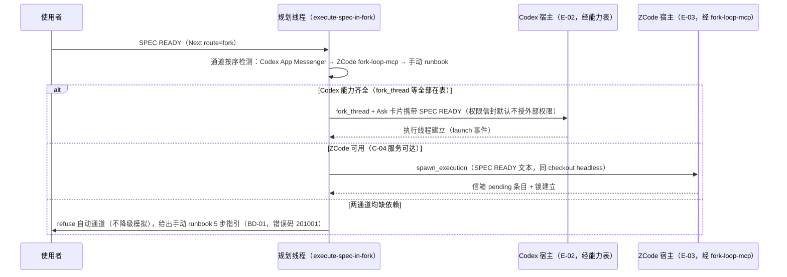
```mermaid
sequenceDiagram
    participant U as 使用者
    participant P as 规划线程（execute-spec-in-fork）
    participant CX as Codex 宿主（E-02，经能力表）
    participant ZC as ZCode 宿主（E-03，经 fork-loop-mcp）
    U->>P: SPEC READY（Next route=fork）
    P->>P: 通道按序检测：Codex App Messenger → ZCode fork-loop-mcp → 手动 runbook
    alt Codex 能力齐全（fork_thread 等全部在表）
        P->>CX: fork_thread + Ask 卡片携带 SPEC READY（权限信封默认不授外部权限）
        CX-->>P: 执行线程建立（launch 事件）
    else ZCode 可用（C-04 服务可达）
        P->>ZC: spawn_execution（SPEC READY 文本，同 checkout headless）
        ZC-->>P: 信箱 pending 条目 + 锁建立
    else 两通道均缺依赖
        P->>U: refuse 自动通道（不降级模拟），给出手动 runbook 5 步指引（BD-01，错误码 201001）
    end
```

**SQ-02-2 时序图**：

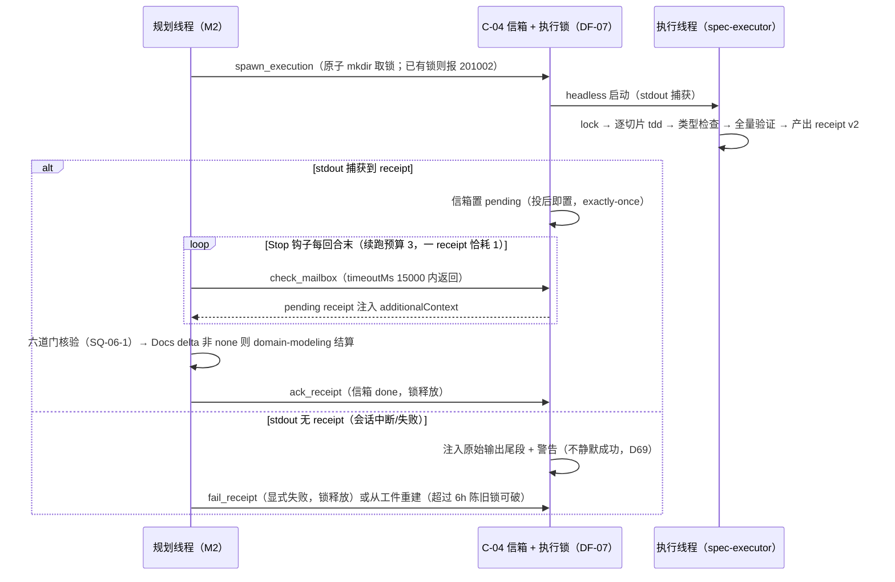
```mermaid
sequenceDiagram
    participant PL as 规划线程（M2）
    participant MB as C-04 信箱 + 执行锁（DF-07）
    participant RU as 执行线程（spec-executor）
    PL->>MB: spawn_execution（原子 mkdir 取锁；已有锁则报 201002）
    MB->>RU: headless 启动（stdout 捕获）
    RU->>RU: lock → 逐切片 tdd → 类型检查 → 全量验证 → 产出 receipt v2
    alt stdout 捕获到 receipt
        MB->>MB: 信箱置 pending（投后即置，exactly-once）
        loop Stop 钩子每回合末（续跑预算 3，一 receipt 恰耗 1）
            PL->>MB: check_mailbox（timeoutMs 15000 内返回）
            MB-->>PL: pending receipt 注入 additionalContext
        end
        PL->>PL: 六道门核验（SQ-06-1）→ Docs delta 非 none 则 domain-modeling 结算
        PL->>MB: ack_receipt（信箱 done，锁释放）
    else stdout 无 receipt（会话中断/失败）
        MB->>MB: 注入原始输出尾段 + 警告（不静默成功，D69）
        PL->>MB: fail_receipt（显式失败，锁释放）或从工件重建（超过 6h 陈旧锁可破）
    end
```

##### §3.2.M2.5 关键流程逻辑

**信箱条目状态机（O-11，D69）**：

| 起始状态 | 触发事件 | 终止状态 | 触发条件 / 校验 | 副作用 |
| --- | --- | --- | --- | --- |
| （无条目） | spawn_execution 成功 | pending | 原子 mkdir 取锁成功；已有活跃锁则拒绝（201002） | 锁文件建立 + stdout 捕获启动 |
| pending | Stop 钩子注入 | delivered | 注入 additionalContext 成功；一 receipt 恰耗一次续跑预算 | 续跑预算 -1 |
| delivered | 六道门通过 + ack_receipt | done | 六道门 6/6 通过；Docs delta 结算完成 | 锁释放（锁只在 done 或显式 release 释放——崩溃 runner 不能静默解锁） |
| delivered / pending | fail_receipt | done（失败档） | 执行线程显式失败或 receipt 缺失 | 锁释放 + 失败记录 |
| pending / delivered | 陈旧锁判定 | 可破锁 | 锁龄 > 6h（D69 保障） | 破锁需按 runbook 显式执行并留痕 |

**express lane 判定伪代码（D75 Decision 2 / D27）**：

```text
触发：SPEC READY 产出前的小任务分流
Step 1: 判定三条件（全部满足才直通）
  ├── 条件 1：单文件 / 几行机械改动
  ├── 条件 2：无未决产品决策
  └── 条件 3：验证便宜（验证命令可快速完整跑通）
Step 2: 直通路径（三条件全过）
  └── 规划线程内联完成 + 三行 mini receipt 收尾（what changed / validation run / worktree state）
Step 3: 回退路径（任一不过）
  └── 回退 fork 全管线（错误码 202001），禁止静默 bypass——把轻用户推进假可追溯比没有更糟
```

> 六道归档门的逐道校验逻辑归 M6 校验器（§3.2.M6.5）；M2 内的六道门是验收流程节点的消费方。本模块无数据库事务；跨多步异步（信箱生命周期）状态机如上表。

#### 3.2.M3 质量与评审技能组

##### §3.2.M3.1 模块概述

M3 覆盖「实现质量与评审」业务场景，业务逻辑在使用者与评审子代理之间流动，同时涉及宿主 harness（E-01 子代理并行）、固定点 diff（C-02 Git）、docs/agents/project-standards.md（规范权威源）的数据流动。本模块为主链路各环节提供质量输入：tdd 供 spec-executor 逐切片调用，code-review 供 implement 后评审，roundtable 供决策压测，diagnosing-bugs 为疑难 bug on-ramp。支撑域：复用上游既有技能，fork 无差异改动。

**涉及角色**：最终用户 A（评审发起与裁决接受者）、评审子代理（Standards 轴/Spec 轴、四席席位）。
**涉及的内外部系统**：E-01 Claude Code 宿主（subagents 并行隔离）、C-02 Git（固定点 diff）、project-standards 文档与 friction log（只读）。

##### §3.2.M3.2 接口清单

| 子领域 | 触发类型 | 触发名 | 用途（≤ 20 字） | 输入工件 | 输出工件 | 幂等 |
| --- | --- | --- | --- | --- | --- | --- |
| 测试 | 模型触发 | tdd | seam 红绿循环实现 | seam 清单（与用户确认） | 测试 + 最小实现 | 天然（红绿循环可重跑） |
| 评审 | 模型触发 | code-review | 双轴 diff 评审 | 固定点 + 标准源 | 双轴报告（≤400 词/轴） | 天然（只读） |
| 评审 | slash（user-invoked） | roundtable | 四席两轮对抗评审 | 动议 + evidence pack | Verdict/Consensus/Dissent/Vote | 天然（只建议不执行） |
| 诊断 | 模型触发 | diagnosing-bugs | 六阶段红循环诊断 | bug 描述 | 复现命令 + 修复 + 回归测试 | 天然（红循环可重跑） |

##### §3.2.M3.3 关键结构定义

**code-review 双轴报告结构骨架**（D23）：

```text
## Standards 轴（≤400 词）
- 固定点与 diff 命令（git diff 三点，merge-base）
- 标准源（project-standards.md 权威，⚠️ 项跳过 + Fowler 12 smells 基线）
- 最差项与证据（file+line）
## Spec 轴（≤400 词）
- spec 来源（commit 引用 → 参数 → specs/.scratch 按分支匹配）
- 忠实度结论与证据
（两轴各一子代理并行，报告不合并不重排，不跨轴评总冠军）
```

**关键字段定义表**：

| 字段 | 类型 | 必填 | 业务含义 | 约束 / 默认值 |
| --- | --- | --- | --- | --- |
| 固定点（fixed point） | 引用 | 是 | diff 基线 | SHA/分支/tag/HEAD~n；预先校验 ref 有效且 diff 非空 |
| 标准源 | 引用 | 是 | Standards 轴依据 | project-standards.md 存在即权威；缺省回落 Fowler 12 smells |
| 报告词数上限 | 约束 | 是 | 防报告膨胀 | 每轴 ≤400 词 |
| 席位输出契约 | 结构 | 是 | roundtable 每席输出 | 立场/三论点/最大风险，≤300 词 |

##### §3.2.M3.4 模块逻辑时序图

| 编号 | 标题 | 场景类别 | 是否包含异常分支 |
| --- | --- | --- | --- |
| SQ-03-1 | M3 - code-review 双轴并行评审 | 核心动作的执行 | 是 |

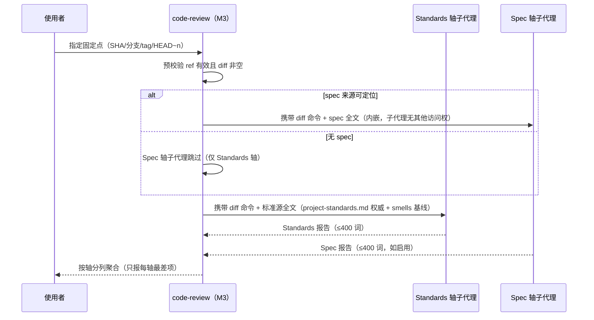
```mermaid
sequenceDiagram
    participant U as 使用者
    participant CR as code-review（M3）
    participant SA as Standards 轴子代理
    participant SB as Spec 轴子代理
    U->>CR: 指定固定点（SHA/分支/tag/HEAD~n）
    CR->>CR: 预校验 ref 有效且 diff 非空
    alt spec 来源可定位
        CR->>SB: 携带 diff 命令 + spec 全文（内嵌，子代理无其他访问权）
    else 无 spec
        CR->>CR: Spec 轴子代理跳过（仅 Standards 轴）
    end
    CR->>SA: 携带 diff 命令 + 标准源全文（project-standards.md 权威 + smells 基线）
    SA-->>CR: Standards 报告（≤400 词）
    SB-->>CR: Spec 报告（≤400 词，如启用）
    CR-->>U: 按轴分列聚合（只报每轴最差项）
```

##### §3.2.M3.5 关键流程逻辑

无复杂状态机/事务/跨多步异步，本段以一条关键规则说明：tdd 红绿循环三反模式拦截（实现耦合/同义反复/水平切片——D40）与 diagnosing-bugs「没有红循环禁止进入假设」红线（D25 Phase 1）。两者均为会话内流程纪律，无持久化状态迁移；roundtable 代价护栏（全桌 2N 子代理、两轮封顶）作为资源预算在 §3.5.3 登记。

#### 3.2.M4 证据回灌与评测组

##### §3.2.M4.1 模块概述

M4 覆盖「质量证据链运营」业务场景，业务逻辑在维护者与台账/评测工件之间流动，同时涉及 E-01（eval 新会话运行）、三台账文件（DF-02/DF-03/DF-04）、draft-proposals/（DF-05）的数据流动。本模块承担 P1 痛点（证据链空转）的解除：N2 evals 首跑与 N1 校验器的台账消费都在此闭环；harvest 是唯一合法的技能修订起草入口（一规则：事实在台账里找，修订由人确认，D30）。

**涉及角色**：甲方决策者（维护者，eval 运行与提案审批）、最终用户（receipt 质量标签提供方）。
**涉及的内外部系统**：E-01 Claude Code 宿主（eval 新会话）、DF-02/DF-03/DF-04/DF-05 工件、M6 校验器（门禁联动）。

##### §3.2.M4.2 接口清单

| 子领域 | 触发类型 | 触发名 | 用途（≤ 20 字） | 输入工件 | 输出工件 | 幂等 |
| --- | --- | --- | --- | --- | --- | --- |
| 台账 | 归档流程内联 | metrics 行追加 | receipt 验收后逐行追加 | receipt v2 | DF-03 新行 | 是（一 receipt 一行，关联标识去重） |
| 台账 | 会话内联 | friction 记录 | 执行中卡点按日追加 | 卡点描述 | DF-04 新行 | 是（append-only 单向追加） |
| 评测 | slash（user-invoked） | eval 运行（人工新会话） | 黄金任务运行与打分 | tasks/ 任务文件 | results/ 一档 + DF-02 回填 | 是（一运行一档，SCOREBOARD 按任务行更新） |
| 回灌 | slash（user-invoked） | harvest run | 读台账→分诊→起草 | 四输入（台账/evals/被点名技能/规则文档） | DF-05 提案（一缺陷一文件） | 是（命名唯一，存在即跳过提示） |
| 回灌 | slash（user-invoked） | harvest apply | 应用已批准提案 | DF-05 提案（Approved: yes） | 技能资产修订 | 是（old text 原位核对，漂移即停） |

##### §3.2.M4.3 关键结构定义

**draft proposal（O-07）结构骨架**（D30 run/3；命名规则：日期-技能名-短标识.md）：

```text
# 2026-09-11-spec-executor-gate2-multi-receipt
- Skill:    spec-executor
- Evidence: 台账/eval 溯源（receipt 标识、任务文件、摩擦行）
- Verdict:  confirmed-defect | noise | gap-not-defect
- Change:   old → new（精确机械可应用编辑）
- Approved: no
（apply 后追加：Approved: yes + Applied: 日期与结果行）
```

**关键字段定义表**：

| 字段 | 类型 | 必填 | 业务含义 | 约束 / 默认值 |
| --- | --- | --- | --- | --- |
| Skill | 引用 | 是 | 目标技能 | 必须为存在的 SKILL.md；「重写整个技能」类提案转 grill-with-docs |
| Evidence | 引用清单 | 是 | 证据溯源 | metrics 行/eval 档/摩擦行可回查；台账缺席=空台账不是错误 |
| Verdict | 枚举 | 是 | 分诊三档 | confirmed-defect（2+ receipt 同摩擦或 eval 复跑仍失败）/ noise（一行记录）/ gap-not-defect（建议立新技能） |
| Change | 编辑对 | 是 | old→new 精确编辑 | apply 时核对 old text 仍在原位，漂移即停（302001） |
| Approved | 状态行 | 是 | 审批记录 | 文件是审批记录而非聊天；聊天批准不算（D30） |

**SCOREBOARD 行结构（DF-02 列定义，D15/D13）**：任务名 / runs / pass rate / 主导失败模式 / Defect signals 关联——当前全部 0 runs（X4：本行状态不得被引用为质量证据，N2 首跑后回填）。

##### §3.2.M4.4 模块逻辑时序图

| 编号 | 标题 | 场景类别 | 是否包含异常分支 |
| --- | --- | --- | --- |
| SQ-04-1 | M4 - eval 首跑与 SCOREBOARD 回填 | 核心动作的执行/记录 | 是 |
| SQ-04-2 | M4 - harvest run→apply 审批闭环 | 异常/补偿回路 | 是 |

**SQ-04-1 时序图**：

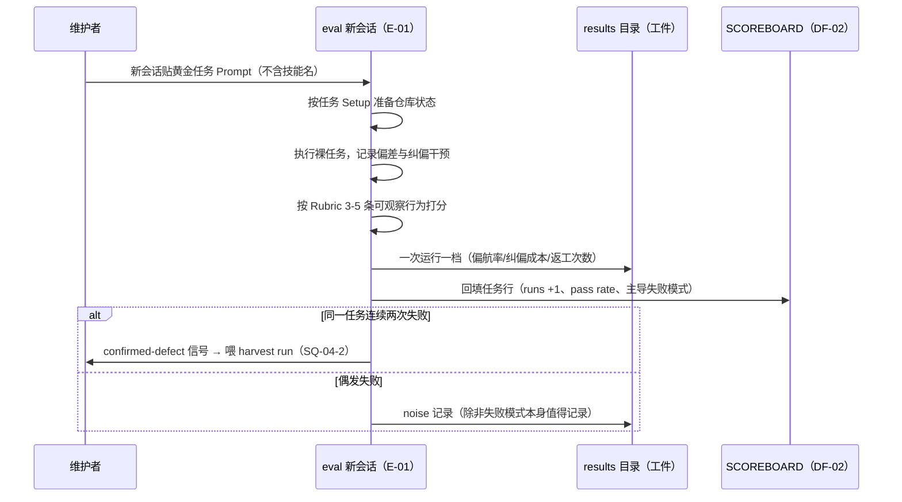
```mermaid
sequenceDiagram
    participant M as 维护者
    participant EV as eval 新会话（E-01）
    participant RS as results 目录（工件）
    participant SB as SCOREBOARD（DF-02）
    M->>EV: 新会话贴黄金任务 Prompt（不含技能名）
    EV->>EV: 按任务 Setup 准备仓库状态
    EV->>EV: 执行裸任务，记录偏差与纠偏干预
    EV->>EV: 按 Rubric 3-5 条可观察行为打分
    EV->>RS: 一次运行一档（偏航率/纠偏成本/返工次数）
    EV->>SB: 回填任务行（runs +1、pass rate、主导失败模式）
    alt 同一任务连续两次失败
        EV->>M: confirmed-defect 信号 → 喂 harvest run（SQ-04-2）
    else 偶发失败
        EV->>RS: noise 记录（除非失败模式本身值得记录）
    end
```

**SQ-04-2 时序图**：

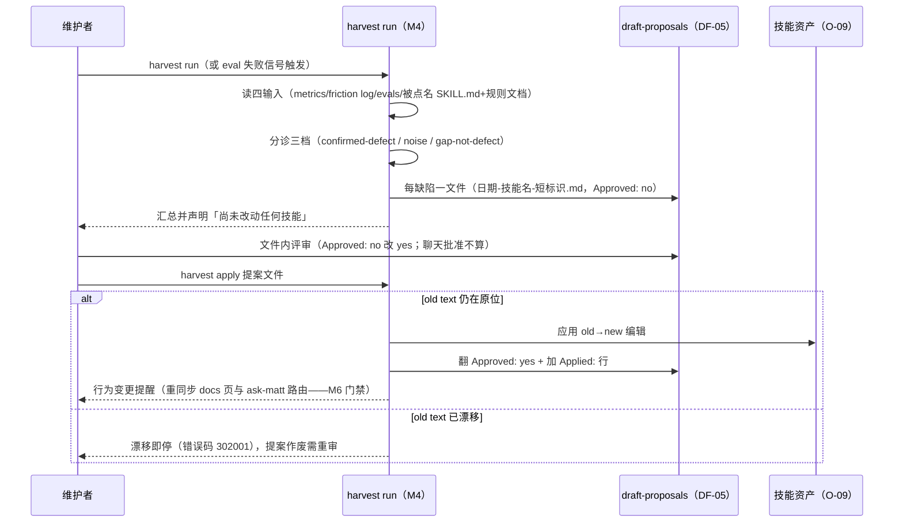
```mermaid
sequenceDiagram
    participant M as 维护者
    participant HV as harvest run（M4）
    participant DP as draft-proposals（DF-05）
    participant SK as 技能资产（O-09）
    M->>HV: harvest run（或 eval 失败信号触发）
    HV->>HV: 读四输入（metrics/friction log/evals/被点名 SKILL.md+规则文档）
    HV->>HV: 分诊三档（confirmed-defect / noise / gap-not-defect）
    HV->>DP: 每缺陷一文件（日期-技能名-短标识.md，Approved: no）
    HV-->>M: 汇总并声明「尚未改动任何技能」
    M->>DP: 文件内评审（Approved: no 改 yes；聊天批准不算）
    M->>HV: harvest apply 提案文件
    alt old text 仍在原位
        HV->>SK: 应用 old→new 编辑
        HV->>DP: 翻 Approved: yes + 加 Applied: 行
        HV-->>M: 行为变更提醒（重同步 docs 页与 ask-matt 路由——M6 门禁）
    else old text 已漂移
        HV-->>M: 漂移即停（错误码 302001），提案作废需重审
    end
```

##### §3.2.M4.5 关键流程逻辑

**eval cadence 与 repeat-test 规则伪代码（D14）**：

```text
触发：技能变更（必跑）或周检节奏（至多每周一次）
Step 1: 选任务（8 黄金任务之一；首跑要求 8/8 各至少 1 run——N2 出口标准）
Step 2: 新会话运行（评测技能契约而非 agent 通用能力；不引入新工具）
Step 3: 打分与归档（results/ 一档 → SCOREBOARD 回填）
Step 4: 失败信号分诊
  ├── 连续两次失败 = confirmed-defect → harvest run
  ├── 偶发失败 = noise（有效 receipt 被门弹回一次也值得记录）
  └── 结果是证据不是评判：不作为每 receipt 的门（抓漂移不拦执行）
```

> 本模块无复杂事务；台账写入均为 append-only 单向操作（幂等见 §3.5.2），状态机即 Draft proposal 的 no→yes→Applied 行进（见 §3.2.M4.3 与 SQ-04-2）。

#### 3.2.M5 路由与初始化组

##### §3.2.M5.1 模块概述

M5 覆盖「入口分流与仓库初始化」业务场景，业务逻辑在用户与路由技能之间流动，同时涉及 E-06 tracker（配置探测）、docs/agents/ 配置产出（C-03）的数据流动。通用域：完全复用上游 ask-matt / setup 机制，fork 不改语义；维护义务仅为新增/改名技能时同步路由文本（check-router 门禁守卫，D4）。

**涉及角色**：最终用户 A/B（入口使用者）、维护者（配置确认者）。
**涉及的内外部系统**：E-06 tracker 宿主、docs/agents/ 三文件（issue-tracker.md / domain.md / triage-labels.md）、CLAUDE.md 或 AGENTS.md（指针块）。

##### §3.2.M5.2 接口清单

| 子领域 | 触发类型 | 触发名 | 用途（≤ 20 字） | 输入工件 | 输出工件 | 幂等 |
| --- | --- | --- | --- | --- | --- | --- |
| 路由 | slash（user-invoked） | ask-matt | idea→ship 主流程分流 | 用户意图 | 路由决策（进入 M1/M3 on-ramps） | 天然 |
| 初始化 | slash（user-invoked） | setup-matt-pocock-skills | 仓库一次性配置 | 仓库现状探索 | docs/agents/ 三文件 + 指针块 | 是（重复运行仅换 tracker 时需要） |
| 边界 | 阶段边界 | Continue/clear/handoff/Subagent/compact | 阶段边界五选项 | 会话状态 | 上下文处置 | 天然 |

##### §3.2.M5.3 关键结构定义

**setup 产出三文件结构骨架**（D38；prompt 驱动：探索→呈现→确认→写入）：

```text
docs/agents/issue-tracker.md   # tracker 类型（GitHub/GitLab/本地）+ PRs-as-request-surface 标志（默认 off）
docs/agents/domain.md          # 领域文档布局与消费规则（CONTEXT.md/ADR 位置）
docs/agents/triage-labels.md   # 五标签词表到 tracker 真实 label 字符串的映射
CLAUDE.md 或 AGENTS.md         # 指针块（存在谁改谁，绝不两个都建）
```

**关键字段定义表**：

| 字段 | 类型 | 必填 | 业务含义 | 约束 / 默认值 |
| --- | --- | --- | --- | --- |
| tracker 类型 | 枚举 | 是 | issue 承载工具 | github（默认，gh CLI）/ gitlab（glab）/ local（.scratch/〈feature〉/）/ 其他（自由文本记录） |
| PRs-as-request-surface | 布尔 | 是 | 外部 PR 是否当请求面 | 默认 off（D38） |
| triage 标签词表 | 映射表 | 是 | 规范五标签 → 真实 label | needs-triage / needs-info / ready-for-agent / ready-for-human / wontfix（X6：规范名为 ready-for-agent） |

##### §3.2.M5.4 模块逻辑时序图

| 编号 | 标题 | 场景类别 | 是否包含异常分支 |
| --- | --- | --- | --- |
| SQ-05-1 | M5 - setup 一次性配置 | 核心配置的创建 | 是 |

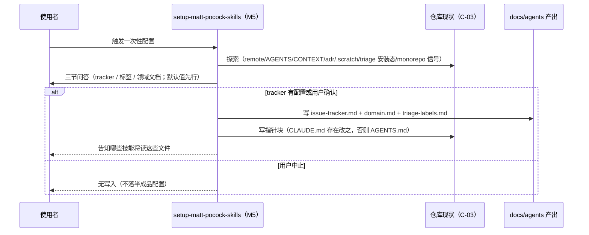
```mermaid
sequenceDiagram
    participant U as 使用者
    participant SU as setup-matt-pocock-skills（M5）
    participant RE as 仓库现状（C-03）
    participant DA as docs/agents 产出
    U->>SU: 触发一次性配置
    SU->>RE: 探索（remote/AGENTS/CONTEXT/adr/.scratch/triage 安装态/monorepo 信号）
    SU->>U: 三节问答（tracker / 标签 / 领域文档；默认值先行）
    alt tracker 有配置或用户确认
        SU->>DA: 写 issue-tracker.md + domain.md + triage-labels.md
        SU->>RE: 写指针块（CLAUDE.md 存在改之，否则 AGENTS.md）
        SU-->>U: 告知哪些技能将读这些文件
    else 用户中止
        SU-->>U: 无写入（不落半成品配置）
    end
```

##### §3.2.M5.5 关键流程逻辑

**ask-matt 主流程路由伪代码（D22）**：

```text
触发：用户进入工程流
Step 0: 前置检查：首次使用工程流 → 提示运行 setup（硬依赖技能带显式一行提示，D72）
Step 1: 入口识别
  ├── 外部涌入 issue → triage
  ├── 疑难 bug → diagnosing-bugs（先建红循环）
  ├── 超大迷雾 → wayfinder（产出决策，收口交 to-spec）
  └── 常规想法 → 主流程
Step 2: 主流程推进（步骤 1-3 保持一个不间断上下文窗口）
  ├── grill-with-docs 访谈（无目录用 grill-me）
  ├── 需可运行答案 → handoff 往返 prototype
  └── 实现分支：小而清晰 implement / 单会话 to-spec+fork / 多会话 to-spec+to-tickets+to-goal
Step 3: 阶段边界处置（五选项决策树：Continue / clear / handoff / Subagent / compact）
上下文预算：smart zone 约 150k token，接近时只在阶段边界 /compact
```

> 本模块无状态机与事务；已知缺陷（误报缺技能、路由时未读 SKILL.md 正文，D22 docs 版补充）按 harvest 缺陷信号通道治理，不在本设计内修改技能语义。

#### 3.2.M6 维护与分发工具组

##### §3.2.M6.1 模块概述

M6 覆盖「机器校验、上游同步、漂移治理、分发发布」业务场景，业务逻辑在维护者与 scripts 工具链之间流动，同时涉及 E-04 上游仓库（rebase）、E-07/E-08 分发渠道、C-01/C-02/C-05（Node/Git/npm）的数据流动。本模块承担 MVP 新增主项 N1（receipt 六道门脚本化校验器）与 N3（X2/X3/X6 漂移修订入库），是六道门从「prompt 级纪律」升级为「机器可防」的落点（P2 痛点解除，V2 目标）。

**涉及角色**：甲方决策者（维护者，校验/同步/发布执行者）、受影响方（贡献者过门禁、skills.sh 用户安装）。
**涉及的内外部系统**：E-04 上游、E-07/E-08 分发、C-01 Node 运行时、C-02 Git、C-05 npm/changesets、DF-01（receipt 校验输入）、DF-06（drill 记录）。

##### §3.2.M6.2 接口清单

| 子领域 | 触发类型 | 触发名 | 用途（≤ 20 字） | 输入工件 | 输出工件 | 幂等 |
| --- | --- | --- | --- | --- | --- | --- |
| N1 校验 | node CLI | node scripts/receipt-gate.mjs 〈receipt 路径〉 | 六道门逐条脚本校验 | receipt 文件 + 工作树 | 校验报告（6 位错误码行）/ exit 0 | 天然（只读校验） |
| N1 防漂移 | node CLI | 同上 --check 模式 | 生成物防漂移检查 | 生成物与期望 | 漂移报告（102001）/ exit 1 | 天然（只读） |
| 门禁 | node CLI | lint-skills（--diff-audit） | 清单/链接/预算校验 | 仓库现状 | 校验报告 / exit 非零 | 天然（只查不改） |
| 门禁 | node CLI | check-router | 路由器三查 | plugin.json + README | 校验报告（一败即阻合） | 天然 |
| 版本 | node CLI | sync-plugin-version（--check） | 版本双写 | package.json | plugin.json 更新 / 不一致 exit 1 | 是（源单点，重跑收敛） |
| 同步 | sh CLI | sync-drill | 无副作用试 rebase | 上游 ref | DF-06 三指标行 | 是（丢弃式分支，可重跑） |
| 同步 | sh CLI | sync-upstream | 正式上游 rebase | 干净 worktree + 命名分支 | rebase 结果 | 否（rebase 改写历史，由 drill 先行 + playbook 兜底） |
| 发布 | npm CLI | changeset / version | 变更聚合与版本双写 | .changeset/ | CHANGELOG + 双写版本 | 是（聚合幂等） |
| 构建 | node CLI | build-codex-plugin（--check） | Codex 插件载荷生成 | plugin.json（唯一事实源） | .codex-plugin/ 镜像 | 是（生成物可重建，--check 防漂移） |

##### §3.2.M6.3 关键结构定义

**校验器报告行（统一输出信封）结构骨架**（§3.5.1 全局约束的实例化；本地形态下 traceId=receipt 标识、tenantId=仓库标识）：

```json
{
  "code": "101006",
  "gate": "six-gate/6",
  "severity": "block",
  "msg": "工作树与 receipt 报告终态漂移",
  "traceId": "receipt-20260911-spec-01",
  "tenantId": "sam-skills",
  "timestamp": "2026-09-11T10:00:00.000Z"
}
```

**六道门校验项定义表（N1 校验器核心，D27 六道门逐条脚本化）**：

| 门序 | 校验项 | 校验逻辑 | 失败错误码 |
| --- | --- | --- | --- |
| Gate 1 | outcome=completed | 解析 receipt Outcome 字段为 completed | 101001 |
| Gate 2 | 单一可解析 receipt | 定位执行产物中 receipt 且回数恰为 1、可解析 | 101002 |
| Gate 3 | Conclusion 单 token | Conclusion 为 completed/blocked/failed 之一且无多余 token | 101003 |
| Gate 4 | 验收标准逐条有证据 | Acceptance evidence 与 spec 验收标准逐条对齐 | 101004 |
| Gate 5 | 无待决规划决策 | receipt 内不存在待决决策标记 | 101005 |
| Gate 6 | 工作树终态无意外漂移 | 工作树状态与 receipt Worktree report 核对一致 | 101006 |
| 前置 | Schema 首字段匹配 | 首行 Schema: spec-executor-receipt/v2（X1；缺失/不匹配即拒收，禁止手补） | 101011 |

**关键字段定义表**：

| 字段 | 类型 | 必填 | 业务含义 | 约束 / 默认值 |
| --- | --- | --- | --- | --- |
| code | 6 位数字 | 是 | 错误码（§3.5.1 注册表） | 类别 1 位 + 模块 2 位 + 序号 3 位 |
| severity | 枚举 | 是 | 处置级别 | block（阻断归档）/ warn（放行但登记）/ info |
| traceId | 字符串 | 是 | 工件链关联标识 | receipt 标识（语义映射见 §8.3） |
| tenantId | 字符串 | 是 | 仓库标识 | 本仓固定 sam-skills（§8.2） |

##### §3.2.M6.4 模块逻辑时序图

| 编号 | 标题 | 场景类别 | 是否包含异常分支 |
| --- | --- | --- | --- |
| SQ-06-1 | M6 - receipt 校验器六道门校验 | 核心门禁的执行 | 是 |
| SQ-06-2 | M6 - 上游同步 drill 与合并 | 运营维护流程 | 是 |

**SQ-06-1 时序图**：

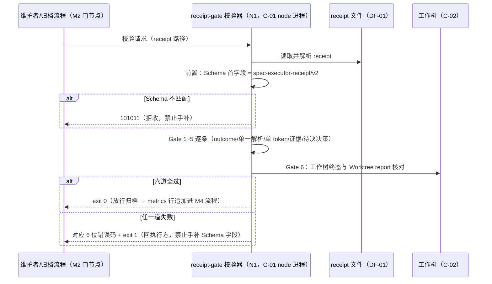
```mermaid
sequenceDiagram
    participant MT as 维护者/归档流程（M2 门节点）
    participant RG as receipt-gate 校验器（N1，C-01 node 进程）
    participant RF as receipt 文件（DF-01）
    participant WT as 工作树（C-02）
    MT->>RG: 校验请求（receipt 路径）
    RG->>RF: 读取并解析 receipt
    RG->>RG: 前置：Schema 首字段 = spec-executor-receipt/v2
    alt Schema 不匹配
        RG-->>MT: 101011（拒收，禁止手补）
    end
    RG->>RG: Gate 1~5 逐条（outcome/单一解析/单 token/证据/待决决策）
    RG->>WT: Gate 6：工作树终态与 Worktree report 核对
    alt 六道全过
        RG-->>MT: exit 0（放行归档 → metrics 行追加进 M4 流程）
    else 任一道失败
        RG-->>MT: 对应 6 位错误码 + exit 1（回执行方，禁止手补 Schema 字段）
    end
```

**SQ-06-2 时序图**：

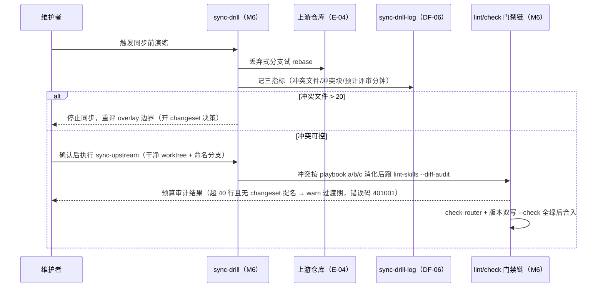
```mermaid
sequenceDiagram
    participant MT as 维护者
    participant DR as sync-drill（M6）
    participant UP as 上游仓库（E-04）
    participant LG as sync-drill-log（DF-06）
    participant GB as lint/check 门禁链（M6）
    MT->>DR: 触发同步前演练
    DR->>UP: 丢弃式分支试 rebase
    DR->>LG: 记三指标（冲突文件/冲突块/预计评审分钟）
    alt 冲突文件 > 20
        DR-->>MT: 停止同步，重评 overlay 边界（开 changeset 决策）
    else 冲突可控
        MT->>DR: 确认后执行 sync-upstream（干净 worktree + 命名分支）
        DR->>GB: 冲突按 playbook a/b/c 消化后跑 lint-skills --diff-audit
        GB-->>MT: 预算审计结果（超 40 行且无 changeset 提名 → warn 过渡期，错误码 401001）
        GB->>GB: check-router + 版本双写 --check 全绿后合入
    end
```

##### §3.2.M6.5 关键流程逻辑

**N1 校验器实现约束伪代码（MVP 新增物；上游已冻结实现形态：Node 18+ ESM 零依赖、--check 模式参照 lint-skills.mjs，D68）**：

```text
触发：归档验收（六道门节点）或 --check 防漂移巡检
Step 1: 输入解析（同步）
  ├── 读取 receipt 文件（UTF-8）；不可读 → 901001（exit 9，可重试）
  ├── 解析 Schema 首字段（前置门）；不匹配 → 101011（exit 1，不重试）
  └── [MOCK] 无——本地工件校验无三方服务，无 Mock 项（与上游 §4.3 一致）
Step 2: 六道门逐条（顺序短路：先到先败）
  ├── 每道失败输出一条 6 位错误码报告行（JSON 结构见 §3.2.M6.3）
  └── 状态变更：无（只读校验，不改工件）
Step 3: 退出码收敛（写操作必标注：无写操作；幂等天然）
  ├── 全过 → exit 0
  └── 任一 block → exit 1；报告行落 stdout 供台账与人工引用
[完整版替换点] 无——校验器被完整版直接继承（上游 §4.3 演进纪律）
```

**N3 漂移修订入库清单（MVP 三项，各有确定处置）**：

| 编号 | 漂移项 | 处置 | 落点 |
| --- | --- | --- | --- |
| X2 | install-block.md 引用不存在的 ADR 文件名（./adr/0005-ship-as-a-codex-plugin.md） | Codex 插件轨道 ADR 级补档：为 Codex 插件轨道补一份 ADR（或在既有 ADR 体系内补档），修正 install-block 引用 | .agents/adr/ + .agents/install-block.md |
| X3 | goal-crafter README 指向外部仓库且内容漂移 | 处置口径：仅采信 SKILL.md；README 按 X3 结论修订或标注非契约地位 | skills/engineering/goal-crafter/ |
| X6 | CONTEXT.md 的 Triage role 写作 ready-for-afk | 术语对齐为 ready-for-agent（规范名全链路一致） | CONTEXT.md（经 domain-modeling 词条修订纪律） |

### 3.3 核心业务对象清单

#### 3.3.1 对象定义

| 编号 | 对象名（代码类名） | 对象类型 | 包路径（文件位置） | 模块归属 | 被哪些模块复用 | 实例化策略 | 序列化约定 | 持久化策略 |
| --- | --- | --- | --- | --- | --- | --- | --- | --- |
| O-01 | SpecReadyBlock | 值对象（结构化块） | 规划线程会话内联（spec 正文） | M1 | M1 / M2 | to-spec 综合产出 | Markdown 结构化块 | tracker issue 内（随 spec） |
| O-02 | Receipt | 聚合根 | 执行会话产物 | M2 | M2 / M4 / M6 | spec-executor 产出（禁止手补） | Markdown（Schema 首行锁定） | 执行产物文件 → 归档关联（DF-01） |
| O-03 | ExecutionLock | 实体 | fork-loop-mcp 状态目录 | M2 | M2 | 原子 mkdir 创建 | 锁文件（含初始工作树状态） | DF-07；done/fail/release 释放 |
| O-04 | Goal | 聚合根 | to-goal 编译产物 | M1 | M1 / M2 | to-goal + goal-crafter 编译 | Markdown（六节） | goal 工件文件 |
| O-05 | Issue | 实体 | tracker 宿主 | M1 / M5 | M1 / M2 / M5 | triage/to-spec/to-tickets/wayfinder 创建 | tracker 原生 | tracker 宿主 |
| O-06 | Ticket | 实体 | .scratch/〈feature-slug〉/issues/ | M1 | M1 / M2 | to-tickets 垂直切片创建 | Markdown 工单文件 | 本地 tracker 轨（一票一文件） |
| O-07 | DraftProposal | 聚合根 | docs/evals/draft-proposals/ | M4 | M4 / M6 | harvest 起草（一缺陷一文件） | Markdown 模板（Approved 行） | DF-05；apply 后翻牌 |
| O-08 | TriageRole | 共享枚举 | triage-labels.md 映射 | M1 | M1 / M5 | 分诊判定赋值 | label 字符串 | tracker 标签 |
| O-09 | SkillAsset | 实体 | skills/〈bucket〉/〈skill〉/SKILL.md | 全部 | 全部（只读消费）；修订仅经 O-07 | 上游继承或 changeset 引入 | SKILL.md + openai.yaml 双侧 | 三重同步三处（plugin.json/README/docs 页） |
| O-10 | Changeset | 实体 | .changeset/ | M6 | M6 / M1（ADR 决策记录伴随） | 超预算/行为变更时创建 | Markdown 变更集 | .changeset/；version 聚合后进 CHANGELOG |
| O-11 | MailboxMessage | 实体 | fork-loop-mcp 状态目录 | M2 | M2 | spawn_execution 投递 | 状态文件（pending/delivered/done） | DF-07；done 后留存 |
| O-12 | ReceiptMetricsRow | 共享 DTO | docs/metrics.md 行 | M4 | M4 / M6 | receipt 验收后追加 | 表格行（日期/任务/技能/结果/偏差/质量标签） | DF-03（append-only） |

**对象类型说明**（本项目适用性）：聚合根=一致性边界（Receipt 的字段完整性由六道门守护、DraftProposal 的审批状态由文件行承载）；值对象=无标识结构（SpecReadyBlock 随 spec 存在）；共享枚举/DTO=跨模块传输结构；本项目无防腐层代码对象（ACL 以文档化能力表形式存在，见 §3.3.2 漂移登记说明）。

#### 3.3.2 命名漂移登记表

| 业务实体（§2） | 代码类名（§3.3.1） | 数据落盘名（§4.2） | 漂移原因 |
| --- | --- | --- | --- |
| Issue | Issue 与 Ticket 双形态 | tracker issue / .scratch 工单文件 | D2 术语约定：通用语境用 Issue；本地轨落盘物称 Ticket；wayfinder 子件称 Decision ticket（引用外部系统语义时保留 ticket 用词） |
| Triage role | TriageRole | tracker label 字符串（如 ready-for-agent） | 规范名与 tracker 真实 label 需经 triage-labels.md 映射（多 tracker 宿主 label 词不同）；X6 漂移修订对齐后全链路为 ready-for-agent |
| Receipt | Receipt | metrics 台账行（ReceiptMetricsRow） | 一 receipt 对应台账一行：receipt 是完整回执工件，台账行是其遥测投影（列结构为子集） |
| Codex 能力名 / ZCode 工具名 | 适配器能力表 | —（不落盘为数据） | 同一「程序化派发」语义在两宿主各有一个专名（fork_thread vs spawn_execution）；按 ADR 0003 能力名只活在各自适配器单点，属有意保留的 ACL 命名漂移 |

### 3.4 跨模块公共能力

仅登记横切多个模块、以「机器校验脚本 / 共享工件 / 会话纪律」形式提供的能力（本系统无 SDK/AOP/Bean，提供方为脚本或文档契约）：

| 公共能力 | 简述 | 提供方（脚本 / 文档契约名） | 被哪些模块复用 | 接入方式 |
| --- | --- | --- | --- | --- |
| 三重同步机器守卫 | promoted 技能三处登记一致性（plugin.json / 顶层 README / docs 页）+ 路由器点名三查 | scripts/check-router.mjs + scripts/lint-skills.mjs（门禁链） | M1（路由文本）、M6（发布）、全部技能变更 | 发布/变更流程内联调用；一败即阻合 |
| 40 行表达层预算审计 | 继承技能 diff 预算机器审计（warn 过渡期，两版后转硬门） | scripts/lint-skills.mjs --diff-audit | M6（上游同步）、M1/M3（继承技能修订） | sync 流程内联调用；超预算须 O-10 Changeset 提名 |
| CONTEXT.md 词汇消费 | 五术语全仓唯一标准名 | CONTEXT.md（Shared Kernel，C-03 关系） | M1~M6 全部 | 读 CONTEXT.md 取词是散文指针（被动消费）；主动维护走 domain-modeling |
| 权限信封继承 | External authority 从 SPEC READY 传导到执行方权限边界 | SPEC READY 块字段（O-01）→ M2 执行契约 | M1（产出）、M2（消费） | 工件字段传导；默认不授外部权限（D27） |
| 台账 append-only 纪律 | 台账文件单向追加、不修剪不回写 | §4.1 全局数据约定（DF-02~DF-06） | M2（验收）、M4（运营）、M6（drill） | 写入路径唯一化（各台账仅一个追加入口） |
| 秘密脱敏纪律 | 凭据留环境变量、产出前先脱密 | diagnosing-bugs §Redact + receipt Redaction note（D25/D39） | M2 / M3 | 会话纪律 + receipt 字段承载 |

> 不在本节登记：业务技能组（归 §3.2）、直接使用的底座组件（归 §3.1.3 C-xx）、单纯命名规范（归 §3.2.1）。

### 3.5 接口契约

> 本系统对外暴露的触发接口（slash 命令、MCP 工具、脚本 CLI）与工件契约在错误码、幂等、资源预算、超时上的全局约定。**所有模块必须遵守，不在每个接口下重复声明。**

#### 3.5.1 全局错误码体系

**错误码格式**：

| 项 | 取值 |
| --- | --- |
| 错误码格式 | 6 位数字，如：101001 |
| 分段规则 | 1 位类别 + 2 位模块 + 3 位错误序号 |
| 类别取值 | 1 = 门禁拒绝（业务语义失败，阻断归档/合入）/ 2 = 执行环境错误（传输与宿主）/ 3 = 输入与配置错误 / 4 = 漂移与预算告警（warn 级）/ 9 = 校验器自身内部错误 |
| 模块码取值 | 01 = 校验器与门禁（M6）/ 02 = 执行编排（M2）/ 03 = 证据回灌（M4）/ 04 = 路由初始化（M5）/ 00 = 全局 |

**错误响应统一结构**（校验器与门禁脚本的 stdout 报告行，JSON 单行）：

```json
{
  "code": "101006",
  "severity": "block",
  "gate": "six-gate/6",
  "msg": "工作树与 receipt 报告终态漂移",
  "traceId": "receipt-20260911-spec-01",
  "tenantId": "sam-skills",
  "timestamp": "2026-09-11T10:00:00.000Z"
}
```

**错误码注册表**：

| 错误码 | 退出码 | 所属模块 | 含义 | 重试建议 | 用户文案 |
| --- | --- | --- | --- | --- | --- |
| 101001 | 1 | M6 校验器 | Gate1：receipt Outcome 非 completed | 不重试（回执行线程补证） | 归档被拒：执行结果未标记完成 |
| 101002 | 1 | M6 校验器 | Gate2：receipt 缺失或存在多份不可解析回执 | 不重试 | 归档被拒：回执缺失或不止一份 |
| 101003 | 1 | M6 校验器 | Gate3：Conclusion 非单一合法 token | 不重试 | 归档被拒：结论字段不合法 |
| 101004 | 1 | M6 校验器 | Gate4：存在无证据的验收标准条目 | 不重试 | 归档被拒：存在未附证据的验收项 |
| 101005 | 1 | M6 校验器 | Gate5：存在待决规划决策 | 不重试 | 归档被拒：仍有待决规划决策 |
| 101006 | 1 | M6 校验器 | Gate6：工作树与 receipt 报告终态漂移 | 不重试（核对后重新产出 receipt） | 归档被拒：工作树状态与回执不一致 |
| 101011 | 1 | M6 校验器 | receipt 首字段 Schema 非 spec-executor-receipt/v2 | 不重试（禁止手补） | 回执契约版本不匹配 |
| 102001 | 1 | M6 门禁 | --check 模式检测到生成物漂移（镜像/版本/路由） | 重跑对应生成/同步命令 | 检测到生成物漂移，请重跑生成命令 |
| 201001 | 2 | M2 传输适配 | 宿主能力缺失，refuse 自动通道 | 不重试（走手动 runbook） | 当前宿主不支持自动闭环，已给出手动流程指引 |
| 201002 | 2 | M2 传输适配 | 执行锁被占用（单活跃执行守卫） | 等待持有方释放；超过 6h 陈旧锁按 runbook 破锁 | 已有执行线程在运行 |
| 201003 | 2 | M2 传输适配 | 信箱 receipt 缺失（stdout 未捕获到回执） | 不重试（检查执行会话） | 执行会话未产出回执，已注入警告不静默成功 |
| 202001 | 0（回退） | M2 编排 | express lane 判据不满足，回退全管线 | 不重试 | 本任务超出直通条件，转入完整管线 |
| 302001 | 3 | M4 回灌 | apply 时 old text 已漂移 | 不重试（提案作废重审） | 提案已过期：原文本已被改动，请重新评审 |
| 301001 | 3 | M5 初始化 | tracker 配置缺失（硬依赖技能） | 先运行 setup | 尚未完成仓库配置，请先运行初始化技能 |
| 401001 | 0（warn） | M6 审计 | 继承技能表达层超 40 行预算且无 changeset 提名 | 开 changeset 说明（过渡期 warn，两版后转硬门） | 表达层差异超预算，请补充变更集说明 |
| 901001 | 9 | 全局 | 校验器/门禁自身异常（文件不可读等） | 可重试 | 校验器内部错误，请重试或报告 |

#### 3.5.2 幂等性约定

本地形态下「重复执行有副作用」的写入操作分类与幂等机制：

| 写入类型 | 是否要求幂等 | 幂等机制（等价于模板幂等键） |
| --- | --- | --- |
| 信箱投递（MCP spawn_execution） | **强制幂等（exactly-once）** | 投后即置 delivered（D69）；重复投递被状态机拒绝 |
| 执行锁获取 | 强制幂等（互斥） | 原子 mkdir：重复获取失败（201002）；释放仅在 done/fail/release |
| 台账追加（DF-02~DF-04、DF-06） | 强制幂等（防重复行） | 一事一行 + 关联标识（receipt 标识/任务名/日期）；追加前按关联标识查重；append-only 单向 |
| draft proposal 创建 | 强制幂等 | 一缺陷一文件 + 命名规则（日期-技能名-短标识）；同名存在即跳过并提示 |
| harvest apply 应用 | 强制幂等（防重放） | old text 原位核对：已应用则 old 不在原位 → 302001 停止，天然防重复应用 |
| 版本双写（sync-plugin-version） | 是 | package.json 为单源，重跑收敛到同一值 |
| 生成物重建（build-codex-plugin） | 是 | 生成物从唯一事实源（plugin.json）可确定性重建；--check 校验漂移 |
| spec/goal/工单创建 | 是 | tracker 原生唯一性 / 一票一文件命名唯一 |
| 查询类（check_mailbox、list-skills、校验只读模式） | 天然幂等 | — |

**幂等设计五问（各模块已回答）**：幂等键生命周期=工件关联标识随台账永久保留（append-only）；重复请求语义=拒绝或跳过并提示（不返回假成功）；执行中态=锁互斥（第二个获取者收 201002）；失败后可重试性=失败释放锁后可重新发起（工件重建原则，QS-05）；存储兜底=文件系统即最终事实（无缓存层，§0 裁剪声明）。

#### 3.5.3 并发与资源预算约定（限流约定的本地形态）

无网关限流；本节以「资源预算」承担同等职能（防止单点过载与失控消耗）。5 维预算：

| 维度 | 默认值 | 触发动作 | 调整方式 |
| --- | --- | --- | --- |
| 全局并发（执行线程） | 单一活跃执行线程/checkout | 第二个执行请求被拒（201002） | fork-loop-mcp 锁机制；超过 6h 陈旧锁人工破 |
| 单任务续跑预算 | Stop 续跑 ≤ 3 次（一 receipt 恰耗 1） | 预算耗尽停止续跑 | D76 固定值，改动属 ADR 级 |
| 上下文预算（规划线程） | smart zone 约 150k token；L2 正文 ≤5k token/技能 | 接近阈值仅在阶段边界 /compact | ask-matt 阶段边界五选项；D22 |
| 评审并发预算 | roundtable 全桌 2N 子代理（quick=N）；code-review 每轴 1 子代理 | 席位数 3~5 封顶；报告 ≤300/400 词 | D37/D23 固定护栏 |
| 运营频次预算 | eval 至多每周一次（技能变更后必跑）；sync drill 每次同步前一次 | 超频次不自动执行 | D14 cadence；D8 |

**降级策略**（对齐 §2.5.2 降级清单）：预算触发不静默丢弃——执行并发被拒给出明确错误码与等待指引；续跑耗尽后状态留在工件可重建；评审超限按固定护栏收敛输出。红线联动：本表数值与 §5.5 容量水位线、§8.4 告警阈值一致。

#### 3.5.4 默认超时与重试基线

全局单一来源；各模块接口清单（§3.2.M{N}.2）通过引用本节继承默认值，特殊场景覆盖须显式说明：

| 调用类型 | 默认超时 | 默认重试 | 重试条件 |
| --- | --- | --- | --- |
| MCP 工具调用（check_mailbox / spawn_execution 等） | timeoutMs 15000（D69 安装配置） | 0 次（轮询模型天然重试：Stop 钩子每回合末再查） | 不在调用内重试，靠回合轮询 |
| Stop 钩子续跑 | 每回合末触发 | 预算 3 次（一 receipt 恰耗 1） | 仅 pending receipt 注入场景 |
| headless 执行会话（zcode -p / Codex fork） | 无固定墙钟超时（以 Stop 回合为心跳） | 0 次自动重试 | 失败经 fail_receipt 显式登记；超过 6h 陈旧锁可破后人工重启 |
| 校验与门禁脚本（lint/check/sync-plugin-version/校验器） | 秒级（本地文件 IO） | 0 次 | 失败即报告（901001 类可人工重试） |
| sync drill / sync-upstream | 人工触发，一次执行 | 0 次 | drill 可安全重跑（丢弃式分支）；正式 rebase 失败按 playbook |
| eval 运行 | 人工新会话，不设脚本超时 | 按 repeat-test 规则 | 连续两次失败 → confirmed-defect 走 harvest，不做机械重试 |

**填写要求自查**：无「无限」超时（headless 会话以心跳+陈旧锁判定兜底）；所有重试有上限；重试不产生副作用（配合 §3.5.2 幂等）。

#### 3.5.5 触发词与入口路由规范

**触发接口规范**（模板 API 路由规范的本地形态）：

| 维度 | 取值 |
| --- | --- |
| 命名风格 | slash 命名 kebab-case（/grill-with-docs、/to-spec）；脚本 CLI kebab-case（lint-skills、check-router） |
| invocation 双轨 | user-invoked：frontmatter disable-model-invocation: true + openai.yaml policy.allow_implicit_invocation: false（双侧配对，D77）；model-invoked：默认，description 带富触发语 |
| 版本控制 | 无路径版本；契约版本承载于工件（receipt Schema 首字段）与技能 frontmatter |
| 动作类触发 | user-invoked 可调用 model-invoked 技能；user-invoked 之间不可互调（D77 invocation.md） |
| 依赖表达 | 依赖用 /skill 散文调用表达，禁止跨文件夹深链（D77） |

**入口路由清单**（URL↔页面 的本地对应：触发词↔流程↔角色↔权限边界；权限基线见 §7.2.5 权限信封）：

| 触发入口 | 流程 | 入口角色（§2.3.1） | 权限边界 | 关联模块 |
| --- | --- | --- | --- | --- |
| /ask-matt | idea→ship 主流程分流 | 最终用户 A/B | 会话内只读探索 | M5 |
| /setup-matt-pocock-skills | 仓库一次性配置 | 最终用户 / 维护者 | 写 docs/agents/ + 指针块（确认后） | M5 |
| /grill-with-docs、/grilling、/grill-me | 访谈 | 最终用户 A | 词汇/ADR 落盘（内联确认） | M1 |
| /to-spec、/to-tickets、/to-goal | 成稿/拆分/编译 | 最终用户 A | tracker 写入（发稿） | M1 |
| /triage、/wayfinder | 分诊/决策地图 | 最终用户 / 维护者 | tracker 标签与评论（带 AI 免责声明） | M1 |
| /execute-spec-in-fork、/spec-executor | 契约执行 | 最终用户 A/B | 权限信封默认不授外部权限 | M2 |
| /harvest run、/harvest apply | 回灌 | 维护者 | 仅写 draft-proposals/；apply 需文件内显式批准 | M4 |
| node scripts/receipt-gate.mjs | 六道门校验 | 维护者 / 归档流程 | 只读校验 | M6 |
| npm run lint:skills / check:router | 门禁链 | 维护者 / 贡献者（CI 语境） | 只读校验 | M6 |
| npx skills add opsbli/sam-skills | 安装（skills.sh 轨） | skills.sh 用户 | 本机 ~/.agents 或项目目录写入 | M6（E-08） |

---

---

## 4. 数据库设计（文件型数据设计）

> **本章回答**：每个模块的状态用什么文件存、列结构怎么定义、数据怎么清理、版本怎么管。
> **形态映射声明**（§0 裁剪声明的落地）：本系统无数据库引擎。数据存储的现实形态是 repo 内文件，按以下等价映射组织，全文口径一致：**表 ≈ 数据文件/台账；行 ≈ 行记录；字段 ≈ 列结构；索引 ≈ 命名与检索约定；DDL ≈ 文件结构定义；备份 ≈ git 版本管理**。业务域与 §2.1/§3.2 保持一致（按域分组，禁止按技术维度横向组织）。

### 4.1 全局数据约定

写在所有数据文件设计之前的项目级数据基线：

| 约定项 | 取值 | 说明 |
| --- | --- | --- |
| 命名规范（数据文件） | 台账类：docs/〈语义名〉.md（kebab-case）；提案类：日期-技能名-短标识.md；工件类：随会话/跟踪器命名约定 | 全仓统一 kebab-case，与 §3.5.5 命名风格一致 |
| 命名规范（列/字段） | 台账表头 snake_case 英文列名；正文叙述字段用中文定义 | 机器可解析列与人类可读叙述分层 |
| 主键（行唯一性） | 关联标识组合：receipt 标识 / 任务名+日期 / 提案文件名 | 每行可由「关联标识」唯一定位；无自增主键概念 |
| 字符集 | UTF-8 | 全仓统一；mermaid/emoji（技能内类型锚）均 UTF-8 安全 |
| 时间字段 | 日期用 ISO 8601 短横线格式（例如 2026-09-11，台账行首列）；时间戳用 ISO 8601 完整格式（机器报告行） | 与台账人类阅读习惯及机器解析双轨对齐 |
| 软删除 | 不适用：台账一律 append-only，不修剪不回写（D10/D30）；工件级退役=删除文件且 changeset 指名替代物（D21） | append-only 是本系统的「软删除」等价纪律 |
| 审计字段 | 每台账行含日期列；机器报告行含 timestamp；修订类文件含 Applied: 行 | 谁（会话/维护者）何时对什么工件做了什么，经 git 提交记录补全 |
| 隔离字段（多租户） | 不适用（本地单用户仓库，O1 冻结）；等价物=仓库标识 tenantId 语义固定为 sam-skills（§8.2） | 无跨租户隔离概念 |
| 业务唯一标识 | receipt 标识（traceId 语义）、任务名、提案文件名 | 与外部系统对齐时（tracker issue 编号）引用 tracker 原生标识 |
| 状态枚举 | Markdown 行内枚举（人类可读全列）+ 机器报告行 JSON 枚举 | 枚举取值在字段定义表全部列出（如 Conclusion：completed/blocked/failed） |
| 金额字段 | 不适用（本系统无资金语义） | — |
| 敏感字段 | 秘密不入台账：凭据留环境变量，产出前先脱密（D25/D39）；台账与 receipt 只记事实不记值 | 与 §7.2.2 数据安全联动 |

### 4.2 数据文件设计（单表设计的文件型映射）

> 登记为「数据文件（DF-xx）」的每个文件严格按五段式编写，不得省略任何一段：**.1 文件元信息 → .2 结构定义 → .3 检索约定（索引的等价物）→ .4 文件结构定义（DDL 等价物）→ .5 清理机制**。其余 repo 内工件（CONTEXT.md、ADR、spec、goal、工单、.out-of-scope）是「文档型工件」而非数据台账，在 §4.2.8 统一登记并说明豁免理由。

#### 4.2.1 DF-01 receipt v2 回执文件

**.1 文件元信息**

| 字段 | 取值 |
| --- | --- |
| 存储类型 | repo 内执行产物文件（markdown） |
| 路径 | 执行会话产物位置（stdout 捕获产物，归档后随台账引用留存） |
| 文件名 | receipt 标识（traceId 语义，如 receipt-20260911-spec-01） |
| 业务含义（≤ 50 字） | 契约执行的完整结果回执，六道门校验与遥测的事实源 |
| 模块归属（§3.2） | M2 产出 / M4 M6 消费 |
| 对应核心对象（§3.3） | O-02 Receipt |

**.2 结构定义**

| 字段 | 类型 | 必填 | 业务含义 | 约束 / 默认值 |
| --- | --- | --- | --- | --- |
| Schema | 字符串（首行） | 是 | 契约版本 | 恒为 spec-executor-receipt/v2（X1） |
| Outcome | 枚举 | 是 | 执行结果 | completed / blocked / failed |
| Conclusion | 单 token | 是 | 归档结论 | 同 Outcome 枚举；门 3 校验 |
| Acceptance evidence | 逐条清单 | 是 | 验收证据 | 与 spec 验收标准逐条对齐 |
| Docs delta | 结算清单 | 是 | 文档影响结算 | none 必须显式写；非 none 列应更新点 |
| Receipt metrics | 结构化行 | 是 | 遥测数据 | 列结构同 DF-03 |
| Worktree report | 报告块 | 是 | 终态报告 | 门 6 核对基准 |
| Redaction note | 声明 | 是 | 脱敏声明 | secret 先脱密（D39） |

**.3 检索约定**：按 receipt 标识唯一定位；台账 DF-03 的行经「任务+日期」列反向关联 receipt 标识；归档视图（规划线程 receipt 归档节点）按执行会话聚合。

**.4 文件结构定义**：结构骨架见 §3.2.M2.3 receipt v2 骨架（此处不重复）；首行 Schema 字段是格式准入门槛（缺行即 101011）。

**.5 清理机制**：永久保留（质量证据链的事实源，V2 目标的证据本体）；无物理清理。归档语义=通过六道门并追加 DF-03 行，非文件删除。

#### 4.2.2 DF-02 docs/evals/SCOREBOARD.md（评测记分板）

**.1 文件元信息**

| 字段 | 取值 |
| --- | --- |
| 存储类型 | repo 内台账（markdown 表格） |
| 路径 | docs/evals/SCOREBOARD.md |
| 文件名 | SCOREBOARD.md |
| 业务含义（≤ 50 字） | 8 个黄金任务的运行记分与失败模式汇总 |
| 模块归属（§3.2） | M4（N2 首跑回填） |
| 对应核心对象（§3.3） | O-12 ReceiptMetricsRow（eval 变体行） |

**.2 结构定义（列结构）**

| 列名 | 类型 | 必填 | 业务含义 | 约束 / 默认值 |
| --- | --- | --- | --- | --- |
| task | 字符串 | 是 | 黄金任务名 | 8 项固定（to-goal×2 / spec-executor×2 / tdd×2 / code-review×2，D16） |
| runs | 数字 | 是 | 已运行次数 | 当前全部 0（X4）；首跑目标 ≥1 |
| pass rate | 比例 | 是 | 通过率 | 首跑后按 rubric 聚合 |
| dominant failure mode | 字符串 | 是 | 主导失败模式 | 无运行时留空；失败模式按 rubric 偏差归类 |
| defect signals | 引用 | 是 | 缺陷信号关联 | repeat-test 命中后关联 DF-05 提案文件名 |

**.3 检索约定**：按 task 列定位任务行；defect signals 列反向链接 DF-05 提案；results/ 目录按任务名分档存储运行明细。

**.4 文件结构定义**（表格模板）：

```markdown
# SCOREBOARD
| task | runs | pass rate | dominant failure mode | defect signals |
| --- | --- | --- | --- | --- |
| to-goal/01-frontier-ticket-to-verifiable-goal | 0 | — | — | — |
（8 行任务固定；runs 大于 0 后逐列回填）
## Defect signals
（repeat-test 命中的确认缺陷登记区，当前为空——X4）
```

**.5 清理机制**：永久保留；runs 累计不重置；历史运行明细在 results/ 按「一运行一档」累积（D14），档案化不删除。

#### 4.2.3 DF-03 docs/metrics.md（receipt 遥测台账）

**.1 文件元信息**

| 字段 | 取值 |
| --- | --- |
| 存储类型 | repo 内台账（markdown 表格） |
| 路径 | docs/metrics.md |
| 文件名 | metrics.md |
| 业务含义（≤ 50 字） | 每个 receipt 验收后追加一行的质量遥测台账 |
| 模块归属（§3.2） | M4（M2 验收流程内联追加） |
| 对应核心对象（§3.3） | O-12 ReceiptMetricsRow |

**.2 结构定义（列结构，D9）**

| 列名 | 类型 | 必填 | 业务含义 | 约束 / 默认值 |
| --- | --- | --- | --- | --- |
| 日期 | 日期 | 是 | 验收日期 | ISO 8601 短横线格式（例如 2026-09-11） |
| 任务 | 字符串 | 是 | 任务标识 | 与 receipt traceId 关联 |
| 技能 | 字符串 | 是 | 主执行技能 | spec-executor / express lane 等 |
| 结果 | 枚举 | 是 | 六道门结论 | completed / blocked / failed |
| 偏差 | 字符串 | 是 | 执行偏差摘要 | 无偏差写 none（显式） |
| 质量标签 | 枚举 | 是 | 主观质量档（D9 Goal/spec quality） | 验收后询问使用者记入 |

**.3 检索约定**：按日期列时间序检索；harvest run 按「质量标签+偏差」列扫描重复模式（confirmed-defect 判据：2+ receipt 同摩擦）；任务列关联 DF-01 receipt 标识。

**.4 文件结构定义**：文件开头为空模板表头（D9：尚无数据行，等首验收追加）；列定义如 .2。

**.5 清理机制**：append-only 永久保留，不修剪不回写（D30）；harvest 只读消费。

#### 4.2.4 DF-04 docs/skill-friction-log.md（技能摩擦日志）

**.1 文件元信息**

| 字段 | 取值 |
| --- | --- |
| 存储类型 | repo 内台账（markdown 日志条目） |
| 路径 | docs/skill-friction-log.md |
| 文件名 | skill-friction-log.md |
| 业务含义（≤ 50 字） | 技能执行卡点的 append-only 日志 |
| 模块归属（§3.2） | M4（执行会话内联追加） |
| 对应核心对象（§3.3） | O-12（摩擦行变体） |

**.2 结构定义（行结构，D10）**

| 字段 | 类型 | 必填 | 业务含义 | 约束 / 默认值 |
| --- | --- | --- | --- | --- |
| 日期 | 日期 | 是 | 记录日期 | ISO 8601 短横线格式（例如 2026-09-11），按日期追加一行 |
| 技能名 | 字符串 | 是 | 卡点技能 | 与 skills/ 目录名一致 |
| 卡点描述 | 文本 | 是 | 一行卡点事实 | 只记事实不记情绪；不记敏感值 |

**.3 检索约定**：按技能名列聚合（harvest 分诊输入）；按日期列检索时间线；跨 receipt 重复摩擦由 harvest 扫描判定（repeat-test 的台账侧）。

**.4 文件结构定义**：逐行条目式（日期 + 技能名 + 卡点描述），当前为空（D10）。

**.5 清理机制**：append-only，harvest 读取不修剪（D10 明文）；永不物理清理。

#### 4.2.5 DF-05 docs/evals/draft-proposals/*.md（修订提案）

**.1 文件元信息**

| 字段 | 取值 |
| --- | --- |
| 存储类型 | repo 内提案文件组（markdown） |
| 路径 | docs/evals/draft-proposals/ |
| 文件名 | 日期-技能名-短标识.md（D30 命名规则） |
| 业务含义（≤ 50 字） | harvest 产出的技能修订提案与审批记录 |
| 模块归属（§3.2） | M4 起草 / M4 apply 应用 / M6 门禁联动 |
| 对应核心对象（§3.3） | O-07 DraftProposal |

**.2 结构定义**

| 字段 | 类型 | 必填 | 业务含义 | 约束 / 默认值 |
| --- | --- | --- | --- | --- |
| Skill | 引用 | 是 | 目标技能 | 存在的 SKILL.md |
| Evidence | 引用清单 | 是 | 证据溯源 | DF-03/DF-04/evals 可回查 |
| Verdict | 枚举 | 是 | 分诊档位 | confirmed-defect / noise / gap-not-defect |
| Change | 编辑对 | 是 | old→new 精确编辑 | 机械可应用；old text 原位核对 |
| Approved | 状态行 | 是 | 审批状态 | no → yes（文件内翻牌，聊天不算） |
| Applied | 追加行 | 条件必填 | 应用记录 | apply 成功后追加日期与结果 |

**.3 检索约定**：文件名即索引（日期前缀天然时间序）；harvest run 先按文件名查重；apply 按提案文件名定位；SCOREBOARD defect signals 列反向链接。

**.4 文件结构定义**：结构骨架见 §3.2.M4.3（不重复）；git 批量评审是设计意图（D30：入库 git 可批量评审）。

**.5 清理机制**：已应用（Applied）提案保留作审批审计记录，不删除；作废提案（漂移即停）保留原文件并人工标注作废原因——禁止静默删除审批记录。

#### 4.2.6 DF-06 docs/sync-drill-log.md（同步演练记录）

**.1 文件元信息**

| 字段 | 取值 |
| --- | --- |
| 存储类型 | repo 内台账（markdown 记录行） |
| 路径 | docs/sync-drill-log.md |
| 文件名 | sync-drill-log.md |
| 业务含义（≤ 50 字） | 每次上游同步前 drill 的三指标记录 |
| 模块归属（§3.2） | M6 |
| 对应核心对象（§3.3） | O-12（drill 行变体） |

**.2 结构定义（行结构，D8/D11）**

| 字段 | 类型 | 必填 | 业务含义 | 约束 / 默认值 |
| --- | --- | --- | --- | --- |
| 日期 | 日期 | 是 | 演练日期 | ISO 8601 短横线格式（例如 2026-09-11） |
| 上游基准 | 引用 | 是 | 演练所对上游 ref | commit SHA 或 tag |
| 冲突文件数 | 数字 | 是 | 三指标一 | 超过 20 触发停止重评 overlay（D8） |
| 冲突块数 | 数字 | 是 | 三指标二 | — |
| 预计评审分钟 | 数字 | 是 | 三指标三 | 成本预判值 |

**.3 检索约定**：按日期倒序（最近演练优先读）；正式同步前必查最近一行（V3 目标：覆盖率 100%）。

**.4 文件结构定义**：记录行式；当前仅 1 行（2026-09-04 演练：0/0/0——D11）。

**.5 清理机制**：append-only 永久保留（演练历史是同步成本趋势证据）。

#### 4.2.7 DF-07 执行锁与信箱状态（fork-loop-mcp 状态目录）

**.1 文件元信息**

| 字段 | 取值 |
| --- | --- |
| 存储类型 | 本机状态目录（JSON/文件，环境变量 FORK_LOOP_STATE_DIR 指定） |
| 路径 | 状态目录（workspace 级，D69 安装节） |
| 文件名 | 锁文件 + 信箱条目文件 |
| 业务含义（≤ 50 字） | 单活跃执行守卫与 receipt 投递的运行时状态 |
| 模块归属（§3.2） | M2（C-04 承载） |
| 对应核心对象（§3.3） | O-03 ExecutionLock / O-11 MailboxMessage |

**.2 结构定义**

| 字段 | 类型 | 必填 | 业务含义 | 约束 / 默认值 |
| --- | --- | --- | --- | --- |
| 锁文件（目录形态） | 目录 | 是 | 单活跃执行守卫 | 原子 mkdir 创建；含 SPEC READY 契约与初始工作树状态（D27） |
| mailbox 条目状态 | 枚举 | 是 | 投递状态 | pending / delivered / done |
| session_id / task_id | 字符串 | 是 | 执行会话关联（source_thread_id 等价物，D76） | 投递时写入 |
| created_at | 时间戳 | 是 | 陈旧锁判定基准 | 超过 6h 可破锁（D69） |

**.3 检索约定**：check_mailbox 按 pending/delivered 状态过滤；锁检测按目录存在性判断（原子语义）。

**.4 文件结构定义**：状态文件由 C-04 服务自持（数据流见 D69 §数据流）；bin 盘上锁文件与信箱三态为唯一运行时事实。

**.5 清理机制**：done 后锁释放（保留条目供追溯）；释放路径仅 ack_receipt / fail_receipt / release_execution 三工具 + 超过 6h 人工破锁；禁止崩溃时静默解锁（D76）。

#### 4.2.8 附属工件登记表（非台账工件，五段式豁免说明）

| 工件 | 路径 | 归属模块 | 豁免理由（非数据台账） |
| --- | --- | --- | --- |
| CONTEXT.md | 根目录 | M1（domain-modeling 维护） | 纯 glossary 词汇表，非行式台账；条目内联更新（D26） |
| ADR 文件组 | .agents/adr/（5 份） | M6/M1（domain-modeling 沉淀） | 决策记录文档，一决策一文件；演进=新增 ADR 不改旧档 |
| spec 正文 | tracker issue 内 | M1 | tracker 原生承载，本仓不重复存储 |
| Goal 工件 | 会话产物 | M1 | 一次性编译产物，消费方为执行线程 |
| 工单文件（Ticket） | .scratch/〈feature-slug〉/issues/ | M1 | tracker 的本地轨形态，一票一文件（D43） |
| .out-of-scope/ 知识库 | 根目录 .out-of-scope/（7 份） | M5（triage 写入） | 被拒请求档案，只增不改 |
| results/ 运行档 | docs/evals/results/ | M4 | eval 运行明细档案，SCOREBOARD 的原始凭证 |
| SKILL.md + openai.yaml | skills/〈bucket〉/〈skill〉/ | 全部 | 技能资产本体（代码等价物），由 changeset/ADR 治理而非台账纪律 |

### 4.3 数据部署与备份

#### 4.3.1 存储清单（本地形态）

| 存储类型 | 用途 | 部署模式 | HA 方案 | 备份策略 | 日志 / 审计去向 |
| --- | --- | --- | --- | --- | --- |
| 本机仓库工作副本 | 全部数据文件与技能资产 | 本机目录 | git 工作树自愈（checkout 恢复） | 每次提交即版本化 | git 提交历史 |
| 远端 GitHub 仓库（origin=opsbli/sam-skills） | 共享与分发主副本 | GitHub 托管 | GitHub 平台可用性（无 SLA 承诺，本地工具） | push 即远端副本；GitHub 平台侧冗余 | GitHub 提交历史 |
| fork-loop-mcp 状态目录 | 运行时锁与信箱 | 本机临时态 | 工件重建原则（QS-05） | 不备份（运行时态，重建优于备份） | done 条目留存 |

#### 4.3.2 备份与恢复

| 维度 | 取值 |
| --- | --- |
| 备份方式 | git 提交（增量）+ push 到 GitHub（异地副本）；台账类变更随业务提交节奏入库 |
| 备份位置 | 本机 .git 对象库 + GitHub 远端（物理隔离于工作目录） |
| 保留策略 | git 历史永久保留；远端仓库由 GitHub 平台冗余；release/tag 长期保留 |
| RPO（数据丢失容忍） | 已提交数据 RPO = 0（git 提交即持久）；未 push 的本地提交 RPO ≤ 24h（维护节奏：台账变更当日入库，配合每周 eval / 每季 drill 的既有节奏，MVP 期建议台账变更即 push） |
| RTO（恢复时间目标） | ≤ 30 分钟（本机故障场景：git clone 远端仓库 + 恢复本机环境：Node 18 安装与宿主插件重装；恢复步骤 ≤ 6 步） |
| 恢复演练 | 频率：随每次上游同步 drill 顺带核验（clone 远端到临时目录跑 lint 门禁链，零额外成本）；负责人：仓库维护者（opsbli） |

**自洽性说明**：本地工具无对外 SLA（§5.3），RPO/RTO 是维护者侧的数据安全承诺而非用户合同承诺；与 §5.2 韧性口径一致（工件可重建 > 备份恢复）。

### 4.4 数据演进与兼容性

> 模板 §4.5「数据迁移」未启用（无存量迁移，§0 裁剪声明）；本节承载其兼容性职能的等价物——数据文件与契约的版本演进规则。

| 演进对象 | 演进规则 | 兼容性保障 |
| --- | --- | --- |
| receipt 契约（DF-01） | 必填字段增删改名 → 版本必须 bump（v2 → v3）+ 两侧技能同步更新（D39）；本期冻结 v2（O4/X1） | 首行 Schema 字段是准入门槛：校验器拒收不匹配版本（101011），旧版本工件不被静默降级解释 |
| 台账列结构（DF-02~DF-04、DF-06） | 允许向表尾追加新列（向后兼容）；禁改既有列语义；台账 append-only 旧行不回填新列 | harvest 分诊按「列存在才消费」原则读取；列语义变更须 changeset 说明 |
| 提案模板（DF-05） | 模板字段新增须同步 harvest 技能（一规则：提案模板与技能契约同源） | apply 只依赖 Change 与 Approved 两字段（最小兼容面） |
| 插件清单（plugin.json skills 数组） | 技能增删改名 → 三重同步三处 + ask-matt 路由文本同步（check-router 门禁一败即阻合） | 机器门禁保证清单不漂移；版本双写 --check 保证发布一致 |
| 状态目录（DF-07） | 信箱协议刻意小（三态 + 锁），ZCode 原生长出会话原语则适配器退役（D76） | 状态目录重建成本=零（运行时态，工件重建原则） |

---

## 5. 部署架构（本地运行与分发形态）

> **本章定位**：本系统不部署（无集群、无服务端，O1 冻结）。本章承载**对开发与使用产生约束的本地运行结论**——环境要求、运行时韧性、分发拓扑与容量预算。集群/流水线等施工细节不适用；下游《部署设计》应聚焦三轨分发流程与宿主环境验证。

### 5.1 运行环境与配置策略

**运行环境矩阵**（模板环境划分的本地形态：无 dev/int/uat/prod 集群，环境=使用者与维护者本机）：

| 环境名称 | 环境定位 | 隔离方式 | 基线要求 |
| --- | --- | --- | --- |
| 使用者环境 | 安装三轨之一后使用 | 每 harness 单轨（插件只读托管束 / skills.sh 可编辑拷贝，双装即同技能双载，D77） | 宿主（Claude Code / Codex / ZCode）当前版本；skills.sh 轨需 Node ≥18（脚本） |
| 维护者环境 | fork 开发与发布 | 独立工作副本 + 双 remote（upstream/origin，D8） | Node.js 18.x LTS + Git 2.x + npm ≥9；~/.claude/skills 本地链接（dev-only，D68） |
| CI 环境 | 不引入（O5：评测 CI 化属完整版评估项） | — | 门禁链目前跑在维护者本机与贡献者本机（pre-commit 语境） |

**配置策略**（模板 L1~L4 的本地映射）：

| 配置层级 | 存放位置 | 适用内容 | 变更生效 | 对开发的约束 |
| --- | --- | --- | --- | --- |
| L1 代码内 | 仓库文件 | 枚举、错误码注册表、协议常量、信箱三态 | 随提交 | 禁止写入：使用者环境差异、任何秘密 |
| L2 配置文档 | docs/agents/ 三文件 + CONTEXT.md + project-standards.md | tracker 配置、标签词表、领域文档布局、工程标准 | 重读文件即生效（技能每次消费时读取） | 修改须经 setup 确认或 project-standards 流程（事实靠探索，标准由人确认） |
| L3 环境变量 | 使用者 shell / .zcode/config.json | FORK_LOOP_ZCODE_CMD / FORK_LOOP_STATE_DIR / ZCode provider 配置（model.main 字符串、options.baseURL+apiKey） | 下次进程启动 | 启动失败 fail-fast（headless 无 provider 拒启，D76）；--settings 参数不接线勿用（实测错位） |
| L4 密钥 | 使用者宿主注入（BYOK）/ 环境变量 | 模型 API key（本仓零持有）、tracker CLI 凭据（gh/glab 登录态） | 宿主管理 | 本仓零密钥边界：禁入台账/receipt/日志/提交（§7.2.3） |

### 5.2 运行时韧性（高可用的本地等价物）

本地工具无多副本/负载均衡/容灾级别概念。韧性来源按模板「可用性来源拆分」结构重述：

| 可用性来源 | 范围 | 责任方 |
| --- | --- | --- |
| 平台兜底 | GitHub 托管（远端副本）、宿主 harness 可用性 | GitHub / 各宿主厂商 |
| 本系统自身保障 | 工件可重建（SPEC READY+锁+receipt 三工件崩溃重建，QS-05）、refuse-not-degrade、陈旧锁可破（超过 6h） | 仓库维护者 |
| 强依赖外部（E-xx）故障策略 | 宿主能力失效 → 通道 refuse 退手动 runbook（BD-01）；tracker 不可用 → .scratch 本地轨；上游不可达 → 暂停同步（drill 可预判） | 仓库维护者 |

**对开发的约束**：

| 契约项 | 本系统取值 | 开发实现要求 |
| --- | --- | --- |
| 状态外置 | 全部跨会话状态在持久化工件（工件重建原则，P-04） | 禁止依赖会话内存跨上下文传状态；新状态先落盘再依赖 |
| 优雅终止 | 执行线程失败必须显式 fail_receipt（禁止静默消失） | C-04 捕获不到 receipt 时注入警告不静默成功（D69） |
| 锁恢复 | 崩溃 runner 不能静默解锁；锁只在 done 或显式 release 释放 | 锁文件含创建时间戳，超过 6h 陈旧锁仅可人工按 runbook 破 |
| 幂等范围 | 写入类全部幂等（§3.5.2） | 新增写入路径必须先定义幂等机制再合入 |
| 超时基线 | 见 §3.5.4 | 新增跨进程调用必须显式设置超时或声明轮询模型 |

### 5.3 服务级别（SLA）

| SLA 指标项 | 指标定义 | 目标值 | 度量方式 |
| --- | --- | --- | --- |
| 对外可用性承诺 | 不适用——本地工具，无服务端可用性概念（上游 §4.2 已冻结：不提供可用性 SLA 承诺） | 无承诺 | — |
| 质量承诺口径 1（契约可信） | 合成错误 receipt 拦截率 | 100%（V2，MVP 出口标准） | 校验器对合成用例的拦截记录 |
| 质量承诺口径 2（证据覆盖） | SCOREBOARD 已运行黄金任务数 | 8/8 各 ≥1 run（V1，MVP 出口标准；当前 0/8，X4） | DF-02 回填 |
| 质量承诺口径 3（同步可预判） | drill 记录覆盖率（同步前） | 100%（V3，完整版） | DF-06 覆盖率 |
| 「不可用」界定 | 通道失效（自动闭环不可用）≠ 系统不可用——手动 runbook 永远可用 | 通道失效时手动路径 100% 可达 | BD-01 降级路径演练 |
| 故障恢复目标 | 本机数据恢复 RTO ≤ 30 分钟；RPO = 0（已提交）/ ≤ 24h（未 push 本地提交） | 同 §4.3.2 | 恢复演练 |

### 5.4 分发拓扑（部署拓扑的本地形态）

#### 5.4.1 分发拓扑图

```mermaid
flowchart LR
    DEV["维护者本机（fork 工作副本）"] -->|changeset + version 双写| REL["发布物（git tag + plugin manifest + .codex-plugin 镜像）"]
    REL -->|push origin| GH["GitHub 仓库 opsbli/sam-skills"]
    GH -->|marketplace add + install| CC["Claude Code 使用者（插件轨：只读托管束）"]
    GH -->|plugin marketplace add + plugin add| CX["Codex 使用者（插件轨，X2：已实现待 ADR 补档）"]
    GH -->|npx skills add| SX["skills.sh 用户（可编辑拷贝轨）"]
    CC -.单轨互斥警告.-> SX
    CX -.单轨互斥警告.-> SX
```

#### 5.4.2 拓扑要素清单

| 要素 | 取值 |
| --- | --- |
| 跨 Region / AZ 部署 | 不适用（本地仓库；远端仅 GitHub 单区域托管） |
| 流量入口路径 | 不适用；分发入口=GitHub 仓库 → 三轨安装器 |
| 安装面路径 | Claude 插件：marketplace add opsbli/sam-skills → install sam-skills@opsbli；Codex：plugin add sam-skills@opsbli；skills.sh：npx skills add opsbli/sam-skills（整集/单技能） |
| 内部调用路径 | 技能间散文调用（/skill 指针）；进程间 MCP stdio；脚本间 npm scripts 串联 |
| 版本一致性路径 | package.json → sync-plugin-version → plugin.json 双写（--check 门禁） |

#### 5.4.3 故障域划分

| 故障域 | 影响范围 | 容错机制 | 预期恢复 |
| --- | --- | --- | --- |
| 单技能文件损坏 | 该技能不可用 | git checkout 恢复；或 harvest→draft proposal 修复 | 分钟级（git 还原） |
| 传输适配器失效（宿主升级） | 该宿主自动闭环不可用 | refuse 退手动 runbook 5 步（BD-01）；能力表重验后修复 | ≤ 5 步手动切换（V5） |
| 上游破坏性变更 | 下次同步受阻 | drill 提前量化；playbook a/b/c；冲突超过 20 个停止重评 | 演练级预防，无被动故障 |
| 发布链故障（版本双写不一致） | 发布暂停 | sync-plugin-version --check 门禁拦截（102001） | 重跑生成命令，分钟级 |
| 本机环境丢失 | 全部本地态 | GitHub 远端 clone + 环境重装（§4.3.2） | RTO ≤ 30 分钟 |

### 5.5 容量规划

#### 5.5.1 规模基线与增长预估

| 规模指标 | 当前值 | MVP 阶段值 | 完整版阶段值 | 备注 |
| --- | --- | --- | --- | --- |
| promoted 技能数 | 32（engineering 25 + productivity 7，D70） | 32（MVP 不新增技能） | 33~34（N4 质量门 skill 等 1~2 个，上游 §4.3） | 三重同步三处联动 |
| 仓库 markdown 文件 | 71 skills + 48 docs | +N1 校验器文档 +N3 修订 | +1~2 技能全套（SKILL.md/openai.yaml/docs 页） | Glob 盘点口径（D1 组） |
| 脚本数 | 9 顶层 + 4 fork-loop-mcp | +1（receipt-gate.mjs） | 视 drill 常态化需求 +0~1 | 零依赖边界内 |
| 台账数据量 | DF-03/DF-04 为空模板，DF-06 仅 1 行 | 首验收后逐行增长（KB 级/月） | 数十 KB 级/年（单人维护节奏） | append-only |
| eval 运行档 | 0（X4） | 8 任务 × ≥1 档 | 每周 1~2 档累积 | results/ 一运行一档 |

#### 5.5.2 上下文容量推算（token 预算，本系统的核心「容量」维度）

| 资源 | 推算依据 | 当前配置 | 完整版配置 |
| --- | --- | --- | --- |
| 规划线程窗口 | smart zone 阈值（D22） | 约 150k token，接近时阶段边界 /compact | 同左（机制不变） |
| 技能 L2 正文 | Skills 三层披露（SR-1） | ≤5k token/技能 | 同左（新增技能同预算） |
| 评审报告 | code-review/roundtable 输出契约 | ≤400 词/轴、≤300 词/席 | 同左 |
| evidence pack | roundtable 单桌共享证据 | 一份主线程组装（子代理不自行找事实，D37） | 同左 |

#### 5.5.3 扩容触发与路径

| 资源 | 触发指标 | 扩容方式 | 耗时 |
| --- | --- | --- | --- |
| 台账文件 | 单文件 > 数百 KB 或检索变慢 | 按年归档拆分（旧年数据移 docs/archive/，引用路径保留） | 分钟级 |
| skills/ 目录 | 技能数超过 40 个 | 评估 bucket 再分层（misc/in-progress 模式推广） | 需 changeset 决策 |
| fork-loop-mcp 状态目录 | 条目堆积 | done 条目定期归档清理（保留最近 30 天） | 分钟级 |

#### 5.5.4 容量水位线

| 水位 | 阈值 | 动作 | 对开发的约束 |
| --- | --- | --- | --- |
| 健康水位 | 仓库低于 50MB、台账低于 100KB | 无动作 | — |
| 预警水位 | 仓库 50~100MB 或台账 100KB~500KB | 启动归档评审（§5.5.3） | 归档拆分须经 changeset |
| 危险水位 | 台账超过 500KB 或 skills 超过 40 个 | 立即执行归档/分层 | 扩容路径见 §5.5.3 |
| 红线 | 上下文预算超限（超过 150k token 未在阶段边界压缩） | 触发 /compact 提示（§3.5.3 红线联动） | 阶段边界五选项是唯一压缩点 |

---

## 6. 网络架构（未启用声明）

> **章节位保留、域内容未启用**：本系统为本地 CLI/Skills 仓库（O1 冻结边界：无云部署、无服务端、无多租户），不存在网络拓扑、负载均衡、VPC/Region、DNS、CDN 等网络架构对象；宿主 harness 与模型 API 之间的网络路径由宿主自行承担，本仓零直连模型 API（E-05 为虚线依赖，见 §3.1.1）。

**未启用判据**（三条全部成立，故无网络域设计物）：

| 判据 | 本系统事实 | 结论 |
| --- | --- | --- |
| 是否存在服务间网络通信 | 全部交互为本地进程、本地文件与 git 协议（远端仅 GitHub 托管，经使用者本机 git 凭据） | 无 |
| 是否存在南北向流量 | 无公网入口；安装消费经 E-07/E-08 由宿主拉取，本仓不提供任何网络端点 | 无 |
| 是否存在东西向流量 | 无多实例/多服务；单机单仓单活跃执行线程（§3.5.3） | 无 |

**边界与未来启用条件**：若 O1 边界被有意打破（例如出现远端同步服务或遥测网关，属 Out-of-Scope O4~O6 完整版范围），网络架构（认证边界、传输加密、限流与防爬、网络分区）须由《部署设计》《安全设计》下游文档先行裁决，并在本文档升级版本后补章；在此之前，网络相关结论一律回溯宿主 harness 与 git 协议的既有行为，不在本文虚构设计物。

---

## 7. 安全设计（合规底线）

> **本章回答**：本系统在安全维度做了哪些机制选择与关键参数基线。本系统为本地仓库（无网络暴露面、无服务端、无账号体系），本章承载「机制选择 + 关键参数基线」合规底线级内容；完整威胁模型（STRIDE / OWASP 对照 / IAM 策略）归 security-architect 的《安全设计》（其深度材料输入=本章 + §3.1.3 E-xx/C-xx 清单）。

### 7.1 架构安全全景

| 能力域 | 选用产品 / 机制 | 作用范围 | 是否启用 |
| --- | --- | --- | --- |
| 抗 DDoS | 不适用（无网络入口，本地仓库无公网暴露） | — | 否（不适用：本地形态，O1 冻结） |
| WAF | 不适用（无 Web 应用） | — | 否（不适用） |
| 防火墙 / 安全组 | 不适用（无自有网络边界；本机网络由使用者 OS 防护） | — | 否（不适用：由使用者本机环境统一保障） |
| 主机安全 | 不适用（由使用者本机环境统一保障） | 本机 | 否（不适用） |
| 供应链安全 | **零第三方依赖边界**（D14/D68/D69）：npm 依赖树为零，node/git 原生能力 + 自研脚本 | 全部脚本与传输服务 | 是（本系统最重要的攻击面收敛手段） |
| 密钥管理（KMS） | 无 KMS；密钥边界=本仓零持有（BYOK 经宿主注入）+ 使用者环境变量 | 模型 key / tracker 凭据 | 是（以「不持有」为机制，见 §7.2.3） |
| 数据安全审计 | 台账 append-only + git 提交历史（不可篡改性由 git 对象哈希保障） | 全部数据文件 DF-01~DF-06 | 是 |
| 安全运营中心（SOC） | 不适用（单人维护仓库；异常信号经 §8.4 告警分级承载） | — | 否（不适用） |
| 堡垒机 | 不适用（无运维通道） | — | 否（不适用） |
| 危险命令拦截 | git-guardrails（PreToolUse hook 拦截 push --force / reset --hard / clean -f / branch -D / checkout . 等，D62） | 使用者 Claude Code 会话 | 是（可选安装，misc 桶） |

> 填写要求自查：每个能力域均已出现，不启用项注明「不适用 + 原因」，无空白。

### 7.2 业务安全架构

#### 7.2.1 用户认证

| 维度 | 取值 |
| --- | --- |
| 账号体系 | 无本系统账号（本地单用户仓库，O1 多租户=否）；宿主侧账号（Claude/Codex/ZCode 订阅）由宿主管理 |
| 登录方式 | 无系统登录；tracker 宿主凭据（gh/glab CLI 登录态）由使用者自管 |
| MFA | 不适用（无认证面）；建议使用者在宿主与 GitHub 侧启用（使用方责任，非本仓约束） |
| 密码强度 | 不适用（本仓零密码） |
| 会话管理 | 会话=宿主 harness 会话；跨会话状态只经工件传递（工件重建原则），无会话劫持面 |

#### 7.2.2 数据安全

| 维度 | 取值 |
| --- | --- |
| 数据分级 | 仓库公开（GitHub 公开仓 + MIT 协议）；使用者的业务仓库数据与凭据为「使用者本地敏感数据」（本仓技能消费但不存储） |
| 传输加密 | 本仓无自有传输；宿主到模型 API 的加密由宿主承担；git 远端走 GitHub HTTPS/SSH |
| 存储加密 | 不启用（本地明文 markdown；敏感值不入仓即根本对策，见下行敏感字段策略） |
| 敏感字段清单 | 模型 API key、tracker 凭据、使用者业务代码中的秘密——全部**禁止入仓** |
| 数据导出与共享 | 无遥测外发（N4 冻结）：台账全部 repo 内自持，不向任何外部系统推送；handoff/prototype 等会话产物写 OS 临时目录时执行脱敏（D50：API key/密码/PII 脱敏） |

**敏感字段处理策略表**：

| 字段 | 分级 | 存储策略 | 展示策略（脱敏） | 导出策略 |
| --- | --- | --- | --- | --- |
| 模型 API key | 高敏 | 使用者环境变量 / 宿主 BYOK，本仓零接触 | 永不展示、永不记录（redact 纪律，D25） | 禁止出现在任何工件 |
| tracker 凭据 | 高敏 | gh/glab CLI 登录态 | 永不展示 | 禁止 |
| 业务仓库秘密（使用者侧） | 高敏 | 使用者环境变量；diagnosing-bugs 先脱密（〈REDACTED〉） | receipt/台账只记事实不记值（D39 redact 要求） | 禁止 |
| 台账与 receipt 内容 | 内部 | 明文 markdown（已脱敏后的事实） | 正常展示 | git 公开仓可见（按公开仓标准先脱敏再落盘） |

#### 7.2.3 密钥与凭证

| 维度 | 取值 |
| --- | --- |
| 存储方式 | 本仓零密钥（N4 冻结边界）；模型推理 BYOK 由宿主注入；ZCode provider apiKey 存于使用者 .zcode/config.json（使用者环境，D76） |
| 下发方式 | 无下发（本仓不分发任何凭证）；wizard 类工具收集的 secrets 直写 GitHub secrets/使用者 .env（不落仓，D46） |
| 轮换策略 | 不适用（无本仓密钥）；使用者侧轮换由使用者自管 |
| 红线 | 禁止任何 key/凭据/密码进入：台账（DF-01~DF-06）、receipt、日志、会话产物、提交历史；project-standards 审计发现秘密时按事实报告（file+line 不引值）转安全工单（D33） |

#### 7.2.4 审计日志

| 维度 | 取值 |
| --- | --- |
| 启用的日志类型 | 业务操作审计=台账组（DF-03 遥测 / DF-04 摩擦 / DF-06 演练）+ 审批审计（DF-05 Approved/Applied 行）+ git 提交历史 |
| 审计内容 | 谁（维护者/会话）、何时（日期列/timestamp）、对什么（工件关联标识）、做了什么（结果/偏差列、Applied 行）、结果如何（质量标签/verdict）——六要素齐备 |
| 不可篡改保障 | append-only 纪律（D10/D30）+ git 对象哈希（历史改写需 force push，被 git-guardrails 拦截，D62）；远端 GitHub 副本为第二事实源 |
| 保留期 | 永久（§4.2 各 .5 清理机制：无物理清理）；git 历史永久 |

#### 7.2.5 访问控制

| 维度 | 取值 |
| --- | --- |
| 权限模型 | 权限信封模型（非 RBAC）：SPEC READY 的 External authority 字段定义执行方权限边界，默认不授 commit/push/deploy 等外部权限（D27）；写入路径白名单：harvest 只写 draft-proposals/、台账各有唯一追加入口（§3.4）、domain-modeling 只写 CONTEXT.md/ADR |
| 多租户隔离 | 不适用（本地单用户，O1） |
| 越权防护 | 执行方越权=权限信封拒绝（外部动作默认拒绝）；修订越权=未经 Approved: yes 的 SKILL.md 改动被流程禁止（apply 核对 old text，漂移即停）；路由越权=check-router 三查（路由器从不点名未登记技能） |
| 接口级权限 | 触发接口的权限边界见 §3.5.5 入口路由清单（逐入口标注写入面） |

**判定合格自查**：§7.1 全景表无空白；§7.2 五项维度均给出本系统选择与关键基线，无「待定」、无「详见安全文档」式空转（细节方案确实归 security-architect，但底线机制已在本文锁定）。

---

## 8. 可观测设计

> **本章回答**：系统运行起来之后，维护者怎么知道它健康、问题怎么定位。**三大支柱的本地形态映射**：Metrics=台账与记分板；Logs=结构化台账行与校验器报告行；Traces=工件链关联标识（receipt 标识贯穿 SPEC READY→锁→receipt→台账行）。无 Prometheus/OpenTelemetry 等外部设施（零依赖 + 无遥测外发，N4/O5 冻结）——可观测的全部载体是 repo 内文件与脚本输出，这正是本地仓库的可观测正确形态。

### 8.1 Metrics

#### 8.1.1 指标分层

| 指标层 | 指标（含度量来源） | 工具（本地形态） |
| --- | --- | --- |
| 业务指标 | receipt 通过六道门比例（DF-03 结果列聚合）、eval pass rate 与主导失败模式（DF-02）、sync drill 三指标（DF-06）、质量标签分布（DF-03） | 台账人工/脚本聚合 |
| 应用指标 | 校验器/门禁运行次数与拦截数（各错误码计数）、express lane 直通率 vs 全管线占比（错误码 202001 出现频次） | 脚本输出汇总 |
| 中间件指标 | 信箱投递量与状态分布（DF-07 pending/delivered/done 计数）、锁占用与陈旧锁破锁次数、Stop 续跑预算消耗 | C-04 状态目录读取 |
| 资源指标 | 仓库体积、台账行数水位（§5.5.4）、上下文窗口占用（smart zone 阈值内完成率——V1 效率目标：SPEC READY 产出前主会话 token 占用 ≤150k） | git/文件系统统计 + 会话内感知 |

#### 8.1.2 关键指标 Dashboard 清单（本地形态=维护者工作台面板，≥5 达标）

| Dashboard（面板）名 | 受众 | 核心指标 | 刷新频率（更新节奏） |
| --- | --- | --- | --- |
| SCOREBOARD 记分板（DF-02） | 维护者 / 评审委员会 | 8 黄金任务 runs / pass rate / 主导失败模式 | 每次 eval 后（V1 出口：8/8） |
| receipt 遥测台账（DF-03） | 维护者 | 验收行流：结果/偏差/质量标签分布 | 每 receipt 验收后 |
| 摩擦日志（DF-04） | 维护者 / harvest | 卡点按技能聚合、跨 receipt 重复模式 | 执行中实时追加；harvest run 时消费 |
| 同步演练面板（DF-06） | 维护者 | drill 三指标趋势、距上次演练间隔 | 每次同步前演练后 |
| 门禁与错误码面板 | 维护者 / 贡献者 | lint/check-router/校验器运行结果、各 6 位错误码计数、40 行预算 warn 列表 | 每次门禁链执行后 |
| 分发版本面板 | 维护者 / skills.sh 用户 | package.json↔plugin.json 双写一致性、CHANGELOG 档位、三轨安装话术一致性（install-block 单源） | 每次 version/发布后 |

### 8.2 Logs

#### 8.2.1 日志分级与去向（本地形态）

| 日志类型 | 级别 | 保存时间 | 日志去向 |
| --- | --- | --- | --- |
| 业务台账（验收/摩擦/演练） | 每事件必记 | 永久（append-only） | DF-03 / DF-04 / DF-06（git 版本化） |
| 校验器/门禁报告 | block（错误）必须留档引用，warn 登记 | 永久（随台账引用） | stdout → 台账/issue 引用；报告行 JSON 结构见 §3.5.1 |
| eval 运行档 | 每运行一档 | 永久（档案化） | docs/evals/results/（SCOREBOARD 的原始凭证） |
| 会话输出 | 会话内可见 | 会话期 | 宿主会话历史（本仓不采集不外发，N4） |
| 审计记录（审批） | 每提案必记 | 永久 | DF-05（Approved/Applied 行） |

#### 8.2.2 结构化日志规范

机器可解析的日志行（校验器报告行、台账机器消费行）统一含以下字段（模板必含字段的本地语义映射已在 §3.2.M6.3 / §3.5.1 声明）：

```json
{
  "timestamp": "2026-09-11T10:00:00.000Z",
  "level": "block",
  "tenantId": "sam-skills",
  "traceId": "receipt-20260911-spec-01",
  "module": "receipt-gate",
  "event": "six-gate-check",
  "code": "101006",
  "msg": "工作树与 receipt 报告终态漂移",
  "extra": { "gate": "six-gate/6", "worktreeFiles": 2 }
}
```

**硬性要求**：

| 要求项 | 内容 |
| --- | --- |
| 必含字段 | 所有机器日志行必须含 `traceId` + `tenantId`：traceId=receipt 标识/工件链关联标识（本地无分布式调用，工件链即调用链）；tenantId=仓库标识（本仓固定 sam-skills——本地单仓形态下的隔离语义，O1） |
| 敏感字段 | 禁止打印/记录敏感字段值（与 §7.2.2 联动；secret 只记「存在事实」不记值，D33/D39） |
| 错误级（block） | 必须含完整上下文：gate 位置、错误码、修复指引（用户文案见 §3.5.1 注册表） |
| level 枚举 | block（阻断）/ warn（放行登记）/ info（普通记录）——本地语义与 P0~P3 告警分级（§8.4）联动映射 |

### 8.3 Traces（工件链关联）

| 项 | 取值 |
| --- | --- |
| 协议标准 | 无 OpenTelemetry（外部设施不引入）；等价标准=receipt 标识作为工件链 Trace ID，贯穿全链 |
| 采样策略 | 100% 全采样：每个执行必有 receipt（成功/失败都产出——fail_receipt 显式登记；stdout 无 receipt 注入警告不静默成功，D69），错误留痕率 100%（V2 证据可追溯目标） |
| 链路结构 | SPEC READY 块（trace 起点，含 Source/Baseline）→ ExecutionLock（锁文件含 SPEC READY 契约与初始工作树）→ MailboxMessage（session_id/task_id 关联）→ Receipt（Schema 首行 + metrics 行）→ DF-03 台账行（任务列关联）——五节点全链可回放 |
| 透传方式 | 工件字段传导（SPEC READY 契约继承进锁；receipt 标识写入台账行）；跨宿主经 SPEC READY 文本整体传递（继承保持契约级，D76） |
| 关联命名 | receipt-〈YYYYMMDD〉-〈任务短标识〉-〈序号〉（与 §3.2.M6.3 示例一致） |

**与模块时序图的关联**：§3.2.M2.4 / §3.2.M6.4 时序图中 receipt 标识在锁建立、信箱投递、六道门校验、台账追加四处出现，即工件链 Trace 的可视化表达。

### 8.4 告警体系

#### 8.4.1 告警分级（本地形态：无电话/短信通道，通知方式=台账登记 + 维护者工作台面板显眼位 + 会话内阻断提示）

| 级别 | 适用场景 | 响应时间 | 通知方式 |
| --- | --- | --- | --- |
| P0 紧急 | 契约底线被破坏：六道门拦截但 receipt 被手补绕过 / 台账被回写 / 未批准的技能修订被应用 | 立即（发现即处置） | 校验器 block 输出 + 会话内阻断（不产生「成功」假象） |
| P1 高 | 证据链断流：连续归档未追加 DF-03 行 / eval 连续两次失败（confirmed-defect）| 当次工作会话内 | harvest run 输出 + SCOREBOARD defect signals 区 |
| P2 中 | 漂移命中：--check 门禁拦截生成物漂移 / 40 行预算超限 / 适配器能力重验发现失效 | 计划内（下次维护窗口） | 门禁 warn 输出 + 分发面板 |
| P3 低 | 趋势预警：台账水位进入预警区 / drill 三指标恶化趋势 / eval pass rate 下降趋势 | 周检节奏 | §5.5.4 水位 + SCOREBOARD 趋势 |

#### 8.4.2 告警规则编排

| 编号 | 级别 | 触发条件 | 维度 | Owner | Runbook |
| --- | --- | --- | --- | --- | --- |
| AL-01 | P0 | 六道门任一道失败且检测到手补 Schema 字段迹象 | 契约完整性 | 仓库维护者（opsbli） | docs/maintaining-fork.md（门下纪律节：回执行线程补证，禁止手补——D39） |
| AL-02 | P0 | 台账行被回写/删除（git diff 检出非 append 变更） | 证据链完整 | 仓库维护者 | git revert + 复盘（append-only 纪律，D10/D30） |
| AL-03 | P1 | 同一黄金任务连续两次失败（repeat-test 命中） | 评测证据 | 仓库维护者 | docs/evals/PROTOCOL.md → harvest run 起草提案（D14/D30） |
| AL-04 | P1 | 连续 2 个 receipt 验收后 DF-03 无对应行 | 证据链连续性 | 仓库维护者 | 补录审计说明 + 核查验收流程（§3.2.M4.2 追加入口唯一性） |
| AL-05 | P2 | build-codex-plugin/sync-plugin-version --check 拦截（102001）或 lint-skills --diff-audit warn（401001） | 生成物与预算 | 仓库维护者 | 重跑生成命令；超预算开 changeset（D8/D68） |
| AL-06 | P2 | 宿主升级后能力表重验失败（Codex 能力缺失/ZCode 实测行为变化） | 传输通道 | 仓库维护者 | ADR 0003/0005：能力表单点更新或退手动 runbook 5 步（D74/D76） |
| AL-07 | P3 | drill 冲突文件数趋势连续两次上升 / 仓库水位进入预警区 | 同步成本与容量 | 仓库维护者 | DF-06 趋势评审 → 提前开 overlay 边界评估 changeset（D8） |

**判定合格自查**：指标覆盖业务/应用/中间件/资源四层；Dashboard 6 个（≥5）；日志行含 traceId + tenantId；采样=错误 100% 留痕；P0/P1 告警有 Owner 与 Runbook；§5.3 质量承诺、§3.5.3 预算红线与本章阈值数值一致。

---

## 附录 A：中间确认自检报告（协议 §2.4）

> 按《阶段内中间确认协议》要求，在 §2 / §3 / §4 / §5 四个关键章节产出后各插入一次自检：先按协议 §2.1 判定（三条全部成立才命中），再按协议 §2.3 反向验证 3 问（每问给出答案与具体证据）。**本轮四个决策点均未命中触发条件，故未发起 [中间确认]**。高频决策点提示清单（agent 文件列出）已逐点覆盖：§2.2.1 上下文拆分（自检 1）、§2.2.2 上下文映射（自检 1）、§3.5 接口契约风格（自检 2）、§4.1~§4.3 数据一致性（自检 3）、§4.5 迁移路径（自检 3）、§5.2 高可用模式（自检 4）。

### 自检 1：§2 业务架构（业务域 / 限界上下文 / 上下文映射）完成后

- **§2.1 判定**：未命中。六业务域与 M1~M6 模块直接继承《高层架构设计》§5.1/§6.2 已冻结全景（G3 人工审核通过），不存在「另拆一套域」的方案分歧；五种上下文映射模式（Conformist/ACL/Shared Kernel/Published Language/Customer-Supplier）的每一条归属均有上游冻结依据——C-01 对应 overlay 继承（D8）、C-02 对应一适配器一文档（ADR 0003 冻结）、C-03 对应 CONTEXT.md 纯 glossary（D2/D26）、C-04 对应 receipt v2 当前契约（X1/D39）、C-05 对应 harvest 人工批准流程（D30）——协议 §2.1 第 3 条构成「该决策点已被上游锁定」，第 1 条「≥2 种各有合理性」不成立。
- **反向 3 问**：
  - Q1：若映射关系重排，返工范围 = §2.2.2 一张表 + §3.1.3 依赖矩阵引用列 + §3.2 各模块「涉及的内外部系统」行，估值约 0.5 人日；无供应商绑定、无合规框架锁定，切换成本可控。
  - Q2：感知方 = 维护者与下游文档 Owner（部署/安全设计的组件依赖输入）；感知点 = 模块拆分边界与数据归属（维护侧时序感知）；无客户合同/监管/对外承诺感知面——判断依据：本地工具无 SLA 承诺（上游 §4.2 冻结 + 本文 §5.3），无遥测外发（N4）。用户经 G4 人工审核可见全部映射并可否决——裁决通道存在。
  - Q3：与用户诉求一致——诉求原文「基于我的项目背景和资料生成完整架构方案」；六域与五模式全部从该背景资料（高层架构 §5.1/§6.2 + material_digest 的 D/X 事实）继承，无外部引入；用户诉求未显式提及 DDD 映射粒度，本设计为模板硬指标（上下文映射 5 种模式）的专业落实，未改变任何已冻结业务形态。

### 自检 2：§3 应用架构（模块设计 / 接口契约）完成后

- **§2.1 判定**：未命中。逐项检验：模块五段式的对象划分按上游 M1~M5+B4 冻结口径（唯一解）；触发接口四分类（slash/MCP/CLI/工件）是仓库既成事实的登记而非新设计；错误码 6 位体系为模板硬指标强制格式（「全局错误码 6 位格式」），类别/模块分段是模板分段规则（1 位类别+2 位模块+3 位序号）的直接套用，不存在可争辩的第二方案——模板约束收敛为唯一合规解；超时/重试/预算数值全部取自上游实测硬事实（timeoutMs 15000、Stop 预算 3、6h 陈旧锁、150k token、D68/D69/D76/D22），无自由裁量空间。
- **反向 3 问**：
  - Q1：若错误码分段或预算值调整，返工范围 = §3.5.1 注册表 + §3.2.M6.3 门表 + §8.4 告警规则三处联动，估值约 0.5~1 人日；错误码尚未进入实现（N1 校验器在 W1~W2 才建），切换成本可控。
  - Q2：感知方 = 维护者与贡献者（错误码与门禁输出是维护侧日常消费物）；使用者感知点 = 阻断时的用户文案（如「归档被拒：回执契约版本不匹配」）——属交互文案层面的轻感知，且文案表在 G4 可见可改；无合同/监管感知面（判断依据同自检 1 Q2）。
  - Q3：与用户诉求一致——诉求未显式提及错误码体系（注明：用户诉求/material_digest 均无错误码表述）；本文错误码为模板硬指标要求的落实，数值基线全部继承上游实测事实，未偏离任何显式提及的能力或形态。

### 自检 3：§4 数据库设计（文件型数据设计 / 数据部署与备份）完成后

- **§2.1 判定**：未命中。文件型映射路径由主理人调度指令明示授权（「§4 数据库设计可按文件型数据设计思路映射……由你裁量，但全文必须内部自洽」）且 §4.1~§4.3 为模板不可裁剪章节（整节裁剪路径被模板约束排除）——合规路径唯一；数据一致性等级无需裁决：本系统全部写入为 append-only 单向追加或工件重建（无强一致 vs 最终一致的分布式取舍，该模板议题在本地单机文件形态下不成立）；迁移路径未启用（无存量迁移，§0 已声明）。
- **反向 3 问**：
  - Q1：若映射方式调整（如未来引入真数据库），返工范围 = §4 全章 + §4.2 七个 DF 五段式重写，估值约 1~1.5 人日；台账为纯文本可无损导入任何后续存储，切换成本可控且不绑定任何供应商。
  - Q2：感知方 = 维护者（台账即其日常工作面）；感知点 = 文件路径与列结构（维护侧感知）；无客户/监管感知（数据不出本机与 GitHub 私有协作范围，无数据驻留合规要求——判断依据：本地优先冻结 + 无遥测外发 N4）。
  - Q3：与用户诉求一致——主理人调度指令原文「数据存储的现实形态是 repo 内文件……按文件型数据设计思路映射」为直接依据（用户运行时决策链路内的明确授权）；material_digest 无相反表述。

### 自检 4：§5 部署架构（本地运行与分发）完成后（最后一轮完整复核）

- **§2.1 判定**：未命中。高可用模式议题不成立：上游已冻结「不提供可用性 SLA 承诺」（§4.2 边界行），多活/主备/单活三模式在本系统无对应物，本文以「运行时韧性（工件可重建）」如实登记而非强行套用集群模式；分发三轨为上游已实现事实（D5/D73/D77 install-block 单源）；环境矩阵为「使用者/维护者」二分（无集群可划分）。全文最后一轮复核确认：§2~§8 各章与《高层架构设计》冻结口径逐条对齐（业务域、模块、receipt v2、六道门、零依赖、无遥测外发、术语表），无新增业务域、无越权部署/安全决策（§5/§7 仅为下游文档的结论性输入）。
- **反向 3 问**：
  - Q1：若分发拓扑调整（如新增轨），返工范围 = §5.4 两小节 + §3.1.3 E-07/E-08 行 + BF-04 流程图，估值约 0.5 人日；分发轨为流程约定非代码实现，切换成本可控。
  - Q2：感知方 = skills.sh 用户与插件用户（安装路径变化）——该感知点属上游已冻结事实的登记（三轨已存在），本文未引入新安装路径；无 SLA/合同/监管承诺变化（不提供可用性 SLA 为上游冻结边界）。
  - Q3：与用户诉求一致——运行时决策「跳过云现状核对——本地 CLI/Skills 仓库，无云部署」为主理人调度原文直接引用；本文 §5 全章为该决策的落地表达，未偏离。

### 结论

四个关键决策点均未命中协议 §2.1（方案分歧：各点被上游冻结决策、模板硬指标或主理人明示授权收敛为唯一合规解）或 §2.2（不可逆代价：各点返工 ≤ 1.5 人日、无供应商/合规绑定；跨界感知：仅维护侧感知且经 G4 审核通道可见可否决；偏离诉求：无）。**本报告未发起 [中间确认]**；G4 人工审核为全部裁决的最终用户裁决通道。

---

## 附录 B：硬指标总自查（对照自动校验要求）

| 校验项 | 状态 | 落点 |
| --- | --- | --- |
| 业务域 3~7 个 | ✅ 6 个 | §2.1.1 业务域清单 BD1~BD6（与 §3.2 模块、§4.2 数据文件分组一致） |
| DDD 上下文映射使用 5 种关系模式 | ✅ 5 种 | §2.2.2 C-01~C-05：Conformist / ACL / Shared Kernel / Published Language / Customer-Supplier |
| 模块设计五段式完整 | ✅ 6 模块 | §3.2.M1~M6，每模块 .1~.5 五段齐全（M3/M5 无复杂状态机的 .5 段已显式注明） |
| 技术选型表每项有版本号 + 选型理由 | ✅ 11 项 | §3.1.5（Node 18.x / Git 2.x / npm ≥9 / changesets 2.x / node:test 等，逐项含「为什么不选 B」） |
| 全局错误码 6 位格式 | ✅ | §3.5.1（6 位数字，1 位类别+2 位模块+3 位序号；注册表 16 条含重试建议与用户文案） |
| 数据库表设计五段式完整 | ✅ 7 个 DF | §4.2.1~§4.2.7（DF-01~DF-07 各五段；文档型工件在 §4.2.8 登记豁免理由） |
| RPO/RTO 有具体数字 | ✅ | §4.3.2（RPO=0 已提交 / ≤24h 未 push；RTO ≤30 分钟）并与 §5.3 自洽 |
| Dashboard ≥ 5 个 | ✅ 6 个 | §8.1.2（记分板/遥测/摩擦/演练/门禁/分发六面板） |
| Logs 必含 traceId + tenantId | ✅ | §8.2.2 结构化规范 + §3.5.1 报告行结构（本地语义映射已声明） |
| 告警 P0~P3 分级含 Owner + Runbook | ✅ | §8.4.1 分级表 + §8.4.2 规则表 AL-01~AL-07（每条有 Owner=仓库维护者与 Runbook 路径） |
| 全文无残留占位符 | ✅ | 引用一律全角〈〉；日期均为 2026-09-11 或 W1~W6；无占位与待定类残留字样（按校验器规则自查通过）；mermaid 与正文无裸露 ASCII 尖括号 |
| mermaid 图与正文一致 | ✅ | 图 1~10 的节点名与 §2.1/§3.1/§3.2 正文清单一一对应（BD1~BD6/M1~M6/E-xx/C-xx/B1~B4） |
| 裁剪章节 §0 声明齐备 | ✅ | §0 裁剪声明（§6 网络架构未启用声明节、原 §4.4 缓存未启用、原 §4.5 迁移未启用；章节位保留、编号连续无悬空引用） |
| In-Scope/Out-of-Scope 与上游一致 | ✅ | §2.4.1（12 条 / 6 条，沿用上游 F/N/O 编号体系，声明不重排） |
| MVP 范围与上游一致 | ✅ | §2.4.1 N1~N3 标注 MVP 新增；N4/N5 类完整版项仅以 O4~O6 形式出现在 Out-of-Scope（与上游 §6.3 对齐） |

---

## 附录 C：给下游文档的交接要点（部署设计 / 安全设计 / UserStory）

- **给《部署设计》（platform-architect）**：本系统无部署动作；部署设计应聚焦三轨分发流程（§5.4）、宿主环境验证矩阵（§5.1）、恢复演练（§4.3.2）与发布链门禁（§3.2.M6.2）；容量红线以 token 预算与仓库水位为主（§5.5），非机器规格。
- **给《安全设计》（security-architect）**：合规底线已在 §7 锁定（零依赖供应链、零密钥、权限信封、append-only 审计、redact 纪律）；威胁模型应覆盖宿主侧风险（E-01~E-03 能力面腐化、X2 待补档的 Codex 轨道、ZCode auth 分裂事实 D76）与使用者侧风险（业务仓库秘密经技能消费的暴露面）。
- **给《UserStory》（product-story-designer）**：六类角色与核心场景见 §2.1/§2.3.1 用例图；MVP 验收口径 = N1（六道门 6/6 脚本化 + 合成用例拦截 100%）、N2（8/8 黄金任务首跑回填）、N3（X2/X3/X6 修订入库）；主链路体验细节以各 SKILL.md 与 docs/ 人面页为唯一事实源（D77）。
- **给并行方 product-story-designer 的边界提示**：《UserStory》与本文并行互不阻塞；若发现本文与《高层架构设计》口径出入，经主理人中转反馈，不直连修改。
