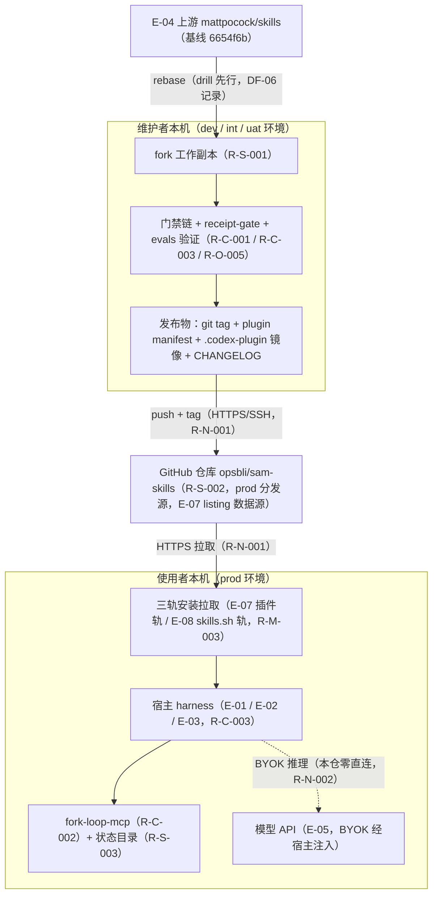
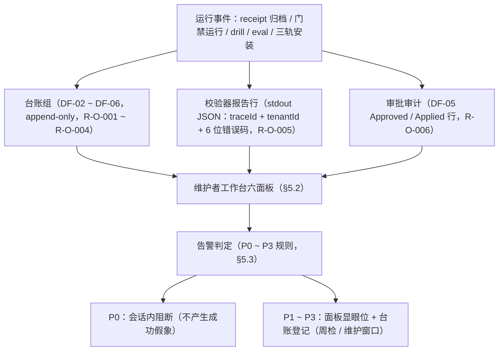

# AICoding 架构设计 · 部署设计

> 本文档为《AICoding 架构设计》核心产物之一，对应**部署设计模版**。
> 上游输入：《系统设计》（G4 已过审，v1.1）——模块拆分（M1~M6）、运行形态（本地 CLI/Skills 仓库）、外部依赖（E-01~E-08）、本地底座（C-01~C-06）、发布链门禁（§3.2.M6）、可观测要求（§8）、容量水位（§5.5）；
> 下游输出：环境与资源清单、分发拓扑、发布链流水线、监控告警、应急回滚等可落地的运维交付物。

> **模版使用约定（按需裁剪）——本轮裁剪声明**：
> 本系统为 sam-skills（发布身份 opsbli/sam-skills）本地 CLI/Skills 仓库：无云部署、无服务器、无 VPC/K8s/云中间件（O1 永久边界，运行时决策已确认并跳过云现状核对）。「部署」的真实形态 = **三轨分发**：Claude 插件 marketplace 轨 / Codex 插件轨 / skills.sh 可编辑拷贝轨，每 harness 单轨不双装（D77）。模板中的云部署章节按《系统设计》已验证的「**章节位保留 + 未启用声明 + 本地等价物映射**」模式处理（参照《系统设计》§6 网络架构的未启用声明写法），不虚构任何云资源：
> - **§2.2 云资源清单**：六类资源（计算/存储/网络/中间件/安全/可观测）全部以本地等价物填写，无对应物的资源在表内以「未启用声明」行登记，无整表留空；
> - **§3 部署拓扑**：物理拓扑 = 单机单仓分发拓扑；Region/AZ/负载均衡/弹性伸缩/容灾机房对象以未启用声明保留章节位，并给出本地等价物；
> - **§4.2 CI/CD 8 阶段**：映射为维护者本机发布链（不引入云 CI，O5 冻结：评测 CI 化属完整版评估项）；
> - **§5 / §6**：监控告警与应急回滚全部落在台账组 + git + 门禁链的本地载体上；
> - **§8 成本**：云资源直接成本为零，成本主体为平台服务（零元）与维护人力工时（给出具体数字）。
> 全文章节位与模板一级、二级编号一一对应，无编号顺延、无悬空引用；凡引用《系统设计》数值（token 预算、水位阈值、错误码、告警规则）均原样继承，不改动。

---

## 0. 元信息：修订记录

| 文档版本 | 发布日期 | 修订人 | 修订说明 |
| --- | --- | --- | --- |
| v1.0 | 2026-09-11 | platform-architect（平台架构师 毕落地） | 文档初始版本：三章骨架（环境矩阵四环境本地映射、六大资源清单本地等价物、单机单仓分发拓扑 + 流量三表）、发布链八阶段映射、告警 P0~P3（AL-01~AL-07）、水位四级、成本月度年度分项；安全权威项（密钥分级/审计保留期/安全资源）按重叠区权威方分配表标注待 security-architect 对齐 |
| v1.1 | 2026-09-11 | platform-architect（平台架构师 毕落地） | Phase 5.3 策略对齐定稿：按 security-architect《安全设计》v1.0 权威口径（经主理人中转）回填 §2.2.4 R-M-004 密钥分级与轮转、§2.2.6 R-Sec-004 WAF 等价职能确认、§7.1.1/§7.1.5/§7.1.6 自检结论列、§7.2 凭证分级列与轮转策略列、§7.3 审计保留期（新增 TD3 done 条目 30 天归档行）；新增 §3.2.4 信任域与链路编号映射（TD1~TD7 ↔ R-*、B-x/F-xx ↔ 部署链路）与附录 E 末段对账表（部署侧来源 6 项，项 4/项 6 关闭）；§2.2.5 表尾注、§4.4 L4 行、§7 权威方声明、附录 A 补记、附录 D 交接要点同步更新 |

**填写要求**：每次评审通过新增一行；修订说明必须能定位到具体章节。

**已冻结口径继承声明**（全篇遵守，源自《系统设计》G4 审核与运行时决策）：
- 业务边界：本地 CLI/Skills 仓库，无云部署（O1 永久边界）；跳过云现状核对（运行时决策），本文无 CloudQ 查询项，无「待人工确认」的云资源事实项。
- 容量与水位：容量红线以 token 预算（L2 正文 ≤5k token/技能、规划线程 smart zone 约 150k token）与仓库水位（健康低于 50MB、预警 50~100MB、危险为台账超 500KB 或 skills 超 40 个）为准，非机器规格（系统设计 §5.5 数值原样继承）。
- 技术栈：Node 18+ ESM、零第三方依赖（D14/D68/D69）；npm + changesets 版本双写；fork-loop-mcp 为本仓自研 MCP stdio 服务（ADR 0005，exactly-once、单活跃执行锁原子 mkdir、超过 6h 陈旧锁可破）。
- 密钥与遥测：本仓不持有任何 API key（BYOK 经宿主注入）、无遥测外发（N4）、台账 repo 内 append-only；密钥管理与日志管道的权威决策在 security-architect（重叠区权威方分配表），本文按其决策落实配置面。
- 发布链门禁：以《系统设计》§3.2.M6（发布链）与错误码注册表（§3.5.1）为基线；sync:local/link-skills 为 dev-only 非受支持安装器（D68），公开故事走三轨。
- 事实口径：receipt v2 为当前契约（X1）；evals 当前 0 runs，不得作质量证据（X4）；术语遵循 CONTEXT.md（Issue tracker / Issue / Triage role / Decision ticket / Draft proposal，backlog 禁用）。

---

## 1. 引言

### 1.1 适用范围与部署形态

**适用范围**：本文档覆盖 sam-skills（opsbli/sam-skills）全部交付物在真实运行环境中的落地面——32 个 promoted skills（engineering 25 + productivity 7）、13 项维护脚本（顶层 9 个 + fork-loop-mcp 子目录 4 项）、repo 内工件协议（台账组 DF-02~DF-06、执行锁与信箱状态 DF-07），以及三轨分发链路的安装、发布、验证与应急。

**部署形态**：本系统**不部署**——无集群、无服务端、无常驻进程（fork-loop-mcp 为 MCP stdio 按需启动的短生命周期进程）。真实形态为：

| 维度 | 取值 |
| --- | --- |
| 运行位置 | 使用者与维护者本机（无任何云端运行单元） |
| 分发形态 | 三轨分发：Claude 插件 marketplace 轨（opsbli 自建 listing，D73）/ Codex 插件轨（.codex-plugin 扁平镜像）/ skills.sh 可编辑拷贝轨（npx skills add） |
| 分发模型 | pull 模型：本仓不提供网络端点，安装面由使用者经平台侧拉取（GitHub HTTPS） |
| 轨道约束 | 每 harness 单轨互斥：插件 = 只读托管束、skills.sh = 可编辑拷贝，双装即同技能双载（D77） |
| 未启用域 | 云计算资源、网络拓扑（VPC/Region/AZ/负载均衡）、容器编排、云中间件、云可观测设施、云安全设施——全部以未启用声明保留章节位并给出本地等价物 |

**本地等价物映射总表**（模板概念 → 本系统对应物，全文口径）：

| 模板概念 | 本系统本地等价物 | 依据 |
| --- | --- | --- |
| 集群 / 节点 | 本机单仓（单活跃执行线程/checkout） | 系统设计 §3.5.3 |
| Pod / 实例 | 单个技能文件或脚本 | 系统设计 §5.4.3 |
| Node 宿主机 | 宿主 harness 会话（Claude Code / Codex / ZCode） | E-01~E-03 |
| 多 AZ 冗余 | 多 harness 互备 + 手动 runbook 兜底（100% 可达） | 系统设计 §5.2/§5.3 |
| 多 Region 灾备 | GitHub 远端主副本（push 即异地副本） | 系统设计 §4.3.1 |
| 负载均衡 | 三轨多渠道分流（按 harness 自然分流） | D5/D73/D77 |
| CI/CD 流水线 | 维护者本机发布链（门禁链 + changeset 双写 + tag） | 系统设计 §3.2.M6 |
| 配置中心 | docs/agents/ 配置文档 + 环境变量（L1~L4 映射见 §4.4） | 系统设计 §5.1 |
| 监控告警设施 | 台账组 + 校验器报告行 + 维护者工作台面板 | 系统设计 §8 |
| KMS / Vault | 无（零密钥边界：本仓不持有任何 key，BYOK 经宿主） | 系统设计 §7.2.3 |

### 1.2 名词与缩写

| 名词 | 含义 |
| --- | --- |
| 三轨分发 | Claude 插件 marketplace 轨、Codex 插件轨、skills.sh 可编辑拷贝轨三条公开安装路径（D77 install-block 单源话术） |
| 单轨互斥 | 每 harness 只选一路安装；插件轨与可编辑拷贝轨双装导致同技能双载 |
| 门禁链 | check-router + lint-skills（含 --diff-audit）+ sync-plugin-version --check + build-codex-plugin --check 的机器校验链，一败即阻合 |
| receipt v2 | spec-executor-receipt/v2 执行回执契约（Schema 首字段锁定，X1）；六道归档门为其验收门禁 |
| receipt-gate | MVP 新增的六道门脚本化校验器（N1，Node 18+ ESM 零依赖） |
| fork-loop-mcp | 本仓自研 MCP stdio 传输服务（五工具：spawn_execution/check_mailbox/ack_receipt/fail_receipt/release_execution），ZCode 自动闭环通道（ADR 0005） |
| 信箱三态 | pending → delivered → done 的投递状态机；exactly-once（投后即置 delivered） |
| 执行锁 | 单活跃执行守卫，原子 mkdir 获取；锁龄超过 6h 为陈旧锁，仅可人工按 Runbook 破 |
| drill | sync-drill.sh 无副作用试 rebase，三指标（冲突文件数/冲突块数/预计评审分钟）入 DF-06；冲突文件数超过 20 停止同步重评 overlay |
| overlay | fork 继承模型：上游为底、fork 只增量表达差异；继承技能表达层改动 ≤40 行/技能（D8） |
| express lane | 轻任务直通路径（三条件），收尾三行 mini receipt；不满足回退全管线（错误码 202001） |
| 双 remote | upstream = mattpocock/skills，origin = opsbli/sam-skills（D8） |
| 版本双写 | package.json 与 .claude-plugin/plugin.json 版本一致，sync-plugin-version 守卫 |
| evals / 黄金任务 | 8 个黄金任务（4 技能 × 2）的评测协议（D14）；repeat-test：同一任务连续两次失败 = confirmed-defect |
| append-only | 台账单向追加、不修剪不回写（D10/D30）；回写即 P0 告警（AL-02） |
| BYOK | Bring Your Own Key：模型 API key 由使用者自配、宿主注入，本仓零接触 |
| dev-only 安装器 | sync:local（维护者本地安装）与 link-skills（symlink），非受支持公开安装途径（D68） |
| 错误码 | 6 位数字（1 位类别 + 2 位模块 + 3 位序号），注册表见《系统设计》§3.5.1 |

---

## 2. 环境与资源清单

### 2.1 环境矩阵

本地形态下无云集群可划分，「环境」= 使用链路与验证链路在单机上的职能分层。模板四环境（dev/int/uat/prod）按本地等价物映射如下（隔离策略逐行标注）：

| 环境 | 本地等价形态 | 用途 | 隔离策略 | 数据 | 网络访问 |
| --- | --- | --- | --- | --- | --- |
| dev | 维护者本机 fork 工作副本（R-S-001） | 开发自测：技能编写、脚本调试、doc 修订 | 独立工作副本 + 双 remote（upstream/origin）；dev-only symlink 经 link-skills.sh 挂 ~/.claude/skills（非受支持安装器，仅维护者） | 真实仓库 + .scratch 模拟工单 | 本机 + git 协议（push/pull 经凭据） |
| int | 维护者本机门禁验证面（同一工作副本内执行） | 联调与机器校验：门禁链全跑、mailbox-cycle 测试、--check 防漂移 | 与 dev 同副本隔离：门禁只读不改工件；drill 在丢弃式分支执行（可安全重跑） | 真实仓库（只读校验） | 本机（无外部调用；drill 需 fetch 上游） |
| uat | 黄金任务验证面（evals 首跑与回归） | 预发验收：N2 出口标准 8/8 任务各 ≥1 run；三轨安装话术核验 | 每次运行独立新会话（E-01）；results/ 一运行一档；SCOREBOARD 按任务行回填 | 仿生产任务档案（tasks/ 八任务） | 本机（会话经宿主 BYOK 推理） |
| prod | 三轨分发面 + 使用者环境 | 正式分发与使用：marketplace/Codex 插件/skills.sh 拉取安装 | 每 harness 单轨互斥（D77）；插件轨只读托管束、skills.sh 轨可编辑拷贝；版本经 tag pin | 真实使用者环境（业务仓库数据本仓不存储） | 公网拉取（HTTPS/443，平台侧 TLS） |

> 环境推进关系：dev（变更）→ int（门禁链全绿）→ uat（evals 回归 + 安装话术核验）→ prod（人工审批 + tag 发布）。四环境物理上同属维护者本机，隔离靠**流程门禁与工件状态**而非网络分区——这是单机单仓形态下隔离策略的正确表达：任何阶段失败都阻断向下一环境推进（发布门禁见 §4.5.4）。

### 2.2 云资源清单

> 本节六类资源全部以本地等价物填写。资源编号沿用模板 R-前缀编号规则；无云资源，「资源 ID」列登记真实载体（文件路径/进程/平台名），不虚构云资源 ID。

#### 2.2.1 计算资源

| 资源编号 | 类型 | 产品 | 资源 ID | 名称 | 规格 | 数量 | 环境 | 复用 / 新建 | HA 方案 | 用途 |
| --- | --- | --- | --- | --- | --- | --- | --- | --- | --- | --- |
| R-C-001 | 脚本运行时 | Node.js 18.x LTS（ESM） | 本机 node 进程 | node 运行时 | 版本 ≥18；零第三方依赖 | 每环境 1 | 全环境 | 新建（使用者自备本机环境） | 无进程级 HA；失败可重试（901001 类可人工重试） | 九个维护脚本 + receipt-gate 校验器 + fork-loop-mcp 服务执行 |
| R-C-002 | 传输服务进程 | fork-loop-mcp（本仓自研，零依赖） | scripts/fork-loop-mcp/server.mjs | MCP stdio 服务 | 单实例/checkout；timeoutMs 15000 | 1 | prod（使用者 ZCode 场景） | 新建（随插件分发，D70 mcpServers） | 工件重建原则（SPEC READY + 锁 + receipt 三工件崩溃可重建，QS-05）；锁龄超过 6h 陈旧锁人工破 | ZCode 自动闭环：信箱投递 + 执行锁 + stdout 捕获 |
| R-C-003 | 宿主 harness 会话 | Claude Code（E-01）/ Codex（E-02）/ ZCode（E-03） | 宿主平台 | 技能加载与执行会话 | 宿主当前版本 | 每使用者各 1 | 全环境 | 复用（使用者既有订阅/安装） | 多 harness 互备：任一家通道失效退手动 runbook（BD-01，5 步，100% 可达） | 技能运行时、subagents、执行会话承载 |

> 未启用声明：无云服务器（CVM/Lighthouse）、无容器编排（TKE/K8s）、无 Serverless（SCF）——本系统无常驻计算单元，O1 冻结。

#### 2.2.2 存储资源

| 资源编号 | 类型 | 产品 | 资源 ID | 名称 | 规格 | 容量 | 环境 | 复用 / 新建 | HA 方案 | 备份策略 |
| --- | --- | --- | --- | --- | --- | --- | --- | --- | --- | --- |
| R-S-001 | 本机仓库工作副本 | Git 工作树 | sam-skills/ 目录 | fork 工作副本 | Node 18+ 环境内；UTF-8 | 低于 50MB（健康水位） | 全环境 | 新建 | git 工作树自愈（checkout 恢复损坏文件） | 每次提交即版本化（git 对象库） |
| R-S-002 | 远端主副本 | GitHub 托管仓库 | opsbli/sam-skills | 远端 origin | 公开仓 + MIT 协议 | 低于 50MB | prod（分发源）/ dev（同步目标） | 新建（已存在） | GitHub 平台侧冗余（无 SLA 承诺，本地工具可接受） | push 即异地副本；release/tag 长期保留 |
| R-S-003 | 运行时状态目录 | 本机文件系统（FORK_LOOP_STATE_DIR 指定） | 状态目录 | 执行锁 + 信箱条目 | 原子 mkdir 语义 | 数 KB | prod | 新建 | 工件重建优于备份（运行时态，QS-05） | 不备份（运行时态）；done 条目留存供追溯 |
| R-S-004 | 台账数据组 | repo 内 markdown 台账 | DF-02~DF-06（SCOREBOARD/metrics/friction-log/sync-drill-log/draft-proposals） | 质量证据链台账 | append-only；UTF-8 | 当前 KB 级（DF-03/DF-04 为空模板、DF-06 仅 1 行），按月 KB 级增长 | 全环境 | 新建 | git 版本化 + GitHub 远端第二事实源 | 永久保留（无物理清理，append-only 纪律） |

> 未启用声明：无云硬盘（CBS）、无对象存储（COS）、无数据库（MySQL/TDSQL）、无缓存（Redis）——数据存储现实形态即 repo 内文件（《系统设计》§4 文件型数据设计）。

#### 2.2.3 网络资源

| 资源编号 | 类型 | 产品 | 资源 ID | 名称 | 规格 | 环境 | 复用 / 新建 | 用途 |
| --- | --- | --- | --- | --- | --- | --- | --- | --- |
| R-N-001 | 代码分发通道 | git 智能协议 over HTTPS（443）/ SSH（22） | GitHub 仓库端点 | 安装拉取与 push/pull 通道 | 消费者本机带宽 | 全环境 | 复用（使用者既有 git 凭据） | 三轨安装拉取（IN-01~IN-03）、维护者 push/tag、上游 fetch |
| R-N-002 | 模型推理通道 | 宿主 harness 自有网络面 | E-01/E-02/E-03 宿主出口 | BYOK 推理链路 | 宿主侧承载 | prod | 复用（使用者自配 provider 与 key） | 推理请求（本仓零直连，E-05 为虚线依赖） |

> **未启用声明**（章节位保留；判据引《系统设计》§6，三条全部成立）：无 VPC、无子网、无 CIDR 规划、无负载均衡、无 CDN、无公网 IP/安全组/网络 ACL——本系统不存在服务间网络通信（全部交互为本地进程/文件与 git 协议）、不存在南北向流量（无公网入口，安装经平台侧拉取）、不存在东西向流量（单机单仓单活跃执行线程）。宿主 harness 与模型 API 之间的网络路径由宿主自行承担。

#### 2.2.4 中间件与平台服务

| 资源编号 | 类型 | 产品 | 资源 ID | 名称 | 规格 | 环境 | 复用 / 新建 | HA 方案 | 用途 |
| --- | --- | --- | --- | --- | --- | --- | --- | --- | --- |
| R-M-001 | 版本控制 | Git 2.x | 本机 git + GitHub | overlay rebase 底座 | 2.x | 全环境 | 新建（使用者自备） | git 对象哈希 + 远端第二事实源 | 上游同步、固定点 diff、台账不可篡改底座 |
| R-M-002 | 包与版本管理 | npm ≥9 + changesets 2.x | package.json scripts | 版本双写链 | 零运行时依赖（npm 仅作脚本编排与发布工具链） | dev/int | 新建 | 版本双写 --check 门禁收敛 | changeset 聚合、version 双写、发布脚本入口 |
| R-M-003 | 插件分发面 | Claude 插件 marketplace（E-07，opsbli 自建 listing）+ Codex 插件机制 + skills.sh（E-08） | .claude-plugin/marketplace.json + .codex-plugin/ 镜像 | 三轨安装入口 | 整集/单技能两式（skills.sh） | prod | 新建 | 三轨互为安装面冗余（单轨故障切另一轨 + 手动 clone） | 三轨分发安装（详见 §3.2.1） |
| R-M-004 | 密钥管理设施 | 无 KMS/Vault——**未启用声明**：本仓零持有任何密钥（N4 冻结）；本地等价物 = 使用者环境变量 + 宿主 BYOK 注入 + tracker CLI 登录态 | — | — | — | — | — | — | 密钥分级与轮转已按 security-architect 权威口径回填（安全设计 §6.2/§6.5，经主理人中转，Phase 5.3）：CRED-01/02 为 L4、CRED-03 为 L4（云 AKSK 本地等价类）、CRED-04 零持有；轮转 = 事件驱动为原则，CRED-03 PAT 过期不超过 90 天；明细见 §7.2 凭证清单 |

> 未启用声明：无消息队列（CKafka/TDMQ）——异步投递等价物 = 信箱三态；无缓存——互斥等价物 = 执行锁原子 mkdir；无搜索引擎、无 API 网关、无任务调度平台（D14 零依赖边界）。

#### 2.2.5 可观测资源

| 资源编号 | 类型 | 产品 | 资源 ID | 名称 | 规格 | 环境 | 复用 / 新建 | 承载可观测维度 |
| --- | --- | --- | --- | --- | --- | --- | --- | --- |
| R-O-001 | 遥测台账 | repo 内 markdown（DF-03） | docs/metrics.md | receipt 遥测台账 | append-only，一 receipt 一行 | 全环境 | 新建 | 业务指标：验收行流（结果/偏差/质量标签） |
| R-O-002 | 摩擦日志 | repo 内 markdown（DF-04） | docs/skill-friction-log.md | 技能卡点日志 | append-only，按日追加 | 全环境 | 新建 | 业务指标：卡点按技能聚合、重复摩擦模式 |
| R-O-003 | 评测记分板 | repo 内 markdown（DF-02） | docs/evals/SCOREBOARD.md | 黄金任务记分 | 8 行任务固定；runs 累计 | uat/prod | 新建 | 业务指标：runs/pass rate/主导失败模式（当前 0 runs，X4） |
| R-O-004 | 同步演练台账 | repo 内 markdown（DF-06） | docs/sync-drill-log.md | drill 三指标记录 | append-only | dev/int | 新建 | 业务指标：同步成本趋势 |
| R-O-005 | 校验器报告行 | stdout JSON（统一报告信封） | receipt-gate/门禁链输出 | 机器日志行 | 含 traceId + tenantId（tenantId 固定 sam-skills）+ 6 位错误码 | 全环境 | 新建（MVP：receipt-gate 新增） | 应用指标：门禁拦截数、各错误码计数 |
| R-O-006 | 审批审计记录 | repo 内提案文件（DF-05） | docs/evals/draft-proposals/ | 提案审批队列 | 一缺陷一文件；Approved/Applied 行 | 全环境 | 新建 | 审计：修订审批链（谁/何时/对什么/结果） |

> 日志管道与收集载体由 platform-architect 决策（上表：repo 内 append-only 文件即日志管道，无外部日志服务——N4 无遥测外发冻结）；**审计字段与合规保留期的权威决策在 security-architect，已按其《安全设计》§7.2 口径回填（Phase 5.3）**：业务操作台账 / 修订审批 / git 提交历史永久保留，TD3 状态域 done 条目 30 天归档，会话输出宿主侧管理（本仓不启用）——明细见 §7.3。
> 未启用声明：无 Prometheus/Grafana/CLS/APM 等外部可观测设施（零依赖 + 无遥测外发，N4/O5 冻结）——可观测的全部载体是 repo 内文件与脚本输出。

#### 2.2.6 安全资源

| 资源编号 | 类型 | 产品 | 资源 ID | 名称 | 规格 | 环境 | 复用 / 新建 | HA 方案 | 用途 |
| --- | --- | --- | --- | --- | --- | --- | --- | --- | --- |
| R-Sec-001 | 危险命令拦截 | git-guardrails-claude-code（misc 桶，D62） | scripts/block-dangerous-git.sh | PreToolUse hook | 可选安装（项目级或全局 settings） | prod（使用者可选） | 新建（可选组件） | hook 常驻（安装即生效） | 拦截 git push --force / reset --hard / clean -f / branch -D / checkout . 等 |
| R-Sec-002 | 供应链防线 | 零第三方依赖边界 | npm 依赖树 = 0 | 攻击面收敛 | 全部脚本与传输服务零运行时依赖（D14/D68/D69） | 全环境 | 新建（架构级机制） | 不适用（机制本身即防线） | 本系统最重要的攻击面收敛手段（系统设计 §7.1） |
| R-Sec-003 | 秘密脱敏纪律 | redact 纪律（D25/D39） | receipt Redaction note + diagnosing-bugs 先脱密 | 脱敏执行面 | secret 先脱密再产出 | 全环境 | 新建 | 会话纪律（写入路径白名单兜底） | 禁止任何 key/凭据进入台账/receipt/日志/提交 |
| R-Sec-004 | WAF / DDoS 防护 / 主机安全 / 安全组 | **未启用声明**：无 Web 应用、无公网入口、无自有网络边界（本地形态，O1 冻结；本机防护由使用者 OS 承担） | — | — | — | — | — | — | WAF 不适用结论已经 security-architect 正式确认（安全设计 §1.1/§5.2，Phase 5.3）：等价职能 = 出站面白名单（安全设计 §5.2 六项清单默认拒绝）+ 零依赖供应链边界（R-Sec-002）+ 安装话术单源（D77）；git-guardrails（R-Sec-001）定位为纵深防线之一，非 WAF 等价物（安全设计 §5.3） |

> 安全资源清单构成已经 security-architect《安全设计》v1.0 对齐确认（Phase 5.3）：四项登记机制（R-Sec-001~004）与其 §1.1 组件适用性清单、§5.3 主机安全基线一致，无新增安全组件要求。

### 2.3 复用资源清单

| 复用资源 ID | 原业务方 | 余量评估 | 隔离方式 |
| --- | --- | --- | --- |
| E-04（上游基线 6654f6b / v1.2.3） | 上游社区（Matt Pocock，mattpocock/skills） | 同步成本经 drill 量化（最近一次 2026-09-04：冲突文件 0/冲突块 0/预计评审 0 分钟，D11）；下次同步前必跑 drill（覆盖率目标 100%） | overlay 继承 + 40 行表达层预算（超预算须 changeset 提名，401001）+ 双 remote 物理隔离（upstream 只读 fetch、origin 独立推送） |
| R-C-003（三家宿主 harness） | 各宿主厂商（Anthropic / OpenAI / ZCode） | 能力表单点重验（宿主升级后 100% 重验，QS-04）；失效即退手动 runbook | ACL 防腐层单点隔离：Codex 能力名只活在 capability map、ZCode 工具面只活在 fork-loop-mcp（ADR 0003/0005），外部模型不污染技能语义层 |
| R-S-002（GitHub 托管平台） | GitHub | 公开仓免费额度内（低于 50MB 远低于配额）；平台冗余由 GitHub 承担 | 独立仓库隔离（opsbli/sam-skills 与上游仓库、其他业务仓库互不共享数据） |

> 本系统无跨业务复用的云资源（无共享数据库/共享集群/共享中间件）；上表登记的是**外部资产复用**的本地等价形态及其隔离与评估机制。余量评估中 CloudQ 无法获取的信息（宿主厂商侧配额）不适用——均为使用者自有订阅，无共享余量问题。

---

## 3. 部署拓扑与高可用设计

### 3.1 物理拓扑

#### 3.1.1 物理拓扑图

> 本系统无机房/Region/AZ 物理设施；物理拓扑的本地形态 = **分发拓扑**（维护者侧生产链 → GitHub 平台 → 使用者侧消费链）。图示与 §2 资源编号、§3.2 链路编号一一对应；拓扑图采用 mermaid 内嵌（与《系统设计》图表方案一致：图文同文件可机器校验、零依赖，不引入独立 drawio/svg 文件——本地等价物映射下的图表内嵌形态）。

> 读图说明：实线 = 工件/代码流（生产链自左向右、分发链自上而下）；虚线 = 宿主承担的推理链路（本仓零直连）。三轨安装动作明细：Claude 轨 marketplace add opsbli/sam-skills → install sam-skills@opsbli；Codex 轨 plugin add sam-skills@opsbli；skills.sh 轨 npx skills add opsbli/sam-skills（整集或单技能）。每 harness 单轨互斥（D77）。

#### 3.1.2 拓扑要素清单

| 要素 | 取值 |
| --- | --- |
| 跨 Region 部署 / Region 数量 | **不适用（未启用声明）**：本系统无云 Region 对象；远端仅 GitHub 单区域托管，冗余由平台侧承担 |
| 跨 AZ 部署 / AZ 数量 | **不适用（未启用声明）**：单机单仓无可用区概念；冗余等价物 = 多 harness 互备 + GitHub 远端副本 |
| 流量入口路径 | 三轨安装入口（pull 模型）：E-07 插件 listing 拉取 / E-08 skills.sh 拉取 / git clone；本仓不提供任何网络端点（无监听端口） |
| 内部调用路径 | 技能间散文调用（/skill 指针）；跨进程 MCP stdio（fork-loop-mcp 五工具）；脚本间 npm scripts 串联；跨上下文结构化工件传递（SPEC READY / receipt / goal） |
| 数据库访问路径 | **不适用（未启用声明）**：无数据库引擎；数据访问 = 技能/脚本直读本机工件文件（文件系统原子语义；append-only 台账写入路径唯一化） |
| 版本一致性路径 | package.json → sync-plugin-version → plugin.json 双写（--check 门禁）；发布物经 tag 溯源 |

### 3.2 流量与网络链路（连通视图）

> 本节为模板「流量与网络链路」的本地形态：本系统无自有网络面，链路=经平台侧的拉取/推送通道 + 本机进程通道。三表按**入口（外部进入）/ 内部互联 / 跨网络互联（出口与跨网）**组织。

#### 3.2.1 流量入口链路

| 链路编号 | 组件 (R-xx) | 协议 - 端口 | TLS 终结 | 作用 |
| --- | --- | --- | --- | --- |
| IN-01 | Claude 插件 marketplace 轨（E-07 → R-S-002） | HTTPS/443（git 智能协议） | 平台侧（GitHub / Anthropic 生态） | 插件 listing 安装：marketplace add opsbli/sam-skills → install sam-skills@opsbli（只读托管束） |
| IN-02 | Codex 插件轨（R-M-003 → R-S-002） | HTTPS/443（git 智能协议） | 平台侧（GitHub） | plugin add sam-skills@opsbli（消费 .codex-plugin 扁平镜像） |
| IN-03 | skills.sh 轨（E-08 → R-S-002） | HTTPS/443（git 智能协议） | 平台侧（GitHub） | npx skills add opsbli/sam-skills（整集或单技能，可编辑拷贝） |
| IN-04 | git clone / pull（贡献者与维护者） | HTTPS/443 或 SSH/22 | 平台侧（GitHub） | 仓库同步与协作（贡献变更走门禁链） |

> 入口侧说明：全部入口均为 **pull 模型**——本仓不运行任何服务、不监听任何端口，TLS 由平台侧终结；无 WAF/DDoS/安全组对象（未启用声明见 §2.2.6 R-Sec-004；公网暴露面评估见 §7.1.3：零暴露）。

#### 3.2.2 内部互联链路

| 项 | 说明 |
| --- | --- |
| 服务发现 | **不适用**（无服务发现设施）；本地等价物 = .claude-plugin/plugin.json skills 数组（32 技能权威清单，D70）+ ask-matt 路由文本，check-router 三查守卫（路由器从不点名未登记技能，一败即阻合） |
| 服务间协议 | 会话内：散文调用（/skill 散文指针，D77 invocation.md）；跨进程：MCP stdio（fork-loop-mcp）+ stdout 捕获；脚本间：npm scripts 串联 |
| mTLS | **不启用**（理由：无网络传输面——进程 stdio 与本机文件读写不经过网络栈；跨机链路仅 git 协议，其传输安全由平台侧 TLS/SSH 承担，见 IN 表） |
| 数据库连接 | **不适用**（无数据库）；本地等价物 = 技能/脚本直读工件文件（本机文件系统；台账写入路径唯一化，append-only） |
| 缓存连接 | **不适用**（无缓存组件）；互斥语义等价物 = 执行锁原子 mkdir（DF-07：第二个获取者收 201002） |
| MQ 连接 | **不适用**（无消息队列）；异步投递等价物 = 信箱三态 pending → delivered → done（exactly-once：投后即置 delivered，重复投递被状态机拒绝，D69） |
| 跨上下文契约 | SPEC READY 启动块（规划→执行）与 receipt v2（执行→归档）工件传递；跨宿主经 SPEC READY 文本整体传递（继承保持契约级，D76） |

#### 3.2.3 跨网络互联

| 互联类型 | 通道 | 带宽 | 加密 | 用途 |
| --- | --- | --- | --- | --- |
| push/pull（origin 远端） | git over HTTPS/443 或 SSH/22（R-N-001） | 消费者本机带宽 | TLS（HTTPS）或 SSH 加密 | 发布（tag + push）、克隆与同步 |
| 上游 rebase（E-04） | git over HTTPS（fetch upstream） | 同上 | TLS | 上游同步（drill 先行，playbook a/b/c 兜底，D8/D12） |
| 模型推理（E-05） | 宿主 harness 自有通道（R-N-002） | 宿主侧承载 | 宿主承担 | 本仓零直连、零密钥（BYOK 经宿主注入；本仓不出现在该链路上） |
| 遥测外发 | **无（N4 冻结）** | — | — | 台账全部 repo 内自持，不向任何外部系统推送；handoff/prototype 等写 OS 临时目录时执行脱敏（D50） |

#### 3.2.4 与《安全设计》信任域与链路编号映射（Phase 5.3 对齐）

> 本节为与 security-architect《安全设计》v1.0 §5.1 信任域清单、§1.2.1 信任边界清单的显式映射（G5 交叉一致性 diff 依据）：本部署设计 §2 资源编号与 §3.2 链路编号同其信任域编号（TD1~TD7）、信任边界编号（B-1~B-7）、域间数据流编号（F-01~F-07）一一对应，无命名漂移。

**TD1~TD7 ↔ 部署侧资源编号映射**：

| 信任域（安全设计 §5.1） | 信任级别 | 部署侧对应资源（R-*） | 对应关系说明 |
| --- | --- | --- | --- |
| TD1 使用者会话域 | 受信执行面 | R-C-003（宿主 harness 会话） | 宿主 harness 进程边界即域边界（Claude Code / Codex / ZCode） |
| TD2 仓库工件域 | 受信事实源 | R-S-001（fork 工作副本）+ R-S-004（台账数据组） | 仓库工作树目录边界；git 对象哈希保护 |
| TD3 运行时状态域 | 半受信运行时态 | R-S-003（运行时状态目录） | FORK_LOOP_STATE_DIR 目录边界；可重建（QS-05） |
| TD4 使用者业务域 | 低受信输入面 | 无本仓资源（只读消费面） | 本仓对业务仓库只读、不控制、不持有（O1/N4 边界） |
| TD5 临时产物域 | 低受信短存 | 无本仓资源（OS 临时目录） | 会话期短存、丢弃式；脱敏纪律（D50）对冲残留风险 |
| TD6 远端发布门 | 发布面（单向写） | R-S-002（远端主副本）+ R-N-001（代码分发通道） | GitHub 仓库 opsbli/sam-skills；门禁链守护 push |
| TD7 外部平台域 | 非受信外部 | R-N-002（模型推理通道）+ R-M-003（插件分发面） | 宿主 / 平台 API 边界（E-01~E-08）；本仓零直连零持有 |

**B-x / F-xx ↔ 部署侧链路编号映射**：

| 信任边界 / 数据流（安全设计 §1.2.1 / §5.1） | 跨越域 | 部署侧链路落点（§3.2） | 链路性质 |
| --- | --- | --- | --- |
| B-5 / F-05（三轨安装） | TD6 → 使用者本机 | §3.2.1 入口链路 IN-01 / IN-02 / IN-03 | pull 模型安装（平台侧 TLS 终结） |
| B-2 / F-04（发布 push） | TD2 → TD6 | §3.2.3 跨网络互联「push/pull（origin 远端）」行（R-N-001）；反向读取对应 IN-04 | git over HTTPS/443 或 SSH/22；门禁链一败即阻合 |
| B-4 / F-06（BYOK 推理） | TD7 → TD1 | §3.2.3 跨网络互联「模型推理（E-05）」行（R-N-002） | 宿主承担；本仓零直连零持有（虚线依赖） |
| B-3 / F-02（执行锁与信箱） | TD1 → TD3 | §3.2.2 内部互联「服务间协议」行（MCP stdio 五工具白名单） | 本机进程通道；无网络面 |
| B-6 / F-03（台账追加） | TD1 → TD2 | §3.2.2 内部互联「数据库连接」行等价物（工件文件直读与写入路径唯一化） | 本机文件系统；append-only |
| B-1 / F-01（业务仓只读消费） | TD4 → TD1 | 本机文件只读（无独立链路编号——无网络传输面） | 会话内只读；redact 纪律对冲 |
| B-7 / F-07（脱敏短存） | TD1 → TD5 | §3.2.3 跨网络互联「遥测外发」行附注（OS 临时目录短存 + 脱敏 D50） | 本机临时目录；丢弃式 |

> 说明：B-1 / B-6 / B-7 三条边界为纯本机文件与进程交互，不占用网络链路编号（IN-xx 与跨网络互联行）——其部署侧落点在本机文件系统与进程通道行，与安全设计「监听面清零、无网络面」结论互证。

### 3.3 高可用与故障容错

#### 3.3.1 故障域划分

模板四层故障域（单 Pod/单 Node/单 AZ/单 Region）按本地形态映射如下（影响范围、容错机制与预期 RTO 逐层给出）：

| 故障域 | 影响范围 | 容错机制 | 预期 RTO |
| --- | --- | --- | --- |
| 层 1：单工件损坏（≈单 Pod） | 该技能文件或台账条目不可用 | git checkout 恢复（工作树自愈）；技能语义缺陷经 harvest → draft proposal → 人工批准修复 | 分钟级（git 还原） |
| 层 2：单传输通道失效（≈单 Node） | 该通道自动闭环不可用（如宿主升级致能力缺失） | refuse-not-degrade：refuse 自动通道，切手动 runbook 5 步（BD-01，错误码 201001）；能力表单点重验后修复（QS-04） | ≤ 5 步手动切换（V5 目标） |
| 层 3：单宿主环境失效（≈单 AZ） | 该 harness 上的全部会话不可用 | 多 harness 互备（三家通道按序检测）+ 手动 runbook 永远可用（「不可用」界定：通道失效 ≠ 系统不可用，系统设计 §5.3） | 当次工作会话内 |
| 层 4：本机环境丢失（≈单 Region） | 全部本地态（工作副本 + 本机配置） | GitHub 远端 clone + 环境重装（Node 18 / Git 2.x / 宿主插件重装，恢复 ≤6 步，系统设计 §4.3.2） | RTO ≤ 30 分钟 |

**可用性来源拆分**（模板要求的责任面拆分）：

| 可用性来源 | 范围 | 责任方 |
| --- | --- | --- |
| 平台兜底 | GitHub 托管冗余（R-S-002）；宿主 harness 平台可用性 | GitHub / 各宿主厂商（无 SLA 承诺，本地工具可接受） |
| 本系统自身保障 | 工件可重建（SPEC READY + 锁 + receipt 三工件，QS-05）；refuse-not-degrade；超过 6h 陈旧锁可破 | 仓库维护者 |
| 强依赖外部（E-xx）故障策略 | 宿主能力失效 → 通道 refuse 退手动 runbook（BD-01）；tracker 不可用 → .scratch 本地轨兜底；上游不可达 → 暂停同步（drill 可预判） | 仓库维护者 |

> 本地工具**不提供对外可用性 SLA 承诺**（系统设计 §5.3 冻结边界）；RTO 为维护者侧的数据安全承诺而非用户合同承诺。

#### 3.3.2 负载均衡

**不适用（未启用声明）**：本系统无服务实例可负载均衡（单机单仓、pull 模型分发）。本地等价物：

| 等价机制 | 说明 |
| --- | --- |
| 三轨多渠道分流 | 安装面按 harness 自然分流（Claude/Codex/其他），单一渠道故障可切另一轨或直接 git clone 安装 |
| 手动 runbook 兜底路径 | 通道层故障时手动路径 100% 可达（BD-01；系统设计 §5.3「故障恢复目标」行） |
| 单活跃执行串行化 | 无需负载分摊：单 checkout 恒为单活跃执行线程（原子 mkdir 锁，201002） |

#### 3.3.3 健康检查配置

本地形态的健康检查 = **机器校验链**（无探针/心跳端点对象；无 HTTP 健康检查路径——「路径/频率/失败阈值」映射为校验项/触发时机/拦截条件）：

| 检查项 | 触发频率 | 失败阈值与判据 | 失败处置 |
| --- | --- | --- | --- |
| 门禁链：lint-skills（清单/链接/docs 页/invocation 配对） | 每次变更合入前 | 任一项失败即 exit 非零（一败即阻合） | 阻断合入 |
| 门禁链：check-router 三查 | 每次变更合入前 | 三查任一失败即阻合 | 阻断合入 |
| 版本双写：sync-plugin-version --check | 每次发布链执行 | package.json 与 plugin.json 不一致即 exit 1（102001 语义面） | 阻断发布 |
| 生成物防漂移：build-codex-plugin --check | 每次发布链执行 | 镜像与源不一致即 exit 1 | 重跑生成命令 |
| 六道门：receipt-gate 逐条校验 | 每次归档验收 | 6 道全过才放行；任一道失败输出对应错误码（101001~101006；前置 101011） | 归档被拒，回执行线程补证（禁止手补 Schema 字段） |
| 信箱周期测试：mailbox-cycle.test.mjs | fork-loop-mcp 变更时 | 投递/exactly-once/锁生命周期全链路须全绿 | 阻断合入 |
| 黄金任务回归（evals） | 技能变更必跑；其余至多每周一次 | 同一任务连续两次失败 = confirmed-defect（repeat-test） | 喂 harvest run 起草提案（AL-03） |

#### 3.3.4 弹性伸缩配置

**不适用（未启用声明）**：无实例副本可伸缩（min/max 副本数概念不成立）。本地等价物 = **资源预算 5 维**（《系统设计》§3.5.3，承担限流职能，数值原样继承）：

| 维度 | 默认值 | 触发动作 |
| --- | --- | --- |
| 全局并发（执行线程） | 单一活跃执行线程/checkout | 第二个执行请求被拒（201002）；超过 6h 陈旧锁人工破 |
| 单任务续跑预算 | Stop 续跑 ≤ 3 次（一 receipt 恰耗 1） | 预算耗尽停止续跑，状态留在工件可重建 |
| 上下文预算（规划线程） | smart zone 约 150k token；L2 正文 ≤5k token/技能 | 接近阈值仅在阶段边界 /compact |
| 评审并发预算 | roundtable 全桌 2N 子代理（quick=N）；席位 3~5 封顶；报告 ≤300/400 词 | 超限按固定护栏收敛输出 |
| 运营频次预算 | eval 至多每周一次（技能变更后必跑）；sync drill 每次同步前一次 | 超频次不自动执行 |

#### 3.3.5 容灾切换配置

| 项 | 取值 |
| --- | --- |
| 单 AZ / 多 AZ / 多 Region 切换 | **不适用（未启用声明）**：无云分区对象可切换 |
| 通道级切换路径 | 三通道按序检测降级树：Codex App Messenger → ZCode fork-loop-mcp → 手动 runbook（BD-01；refuse 不降级模拟） |
| 数据级容灾 | GitHub 远端主副本：已提交数据 RPO = 0（git 提交即持久）；未 push 的本地提交 RPO ≤ 24h（维护节奏：台账变更当日 push）；本机恢复 RTO ≤ 30 分钟（§3.3.1 层 4） |
| 切换演练 | 随每次上游同步 drill 顺带核验（clone 远端到临时目录跑门禁链，零额外成本；负责人：仓库维护者 opsbli） |

---

## 4. 部署流程

### 4.1 代码仓库与分支

| 项 | 规范 / 值 | 说明 |
| --- | --- | --- |
| 代码仓库地址 | origin = https://github.com/opsbli/sam-skills；upstream = mattpocock/skills | 双 remote（D8）：upstream 只读 fetch（rebase 源），origin 独立推送 |
| 分支管理 | overlay 模型：main 为 fork 主线；上游同步与重构在命名分支执行（sync-upstream.sh 强制要求干净 worktree + 命名本地分支，否则报错退出）；drill 在丢弃式分支执行（可安全重跑） | 禁止在 main 直接跑正式 rebase；冲突文件数超过 20 停止同步重评 overlay（开 changeset 决策） |
| 合并规范 | 门禁链全绿才可合入：check-router + lint-skills + 版本双写 --check；一败即阻合 | 冲突按 playbook a/b/c 消化（a 放弃差异跟随上游 / b 保留差异重建补丁 / c 语义分叉晋升 fork 全所有权，D12） |
| 标签规范 | git tag 随 changeset version 产生；版本号取上游衍生预发布形式 1.2.3-to-goal.N（1.2.3 = 同步的上游版本 + 后缀 = 本 fork 分发，D6/D73） | release/tag 长期保留；发布物经 tag 溯源（§4.3） |

### 4.2 流水线（CI / CD）

> **形态声明**：本系统不引入云 CI（O5 冻结：评测 CI 化属完整版评估项，D14 零依赖边界——工具依赖引入在 evals 首跑完成前禁止）。流水线的本地形态 = **维护者本机发布链**，八阶段全部由人工触发、脚本承载、门禁拦截；门禁链同时以 pre-commit 语境覆盖贡献者本机。八阶段与《系统设计》§3.2.M6 接口清单一一对应：

| 阶段 | 触发条件 | 关键动作 | 失败处理 |
| --- | --- | --- | --- |
| 1. 构建 | 手动触发（变更合入后） | git fetch/pull origin main → 干净 worktree 校验（sync-upstream/sync-drill 同样强制） | 阻断后续阶段（worktree 不干净先处置） |
| 2. 代码扫描 | 构建通过后 | lint-skills：promoted 清单/README 链接/docs 页/invocation 配对机器校验；--diff-audit 审计继承技能 40 行预算 | 不达标阻断（超预算且无 changeset 提名 → 401001，现 warn 过渡期，两版后转硬门） |
| 3. 安全扫描 | 构建通过后 | 零依赖边界核查（npm 依赖树 = 0）+ 秘密审计（redact 纪律：project-standards audit 发现秘密按 file+line 报告转安全工单，不引值） | 高危阻断（秘密入仓即阻断并转安全工单） |
| 4. 集成测试 | 扫描通过后 | check-router 三查 + mailbox-cycle.test.mjs + receipt-gate --check 防漂移巡检 | 阻断后续阶段（一败即阻合） |
| 5. 制品打包构建 | 集成测试通过 | changeset 聚合 → npm run version（changeset version + sync-plugin-version 双写）→ build-codex-plugin.mjs 生成 .codex-plugin 镜像 | 失败修复后重跑（双写 --check 不一致 exit 1 收敛） |
| 6. 部署集成环境（dev/int） | Package 完成 | npm run sync:local（维护者本机安装验证——dev-only 非公开途径，D68） | 回退上一版本（git revert） |
| 7. 部署测试环境（uat） | 手动触发 | evals 黄金任务回归（技能变更必跑）+ 三轨安装话术核验（install-block.md 单源比对） | 失败回退：修复后重新走阶段 2~6 |
| 8. 部署生产环境（prod） | 人工审批（维护者确认，发布门禁 §4.5.4 全绿为前提） | git tag + push origin → 三轨分发生效（pull 模型：使用者侧拉取即获得新版） | 按 §6.1 回滚策略实施 |

> 云 CI 阶段映射说明：模板「部署集成环境/部署测试环境/部署生产环境」三阶段的本地语义 = 同一工作副本内的**验证深度递进**（机器门禁 → 评测回归 → 公开发布），环境隔离靠流程门禁（§2.1）而非部署目标分离——这是 pull 模型分发的正确形态。

### 4.3 构建产物与制品管理

| 配置项 | 配置值 / 规则 | 说明 |
| --- | --- | --- |
| 产物类型 | git tag + .claude-plugin/plugin.json（manifest）+ .codex-plugin/ 扁平镜像 + CHANGELOG.md 聚合条目 | 无容器镜像/Jar/二进制制品（零构建转译：node 原生执行 .mjs） |
| 制品仓库 | GitHub 公开仓（opsbli/sam-skills）= 唯一制品源 | 无镜像仓库（本地形态；三轨均从 GitHub 拉取） |
| 产物命名 | 版本号 = 1.2.3-to-goal.N（上游衍生预发布形式）；tag 与双写版本一致；.codex-plugin 镜像目录由 build-codex-plugin.mjs 从 plugin.json 唯一事实源确定性重建 | 命名漂移由 sync-plugin-version --check 拦截（102001） |
| 制品保留期 | git 历史永久保留；release/tag 长期保留 | 无制品 GC 需求（仓库水位由 §8.1.4 水位线治理） |
| 制品溯源 | 每个制品经 git commit SHA 溯源；CHANGELOG 由 changeset 聚合（动机可查到具体变更集文件）；生成物 --check 防漂移 | 模板「镜像 Label 含 git-commit/build-time/pipeline-id」的本地等价物 = git 提交元数据 + changeset 动机记录 + 发布链阶段日志 |
| 签名与校验 | git 提交哈希链（完整性底座）+ tag；可选 GPG 签名 tag（维护者侧增强项）；传输完整性由 HTTPS/SSH 承担 | **不引入 cosign/Notary**（理由：无镜像制品，引入即新增依赖面，违背零依赖边界 D14）；supply-chain 攻击面收敛以零依赖边界为主防线（R-Sec-002） |

### 4.4 配置管理

> 配置中心选型：**无配置中心服务**（本地形态）；配置管理层级 L1~L4 映射如下（《系统设计》§5.1 已冻结，本表原样承接并补发布视角）：

| 配置层级 | 存放位置 | 适用内容 | 变更生效 | 对开发的约束 |
| --- | --- | --- | --- | --- |
| L1 代码内 | 仓库文件 | 枚举、错误码注册表（16 条，§3.5.1 系统设计）、协议常量、信箱三态 | 随提交（走发布链八阶段） | 禁止写入：使用者环境差异、任何秘密 |
| L2 配置文档 | docs/agents/ 三文件 + CONTEXT.md + project-standards.md | tracker 配置、标签词表、领域文档布局、工程标准 | 重读文件即生效（技能每次消费时读取） | 修改须经 setup 确认或 project-standards 流程（事实靠探索，标准由人确认） |
| L3 环境变量 | 使用者 shell / .zcode/config.json | FORK_LOOP_ZCODE_CMD / FORK_LOOP_STATE_DIR / ZCode provider 配置（model.main 字符串、options.baseURL + apiKey） | 下次进程启动 | 启动失败 fail-fast（headless 无 provider 拒启，D76）；--settings 参数不接线勿用（实测错位，D76） |
| L4 密钥 | 使用者宿主注入（BYOK）/ 环境变量 | 模型 API key（本仓零持有）、tracker CLI 凭据（gh/glab 登录态） | 宿主管理 | 本仓零密钥边界：禁入台账/receipt/日志/提交（§7.2）；分级已按 security-architect 权威口径对齐为 L4（CRED-01/02/03，见 §7.2 与安全设计 §6.2） |

> 动态配置下发：L2 配置文档天然「动态」（技能每次消费时读取最新文件）；无推送式下发通道（无服务端）。

### 4.5 发布策略

#### 4.5.1 发布方式

全系统统一采用**版本化整体发布（changeset 聚合 + 版本双写 + 三轨同版分发）**。无滚动/蓝绿/金丝雀对象——发布单元是仓库版本而非服务实例，不存在流量切分面：

| 模块 | 发布方式 | 说明 |
| --- | --- | --- |
| 全部（M1~M6 技能资产与维护脚本） | 版本化整体发布（三轨同版） | 三轨读取同一 tag；版本一致性由 sync-plugin-version --check 门禁保障；单轨互斥由 install-block.md 话术守卫（D77） |
| 发布物内技能增删改名 | 变更集伴随发布（三重同步） | 三处登记（plugin.json/README/docs 页）+ ask-matt 路由文本同步，check-router 一败即阻合 |

> 发布方式选择依据：pull 模型分发下「灰度流量」不可控也不必要（使用者按需拉取）；上游先例（D73 update：listing 的 sha 钉死，release 到达用户以 pin 移动为准）说明到达节奏由使用者侧 pin 决定——本仓以**发布前验证深度**（§4.5.3）替代发布中灰度。

#### 4.5.2 发布标准流程

- **首次发布标准流程（含资源初始化）**：确认 .claude-plugin/marketplace.json（仓库自建单插件 listing，D73）→ 核验 install-block.md 安装话术与三轨实际行为一致（X2 修订项：Codex 轨 ADR 级补档，N3）→ 走 §4.2 八阶段 → 三轨各执行一次冒烟安装并运行 setup → 记录首版 tag。
- **常规迭代发布流程**：贡献/修订 → changeset 编写（动机记录）→ §4.2 八阶段（阶段 8 人工审批后 tag + push）→ CHANGELOG 聚合 → 发布面板核验（双写一致性 + 三轨话术一致）。
- **资源变更流程**：技能新增/改名/退役 → changeset 指名（退役必须指名替代物，D21）→ 三重同步三处更新 → docs 页建立/搬移（writing-docs.md 规则）→ ask-matt 路由文本同步 → 门禁链全绿后随下一版本发布。

#### 4.5.3 灰度路径与观测窗口

本地形态无流量百分比灰度（pull 模型）；灰度等价物 = **发布前验证批次递进 + 发布后观测窗口**：

| 批次 | 内容 | 观测窗口 | 放量条件 |
| --- | --- | --- | --- |
| 批次 1：维护者自装 | npm run sync:local 后实机使用（dev-only） | 一次完整任务循环 | 门禁链全绿；六道门正常流转 |
| 批次 2：评测回归 | evals 黄金任务 8 项 | 运行完成即时 | 无 confirmed-defect（repeat-test 不命中） |
| 批次 3：三轨公开分发 | tag + push 后全量可达 | 发布后首周（或首次 harvest run 前） | DF-03 无异常摩擦聚集；安装话术无漂移报告 |

> 观测载体 = §5.2 面板（遥测台账/摩擦日志/门禁面板）；发布后首周如出现 confirmed-defect 信号，按 §6.1 回滚评估。

#### 4.5.4 发布门禁

| 门禁项 | 拦截条件 | 检查时机 |
| --- | --- | --- |
| 三重同步一致性 | plugin.json / 顶层 README / docs 页任一漂移 | 阶段 2（lint-skills）+ 阶段 4（check-router） |
| 版本双写一致 | package.json 与 plugin.json 版本不一致 | 阶段 4/5（sync-plugin-version --check） |
| 生成物防漂移 | .codex-plugin 镜像与 plugin.json 源不一致 | 阶段 4（build-codex-plugin --check） |
| 40 行表达层预算 | 继承技能 diff 超预算且无 changeset 提名 | 阶段 2（lint-skills --diff-audit；现 warn 过渡期，两版后转硬门） |
| 六道门脚本化就绪 | receipt-gate --check 防漂移巡检失败 | 阶段 4 |
| 评测回归 | 黄金任务连续两次失败（repeat-test 命中） | 阶段 7 |
| 秘密审计 | 任何 key/凭据/密码出现在台账/receipt/提交 | 阶段 3（高危阻断） |
| 单元测试通过率 / 覆盖率 | **不适用声明**（零依赖边界下测试载体 = mailbox-cycle 原生测试 + 门禁链；无覆盖率工具——引入即违背 D14） | 替代项：阶段 4 集成测试 |
| 镜像漏洞 | **不适用声明**（无容器镜像制品） | 替代项：阶段 3 零依赖边界核查 |
| 接口契约校验 | receipt Schema 首字段非 spec-executor-receipt/v2 即拒收（101011，禁止手补） | 阶段 4 + 每次归档 |
| 性能基线 | **本地等价物**：L2 正文 ≤5k token/技能（SR-1）；上下文预算红线约 150k token | 阶段 2（lint 校验面）+ 运行期（§8.1.4 红线） |
| 人工审批 | 至少维护者 1 名（opsbli）确认 | 阶段 8 生产发布前 |

---

## 5. 监控告警接入

### 5.1 监控架构与数据流

> 本地形态：无 Prometheus/CLS/APM 设施（N4/O5 冻结）；三大支柱映射 = **Metrics = 台账与记分板；Logs = 结构化台账行与校验器报告行；Traces = 工件链关联标识**（receipt 标识贯穿 SPEC READY → 锁 → receipt → 台账行，100% 全采样、错误留痕率 100%——系统设计 §8.3）。数据流图：

> 结构化日志规范（机器行必含字段）：traceId = receipt 标识/工件链关联标识（本地无分布式调用，工件链即调用链）；tenantId = 仓库标识（固定 sam-skills）；level 枚举 block/warn/info 与 P0~P3 联动映射；敏感字段值禁止打印（secret 只记存在事实不记值）——《系统设计》§8.2.2 原样继承。

### 5.2 关键 Dashboard 清单

本地形态的 Dashboard = 维护者工作台面板（六个，≥5 达标；《系统设计》§8.1.2 原样承接）：

| 大盘 | 用户 | 指标 |
| --- | --- | --- |
| SCOREBOARD 记分板（DF-02，R-O-003） | 维护者 / 评审委员会 | 8 黄金任务 runs / pass rate / 主导失败模式（当前 0 runs，X4；每次 eval 后刷新） |
| receipt 遥测台账（DF-03，R-O-001） | 维护者 | 验收行流：结果/偏差/质量标签分布（每 receipt 验收后） |
| 摩擦日志（DF-04，R-O-002） | 维护者 / harvest | 卡点按技能聚合、跨 receipt 重复模式（执行中实时追加；harvest run 时消费） |
| 同步演练面板（DF-06，R-O-004） | 维护者 | drill 三指标趋势、距上次演练间隔（每次同步前演练后） |
| 门禁与错误码面板（R-O-005 输出聚合） | 维护者 / 贡献者 | lint/check-router/校验器运行结果、各 6 位错误码计数、40 行预算 warn 列表（每次门禁链执行后） |
| 分发版本面板（R-M-003/R-M-002 联动） | 维护者 / skills.sh 用户 | package.json 与 plugin.json 双写一致性、CHANGELOG 档位、三轨安装话术一致性（install-block 单源）（每次 version/发布后） |

### 5.3 告警规则清单

P0~P3 分级 + Owner + Runbook（《系统设计》§8.4.2 规则原样继承，编号与 Runbook 索引对齐 §6.2）：

| 编号 | 级别 | 触发条件 | 关联资源 (R-xx) | Owner | Runbook |
| --- | --- | --- | --- | --- | --- |
| AL-01 | P0 | 六道门任一道失败且检测到手补 Schema 字段迹象 | R-O-005 | 仓库维护者（opsbli） | RB-01（docs/maintaining-fork.md 门下纪律：回执行线程补证，禁止手补——D39） |
| AL-02 | P0 | 台账行被回写/删除（git diff 检出非 append 变更） | R-S-004 | 仓库维护者 | RB-01（git revert + 复盘；append-only 纪律，D10/D30） |
| AL-03 | P1 | 同一黄金任务连续两次失败（repeat-test 命中） | R-O-003 | 仓库维护者 | RB-02（docs/evals/PROTOCOL.md → harvest run 起草提案，D14/D30） |
| AL-04 | P1 | 连续 2 个 receipt 验收后 DF-03 无对应行 | R-O-001 | 仓库维护者 | RB-02（补录审计说明 + 核查追加入口唯一性） |
| AL-05 | P2 | build-codex-plugin/sync-plugin-version --check 拦截（102001）或 lint-skills --diff-audit warn（401001） | R-M-002 / R-O-005 | 仓库维护者 | RB-03（重跑生成命令；超预算开 changeset，D8/D68） |
| AL-06 | P2 | 宿主升级后能力表重验失败（Codex 能力缺失 / ZCode 实测行为变化） | R-C-003 | 仓库维护者 | RB-04（ADR 0003/0005：能力表单点更新或退手动 runbook 5 步，D74/D76） |
| AL-07 | P3 | drill 冲突文件数趋势连续两次上升 / 仓库水位进入预警区 | R-S-002 / R-S-004 | 仓库维护者 | RB-05（DF-06 趋势评审 → 提前开 overlay 边界评估 changeset，D8） |

### 5.4 告警通道

本地形态：无电话/短信通道（无服务端可接入通知网关）；通知方式 = 台账登记 + 维护者工作台面板显眼位 + 会话内阻断提示（《系统设计》§8.4.1）：

| 级别 | 响应时间 | 通知方式 | 上升机制 |
| --- | --- | --- | --- |
| P0 | 立即（发现即处置） | 校验器 block 输出 + 会话内阻断（不产生「成功」假象） | 处置前归档流程被硬门阻断（校验器 exit 1）；连续复现 → 暂停归档流程并复盘（RB-01 升级段） |
| P1 | 当次工作会话内 | harvest run 输出 + SCOREBOARD defect signals 区 | 复现确认即转 confirmed-defect 提案流程（RB-02） |
| P2 | 计划内（下次维护窗口） | 门禁 warn 输出 + 分发面板 | 两版未处理自动升级为硬门（40 行预算机制既定行为） |
| P3 | 周检节奏 | 水位面板 + SCOREBOARD 趋势 | 纳入季度同步评审（drill 顺带核验窗口） |

---

## 6. 应急与回滚

### 6.1 回滚机制

#### 6.1.1 回滚触发条件

| 触发类别 | 具体条件 | 对应告警 |
| --- | --- | --- |
| 契约底线破坏 | receipt 被手补绕过六道门 / 台账被回写 | AL-01 / AL-02（P0，立即处置） |
| 证据链异常 | 发布后黄金任务连续两次失败（confirmed-defect）/ 归档后台账缺行 | AL-03 / AL-04（P1） |
| 发布物漂移 | 三轨安装话术与实际行为不一致 / 版本双写不一致被检出 / 生成物漂移 | AL-05（P2） |
| 通道失效 | 宿主升级后能力表重验失败 | AL-06（P2） |
| 同步与水位 | drill 冲突趋势恶化 / 仓库水位进入预警区 | AL-07（P3，预防性评审而非回滚） |

#### 6.1.2 回滚决策人

- 仓库维护者（opsbli）**单人决策**：本地单人维护形态，无 On-call 值班分级；P0 类（契约底线破坏）发现即处置，无需等待审批（审批人 = 决策人 = 维护者本人）。
- 涉及技能语义的回滚（revert 技能修订）在 revert 提交的 changeset 中记录动机；跨预算/行为变更的回滚开 changeset 决策。

#### 6.1.3 回滚执行 SOP

| 对象 | 回滚方式 | 预计耗时 | 有损风险 / 数据丢失 |
| --- | --- | --- | --- |
| 技能/脚本修订 | git revert 对应 commit（哈希链保障可定位；revert 产生新提交，不改写历史） | 分钟级 | 无 |
| 发布版本 | **下一修复版发布**（pull 模型无在线切流对象）；紧急时删除错误 tag 并以公告指明最后可用版本（marketplace listing sha 钉死机制下，使用者侧 pin 决定实际到达版本，D73 update） | 分钟级 | 无数据丢失 |
| 配置（L2 文档） | git revert + 重读即生效（技能每次消费时读取最新文件） | 低于 1 分钟 | 无 |
| 台账错误行 | **禁止回写**（append-only 纪律）：以新行修正说明（引用原行标识）；回写本身即 AL-02 P0 事件 | 即时 | 无（修正行与原行共存，审计链完整） |
| 数据库 DDL | **不适用**（无数据库）。单向变更的本地等价物 = 契约版本纪律：receipt 必填字段增删改名必须 bump 版本（v2 冻结，O4）；不匹配版本被校验器拒收（101011，禁止手补）——「不可回滚变更」由版本前置防护代替事后回滚 | — | — |
| fork-loop-mcp 状态 | 锁与信箱为运行时态：done/fail/release 三工具释放；超过 6h 陈旧锁人工按 Runbook 破（禁止崩溃时静默解锁，D76） | 分钟级 | 无（工件重建原则，QS-05） |

### 6.2 故障应急 Runbook

#### 6.2.1 Runbook 索引

| Runbook 编号 | 关联告警 | 故障场景 | Owner |
| --- | --- | --- | --- |
| RB-01 | AL-01 / AL-02 | 契约底线破坏：receipt 手补 / 台账回写 | 仓库维护者（opsbli） |
| RB-02 | AL-03 / AL-04 | 证据链断流：eval 连续失败 / 归档后台账缺行 | 仓库维护者 |
| RB-03 | AL-05 | 生成物漂移与预算超限（102001 / 401001） | 仓库维护者 |
| RB-04 | AL-06 | 宿主升级后通道失效（201001 / headless 拒启） | 仓库维护者 |
| RB-05 | AL-07 | 水位与同步成本预警 | 仓库维护者 |
| RB-06 | —（主动演练，随 drill 顺带） | 本机环境丢失恢复 | 仓库维护者 |

#### 6.2.2 Runbook 编写规范

每条 Runbook 按以下结构编写：**症状**（可观测特征：面板指标/告警内容/使用者反馈）→ **诊断**（按顺序执行的定位步骤，明确工具与查询路径）→ **缓解**（分场景处置动作，与 §6.1 回滚、降级机制衔接）→ **升级**（缓解未生效的升级条件与对外通告机制）。

#### 6.2.3 RB-01：契约底线破坏（receipt 手补 / 台账回写）

- **症状**：receipt-gate 输出 101011（Schema 不匹配）且 receipt 文件存在人工修改痕迹；或 git diff 检出台账文件非 append 变更（行删除/改写）；维护者工作台门禁面板出现 P0 阻断记录。
- **诊断（按顺序执行）**：
  1. git log -- 〈涉事文件〉 定位最近改写 commit 与作者会话；
  2. 核对六道门输出错误码（101001~101006 / 101011）确定被破坏的门序；
  3. 确认变更来源：维护者手工 / 某次会话产出（检查该会话 receipt Redaction note 与 Worktree report）。
- **缓解**：
  - 场景 A（receipt 被手补）：git restore 恢复原文件 → 回执行线程补证，重新产出合规 receipt（六道门重跑）；禁止以手补方式「修复」Schema 字段。
  - 场景 B（台账回写）：git revert 修正 commit 恢复 append-only 行 → 以新行记录事故说明（引用原行标识），不删除任何既有行。
- **升级**：若 revert 后同类事件再次发生 → 暂停归档流程，复盘写入路径白名单（各台账唯一追加入口，系统设计 §3.4）与 git-guardrails 安装状态；在摩擦日志登记系统性缺口并开 changeset 评估流程加固。

#### 6.2.4 RB-04：宿主升级后通道失效

- **症状**：execute-spec-in-fork 通道检测失败（错误码 201001）；或 ZCode headless 会话拒启 / Stop 钩子不再注入 receipt（信箱停留在 pending）。
- **诊断（按顺序执行）**：
  1. 重跑通道按序检测：Codex 能力表逐项（fork_thread/read_thread/wait_threads/set_thread_archived + 卡片协议）→ ZCode fork-loop-mcp 五工具探活；
  2. 核对 ZCode CLI 版本与 .zcode/config.json：model.main 必须为字符串 provider/model-id、provider 条目必须带 options.baseURL + apiKey（D76 两坑）；确认未使用 --settings 参数（实测错位）；
  3. 检查 MCP server 配置（workspace 级）与 Stop hook（timeoutMs 15000、hooks.enabled: true）；
  4. 用 mailbox-cycle.test.mjs 验证传输层本身是否健康（区分「宿主变更」与「服务自身缺陷」）。
- **缓解**：
  - 场景 A（Codex 能力缺失）：refuse 自动通道，切手动 runbook 5 步（规划线程停在最终 SPEC READY → 开新会话同 workspace → 粘贴启动块 → 跑 /spec-executor → 把 receipt 带回归档）；不降级模拟。
  - 场景 B（ZCode 配置漂移）：修正 config.json（model.main 字符串化 / 补 baseURL+apiKey）后重试。
  - 场景 C（协议破坏性变更）：按 ADR 0003/0005 在能力表单点更新（API 改名改表）；超出表内表达的能力迁移 → 开 changeset 评估适配器改造。
- **升级**：适配器无法短修 → 以 changeset 公告手动 runbook 为临时主路径（对外通告走 docs 页与 install-block 话术不动原则，行为说明进 CHANGELOG）；同时登记摩擦日志。

#### 6.2.5 RB-06：本机环境丢失恢复

- **症状**：本机故障或换机，工作副本/本机配置不可用；维护者工作台全面板失效。
- **诊断（按顺序执行）**：
  1. 确认 GitHub 远端可达（git ls-remote origin）；
  2. 确认最近 push 时间戳，评估 RPO 敞口（未 push 的本地提交 ≤ 24h 风险敞口，系统设计 §4.3.2）。
- **缓解**：执行六步恢复：①git clone origin → ②安装 Node.js 18.x LTS + npm ≥9 + Git 2.x → ③宿主插件重装（三轨之一）→ ④恢复环境变量（FORK_LOOP_ZCODE_CMD / FORK_LOOP_STATE_DIR）→ ⑤重跑门禁链全绿验证 → ⑥补 push 台账待入库变更。目标 RTO ≤ 30 分钟。
- **升级**：远端不可达（GitHub 平台故障）→ 等待平台恢复（属平台兜底责任面，无本地灾备副本为既定接受风险，§3.3.1 可用性来源拆分）；期间归档与发布暂停，无数据写入损失（本地新增态在故障瞬间未提交部分除外——已按 RPO 口径接受）。

---

## 7. 安全合规

> 本章为部署视角的安全合规落地。**权威方声明（重叠区权威方分配表）**：安全组规则、WAF/DDoS 厂商与规则、密钥分级、访问控制、轮转周期、审计字段与合规保留期——权威决策在 security-architect。**Phase 5.3 状态更新**：其《安全设计》v1.0 已定稿并经主理人中转回传，本章原待对齐点已全部按其权威口径回填（§7.1.1/§7.1.5/§7.1.6 结论列、§7.2 分级与轮转、§7.3 保留期），闭环记录见附录 E 末段对账表。

### 7.1 上线前安全自检

| 编号 | 检查项 | 检查内容 / 标准 | 责任人 | 检查时机 | 是否通过 |
| --- | --- | --- | --- | --- | --- |
| 7.1.1 | 《安全设计》清单自检 | 与 security-architect《安全设计》清单逐项对齐（G5 并行产物） | 维护者 + security-architect | 发布前 | 通过（安全设计 v1.0 七章定稿：AL-01~AL-07 逐条安全语义映射、中间件矩阵按 IN-01~04 回填、R-S-001/003 与 R-Sec-001/002 纳入其 §5.3/§5.4；重叠区 6 项对账一致，见附录 E） |
| 7.1.2 | 合规评审 | 本地个人工具无行业合规面；MIT 协议与上游版权保留核查（D7：MIT，Copyright Matt Pocock） | 维护者 | 发布前 | 通过（协议与版权合规） |
| 7.1.3 | 公网暴露面评估 | 本仓零网络端点（无监听端口、无 Web 面、无服务端）；三轨安装均为平台侧 pull；遥测零外发（N4） | 维护者 | 发布前 | 通过（零暴露） |
| 7.1.4 | 安全组开放性检查 | **不适用**（无云安全组对象，未启用声明 §2.2.6 R-Sec-004）；本机网络防护由使用者 OS 承担 | — | — | 不适用（未启用声明） |
| 7.1.5 | 安全组件接入 | WAF/主机安全不适用（无服务器）；git-guardrails 危险命令拦截为可选组件（D62）；供应链防线 = 零依赖边界（R-Sec-002） | 维护者（组件选型）/ 使用者（guardrails 可选安装） | 安装时 | 通过（security-architect 已确认，Phase 5.3：WAF 不适用成立，等价职能 = 出站面白名单 + 零依赖供应链 + 安装话术单源；git-guardrails 属纵深防线而非 WAF 等价物——安全设计 §5.2/§5.3） |
| 7.1.6 | KMS / 凭证管理（明文票据） | 本仓零密钥（N4）：无 KMS/Vault；秘密禁入台账/receipt/日志/提交（redact 纪律）；密钥分级与轮转权威决策在 security-architect | 维护者 + security-architect | 每次提交（redact 纪律）+ 发布前 | 通过（分级口径已对齐，Phase 5.3：CRED-01/02/03 均 L4、CRED-04 零持有；轮转事件驱动 + CRED-03 PAT 不超过 90 天——见 §7.2 与安全设计 §6.2/§6.5） |
| 7.1.7 | 代码漏洞扫描 | SAST/SCA 工具**不引入**（零依赖边界：npm 依赖树 = 0，无第三方代码可扫；引入工具即新增依赖面）；替代 = 门禁链人工机器双校验 + 秘密审计 | 维护者 | 每次发布（阶段 3） | 通过（边界内替代方案） |
| 7.1.8 | 镜像漏洞扫描 | **不适用**（无容器镜像制品，§4.3） | — | — | 不适用 |
| 7.1.9 | 系统上线前扫描 | 发布门禁全绿（§4.5.4）+ 三轨冒烟安装 + install-block 话术核验 | 维护者 | 发布前（阶段 7~8） | 发布门禁承载 |

### 7.2 凭证与密钥清单

| 凭证编号 | 分级 | 类型 | 存储方式 | 所有人 | 用途 | 轮转策略 |
| --- | --- | --- | --- | --- | --- | --- |
| CRED-01 | L4 | 模型 API key | 使用者环境变量 / 宿主 BYOK 注入（ZCode 场景存于使用者 .zcode/config.json provider 条目，文件权限 0600 等价基线，D76） | 最终用户（自管） | 模型推理（本仓零接触、零持有） | 事件驱动轮转：疑似泄露立即轮换；使用者按模型平台侧策略自管，本仓无轮转义务与提醒机制（不引入） |
| CRED-02 | L4 | tracker 凭据 | gh / glab CLI 登录态（使用者本机） | 最终用户 / 维护者 | issue 读写（triage/to-spec/to-tickets） | 事件驱动轮转 + 平台侧过期自动续期；疑似泄露立即重新认证使旧态失效 |
| CRED-03 | L4（云 AKSK 本地等价类，平台级高权凭据） | GitHub 推送凭据 | git HTTPS token 或 SSH key（维护者本机） | 仓库维护者（opsbli） | push/tag 发布 | PAT 设置过期时间（不超过 90 天）并按用途分离（发布凭据与日常凭据分离）；SSH key 年度核查；疑似泄露立即撤销并轮换 |
| CRED-04 | 无（零持有声明，无分级对象） | 本仓自有密钥 | **无**——本仓不分发任何凭证；wizard 类工具收集的 secrets 直写 GitHub secrets/使用者 .env（不落仓，D46） | — | — | 无轮转对象 |

**红线**（《系统设计》§7.2.3 原样继承）：禁止任何 key/凭据/密码进入台账（DF-01~DF-06）、receipt、日志、会话产物、提交历史；审计发现秘密按事实报告（file+line 不引值）转安全工单。

> **对齐闭环声明（Phase 5.3）**：上表分级列与轮转策略列已按 security-architect《安全设计》§6.2/§6.5 权威口径回填（经主理人中转确认）：CRED-01/02 为 L4、CRED-03 为 L4（云 AKSK 本地等价类）、CRED-04 零持有；轮转 = 事件驱动为原则（疑似泄露立即轮换，无事件不轮转，不引入轮转工具链——零依赖边界一致），CRED-03 PAT 过期不超过 90 天。访问控制细则遵其 §6.2：细粒度 PAT 最小 scope、发布凭据与日常凭据分离、远端 main 分支保护（禁 force push）、本仓脚本对凭据值零接触；其落点与本表存储方式列一致，无新增配置面。

### 7.3 访问审计接入

| 审计源 | 去向 | 保留期 | 是否启用 |
| --- | --- | --- | --- |
| 业务操作台账（验收/摩擦/演练） | DF-03 / DF-04 / DF-06（git 版本化，R-O-001/002/004） | 永久（append-only，无物理清理） | 是 |
| 修订审批审计 | DF-05 Approved/Applied 行（R-O-006） | 永久（已应用提案保留作审批审计记录；作废提案保留并人工标注，禁止静默删除） | 是 |
| git 提交历史 | 本机 .git 对象库 + GitHub 远端（双事实源） | 永久 | 是 |
| 运行时状态域条目（TD3 执行锁与信箱） | FORK_LOOP_STATE_DIR 本机目录（R-S-003） | done 条目 30 天归档后可清理（运行时态非审计源，证据真相在台账；重建零证据损失，QS-05） | 是（运行时态承载） |
| 会话输出 | 宿主会话历史（本仓不采集不外发，N4） | 宿主侧管理 | 否（本仓不启用） |

**审计六要素**（谁/何时/对什么/做了什么/结果如何——系统设计 §7.2.4）：台账行含日期列、机器报告行含 timestamp、修订文件含 Applied 行；「谁」经 git 提交记录补全。不可篡改保障 = append-only 纪律 + git 对象哈希（历史改写需 force push，被 git-guardrails 拦截）+ 远端第二事实源。

> **对齐闭环声明（Phase 5.3）**：审计字段与保留期已按 security-architect《安全设计》§7.2 权威口径对齐且逐行同值（满足「部署侧 ≥ 安全侧」核对规则）：业务操作台账 / 修订审批 / git 提交历史永久保留；TD3 状态域 done 条目 30 天归档（本轮新增行）；会话输出宿主侧管理（本仓不启用）。字段规范遵其权威结论：timestamp = 台账日期列 + 机器报告行 timestamp 字段；tenantId 不适用（单租户单机），等价维度 = 仓库域归属（台账/工单按工单 ID 分文件承载归属）；traceId = 6 位错误码 + receipt 标识 + fork 轮次编号三段串联（与 §5.1 结构化日志规范同源）。日志收集管道形态（repo 内 append-only 文件即管道，无外部日志设施）为部署侧决策，安全侧已确认作为其 §7.2 展开基线，未另建管道。

---

## 8. 容量与成本

### 8.1 容量规划

#### 8.1.1 业务量预估

本地形态无用户量/QPS 维度；业务量以**资产规模与运营节奏**计量（《系统设计》§5.5.1 原样继承）：

| 业务指标 | 当前值 | MVP 阶段值 | 完整版阶段值 | 备注 |
| --- | --- | --- | --- | --- |
| promoted 技能数 | 32（engineering 25 + productivity 7，D70） | 32（MVP 不新增技能） | 33~34（N4 质量门 skill 等 1~2 个） | 三重同步三处联动 |
| 仓库 markdown 文件 | 71 skills + 48 docs = 119 | +N1 校验器文档 + N3 修订若干 | +1~2 技能全套（SKILL.md/openai.yaml/docs 页） | Glob 盘点口径（D1 组） |
| 脚本数 | 9 顶层 + 4 fork-loop-mcp = 13 项 | +1（receipt-gate.mjs，N1） | 视 drill 常态化需求 +0~1 | 零依赖边界内 |
| 台账数据量 | DF-03/DF-04 空模板，DF-06 仅 1 行（2026-09-04：0/0/0，D11） | 首验收后逐行增长（KB 级/月） | 数十 KB 级/年（单人维护节奏） | append-only |
| eval 运行档 | 0（X4：不得作质量证据） | 8 任务各 ≥1 档（N2 出口） | 每周 1~2 档累积 | results/ 一运行一档 |
| 三轨分发用户量 | 不适用（pull 模型，本仓不可观测使用侧规模——无遥测，N4） | — | — | 安装量无统计口径（平台侧数据归平台） |

#### 8.1.2 资源容量推算

> 核心容量维度 = **token 预算与工件水位**（非机器规格，系统设计 §5.5.2 已定；推算公式与配置原样承接）：

| 资源 | 推算公式 | 当前配置 | 生产阶段配置 |
| --- | --- | --- | --- |
| 仓库体积 | 技能与文档文件数 × 平均文件大小 + .git 历史增量 | 低于 50MB（健康水位） | 保持低于 50MB；超限走归档评审（§8.1.3） |
| 规划线程上下文窗口 | smart zone 阈值（D22） | 约 150k token，接近时仅在阶段边界 /compact | 同左（机制不变） |
| 技能 L2 正文 | Skills 三层渐进披露预算（SR-1） | ≤5k token/技能 | 新增技能同预算（lint 校验面） |
| 评审输出 | 输出契约（D23/D37） | ≤400 词/轴、≤300 词/席 | 同左 |
| 单活跃执行并发 | 原子 mkdir 锁互斥（D69） | 1/checkout；超过 6h 陈旧锁人工破 | 同左 |
| 台账行数 | 一 receipt 一行（DF-03）；按日追加（DF-04）；一次演练一行（DF-06） | 0 行 / 0 行 / 1 行 | KB 级累积；超过 500KB 触发危险水位归档 |
| 信箱状态目录 | 每次投递一条目（pending/delivered/done） | 数 KB | done 条目保留最近 30 天，定期归档清理（§8.1.3） |

#### 8.1.3 扩容触发与路径

（《系统设计》§5.5.3 原样继承——本地形态的「扩容」= 归档拆分与目录分层）：

| 资源 | 扩容触发指标 | 扩容方式 | 扩容耗时 |
| --- | --- | --- | --- |
| 台账文件 | 单文件超过数百 KB 或检索变慢 | 按年归档拆分（旧年数据移 docs/archive/，引用路径保留） | 分钟级 |
| skills/ 目录 | 技能数超过 40 个 | 评估 bucket 再分层（misc/in-progress 模式推广） | 需 changeset 决策 |
| fork-loop-mcp 状态目录 | 条目堆积 | done 条目定期归档清理（保留最近 30 天） | 分钟级 |

#### 8.1.4 容量水位线

四级水位模型（标准分层定义见模板；各资源阈值与《系统设计》§5.5.4 完全一致，原样继承不改动）：

**各资源水位阈值**：

| 资源 | 监控指标 | 健康 | 预警 | 危险 | 红线 |
| --- | --- | --- | --- | --- | --- |
| 仓库体积 | git 统计 | 低于 50MB | 50~100MB（启动归档评审，经 changeset） | —（与台账/skills 指标并列观察） | 上下文预算超限：超过约 150k token 未在阶段边界压缩（触发 /compact 提示；阶段边界五选项是唯一压缩点） |
| 台账水位 | 文件大小 | 低于 100KB | 100KB~500KB（启动归档评审） | 超过 500KB（立即执行归档/分层） | — |
| skills/ 目录 | 技能数 | 低于 40 个 | — | 超过 40 个（bucket 再分层，changeset 决策） | — |

**水位分层动作**（标准定义，与阈值表联动）：

| 水位 | 含义 | 动作 |
| --- | --- | --- |
| 健康水位 | 正常运行区间 | 无动作 |
| 预警水位 | 接近瓶颈，需关注 | 告警（AL-07，P3），启动扩容评审（归档拆分经 changeset） |
| 危险水位 | 即将超载 | 立即执行归档/分层（§8.1.3 路径） |
| 红线水位 | 必须保护 | 触发 /compact 提示（上下文红线；无自动扩容对象——单机形态） |

### 8.2 成本计算

> 本地形态**无云资源账单**（O1 冻结）；成本分项 = 直接成本（平台服务，全部零元）+ 间接成本（维护人力工时，给出估算数字与依据）。金额单位：人民币元（平台服务免费额度内）；人力按工时计量（折算单价由组织自定）。

**月度 / 年度分项表**：

| 成本分项 | 计价依据 | 月度成本 | 年度成本 | 说明 |
| --- | --- | --- | --- | --- |
| 云计算（计算/存储/网络/中间件/安全/可观测） | 无云资源（O1） | 0 元 | 0 元 | 无任何云资源账单科目 |
| GitHub 托管 | 公开仓 Free 计划 | 0 元 | 0 元 | 仓库低于 50MB，远低于免费配额 |
| npm / changesets | 本地工具链，不经 npm registry 发布 | 0 元 | 0 元 | 三轨均从 GitHub 拉取，无 registry 费用 |
| marketplace / skills.sh | 生态免费工具 | 0 元 | 0 元 | opsbli 自建 listing（D73）与社区安装器均免费 |
| 上游同步（E-04） | git 协议免费 | 0 元 | 0 元 | 成本体现在人力（下行行） |
| 维护人力：周检与 eval | 运营频次预算（eval 至多每周一次 + 技能变更必跑）：约 1.5 小时/月 | 约 1.5 小时/月 | 约 18 小时/年 | D14 cadence 推算 |
| 维护人力：上游同步与 drill | 季度节奏：drill 约 0.5 小时/次 + 同步执行与冲突消化约 1.5 小时/次，摊 0.67 小时/月 | 约 0.7 小时/月 | 约 8 小时/年 | D8 每季节奏推算 |
| 维护人力：发布链执行 | 按版本节奏：月均 1 次发布 × 1 小时（八阶段含门禁与核验） | 约 1.0 小时/月 | 约 12 小时/年 | §4.2 八阶段推算 |
| 维护人力合计 | — | 约 3.2 小时/月 | 约 38 小时/年 | 单人维护节奏估算；按内部人力单价折算金额 |
| **直接成本合计** | — | **0 元/月** | **0 元/年** | 直接成本为零，成本主体为维护工时 |

**成本结论**：本系统直接成本为 0（无云部署、全部平台服务免费额度内）；真实成本 = 约 38 小时/年的单人维护工时（周检 + 季度同步 + 版本发布）。若未来引入云 CI（O5，完整版评估项）或云组件，需重开成本科目并经中间确认评估（届时容量与成本表按云资源重算）。

---

## 附录 A：中间确认自检报告（协议 §2.4）

> 按《阶段内中间确认协议》，在 §2 / §3 / §4 / §6 / §8 五个关键章节产出后各插入一次自检：先按协议 §2.1 判定（三条全部成立才命中），再按协议 §2.3 反向验证 3 问（每问给出答案与具体证据）。**本轮五个决策点均未命中触发条件，未发起 [中间确认]**；骨架交接（Phase 5.2）按编排协议经主理人中转执行，不属于中间确认论题。

### 自检 1：§2 环境与资源清单（四环境映射 + 六大资源本地等价物）完成后

- **§2.1 判定**：未命中。dev/int/uat/prod 四环境的本地映射不存在「另选映射」的方案分歧：主理人调度指令明示授权「模板中的云部署章节按系统设计已验证的『章节位保留 + 未启用声明 + 本地等价物映射』模式处理」，且《系统设计》§5.1 已冻结本地环境二分基线（使用者环境/维护者环境/CI 环境）——本文四环境映射是该冻结基线向模板硬指标（四环境矩阵）的唯一合规展开（dev=维护者开发、int=门禁验证、uat=evals 验收、prod=三轨分发），每一环境的隔离策略均取自已冻结事实（单轨互斥 D77、dev-only 安装器 D68、一运行一档 D14、干净 worktree 门禁 D68）。协议 §2.1 第 3 条构成「该决策点已被上游锁定」，第 1 条「≥2 种各有合理性」不成立。
- **反向 3 问**：
  - Q1：若环境映射调整（如 uat 与 int 合并），返工范围 = §2.1 一张表 + §4.2 八阶段的环境列标注，估值约 0.5 人日；无供应商绑定、无合规框架锁定，切换成本可控。
  - Q2：感知方 = 维护者（环境推进是其操作流程）与 security-architect（其信任域映射消费本矩阵）；感知点 = 流程门禁顺序与隔离策略标注；无客户合同/监管/对外承诺感知面——判断依据：本地工具无 SLA 承诺（系统设计 §5.3 冻结）、无遥测外发（N4）。用户经 G5 审核可见全部映射并可否决——裁决通道存在。
  - Q3：与用户诉求一致——诉求原文「启动 AICoding 架构专家团，基于我的项目背景和资料生成完整架构方案」；运行时决策原文「跳过云现状核对——本地 CLI/Skills 仓库，无云部署」为本映射的直接依据（主理人调度指令转述）；material_digest 无相反表述。

### 自检 2：§3 部署拓扑（单机单仓分发拓扑 + 流量三表）完成后

- **§2.1 判定**：未命中。拓扑形态唯一解：O1 永久边界（无云部署）+ 《系统设计》§5.4 分发拓扑与 §5.4.3 故障域已冻结——本文 §3.1.1/§3.2/§3.3.1 是其向模板硬指标（拓扑要素清单/三表/故障域 4 层）的展开，无新增运行单元、无新增外部依赖（E-01~E-08 与 C-01~C-06 全部原样引用）；Region/AZ/LB/弹性伸缩/容灾机房五处均为「未启用声明 + 本地等价物」，无虚构设计物。协议 §2.1 第 3 条成立（上游已冻结），不命中。
- **反向 3 问**：
  - Q1：若拓扑调整（如新增一条分发轨），返工范围 = §3.1.1 拓扑图 + §3.2.1 入口表一行 + §4.5.2 发布流程一段，估值约 0.5 人日；分发轨为流程约定非基础设施，切换成本可控。
  - Q2：感知方 = 三轨使用者（安装路径为其直接操作面）——该感知点属上游已冻结事实的登记（三轨已存在且为唯一公开安装故事，D77 install-block 单源），本文未引入新安装路径；维护者感知拓扑图与其操作一致；无 SLA/合同/监管感知变化（不提供可用性 SLA 为冻结边界）。
  - Q3：与用户诉求一致——运行时决策「无云部署」+《系统设计》附录 C 给部署设计的交接要点原文「本系统无部署动作；部署设计应聚焦三轨分发流程（§5.4）、宿主环境验证矩阵（§5.1）、恢复演练（§4.3.2）与发布链门禁（§3.2.M6.2）」为直接依据；本拓扑完全在该范围内。

### 自检 3：§4 部署流程（八阶段映射 + 发布策略）完成后

- **§2.1 判定**：未命中。发布链八阶段是模板硬指标（CI/CD 8 阶段）在「不引入云 CI（O5 冻结）」约束下的唯一合规映射：每个阶段的关键动作均有已冻结脚本与门禁承载（lint-skills/check-router/sync-plugin-version --check/build-codex-plugin --check/mailbox-cycle/evals/tag+push——《系统设计》§3.2.M6 接口清单原样对应），不存在可争辩的第二套阶段划分；发布方式（版本化整体发布）由 pull 模型分发形态唯一决定（无流量切分面，D73 pin 机制佐证）。协议 §2.1 第 1 条不成立（模板约束 + 冻结脚本收敛为唯一合规解）。
- **反向 3 问**：
  - Q1：若八阶段局部调整（如增设阶段），返工范围 = §4.2 一张表 + §4.5.4 门禁表对应行，估值约 0.5 人日；发布链尚未固化到 CI（O5），全部脚本可重排，切换成本可控。
  - Q2：感知方 = 维护者与贡献者（门禁链是其日常合入面）；使用者感知 = 发布节奏（pull 模型下无强制升级）——无新增用户可见行为变化；无合同/监管面。
  - Q3：与用户诉求一致——发布链门禁以《系统设计》§3.2.M6 与错误码注册表为基线（G4 冻结口径继承声明第 5 条，主理人调度指令原文）；本文未改变任何门禁数值或错误码。

### 自检 4：§6 应急与回滚（回滚 SOP + Runbook）完成后

- **§2.1 判定**：未命中。回滚路径唯一解：git revert（不改写历史）+ pull 模型下「下一修复版发布」是本地形态下仅存的两个可执行回滚机制（无在线切流/无镜像回滚对象）；台账「禁止回写、以新行修正」是 append-only 冻结纪律（D10/D30）的直接推论，不是本报告的新决策；契约「不可回滚变更」的等价物（版本 bump + 101011 拒收）为《系统设计》§4.4 已冻结演进规则。无「≥2 种各有合理性」的方案分歧。
- **反向 3 问**：
  - Q1：若回滚 SOP 调整（如引入本地备份快照），返工范围 = §6.1.3 一张表 + §6.2 对应 Runbook，估值约 0.5 人日；切换成本可控。
  - Q2：感知方 = 维护者（回滚执行人）与三轨使用者（紧急回滚时短暂使用旧版——pull 模型下使用者主动选择版本，非被动切换）；无 SLA 承诺变化（冻结边界）。
  - Q3：与用户诉求一致——《系统设计》§4.3.2（RPO=0/≤24h、RTO ≤30 分钟）与 §5.4.3 故障域表为直接上游；本文数值原样继承，未偏离。

### 自检 5：§8 容量与成本（水位阈值 + 成本分项）完成后（最后一轮完整复核）

- **§2.1 判定**：未命中。容量水位数值全部原样继承《系统设计》§5.5.4 已冻结口径（G4 冻结口径继承声明第 2 条：「引用勿改动数值」），无裁量空间；唯一新增推算为**维护人力工时估算**（约 3.2 小时/月、约 38 小时/年），其推算依据全部来自已冻结运营频次（eval 每周一次 D14、drill 每季 D8、发布随版本节奏），属模板硬指标（「成本必须有具体数字」）的强制落实，不存在「不填数字」的合规选项——协议 §2.1 第 1 条不成立。
- **反向 3 问**：
  - Q1：若工时估算修正（如实际维护节奏变化），返工范围 = §8.2 一张表的三个数字行，估值约 0.1 人日；无合同/预算绑定，切换成本可控。
  - Q2：感知方 = 维护者本人与 G5 审核用户（成本表在审核界面完整可见）；无客户/监管感知面（内部维护节奏推算，不构成对外承诺——本地工具无 SLA，成本数字不含任何对用户的价格或服务承诺语义）。
  - Q3：与用户诉求一致——用户诉求未显式提及成本口径（注明：material_digest 无成本表述）；本推算为模板硬指标要求的落实（「容量和成本必须有具体数字」），且直接成本为零的结论正是「无云部署」运行时决策的必然结果，未改变任何产品形态或对外承诺。

### 结论

五个关键决策点均未命中协议 §2.1（各点被上游冻结决策、模板硬指标或主理人明示授权收敛为唯一合规解）或 §2.2（不可逆代价：各点返工 ≤ 0.5 人日、无供应商/合规绑定；跨界感知：仅维护侧与 G5 审核通道可感知，无合同/监管/对外承诺变化；偏离诉求：无）。**本报告未发起 [中间确认]**；G5 人工审核为全部裁决的最终用户裁决通道。骨架交接与安全对齐事项（§2.2.4/§2.2.6/§7.2/§7.3 待对齐点）按 Phase 5.2 编排协议经主理人中转，不属于中间确认论题。

**Phase 5.3 补记**：策略对齐定稿轮对上述待对齐点的处理方式 = 按 security-architect 权威口径原样落实（权威项行使，部署侧无裁量空间，授权链 = 重叠区权威方分配表 + 主理人中转确认）——属「上游已冻结」情形，无需发起 [中间确认]；回填明细见修订记录 v1.1 行，对账闭环见附录 E。

---

## 附录 B：硬指标总自查（对照自动校验要求）

| 校验项 | 状态 | 落点 |
| --- | --- | --- |
| 环境矩阵含 4 环境（dev/int/uat/prod）且标注隔离策略 | ✅ | §2.1（四行映射，逐行标注隔离策略；本地等价物映射声明） |
| 六大资源清单全部填写（计算/存储/网络/中间件/安全/可观测） | ✅ | §2.2.1~§2.2.6（六表全填；未启用项以未启用声明行登记，无整表留空，无虚构云资源） |
| 故障域 4 层划分 | ✅ | §3.3.1（层 1 单工件 / 层 2 单通道 / 层 3 单宿主环境 / 层 4 本机环境，含影响范围 + 容错机制 + 预期 RTO 与可用性来源拆分） |
| CI/CD 8 阶段流水线 | ✅ | §4.2（构建→代码扫描→安全扫描→集成测试→制品打包→部署集成→部署测试→部署生产，逐阶段触发条件/关键动作/失败处理；云 CI 未启用声明） |
| 配置管理 L1~L4 四层级 | ✅ | §4.4（L1 代码内 / L2 配置文档 / L3 环境变量 / L4 密钥，逐层含存放位置/生效方式/开发约束） |
| 告警 P0~P3 分级含 Owner + Runbook | ✅ | §5.3（AL-01~AL-07，每条含级别/触发条件/关联资源/Owner/Runbook 编号）+ §5.4 通道与上升机制 |
| 容量水位线标注（健康/预警/危险/红线） | ✅ | §8.1.4（四级水位定义 + 各资源阈值表；数值与《系统设计》§5.5.4 一致） |
| 成本计算含月度、年度分项 | ✅ | §8.2（分项表：云资源 0 元 + 人力约 3.2 小时/月、约 38 小时/年，含计价依据） |
| 模板一级、二级章节齐全 | ✅ | §1~§8 + 附录（章节位与模板一一对应；云域章节以未启用声明 + 本地等价物保留，无删减、无编号顺延） |
| 全文无残留占位符 | ✅ | 引用一律全角〈〉；日期为 2026-09-11 或 ISO 8601 短横线格式（例如 2026-09-11）；无 ASCII 尖括号残留（mermaid 图内无 br 标签与双向箭头字面量）；比较符全部文字化（低于/超过/大于） |
| mermaid 图与正文一致 | ✅ | 图 1（§3.1.1 拓扑）与图 2（§5.1 数据流）的节点名/资源编号与 §2 资源清单、§3.2 三表、§5.2/§5.3 一一对应 |
| 与《系统设计》数值无漂移 | ✅ | token 预算（150k/5k/400 词/300 词）、水位（50MB/100MB/500KB/40 个）、锁（6h）、续跑（3 次）、timeoutMs 15000、错误码（101001~101011/102001/201001~201003/202001/302001/401001/901001）、告警（AL-01~AL-07）、RPO/RTO（0/≤24h/≤30 分钟）全部原样引用 |

---

## 附录 C：配套工具（本地形态适配说明）

模板附录所列 MCP/Skill（tencent-cloud-portal、CloudQ、tcloud-arch-diagram）为云资源核对与云架构图绘制工具；本系统运行时决策已确认跳过云现状核对（无云资源可查），拓扑图按《系统设计》图表方案采用 mermaid 内嵌（图文同文件可机器校验、零依赖），上述云工具在本轮无适用场景。

---

## 附录 D：给下游与并行方的交接要点

- **给 security-architect（经主理人中转，Phase 5.3 已闭环）**：本文预留的五个对齐点已全部按其《安全设计》v1.0 权威口径回填——§2.2.4 R-M-004（密钥分级 CRED-01/02/03 均 L4、CRED-04 零持有；轮转事件驱动 + CRED-03 PAT 不超过 90 天）、§2.2.6 R-Sec-004（WAF 不适用确认；等价职能 = 出站面白名单 + 零依赖供应链 + 安装话术单源；git-guardrails 为纵深防线非 WAF 等价物）、§7.1.1/§7.1.5/§7.1.6（自检结论列回填）、§7.2（分级列 + 轮转策略列）、§7.3（保留期含 TD3 done 条目 30 天归档行）。对账结论见附录 E（6 项一致，项 4/项 6 本轮关闭）。
- **给 product-story-designer（UserStory，并行不阻塞）**：安装与使用体验的三轨话术以 .agents/install-block.md 为唯一公开单源（D77）；本文 §2.1 环境推进关系与 §4.5.2 发布流程可作为使用者旅程的部署侧参照。
- **给主理人（G5 审核提示）**：本文全部云域章节均为「章节位保留 + 未启用声明 + 本地等价物映射」，与《系统设计》§6 网络架构未启用声明同构；数值类内容（水位/预算/错误码/告警/RPO/RTO）与《系统设计》逐项对齐无漂移（附录 B 末行）。

---

## 附录 E：与《安全设计》末段对账表（部署侧来源 6 项，Phase 5.3 闭环）

> 按主理人 G5 校验 diff 表「部署侧来源」6 项逐项对账（Phase 5.3 策略对齐轮完成）；每项给出部署侧落点、安全侧口径（其 v1.0 §5~§7 与附录 C）与对账结论。项 4 与项 6 在本轮关闭——标注「安全侧口径已回填，两侧一致」。

| 对账项 | 部署侧落点 | 安全侧口径（安全设计 v1.0） | 对账结论 |
| --- | --- | --- | --- |
| 1. VPC / 网络分区 | §2.2.3 未启用声明（无 VPC/子网/CIDR/负载均衡）+ §3.1 分发拓扑（维护链 → GitHub → 消费链） | §5.1 信任域 TD1~TD7 等价物映射（DMZ ↔ TD6、业务 ↔ TD1~TD3、DevOps ↔ TD2）；TD ↔ R-* 显式映射见本文 §3.2.4 | 一致 |
| 2. 安全组 | §2.2.6 R-Sec-004 未启用声明 + §3.2.1 入口侧说明（无安全组对象，本机防护由使用者 OS 承担） | §5.2 默认拒绝清单纪律承载安全组最小开放原则；监听面清零（零端口） | 一致 |
| 3. KMS | §2.2.4 R-M-004 未启用声明（零密钥 = BYOK 经宿主 + 使用者环境变量 + tracker CLI 登录态，N4） | §6.1 零密钥持有声明同源；§6.2 在该等价物之上给分级与访问控制 | 一致 |
| 4. 密钥分级引用（权威 = 安全侧） | §7.2 CRED-01~04 分级列与轮转策略列 + §2.2.4 R-M-004 用途列（Phase 5.3 按其 §6.5 口径回填） | §6.2 五类权威结论 + §6.5 回填口径：CRED-01/02 L4、CRED-03 L4（云 AKSK 等价类）、CRED-04 零持有；轮转事件驱动 + CRED-03 PAT 不超过 90 天 | **安全侧口径已回填，两侧一致**（本轮关闭） |
| 5. 日志保留期 | §7.3 审计表（台账/审批/git 历史永久；TD3 done 条目 30 天归档；会话输出宿主侧不启用）+ §2.2.5 表尾注 | §7.2 保留期权威结论逐行同值（永久 / 永久 / 永久 / 30 天归档 / 宿主侧管理）；「部署侧 ≥ 安全侧」核对规则满足 | 一致 |
| 6. WAF（权威 = 安全侧） | §2.2.6 R-Sec-004 用途列 + §7.1.5 结论列（Phase 5.3 按其确认回填） | 正式确认：WAF 不适用成立；等价职能 = 出站面白名单（§5.2）+ 零依赖供应链（R-Sec-002）+ 安装话术单源（D77）；git-guardrails 属纵深防线而非 WAF 等价物（§5.3） | **安全侧口径已回填，两侧一致**（本轮关闭） |

**补充对齐项**（与安全设计附录 C 补充项镜像核查）：双 remote 命名（origin = opsbli/sam-skills / upstream = mattpocock/skills）两文一致；安装入口 IN-01~IN-04 已被安全侧 §5.4 中间件矩阵与 X2 基线建议稿引用；凭据编号 CRED-01~04 已被安全侧 §6.2/§6.5/§7.3 预案 4 消费；错误码 102001 / 201002 / 101001 段（系统设计冻结）两文引用一致；mTLS 不启用结论两文同源；日志管道形态（部署侧权威决策）已被安全侧 §7.2 作为展开基线确认，未另建管道。

**事实口径声明（不变项）**：X2 Codex 插件轨按「已实现」消费（.codex-plugin 扁平镜像，IN-02 入口），其 ADR 级补档 = N3，挂起至 G5 人工审核由用户最终裁量——本部署设计不在部署侧擅自冻结该事项（与安全设计 §5.4 基线建议稿挂起口径一致）。
