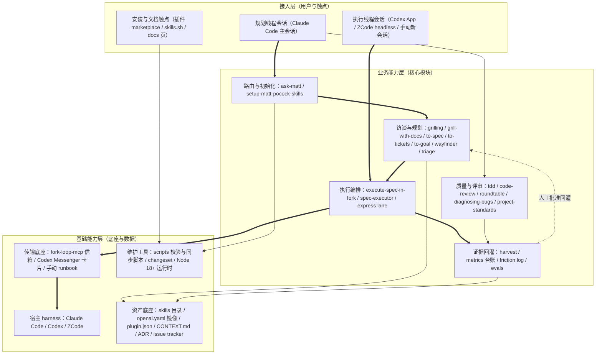
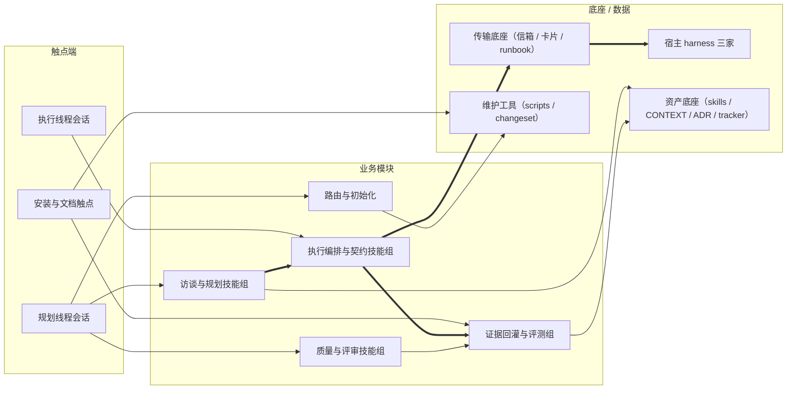

# AICoding 架构设计 · 高层架构设计

> 本文档为《AICoding 架构设计》核心产物之一，对应**高层架构设计模版**。
> 上游输入：业务原始诉求 + 行业调研结论 + 现有架构知识库；
> 下游输出：驱动《系统设计》《部署设计》《安全设计》《UserStory》四份文档的撰写。

---

## 0. 元信息：修订记录

> 记录文档版本、变更内容、修订人、修订时间，确保设计文档的可追溯。

```yaml
标题: sam-skills（opsbli/sam-skills） - 高层架构设计 v1.0
版本: v1.0
状态: Draft   # Draft | Reviewing | Approved | Deprecated
创建日期: 2026-09-11
最后更新: 2026-09-11
作者: business-architect（业务架构师 许边界）
评审人:
  - 主理人（team-lead）→ G3 人工审核待执行

关联文档:
  上游输入:
    - 用户诉求: 「启动 AICoding 架构专家团，基于我的项目背景和资料生成完整架构方案。」（已确认运行时决策：需要资料摄入（G1 已过）；需要行业调研（G2 已过）；跳过云现状核对——本地 CLI/Skills 仓库，无云部署）
    - 资料摘要: .workbuddy/output/material_digest.md（G1 已过审：77 份资料、D1~D77 可溯源、冲突 X1~X6）
    - 行业调研报告: .workbuddy/output/research_report.md（G2 已过审：B1~B6 标杆、5 维加权矩阵、SR-1~SR-22 来源）
  下游产出:
    - 系统设计: AICoding架构设计-2-系统设计.md
    - 部署设计: AICoding架构设计-3-部署设计.md
    - 安全设计: AICoding架构设计-4-安全设计.md
    - UserStory: AICoding架构设计-5-UserStory.md
```

| 版本 | 日期 | 作者 | 变更内容 | 评审状态 |
| --- | --- | --- | --- | --- |
| v1.0 | 2026-09-11 | business-architect（业务架构师 许边界） | 初稿（六章 + 附录；中间确认自检四点均未命中，见附录 C） | Draft |

> **版本管理纪律**：破坏性变更（章节结构调整 / 关键决策反转）升 MAJOR；新增章节、扩充内容升 MINOR。

**引用记号约定**：引用 G1 资料摘要标注（D编号，§章节）；引用冲突记录标注（X编号）；引用 G2 调研报告的公开来源标注（SR-编号）；引用本仓库 ADR 标注（ADR 编号）。全文引用语法一律使用全角〈〉。

**已冻结口径（G1/G2 人工审核确立，本文全篇遵守）**：receipt 契约以 spec-executor-receipt/v2 为当前版本（X1）；Codex 插件轨道按「已实现」消费但缺 ADR 级记录（X2）；goal-crafter 仅采信 SKILL.md（X3）；evals 记分板全部 0 runs，本文及全部下游章节不得引用评测结果作质量证据（X4）；术语遵循 CONTEXT.md 词汇（Issue tracker、Issue、Triage role、Decision ticket、Draft proposal），backlog 不作领域词（D2）。

---

## 1. 需求概要

### 1.1 需求概要说明

sam-skills（发布身份 opsbli/sam-skills）是 mattpocock/skills 的 opinionated fork，为 Claude Code / Codex / ZCode 三类宿主提供「把资深工程纪律编码为可执行技能」的本地仓库（D1，§开头/定位）。业务现状：fork 已在基线 6654f6b（v1.2.3）上沉淀七项差异化能力（to-goal / goal-crafter / spec-executor / execute-spec-in-fork / roundtable / project-standards / harvest）与 receipt v2 契约、fork-loop-mcp 传输层（D1，§与上游差异）。触发事件：用户提出「基于项目背景和资料生成完整架构方案」，而质量证据链空转（评测 8 个黄金任务全部 0 runs，D15）且契约校验停留 prompt 级（D75，§Consequences）。系统定位一句话：**本地优先的 AI 编码工程纪律技能集与「规划线程→执行线程→验收回执」契约管线的边界冻结与演进规划**——无云部署，仓库即系统。

### 1.2 关键决策摘要

| 编号 | 决策类别 | 决策内容 | 关联章节 |
| --- | --- | --- | --- |
| D1 | 范围决策 | 本系统为本地 CLI/Skills 仓库形态，无云部署、无服务端、无多租户；业务边界与 MVP 不引入云部署形态（用户运行时决策冻结） | §4.2 / §6.1 |
| D2 | 复用 vs 新建 | 继承上游 overlay 基线（40 行表达层预算）+ fork 差异资产（receipt v2 / to-goal / 三通道传输 / express lane），不新建运行时服务，不整体替换任何既有底座 | §2.4 / §4.2 |
| D3 | MVP / 完整版边界 | P0 = MVP：仅含风险解除项（receipt 六道门脚本化校验器、eval 8 黄金任务首跑、X2/X3/X6 漂移修订）；数据驱动项（阶段质量门、Docs delta 细则）延后至完整版 | §4.3 / §6.3 |
| D4 | 技术选型决策 | 一适配器一文档（拒绝跨 harness 便携抽象，ADR 0003 已冻结）；校验与工具脚本延续 Node 18+ ESM 零依赖栈（D68）；评测延续零依赖 markdown 协议（D14） | §3.2 / §4.3 |
| D5 | 部署形态 | 无服务端；分发走三轨（Claude 插件 marketplace opsbli listing / Codex 插件 / skills.sh 可编辑拷贝），每 harness 单轨不双装（D77，§install-block） | §4.2 / §5.2 |

**硬指标**：≥ 3 条，≤ 5 条；每条决策必须能映射到正文具体章节。✅ 5 条，均已映射。

### 1.3 价值主张

| 价值维度 | 量化目标 | 度量指标 | 当前值 | 目标值 | 截止时间 |
| --- | --- | --- | --- | --- | --- |
| 效率 | 规划线程/执行线程分离，规划上下文成本受控 | SPEC READY 产出前主会话 token 占用 | 机制已实现、无量化记录 | ≤150k token（smart zone 阈值内完成规划，D22，§Context hygiene） | MVP 首次 eval 记录回填 |
| 合规（留痕） | 执行结果 100% 留痕且机器可查 | 产出 receipt v2 且通过六道归档门的比例 | 契约已定义、校验为 prompt 级纪律（D75） | 100% 由脚本化校验器验证（六道门 6/6 脚本化） | MVP 上线 |
| 成本 | 上游同步成本可量化、可预判 | sync drill 三指标（冲突文件数/冲突块数/预计评审分钟）的记录覆盖率 | 仅 1 次演练记录（D11） | 每次上游同步前 100% 先演练 | 完整版 |
| 体验（证据可信） | 质量声称有运行证据支撑 | SCOREBOARD 已运行黄金任务数 | 0/8（D15，X4） | 8/8 各 ≥1 run 且回填 pass rate | MVP 上线 |

**硬指标**：业务价值 ≥ 2 条 + 技术/成本价值 ≥ 1 条；每条必须可量化，禁止出现"提升 / 优化 / 加强 / 更好"等模糊词。✅ 业务价值 3 条（效率/合规留痕/体验）+ 成本价值 1 条，全部含数字。

---

## 2. 需求分析 & 痛点解构

### 2.1 核心角色关注点

> 按"甲方决策者 / 最终用户 / 受影响方"维度盘点角色诉求。

| 角色 | 业务身份 | 主要操作 | Top1 关心点 | 来源 |
| --- | --- | --- | --- | --- |
| 甲方决策者 | 仓库维护者（fork owner，opsbli） | 决策 fork 演进方向、审批 draft proposal、审阅 sync drill 与 eval 指标 | fork 差异资产的可维护性与质量证据链（不因上游迭代与文档漂移而腐坏） | D8 / D30 / D15 |
| 最终用户 A | 使用 Claude Code 插件的工程师 | 跑 grill→to-spec→execute-spec-in-fork 主流程、读 receipt | 主流程顺畅、receipt 可信（六道门有机器校验而非肉眼） | D1 / D39 |
| 最终用户 B | Codex / ZCode 多 harness 用户 | 经 Codex App 适配器或 fork-loop-mcp 自动闭环执行 | 传输通道可用性与腐化风险（宿主升级后是否失效） | D74 / D76 |
| 受影响方（上游社区） | mattpocock/skills 上游维护者 | 上游迭代、管理官方 marketplace listing | fork 不污染上游语义；上游改名/重构可被 fork 消化 | D12 / D73 |
| 受影响方（贡献者） | 向 fork 提交变更的协作者 | 提 changeset、过 lint-skills/check-router 门 | 贡献门禁清晰（三重同步规则、40 行预算、invocation 双侧配对） | D4 / D8 / D66 |
| 受影响方（skills.sh 用户） | 走可编辑拷贝轨道的安装者 | npx skills add opsbli/sam-skills | 安装路径不与插件轨道双装冲突；升级可自管 | D77，§install-block |

**硬指标**：≥ 3 类（甲方决策者 / 最终用户 / 受影响方各至少一行）；每行必须有"Top1 关心点"，禁止笼统写"使用方便"。✅ 甲方决策者 1 行、最终用户 2 行、受影响方 3 行，共 6 行。

### 2.2 核心痛点

| 编号 | 痛点描述 | 现象 / 数据 | 影响角色 | 影响程度 | 优先级 |
| --- | --- | --- | --- | --- | --- |
| P1 | 质量证据链空转：评测体系已定义但从未运行，技能质量声称无任何运行证据 | SCOREBOARD 8 个黄金任务全部 0 runs、Defect signals 区为空（D15）；harvest 缺陷信号通道依赖 eval 失败输入而空转（D13，§闭环） | 甲方决策者、最终用户 A | 高（质量声称不可证） | P1 |
| P2 | receipt 契约门可检测非可防止：六道归档门与 receipt v2 格式校验停留 prompt 级，格式漂移会静默腐坏 | D75 自评「门下纪律仍是 prompt 级、可检测非可防止」；Skeptic 幸存异议未被击败（D75，§Surviving dissent）；六道门中「单一可解析 receipt」「Schema 首字段匹配」均无脚本执行（D27 / D39） | 甲方决策者、最终用户 A/B | 高（契约可信度底线） | P1 |
| P3 | 上游高速迭代击穿 fork overlay 预算的风险 | 上游 7 分钟内完成改名级替换（SR-19）、v1.2 重构 grilling 轮次制（SR-21）；fork 侧 sync drill 仅 1 次记录（D11）；继承技能 40 行预算现为 warn 而非硬门（D8） | 甲方决策者、贡献者 | 中高 | P2 |
| P4 | 文档与术语漂移累积：三处已确认漂移未治理 | X2（install-block.md 引用不存在的 ADR 文件名）、X3（goal-crafter README 指向外部仓库且内容漂移）、X6（ready-for-afk 与 ready-for-agent 单字符级术语漂移） | 贡献者、最终用户 A | 中 | P2 |
| P5 | 传输适配器随宿主版本腐化 | ZCode 0.16.5 实测硬事实：--settings 参数宣传与实现错位、auth 桌面/CLI 分裂（D76，§Hard facts）；能力表随宿主 API 演化需持续重验 | 最终用户 B | 中 | P2 |
| P6 | 分发轨道政策不确定 | 上游官方 listing pin 滞后（技能数落后 main 两提交，D73，§Update 2026-08-05）；fork 自建 listing 的审核与 pin 机制无公开契约（U-1） | skills.sh 用户、最终用户 A | 中低 | P3 |

**优先级标准**：
- **P1**：直接影响业务核心流程或合规底线，不解决无法上线。
- **P2**：影响用户体验或运营效率，可在 MVP 后迭代。
- **P3**：体验型 / 长尾问题，列入完整版或后续版本。

**硬指标**：每条痛点必须有"现象 / 数据"佐证；P1 ≥ 1 条且必须在 §2.3 有对应目标。✅ 6 条全部有数据佐证（D/X/SR 编号溯源）；P1 两条（P1、P2 编号），均在 §2.3 有对应目标 V1/V2。

### 2.3 期待目标

| 编号 | 目标描述 | 对齐痛点 | 度量指标 | 当前值 | 目标值 | 截止时间 |
| --- | --- | --- | --- | --- | --- | --- |
| V1 | 评测体系激活：8 个黄金任务完成首跑并回填 SCOREBOARD | P1 | SCOREBOARD 已运行任务数 / 有 pass rate 的技能数 | 0/8、0 个 | 8/8、覆盖 4 个考核技能（to-goal / spec-executor / tdd / code-review，D16） | MVP |
| V2 | receipt v2 契约机器可校验：六道归档门全部脚本化 | P2 | 脚本化门数 / 总门数；合成错误 receipt 拦截率 | 0/6、未度量 | 6/6；拦截率 100%（以合成用例验证，参照 lint-skills --check 模式，D68） | MVP |
| V3 | 上游同步成本可量化：每次同步前先跑 sync drill | P3 | drill 记录数 / 上游同步次数 | 1 次记录 / 0 次正式同步 | 覆盖率 100%；冲突文件 >20 即停止并重评 overlay 边界（D8 流程 100% 执行） | 完整版 |
| V4 | 文档与术语漂移清零且治理闭环：X2/X3/X6 修订入库；后续漂移 100% 经 harvest 流程 | P4 | 直接改动 SKILL.md/AGENTS.md 而未经 draft proposal 的次数 | 3 处待修订 | MVP 末 3 处修订入库；完整版期未经流程直接改动次数 = 0 | MVP（修订）/ 完整版（机制常态化） |
| V5 | 适配器腐化可控：宿主升级即重验、失效即退手动兜底 | P5 | ZCode/Codex 版本升级后能力表重验执行率；退兜底的切换步骤数 | 未建立节奏 | 重验执行率 100%；退手动 runbook 切换 ≤5 步（手动 runbook 本身 5 步，D27） | 完整版 |
| V6 | 双轨分发路径可用且互斥：安装话术单一来源、每 harness 单轨 | P6 | 安装话术来源数；双装警告触达面 | 1 个来源（install-block.md，D77） | 保持 1 个来源；警告在插件与 skills.sh 两轨文档 100% 触达 | 完整版 |

**硬指标**：每条目标必须**有数字 + 对齐至少 1 条痛点**；P1 痛点必须有对应 V 级目标。✅ 6 条全部有数字且各对齐 1 条痛点；两条 P1 分别对应 V1、V2。

### 2.4 基线复用

| 复用类别 | 现有能力 | 复用方式 | 来源系统 | 备注 |
| --- | --- | --- | --- | --- |
| 宿主 harness 底座 | Claude Code（Skills 三层渐进披露、subagents、插件 marketplace）、Codex（任务工具 fork/message/read/pin/archive + Messenger 卡片协议 v2+）、ZCode（headless CLI + Stop 钩子续跑） | 直接消费宿主机制 | Claude Code / Codex / ZCode（D1、D74、D76） | 本仓不直连模型 API，推理经宿主注入（BYOK） |
| 上游技能基线 | mattpocock/skills v1.2.3 的 grilling / to-spec / to-tickets / tdd / code-review / wayfinder / triage 等继承技能 | overlay 继承（表达层改动 ≤40 行/技能） | 上游仓库 6654f6b（D8） | 超预算须开 changeset；lint-skills --diff-audit 审计 |
| fork 差异资产 | 7 个 fork 新增技能 + fork-loop-mcp + receipt v2 契约 + 六道归档门 + express lane + 执行锁 | 直接复用，本期不重设计 | fork 自有（D1，§与上游差异；D75） | receipt v2 为当前契约（X1） |
| 维护脚本栈 | lint-skills.mjs / check-router.mjs / sync-plugin-version.mjs / build-codex-plugin.mjs / sync-upstream.sh / sync-drill.sh | 直接复用并作为校验器的模式参照 | scripts/ 顶层 9 个（D68） | Node 18+ ESM、零第三方依赖 |
| 术语与规范资产 | CONTEXT.md 纯 glossary（Issue tracker / Issue / Triage role / Decision ticket / Draft proposal 五术语）、.agents/adr/ 5 份 ADR、docs/ 人面页体系 | 直接复用 | D2 / D72~D76 / D77，§writing-docs | 修复 X3/X6 两处漂移后冻结本轮基线 |
| issue tracker 抽象 | GitHub（gh CLI）/ GitLab（glab）/ 本地 markdown（.scratch/）三种 tracker 支持 | 直接复用 | setup-matt-pocock-skills（D38） | tracker 配置单点维护 |

**硬指标**：必须先盘点再决定新建；凡列入"功能缺口"的能力，必须先在本节确认基线无法覆盖。✅ §2.5 全部缺口均已在基线盘点后确认：评测协议与六道门契约已存在但缺「运行」与「脚本化执行」，属机制激活而非新建。

### 2.5 功能缺口

> 在现有基线之上仍需新建或激活的能力（按业务阶段维度分组）。

| 阶段 | 功能缺口 | 必要性 | 优先级 | 对齐目标 |
| --- | --- | --- | --- | --- |
| 执行中（验收门） | receipt 六道归档门脚本化校验器：契约已定义（D39）、门逻辑已描述（D27），但无脚本执行，六道门靠肉眼与 prompt 纪律 | 必须 | MVP | V2 |
| 规划前（质量证据） | evals 体系激活：8 个黄金任务（D16）与协议（D14）已定义但 0 runs，SCOREBOARD 待回填 | 必须 | MVP | V1 |
| 运营维护（文档治理） | 漂移修订入库：X2 Codex 插件轨道 ADR 级补档、X3 goal-crafter README 处置（按 X3 结论仅采信 SKILL.md）、X6 ready-for-agent 术语对齐 | 必须 | MVP | V4 |
| 规划中（质量门） | 阶段质量门 skill：吸收 B2 的 analyze（跨工件一致性）/ checklist（需求可测性）思想（SR-7），门规则需 receipt metrics 与 friction log 数据定形（D30） | 重要 | 完整版 | V1 |
| 执行后（结算细则） | Docs delta 结算细则形式化：借鉴 B4 delta specs 的 ADDED/MODIFIED/REMOVED 枚举语义（SR-10）细化 receipt v2 Docs delta 字段；若涉必填字段变更按规则 bump 版本（D39） | 重要 | 完整版 | V2 |
| 运营维护（节奏） | sync drill 常态化（每次上游同步前演练）+ 适配器升级重验 runbook + to-goal Session recommendation 档位推广（D41） | 重要 | 完整版 | V3 / V5 |

**硬指标**：每条缺口必须对齐 §2.3 至少一条目标；MVP 缺口必须在 §6.3 功能清单中对应有 MVP 范围标记。✅ 6 条缺口各对齐 V1~V5；3 条 MVP 缺口对应 §6.3 的 N1/N2/N3（MVP ✅）。

---

## 3. 行业调研

### 3.1 行业标杆系统分析

> 对标 AI coding 工作流 / spec 驱动管线 / 技能工程领域的代表性系统（G2 调研报告盘点，6 家）。

| 标杆系统 | 厂商 / 来源 | 场景覆盖 | 技术亮点 | 商业模式 | 适用度 |
| --- | --- | --- | --- | --- | --- |
| B1 Claude Code（Agent Skills/subagents 体系） | Anthropic | 终端自主编码 + 技能生态 + 多代理编排 | Skills 三层渐进披露（L1 元数据常驻/L2 正文触发加载/L3 资源按需）；plan mode 只读规划；内置 Explore/Plan 子代理 | 订阅 + API 按量 | 高（运行底座官方机制即本仓资产形态的同构事实标准） |
| B2 GitHub Spec Kit | GitHub（官方开源） | spec-driven 开发全流程管线 | constitution/specify/plan/tasks/implement 五命令 + clarify/analyze/checklist/converge 质量命令；35+ agent 集成 | 开源免费 | 中高（质量门思想可局部吸收，CLI/模板栈不引入） |
| B3 Kiro | AWS | spec-driven 从原型到生产 | EARS 记法三文档 + 三阶段人工门禁 + SMT 求解器查需求矛盾 | Freemium credit 计费 | 低（商业绑定与计费争议同本地优先前提冲突；EARS 句式局部参考） |
| B4 OpenSpec | Fission AI | 存量系统变更管理 | Propose→Apply→Archive 状态机；delta specs（ADDED/MODIFIED/REMOVED）；validate --strict 结构门硬阻断 | 开源免费（MIT） | 中高（delta 语义与「结构门硬阻断」哲学印证 ADR 0003） |
| B5 OpenHands / SWE-agent | AllHands / Princeton NLP | 自主软件工程（沙箱自主执行路线） | OpenHands 五层 SDK + EventLog + Docker 沙箱；SWE-agent ACI 最小工具面 | 开源免费（MIT） | 低（沙箱自主路线与「规划线程人类决策」哲学分歧；EventLog/ACI 思想局部参考） |
| B6 mattpocock/skills（上游） | Matt Pocock（社区） | 工程纪律技能集 | 53 skills、grilling frontier 轮次制、user/model invoked 双轨、双分发哲学 | 开源免费（MIT） | 高（fork 继承基线与方法论源头，差异化边界天然清晰） |

**硬指标**：≥ 3 家；至少包含 1 家头部 SaaS + 1 家开源/自研代表。✅ 6 家；B1/B3 为头部 SaaS/云厂商代表，B2/B4/B5/B6 为开源代表。

### 3.2 方案对标及优先级打分

**对比矩阵**（每行权重之和 = 1）：

> 评估维度按本项目四大核心命题设定（G2 调研报告 §3.1）；模板默认的「合规可控性」维度因本项目为本地 CLI/Skills 仓库、无云部署、无数据出境与监管诉求，由「本地优先/成本」维度吸收（G2 已在 G2 审核中确认）。下表得分与权重为**调研侧评估建议值**，业务架构师裁决采纳，理由见结论摘要。

| 评估维度 | 权重 | B1 得分 | B2 得分 | B3 得分 | B4 得分 | B5 得分 | B6 得分 |
| --- | --- | --- | --- | --- | --- | --- | --- |
| 规划/执行管线契合度 | 0.30 | 4 | 5 | 5 | 4 | 2 | 4 |
| 跨上下文契约机制 | 0.25 | 5 | 3 | 3 | 3 | 3 | 4 |
| 技能/规则工程成熟度 | 0.20 | 5 | 3 | 3 | 3 | 2 | 5 |
| 多 harness 适配策略 | 0.15 | 3 | 5 | 2 | 5 | 4 | 4 |
| 本地优先/成本可控 | 0.10 | 3 | 5 | 2 | 5 | 5 | 5 |
| **加权总分** | **1.00** | **4.20** | **4.10** | **3.35** | **3.80** | **2.85** | **4.30** |

**结论摘要**（业务架构师裁决，采纳 G2 调研侧三层结论——裁决依据：与仓库已冻结决策（ADR 0003/0005、D75、D14 零依赖边界）及本地优先约束逐条一致，见 §4 与附录 C 自检 2）：

- **优先借鉴**：B6 上游基线（4.30）+ B1 Claude Code 官方机制（4.20）——理由：fork 的继承基线与方法论源头即 B6；B1 的 Skills 三层披露、invocation 双轨、子代理上下文隔离是本仓资产形态的官方事实标准，对齐成本最低（SR-1、SR-3）。
- **部分借鉴**：B2 Spec Kit（4.10）——借鉴 analyze/checklist/converge 三个质量门思想，以本仓 skill 形态落地（不引入其 CLI/模板栈）；B4 OpenSpec（3.80）——借鉴 delta specs 增量语义细化 receipt Docs delta 结算、validate --strict「结构门硬阻断、验证不做编排」印证 ADR 0003 的 refuse-not-degrade（SR-10）。
- **不借鉴（否决）**：B3 Kiro（3.35）——商业绑定（Bedrock/credit 不滚存）与计费争议同本地优先、无云部署前提直接冲突（SR-9）；整体产品形态否决，仅局部保留 EARS 可测句式作 receipt 验收措辞参考。B5 OpenHands/SWE-agent（2.85）——沙箱自主执行路线与「规划线程人类决策 + 执行线程受契约约束」哲学分歧，且 Anthropic 官方结论（编码任务可并行度低、共享上下文领域不适合多代理，SR-4）反向支持单活跃执行线程设计（D75，§Decision 3）；局部保留 EventLog 审计思想作 receipt 遥测参考。

**事实 / 评估意见 / 建议的区分声明**：§3.1 标杆卡片中的机制描述为**事实**（SR 编号溯源）；§3.2 权重与得分为**评估意见**（调研侧建议值，本架构师裁决采纳）；结论摘要中的借鉴动作是**建议**（已落入 §4.3 MVP 与 §6 功能清单，经 G3 人工审核后冻结）。

### 3.3 完整报告参考

- 完整报告链接：`.workbuddy/output/research_report.md`（G2 已过审归档）
- 调研工具：`tech-research-advisor`（见附录 B）
- 调研日期：2026-09-11
- 调研归档：`.workbuddy/output/research_report.md`（11 次公开来源检索、6 家标杆、5 维加权矩阵、R-1~R-5 风险、U-1~U-3 待确认项、SR-1~SR-22 来源目录）

---

## 4. 方案决策

### 4.1 价值定位澄清

**定位三段式**：

```
对外价值（使用者侧）: 把资深工程纪律编码为 agent 可执行技能，使 AI 编码从对话式即兴走向
                      「规划线程→SPEC READY→契约执行→receipt 回执」的可验证闭环；安装即用
                      （Claude 插件 / Codex 插件 / skills.sh 三轨），全程本地运行。
对内价值（维护侧）:   fork overlay 模型（40 行预算 + 冲突 playbook + sync drill）控制上游同步
                      成本；receipt metrics / friction log / evals 三台账 + harvest 回灌构成质量
                      证据链；三重同步规则与机器校验脚本守护 promoted 集一致性。
差异化价值:           上游未覆盖的 fork 自有资产——receipt v2 契约 + 六道归档门（业界无同构物，
                      G2 §2.3 横向表）、to-goal 跨上下文契约编译（fork 全量继承、to-goal 全量压
                      缩）、一适配器一文档的三通道传输（Codex App / ZCode fork-loop-mcp / 手动
                      runbook）——恰好落在上游与六家标杆均未覆盖的位置（G2 §3.2）。
```

**与产品矩阵的关系**：本系统在「AI 编码工程纪律工具」矩阵中承担**技能资产与契约管线**的核心职责：对上消费宿主 harness（Claude Code / Codex / ZCode）的运行时机制，对下向使用者交付 32 个 promoted skills 与三条执行通道，并与上游 mattpocock/skills 形成「继承基线 + overlay 差异」的演进闭环（见 §5.2、§5.3）。

### 4.2 系统定位澄清

| 维度 | 内容 |
| --- | --- |
| 系统名称 | sam-skills（发布身份 opsbli/sam-skills，与术语表及 plugin.json 一致，D70） |
| 系统类型 | 已有系统扩展（fork overlay 演进：上游为底、fork 只增量表达差异，D8） |
| 部署形态 | 本地 CLI / Skills 仓库分发，**无云部署、无服务端**（用户运行时决策冻结；模型推理经宿主的 SaaS API，但本仓库自身不承载任何服务） |
| 多租户 | 否（本地单用户仓库形态；issue tracker 由使用者自选宿主，无跨租户隔离概念） |
| 服务对象 | §2.1 六类角色：甲方决策者（仓库维护者）、最终用户（Claude Code 工程师与 Codex/ZCode 多 harness 用户）、受影响方（上游社区、贡献者、skills.sh 用户） |
| 上游依赖 | 宿主 harness 三家（Claude Code / Codex / ZCode）、上游 mattpocock/skills、模型 API（经宿主注入，本仓零直连）——详见 §5.2 |
| 下游消费者 | 使用者本机技能安装面（~/.claude/skills 等）、issue tracker 宿主（GitHub / GitLab / .scratch）、本架构方案的下游文档（系统设计 / 部署设计 / 安全设计 / UserStory） |
| 边界（不做） | 不做云服务与多租户（用户显式排除）；不做跨 harness 便携抽象层（ADR 0003 冻结）；不做第三 harness 适配器（refuse-not-degrade，D74）；不提供可用性 SLA 承诺（本地工具，无服务端可用性概念） |

### 4.3 MVP 与完整版决策

**P0 = MVP**：全部 P0 功能必须落在 MVP 范围内；MVP 不包含任何 P1/P2 功能。MVP 取舍的逐项依据见附录 C 自检 2。

| 阶段 | 时间窗 | 范围（功能编号） | 架构差异点 | 退出标准 | 不做（延后） |
| --- | --- | --- | --- | --- | --- |
| MVP | W1 ~ W2（G3 通过后两周内） | N1（receipt 校验器）、N2（evals 首跑）、N3（漂移修订）+ F1~F10 既有能力回归保持 | 无新架构组件：校验器为 Node 18+ ESM 零依赖脚本（延续 lint-skills.mjs --check 模式，D68）；无 Mock 项（本地工具，无三方接口需要模拟） | ①8/8 黄金任务各 ≥1 run 且 SCOREBOARD 回填 pass rate 与失败模式；②六道门 6/6 脚本化且合成错误 receipt 拦截率 100%；③X2/X3/X6 修订入库 | N4（质量门 skill）、N5（Docs delta 细则 / drill 常态化）、第三 harness 适配器 |
| 完整版 | W3 ~ W6 | + N4、N5 | 新增 1~2 个 skill（含黄金任务配套）；receipt v2 Docs delta 字段细则修订（若涉必填字段增删改名，按 D39 规则 bump 版本并双侧同步） | ①连续 4 周 eval 周检通过（D14 cadence）；②未经 draft proposal 直接改动 SKILL.md 的次数 = 0；③上游同步前 drill 覆盖率 100% | — |

**演进纪律**：
- ✅ MVP 的架构骨架必须是完整版的**子集**，不允许 MVP 上线后推倒重来——校验器脚本在完整版继续承担六道归档门职责，evals 首跑台账直接被完整版的周检复用。
- ✅ MVP 中可 Mock 的能力：无——本系统为本地工具，MVP 不引入任何需 Mock 的三方服务，因此不存在「完整版替换计划」项。
- ❌ 禁止：MVP 为了赶工而引入「完整版无法继承」的临时架构——MVP 新增物仅两个：零依赖校验脚本与 eval 运行记录（append-only 台账），均被完整版直接继承；阶段质量门 skill 明确推迟到 receipt metrics / friction log 数据积累后（D30，§run/2 的 confirmed-defect 判定依赖台账），不因赶工提前建门。

---

## 5. 业务架构设计

### 5.1 业务架构图

本系统业务架构自上而下分为三层：**接入层 → 业务能力层 → 基础能力层**。接入层承载使用者与安装触点（规划线程会话、执行线程会话、安装与文档触点）；业务能力层承载五大核心模块组（访谈与规划、执行编排、质量与评审、证据回灌、路由与初始化）；基础能力层承载宿主 harness、传输底座、资产底座与维护工具四类底座。实线为同步调用/加载，虚线为异步事件/人工批准回路，粗线为主链路。



> 读图说明：粗箭头（==\>）为主链路（§5.3）；细实线（--\>）为同步调用/加载；虚线（-. -\>）为异步回路（harvest 修订须经人工批准后进入下一轮规划）。图与正文三层描述一致：接入层（U1~U3）→ 业务能力层（M1~M5）→ 基础能力层（B1~B4）。

### 5.2 系统依赖架构

| 依赖类型 | 系统 / 模块 | 提供方 | 依赖能力 | 接入方式 | 同步/异步 | 关键约束 |
| --- | --- | --- | --- | --- | --- | --- |
| 上游 | Claude Code 宿主 | Anthropic | Skills 三层渐进披露、subagents 上下文隔离、插件 marketplace 加载 | skill 目录 + plugin.json 本地文件加载 | 同步 | L2 SKILL.md 正文 ≤5k token（SR-1）；promoted 三重同步（D4） |
| 上游 | Codex 宿主 | OpenAI | 任务工具（fork/message/read/pin/archive）+ Task Messenger 卡片协议 v2+ | execute-spec-in-fork capability map 单点调用 | 同步 | 缺依赖即 refuse 不降级模拟（ADR 0003）；能力名只活在这张表 |
| 上游 | ZCode 宿主 | ZCode（用户自配 provider） | headless CLI（-p/--cwd/--json）+ 七事件 hooks + Stop 续跑（预算 3） | fork-loop-mcp（MCP stdio + stdout 捕获） | 异步（信箱） | 单活跃执行锁（原子 mkdir，>6h 陈旧锁可破）；exactly-once 投递（D69） |
| 上游 | mattpocock/skills | 上游社区 | 继承技能基线（grilling/to-spec/to-tickets/tdd/code-review 等） | git rebase（sync-upstream.sh） | 异步（人工触发） | 表达层 ≤40 行/技能；冲突 playbook a/b/c（D12）；sync drill 先行（D8） |
| 上游 | 模型 API | 各模型厂商（经宿主） | 推理能力 | 宿主注入（BYOK），本仓零直连 | 同步 | 本仓不持有任何 API key；不产生直连依赖（D76，§headless 前提） |
| 下游 | 使用者本机安装面 | 本仓（sync:local / link-skills.sh） | 技能文件落盘 ~/.claude/skills、~/.agents/skills 等 | 文件拷贝/symlink | 异步 | link-skills 为 dev-only 非受支持安装器（D68）；公开故事走三轨分发 |
| 下游 | issue tracker 宿主 | GitHub / GitLab / 本地文件 | issue 读写（triage / to-spec / to-tickets / wayfinder 消费） | gh CLI / glab / .scratch markdown 文件 | 同步 | tracker 配置单点（setup 一次性配置，D38）；PRs-as-request-surface 默认 off |
| 复用底座 | Node 18+ 运行时 | 本地环境 | scripts 九脚本 + fork-loop-mcp 服务 | ESM 脚本直接执行 | 同步 | 零第三方依赖（D14/D68/D69 同一边界）；不引入 Deno/Bun 替代 |
| 数据订阅 | 不适用 | — | 无遥测外发：metrics / friction log / evals 台账全部为 repo 内 append-only 文件 | — | — | 本仓不向任何外部系统推送数据（与无云部署决策一致） |

**硬指标**：
- 每条依赖必须明确"接入方式 + 同步/异步 + 关键约束"，禁止只写"调用 API"。✅ 9 行均齐备。
- 所有 P1 痛点对应的核心能力，必须能在本表中找到依赖来源（自建/复用/采购）。✅ P1（证据链空转）依赖「复用底座 Node 18+」（校验器落点）与上游 ZCode/Codex 行（eval 运行经宿主会话）；P2（契约门 prompt 级）依赖「复用底座」（脚本化落点）；两者均为自建/复用，无需采购。

### 5.3 业务闭环

**业务主链路**（端到端）：

```
触发（idea / tracker Issue / 外部 PR） → 环节1：识别与分诊（triage 五状态机 / wayfinder 决策地图 / diagnosing-bugs 红循环）
→ 环节2：访谈成稿（grill-with-docs 访谈，词汇落 CONTEXT.md、难逆转决策落 ADR → to-spec 发 SPEC READY 启动块）
→ 环节3：路由决策（单会话可完成且未决决策为零 → express lane 直通；单会话装得下 → fork 执行；多会话/并行/跨代理 → to-tickets 拆票 + to-goal 逐 frontier 编译）
→ 环节4：契约执行（spec-executor 五步：lock → 逐切片 tdd 实现 → 类型检查 → 全量验证 → 产出 receipt v2）
→ 环节5：归档结算（六道归档门逐条核验 → 非 none 的 Docs delta 经 domain-modeling 结算 → receipt metrics 行追加 → 工作树终态核对无漂移）
→ 反馈回路（friction log / eval 失败信号 → harvest 分诊 → draft proposal → 人工批准 → apply 修订技能）
```

**关键反馈回路**：

| 回路 | 触发点 | 反馈对象 | 反馈机制 | 价值 |
| --- | --- | --- | --- | --- |
| 质量证据回路（主反馈回路） | receipt 验收后 / eval 失败 / 跨 receipt 重复摩擦 | 技能资产（SKILL.md）与规范文档 | harvest 分诊（confirmed-defect / noise / gap-not-defect 三档，D30）→ draft proposal → 人工批准 → apply | 技能修订有据可查，未经流程不改动 |
| 上游同步回路 | 上游 push / 季度节奏 | fork overlay 边界 | sync drill 试 rebase 三指标 → 冲突 playbook a/b/c → 40 行预算审计（warn→硬门演进，D8） | 同步成本可预判，fork 差异不腐坏 |
| 适配器腐化监控回路 | Codex/ZCode 宿主版本升级 | 传输通道（ADR 0003/0005 两适配器） | 能力表单点重验 → 失效即退手动 runbook → ZCode 原生长出会话原语则信箱适配器退役（D76） | 自动闭环失效可观测、可兜底、可丢弃 |

**运营主线**（各角色的节奏与动作）：
- **每 receipt 验收后**（维护者/执行方）：追加 metrics.md 一行并询问质量标签（D9）；六道门不过即回执行方，禁止手补 Schema 字段（D39）。
- **每周**（维护者）：至多一次 eval 运行，技能变更后必跑（D14 cadence）；SCOREBOARD 回填。
- **每 confirmed-defect**（维护者）：一份 draft proposal（一缺陷一文件），人工批准后 apply 并翻 Approved: yes（D30）。
- **每季度 / 每次上游同步前**（维护者）：sync drill 一次并记三指标；冲突文件 >20 停止并重评 overlay 边界（D8）。
- **每次宿主升级**（最终用户 B/维护者）：重跑适配器能力表验证；ZCode 升级重验为 ADR 0005 内置义务（D76）。

---

## 6. 产品需求及原型

### 6.1 需求边界

**In-Scope**（本期必做，12 条）：

| 编号 | 功能 / 约束 | 对齐目标 |
| --- | --- | --- |
| F1 | 规划线程访谈成稿主线：grilling/grill-with-docs/grill-me → to-spec 发 SPEC READY 启动块（8 字段） | V2 / V4 |
| F2 | 跨上下文契约编译：to-goal 五种输入 + goal-crafter 词汇格式，Readiness checklist 八项硬停 | V2 |
| F3 | 执行契约与回执：spec-executor 五步、receipt v2（Schema 首字段 + Docs delta + metrics 行）、执行锁 | V2 |
| F4 | 执行编排与传输适配：execute-spec-in-fork 三通道（Codex App / ZCode fork-loop-mcp / 手动 runbook）+ express lane 三条件直通 | V5 |
| F5 | 质量与评审技能集：tdd（seam 红绿循环）、code-review（双轴 diff）、roundtable（四席两轮）、diagnosing-bugs（六阶段） | V1 |
| F6 | 架构与规范治理：improve-codebase-architecture、project-standards（三模式）、domain-modeling（glossary/ADR 维护） | V4 |
| F7 | 证据回灌：harvest run/apply 双模式、draft proposal 机制、metrics / friction log 双台账 | V1 / V4 |
| F8 | 入口与分诊：ask-matt 主流程路由、triage 五状态机、wayfinder 决策地图、setup 一次性配置 | V4 |
| N1 | receipt 六道归档门脚本化校验器（Node 18+ ESM 零依赖，--check 模式防漂移） | V2 |
| N2 | evals 体系激活：8 黄金任务首跑 + SCOREBOARD 回填 pass rate 与主导失败模式 | V1 |
| N3 | 漂移修订入库：X2 Codex 插件轨道 ADR 级补档、X3 goal-crafter README 处置（仅采信 SKILL.md）、X6 ready-for-agent 术语对齐 | V4 |
| N4 | 全程本地运行约束：无云服务、无遥测外发、台账 repo 内自持、本仓不持有 API key | 全局约束 |

**Out-of-Scope**（本期不做，必须列原因，共 6 条）：
| 编号 | 不做的事 | 原因 | 后续计划 |
| --- | --- | --- | --- |
| O1 | 云部署 / SaaS 化 / 多租户服务端 | 用户运行时决策显式冻结：本地 CLI/Skills 仓库，无云部署 | 不做（永久边界，除非用户推翻该决策） |
| O2 | 跨 harness 通用便携编排抽象层 | ADR 0003 已冻结「一适配器一文档、拒绝便携抽象」——一个真适配器 + 诚实 fallback 比假便携层便宜 | 不做（ADR 级边界） |
| O3 | 第三 harness 适配器（Cursor 等） | refuse-not-degrade 原则；G2 §4.2 已评估通用集成路线为框架级投入，非单仓可负担 | 完整版后按真适配器条件评估 |
| O4 | receipt schema v3 演进 | X1 冻结 v2 为当前契约；字段增删改名需 bump 但本期无数据驱动需求 | 待 receipt metrics 数据积累后按需评估 |
| O5 | 评测 CI 化（GitHub Actions） | D14 明确零依赖边界；CI 化属工具依赖引入，首跑完成前禁止 | 完整版评估（首跑数据回填后） |
| O6 | 阶段质量门 skill（B2 analyze/checklist 思想） | 门规则需 receipt metrics 与 friction log 数据定形（D30）——先跑数据再定门 | 完整版（N4，依赖 N2 完成） |

**硬指标**：In-Scope ≤ 15 条；Out-of-Scope ≥ 3 条（"没有不做的事"= 边界没想清）。✅ In-Scope 12 条；Out-of-Scope 6 条。

**范围边界总览**：

| 边界类别 | 条目数 |
| --- | --- |
| Out-of-Scope（本期不做，O1~O6） | 6 |
| In-Scope（本期必做，F1~F8、N1~N4） | 12 |
| Out-of-Scope 中的永久边界（O1 无云部署、O2 拒便携抽象） | 2 |
| Out-of-Scope 中完整版再评估项（O3~O6） | 4 |

### 6.2 产品模块全景图

**模块卡片**（每个模块必填字段）：

| 字段 | 说明 |
| --- | --- |
| 模块名称 | 标准名 |
| 一级归属 | 接入层 / 业务能力层 / 基础能力层 |
| 责任团队 | 团队名 |
| 上游 | 模块/系统列表 |
| 下游 | 模块/系统列表 |
| MVP 是否包含 | 是 / 否 |

**模块卡片实例**（本仓为单人维护仓库，责任团队统一为仓库维护者；继承技能的责任含上游社区）：

| 模块名称 | 一级归属 | 责任团队 | 上游 | 下游 | MVP 是否包含 |
| --- | --- | --- | --- | --- | --- |
| 访谈与规划技能组（M1） | 业务能力层 | 仓库维护者（继承部分责任含上游社区） | 宿主 harness、CONTEXT.md、ADR | 执行编排组、issue tracker | 是（现状保持） |
| 执行编排与契约技能组（M2） | 业务能力层 | 仓库维护者 | 访谈与规划组、传输底座 | receipt 台账、docs 结算 | 是 |
| 质量与评审技能组（M3） | 业务能力层 | 仓库维护者 | project-standards 文档、固定点 diff | 证据回灌组 | 是 |
| 证据回灌与评测组（M4，N1/N2 落点） | 业务能力层 | 仓库维护者 | metrics / friction log / evals 三台账 | 技能资产修订（经人工批准） | 是（N1/N2 为 MVP 新增） |
| 维护与分发工具组（B4） | 基础能力层 | 仓库维护者 | plugin.json、changeset | 三轨分发、本地安装 | 是（N1 校验器入 scripts/） |



### 6.3 功能清单

| 编号 | 一级模块 | 二级功能 | 功能描述 | 优先级 | MVP 范围 | 完整版范围 | 对齐目标 |
| --- | --- | --- | --- | --- | --- | --- | --- |
| F1 | 访谈与规划 | grill 主线 | grilling 原语 + grill-with-docs/grill-me 访谈，领域词落盘 CONTEXT.md、难逆转决策落 ADR | P0 | ✅ | ✅ | V4（前提基线） |
| F2 | 访谈与规划 | to-spec 成稿 | 会话压缩为 spec，SPEC READY 启动块 8 字段，未决决策发 SPEC NOT READY | P0 | ✅ | ✅ | V2（前提基线） |
| F3 | 访谈与规划 | to-tickets 拆分 | tracer-bullet 垂直切片，.scratch 或 tracker 一票一文件，blocking edges 声明 | P0 | ✅ | ✅ | V1（前提基线） |
| F4 | 跨上下文契约 | to-goal + goal-crafter | 五种输入编译为机器可查 goal，Readiness checklist 八项硬停，会话档位推荐 | P0 | ✅ | ✅ | V2 |
| F5 | 执行编排 | execute-spec-in-fork | 三通道按序检测（Codex App / ZCode fork-loop-mcp / 手动 runbook），express lane 三条件直通，权限信封 | P0 | ✅ | ✅ | V5 |
| F6 | 执行契约 | spec-executor | lock → 逐切片 tdd → 类型检查 → 全量验证 → receipt v2（Schema 首字段、Docs delta、metrics 行） | P0 | ✅ | ✅ | V2 |
| F7 | 质量与评审 | tdd + code-review + roundtable + diagnosing-bugs | seam 红绿循环、双轴 diff 评审（Standards 轴 + Spec 轴）、四席两轮对抗评审、六阶段诊断 | P0 | ✅ | ✅ | V1 |
| F8 | 治理技能 | improve-codebase-architecture + project-standards + domain-modeling | 架构摩擦扫描（deletion test）、规范文档三模式（generate/update/audit）、glossary 与 ADR 主动维护 | P0 | ✅ | ✅ | V4 |
| F9 | 证据回灌 | harvest | run（读台账→分诊→起草）/ apply（显式 Approved: yes 才应用）双模式，一缺陷一提案 | P0 | ✅ | ✅ | V1 / V4 |
| F10 | 入口路由 | ask-matt + triage + setup-matt-pocock-skills | idea→ship 主流程路由、issue 五状态机分诊（含 PR 请求面）、仓库一次性配置 | P0 | ✅ | ✅ | V4 |
| N1 | 维护工具 | receipt 校验器（新增） | 六道归档门脚本化：outcome/单一可解析 receipt/Conclusion 单 token/验收证据/无待决决策/工作树无漂移 | P0 | ✅ | ✅ | V2 |
| N2 | 维护工具 | evals 激活（新增） | 8 黄金任务首跑、SCOREBOARD 回填、失败信号喂 harvest（repeat-test 规则，D14） | P0 | ✅ | ✅ | V1 |
| N3 | 维护工具 | 漂移修订（新增） | X2 Codex 插件 ADR 补档、X3 goal-crafter README 处置、X6 ready-for-agent 术语对齐 | P0 | ✅ | ✅ | V4 |
| N4 | 维护工具 | 质量门 skill + Docs delta 细则（新增） | 吸收 B2 analyze/checklist 思想建阶段质量门；B4 delta 语义细化 Docs delta 字段细则 | P1 | ❌ | ✅ | V2 / V1 |
| N5 | 维护工具 | drill 常态化 + Session recommendation 推广（增强） | 每次上游同步前 sync drill；to-goal 会话投入档位推广至主流程提示 | P1 | ❌ | ✅ | V3 |

**P0 = MVP**：上表全部 P0 功能的 MVP 范围列为 ✅，无例外；P1 功能（N4/N5）延后至完整版。

**硬指标**：
- 每个 P0 功能必须在 MVP 范围内为 ✅。✅ 13 个 P0 行全部 ✅。
- 每个功能必须能反向映射到 §2.5 功能缺口 + §2.3 期待目标。✅ N1/N2/N3 映射 §2.5 三条 MVP 缺口；F1~F10 为既有基线能力（§2.4 复用盘点），其「对齐目标」列标注所服务的 V 目标或达成前提；N4/N5 映射 §2.5 完整版缺口。

### 6.4 产品原型 - 规划线程会话

> 本系统的核心触点端 1：使用者在 Claude Code 主会话中经历的规划线程交互（CLI 会话形态，非图形界面）。

**核心页面清单**：

| 页面 | 用途 | 关键交互 | MVP |
| --- | --- | --- | --- |
| ask-matt 路由入口 | idea→ship 主流程分流 | 识别入口类型（访谈/疑难 bug/迷雾/triage），阶段边界五选项（Continue/clear/handoff/Subagent/compact） | ✅ |
| grilling 访谈轮次界面 | 澄清未成型决策 | 🔥 Round N · K questions 一轮全问（编号 + 💡 推荐答案）；事实问题派子代理、决策问题留用户；frontier 外移推进 | ✅ |
| to-spec 成稿视图 | 会话压缩为 spec | SPEC READY 启动块 8 字段呈现；未决时发 SPEC NOT READY 并列出缺失项，不启动实现 | ✅ |
| to-tickets 工单清单 | 大任务拆分 | 🎫 编号清单（Blocked by / Delivers）+ 粒度/阻塞边/合并拆分三问迭代 | ✅ |
| receipt 归档视图 | 执行结果验收 | 六道门逐条结果展示；metrics 行追加提示；质量标签询问 | ✅ |

**关键交互约束**：
- 轮次收敛效率：沿上游 v1.2 frontier 轮次制——官方 PR 数据口径 13 问从 13 轮压到约 3 轮（SR-21），fork 不回退单题串行追问。
- 上下文预算：smart zone 约 150k token，接近时只在阶段边界 /compact（D22，§Context hygiene），对齐 §1.3 效率目标。
- 决策与事实分离：环境事实由子代理查证，用户只回答决策问题（D49，§Round loop）。

**原型链接**：本系统为 CLI/仓库形态，无图形原型；交互契约以各 SKILL.md 与 docs/ 人面页为唯一事实源（D77，§writing-docs）。

### 6.5 产品原型 - 维护者工作台

> 本系统的核心触点端 2：仓库维护者消费台账与校验报告的工作面（repo 文件形态）。

**核心页面清单**：

| 页面 | 用途 | 关键交互 | MVP |
| --- | --- | --- | --- |
| docs/evals/SCOREBOARD.md | 8 黄金任务运行记分 | 每任务一行：runs / pass rate / 主导失败模式（N2 首跑回填） | ✅ |
| docs/metrics.md 遥测表 | receipt 验收后逐行追加 | 日期 / 任务 / 技能 / 结果 / 偏差 / 质量标签列（D9） | ✅ |
| docs/skill-friction-log.md | 技能卡点日志 | append-only 追加；harvest 读取不修剪（D10） | ✅ |
| docs/evals/draft-proposals/ 审批队列 | 技能修订提案审批 | Approved: no→yes 文件内翻牌；apply 核对 old text 仍在原位，漂移即停（D30） | ✅ |
| docs/sync-drill-log.md | 同步演练三指标 | 冲突文件/块/预计评审分钟；冲突文件 >20 停止并重评 overlay 边界（D8/D11） | ✅ |
| lint-skills --diff-audit 报告 | 继承技能 40 行预算审计 | 现 warn-only，两版后转硬门；fork 自有技能豁免（D68） | ✅ |

**关键交互约束**：
- 台账一律 append-only，不修剪、不回写历史行（D10/D30）。
- 提案审批以文件行为准：聊天批准不算，必须见显式 Approved: yes 行（D30）。
- evals 首跑完成前（当前 0 runs），本工作台任何面板不得将评测结果引用为质量证据（X4 约束，全下游适用）。

**原型链接**：同 §6.4——CLI/仓库形态无图形原型，以上面板均为 repo 内 markdown/脚本输出，路径即原型。

---

## 附录 A：生成流程方法论

> 本附录为高层架构设计的**生成方法论**，描述每一步的目标、工具与产物形态，作为正文章节的产出依据。以下为本轮实际执行记录。

### A.0 生成流程总览

| 步骤 | 名称 | 核心产出 | 落入正文章节 |
| --- | --- | --- | --- |
| Step0 | 业务基础知识库构建 | material_digest.md（G1 已过审：77 份资料、D1~D77、X1~X6） | （为全文提供输入） |
| Step1 | 行业调研分析 | research_report.md（G2 已过审：B1~B6、5 维加权矩阵、R-1~R-5） | §3 行业调研 |
| Step2 | 需求分析 / 痛点解构 | 需求画像：六类角色、P1~P3 六痛点、V1~V6 目标 | §2 需求分析 & 痛点解构 |
| Step3 | 能力盘点，系统定位 | 价值定位 + 系统定位 + 基线复用盘点 | §4 方案决策 / §5.2 系统依赖架构 |
| Step4 | 生成系统高层架构设计 | 三层业务架构图、依赖表、业务闭环 | §5 业务架构设计 |
| Step5 | 产品需求及原型 | 需求边界、模块全景、功能清单、双触点原型 | §6 产品需求及原型 |


### A.1 本轮执行说明

- **Step0 输入**：material_digest.md 全文精读（含 D1~D77 与冲突 X1~X6）；资料全部为文本类文件（md/yaml/sh/cjs/json），经文件读取工具直接解析，未触发 docx/pdf/pptx/xlsx 解析 skill。
- **Step1 输入**：research_report.md 全文采纳；其中加权打分与借鉴建议按「评估意见」消费（非冻结输入），业务架构师裁决记录见 §3.2 结论摘要与附录 C 自检 2。
- **架构图工具选择**：两张 mermaid 图（§5.1 业务架构图、§6.2 模块全景图）采用 mermaid 内嵌——依据主理人运行时指令「架构图可用 mermaid 内嵌」，且 mermaid 与正文同文件维护、可经自动校验保证图文一致；未调用外部绘图工具。
- **中间确认执行情况**：按《阶段内中间确认协议》在四个关键章节后各插入一次自检，四点均未命中触发标准，未发起阻塞确认；3 问证据全文见附录 C。
- **调研工具**：`tech-research-advisor`（G2 阶段由 research-analyst 执行，WebSearch 11 次）；调研日期 2026-09-11；调研归档 `.workbuddy/output/research_report.md`。

---

## 附录 B：配套工具清单

### B.1 知识库 Skill

> 用途：解析存量知识库内容。

- `docx`
- `pdf`
- `pptx`
- `xlsx`

**本轮适配说明**：本项目资料全部为文本类文件（md / yaml / sh / cjs / json / 其他），未触发上述四类解析 skill；全部经内置文件读取工具完成（与 G1 资料摘要的适配口径一致）。

### B.2 行业调研

> 用途：基于核心痛点与客户诉求，调研行业标杆项目及解决方案。

- `tech-research-advisor`（G2 阶段已执行，产出 research_report.md）

### B.3 架构图

- mermaid 内嵌（§5.1、§6.2 两图，与正文同步维护）

---

## 附录 C：中间确认自检报告（协议 §2.4）

> 按《阶段内中间确认协议》要求，在四个关键章节产出后各插入一次自检：先按协议 §2.1 判定（三条全部成立才命中），再按协议 §2.3 反向验证 3 问。**本轮四个决策点均未命中触发条件，故未发起 [中间确认]**；以下如实记录每次自检的判定与 3 问证据。

### 自检 1：§1 需求概要 + §2 需求分析 & 痛点解构完成后

- **§2.1 判定**：未命中。痛点提炼与目标设定全部直接源自上游已过审事实（X4 的 0 runs、D75 的 prompt 级门自评、R-1~R-5 风险清单），不存在 ≥2 种各有合理性且无法单方裁决的方案分歧；角色盘点维度由模板硬指标固定（甲方决策者/最终用户/受影响方），无取舍空间。
- **反向 3 问**：
  - Q1：若痛点/目标重排，返工范围 = §1.3 与 §2.2/§2.3 三张表，估值约 0.5 人日；切换成本可控。
  - Q2：用户经 G3 人工审核可见全部痛点与目标；本项目为本地工具，无客户合同、无监管、无 SLA 承诺，无直接感知面——判断依据：§4.2 边界行已明确不提供可用性 SLA。
  - Q3：与用户诉求一致——诉求原文「基于我的项目背景和资料生成完整架构方案」，六条痛点全部从该背景资料（material_digest.md 的 D/X 编号事实）提炼，无外部引入；用户诉求未显式提及痛点优先级排序，本节排序为专业推导。

### 自检 2：§4 方案决策（价值定位 / 系统定位 / MVP 与完整版）完成后

- **§2.1 判定**：未命中。逐项检验：
  - 部署形态（本地优先、无云）：用户运行时决策显式冻结（主理人调度原文「业务边界与 MVP 不得引入云部署形态」）——协议 §2.1 第 3 条构成「已冻结」，不存在方案分歧。
  - 复用 vs 新建（overlay 继承 + fork 差异资产）：仓库既定事实（D1，§与上游差异；D8），非本次新决策。
  - MVP 组合：被上游约束收敛为唯一可行解——receipt 校验器进 MVP 的依据是 D75 自评「可检测非可防止」+ X4/R-2 风险解除的唯一低成本路径（业界 lint 门先例同模式，D68）；eval 首跑进 MVP 的依据是 X4 唯一直接解除手段且 D14 零依赖、成本低；阶段质量门排除在 MVP 外的依据是 D30——门规则需 receipt metrics/friction log 数据定形，「先跑数据再定门」是依赖不可行而非偏好取舍；第三 harness 适配器排除的依据是 ADR 0003 已冻结 refuse-not-degrade。因此协议 §2.1 第 1 条「存在 ≥2 种各有合理性、无法单方裁决的方案」不成立。
- **反向 3 问**：
  - Q1：若 MVP 组合被推翻（如用户要求先建质量门），返工范围 = §2.5/§4.3/§6.1/§6.3 四处表格重排，估值约 0.5~1 人日；校验器与质量门互不排斥（可并行建设），切换成本低。
  - Q2：感知方 = 仓库维护者与贡献者；感知点 = 新工具落地顺序（维护侧时序感知）；使用者交互路径（grill→SPEC READY→fork→receipt 主流程、三通道传输、express lane）在 MVP 与完整版中保持不变。用户在 G3 人工审核中可见并可否决 MVP 划分——裁决通道存在。
  - Q3：与用户诉求一致——诉求未显式指定 MVP 细项（注明：用户诉求/material_digest 均无 MVP 细项表述）；MVP 全部落在「生成完整架构方案」与「本地优先无云」框架内，未偏离任何显式提及的能力或形态。

### 自检 3：§5 业务架构设计（三层架构图 + 系统依赖 + 业务闭环）完成后

- **§2.1 判定**：未命中。三层切分与业务闭环均按仓库已实现事实绘制（主流程 D1，§30 秒主流程与 D22，§The main flow；契约 D27/D39；回灌闭环 D30/D13），主链路存在唯一已实现形态，不存在「多种闭环方式」的取舍。
- **反向 3 问**：
  - Q1：若分层切分调整，返工范围 = §5.1/§6.2 两张 mermaid 图与 §5.2 依赖表，估值约 0.5 人日。
  - Q2：图与正文经 G3 人工审核可见；本地工具无对外承诺变化——判断依据：§4.2 边界行。
  - Q3：三层结构是模板硬指标要求（接入层→业务能力层→基础能力层），与用户诉求「生成完整架构方案」直接一致。

### 自检 4：§6 产品需求及原型完成后（最后一轮完整复核）

- **§2.1 判定**：未命中。In-Scope 12 条全部为仓库既有能力（F1~F10，D1~D77 溯源）、其激活或修订（N1~N3）或全局约束（N4），未发明新产品形态；Out-of-Scope 6 条中 O1 为用户显式排除（已冻结）、O2 为 ADR 0003 冻结、O3~O6 各有上游事实（G2 §4.2）或依赖顺序（D30/D14/X1）依据。无任何新增/裁剪偏离用户显式提及的能力。
- **反向 3 问**：
  - Q1：若边界增删，返工范围 = §6.1/§6.3 两表联动，估值约 0.5 人日。
  - Q2：边界清单经 G3 人工审核可见；本地工具无合同/监管感知面——判断依据：§4.2 多租户/SLA 行。
  - Q3：O1 与用户「无云部署」运行时决策直接一致（主理人调度原文引用）；全部 In-Scope 能力为已实现能力或其激活，与诉求「基于项目背景生成架构方案」一致。

### 结论

四个关键决策点均未命中协议 §2.1（方案分歧：部署形态已冻结、MVP 组合被上游约束收敛为唯一可行解、分层与闭环按已实现事实绘制）或 §2.2（不可逆代价：返工远小于 30% 且无供应商绑定；跨界感知：仅维护侧时序感知且经 G3 审核通道可见；偏离诉求：无）。**本报告未发起 [中间确认]**；G3 人工审核为全部裁决的最终用户裁决通道。

---

## 硬指标总自查（对照自动校验要求）

| 校验项 | 状态 | 落点 |
| --- | --- | --- |
| §1 需求概要 / §2 行业调研 / §3 方案决策 / §4 业务架构 / §5 产品需求主题章节齐全 | ✅ | §1 需求概要、§2 需求分析 & 痛点解构、§3 行业调研、§4 方案决策、§5 业务架构设计、§6 产品需求及原型（按模板骨架，五大主题全覆盖） |
| 三层业务架构一行同句表述（接入层 → 业务能力层 → 基础能力层） | ✅ | §5.1 首段 |
| 业务闭环 / 主链路 / 反馈回路表述 | ✅ | §5.3（主链路 + 三反馈回路） |
| In-Scope ≤ 15 条 | ✅ | §6.1：12 条 |
| Out-of-Scope ≥ 3 条 | ✅ | §6.1：6 条 |
| P0 与 MVP 显式关联 | ✅ | §4.3「P0 = MVP」+ §6.3 表下声明行 |
| 核心角色 ≥ 3 类、角色关联描述段落 ≥ 2 处 | ✅ | §2.1（甲方决策者/最终用户/受影响方三类六行）+ §4.2 服务对象行 + §5.3 运营主线（含「角色」表述的段落 ≥ 2 处） |
| 全文无残留占位符（ASCII 尖括号、模板的待替换前缀标记、日期占位与未定事项字样） | ✅ | 全文日期均为 2026-09-11 或 W1~W6 相对窗；引用一律全角〈〉；无未定事项残留 |
| 架构图与正文三层描述一致 | ✅ | §5.1 mermaid 三层 subgraph 与 §5.1 首段/§6.2 全景图一致 |
| P0 功能全部在 MVP 范围 | ✅ | §6.3：13 个 P0 行 MVP 列全部 ✅ |
